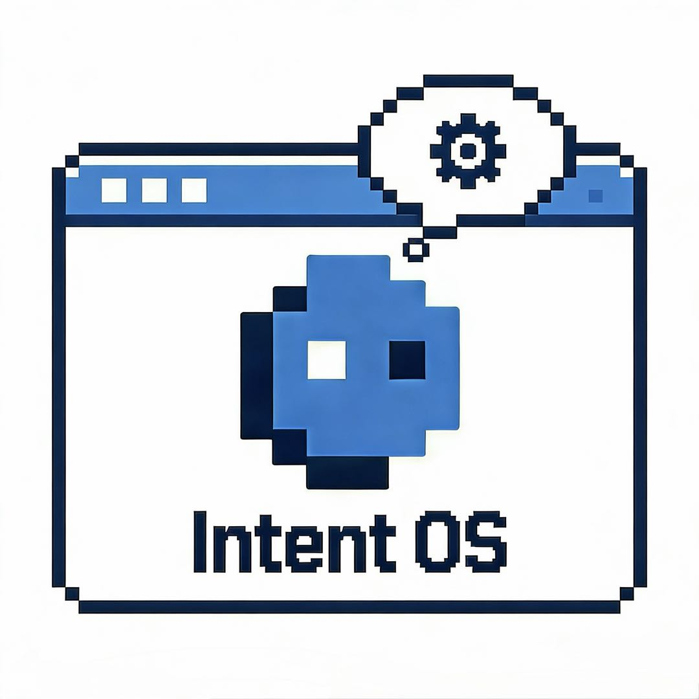

<p align="center">
  
</p>

<h1 align="center">IntentOS</h1>

<p align="center">
  <strong>用意图描述生成可运行应用的桌面 OS</strong>
</p>

<p align="center">
  <a href="#"></a>
  <a href="LICENSE"></a>
  <a href="#"></a>
</p>

---

## 功能特性

- **意图驱动** — 用自然语言描述需求，系统自动规划与生成应用
- **Skill 组合** — 灵活组合已安装的 Skill，快速创建新应用
- **无缝生成** — 生成完成后窗口原地变形为应用，用户立即可用
- **热更新支持** — SkillApp 运行中支持增量修改，无需重启
- **可插拔 AI 后端** — MVP 使用 Claude API，后续可切换本地模型
- **跨平台应用** — 基于 Electron，支持 macOS/Windows/Linux

---

## 核心概念

IntentOS 是一个**"Skill 生成 SkillApp"的操作系统**。

用户通过三个核心流程与系统交互：

### 1. 生成流程
选择 Skill → 描述意图 → AI 规划 → 确认方案 → 生成 → 窗口变形成应用

### 2. 修改流程
提出修改需求 → AI 生成增量方案 → 热更新 → 无需重启即可使用

### 3. Skill 管理
注册/管理本地 Skill（作为应用的功能原子单元）

更多详情请参阅 [docs/idea.md](docs/idea.md)。

---

## 架构设计

IntentOS 采用四层分层架构：

```
┌─────────────────────┐  ┌─────────────────────┐
│  IntentOS Desktop   │  │     SkillApp(s)     │  ← 应用层
│      (管理台)       │  │     (各类应用)      │
└──────────┬──────────┘  └──────────┬──────────┘
           └─────────────┬──────────┘
┌──────────────────────────────────────────────┐
│              IntentOS 核心层                  │
│  ┌──────────────────┐  ┌───────────────────┐ │
│  │    管理层        │  │  AI Provider 层   │ │
│  │ (生命周期调度)   │  │ (规划和代码生成)  │ │
│  └──────────────────┘  └───────────────────┘ │
└──────────────────────────────────────────────┘
           │ 访问
┌──────────▼───────────────────────────────────┐
│         宿主 OS 资源层                        │
│   MCP / 文件系统 / 网络 / 进程               │
└──────────────────────────────────────────────┘
```

### 四层职责

| 层级 | 组件 | 职责 |
|------|------|------|
| **应用层** | IntentOS Desktop | 管理台：Skill 管理、SkillApp 管理、生成交互 |
| **应用层** | SkillApp(s) | 自动生成的独立应用，与管理台平行运行 |
| **管理层** | Lifecycle Manager | 应用启动、退出、窗口调度的 OS 级管理 |
| **AI Provider 层** | Claude API Provider | 规划引擎、代码生成、Skill 执行环理 |
| **资源层** | MCP / OS Interface | 文件、网络、进程等底层能力 |

---

## 技术栈

| 组件 | 技术 | 版本 |
|------|------|------|
| **桌面应用框架** | Electron | 31 |
| **UI 框架** | React | 18 |
| **编程语言** | TypeScript | 5.5 |
| **构建工具** | Vite (electron-vite) | 2.3 |
| **状态管理** | Zustand | 5 |
| **样式** | Tailwind CSS | 4 |
| **单元测试** | Vitest | 1.6 |
| **E2E 测试** | Playwright | 1.58 |
| **AI 后端（MVP）** | Claude API | @anthropic-ai/sdk ^0.54.0 |

---

## 快速开始

### 环境要求

- Node.js 18+
- npm 9+ 或 pnpm 8+
- Electron 31+

### 安装

```bash
git clone https://github.com/jimmyshi/intent-os.git
cd intent-os
npm install
```

### 开发

启动开发模式（含热重载）：

```bash
npm run dev
```

类型检查：

```bash
npm run type-check
```

### 测试

运行单元测试：

```bash
npm run test:unit
```

运行 E2E 测试：

```bash
npm run test:e2e
```

### 构建

生成生产版本：

```bash
npm run build
```

预览构建结果：

```bash
npm run preview
```

---

## 项目结构

```
intent-os/
├── src/                          # 主应用源码
│   ├── main/                     # Electron 主进程
│   ├── preload/                  # 预加载脚本
│   └── renderer/                 # React UI
├── packages/
│   ├── shared-types/             # 共享类型定义
│   └── skillapp-runtime/         # SkillApp 运行时
├── docs/
│   ├── idea.md                   # 核心设计文档
│   └── pic/                      # 图片资源
├── claude-stub/                  # Claude API 测试桩
├── electron.vite.config.ts       # Vite 配置
└── package.json
```

---

## 关键模块

- **M-02 Skill Manager** — SQLite 注册表，Skill 引用计数管理
- **M-03 Lifecycle Manager** — 进程启动、监控、重启
- **M-04 AI Provider** — Claude API 集成，流式规划与代码生成
- **M-05 Generator** — 规划会话、增量修改会话、编译修复循环
- **M-06 Hot Updater** — 备份 → 编译 → 套接字推送 → 确认 → 崩溃回滚
- **IPC** — Unix Socket JSON-RPC 2.0 通信
- **MCP Proxy** — 资源访问代理

---

## 迭代规划

| 迭代 | 阶段 | 状态 |
|------|------|------|
| Iteration 0 | 框架搭建，核心设计验证 | ✅ 完成 |
| Iteration 1 | Skill 管理系统，基础生成流程 | ✅ 完成 |
| Iteration 2 | AI Provider 集成，Claude API MVP | ✅ 完成 |
| Iteration 3 | 热更新系统，SkillApp 运行时 | 进行中 |
| Iteration 4 | UI 优化，交互增强 | 规划中 |
| Iteration 5 | 本地模型集成，性能优化 | 规划中 |

---

## 设计理念

1. **Intent-First** — 用户描述意图，系统负责实现
2. **Skill 原子化** — 最小可复用单位，灵活组合
3. **窗口即过程** — 生成窗口是规划与协作的交互界面
4. **原地变形** — 生成完成后直接变形为应用
5. **可插拔 AI 后端** — 抽象接口，易于切换
6. **动态生长** — SkillApp 持续扩展和进化

详见 [docs/idea.md](docs/idea.md)。

---

## 开发命令汇总

```bash
# 安装依赖
npm install

# 开发模式（含热重载）
npm run dev

# 类型检查
npm run type-check

# 单元测试
npm run test:unit

# E2E 测试
npm run test:e2e

# 生产构建
npm run build

# 预览构建结果
npm run preview

# 代码检查
npm run lint
```

---

## 贡献指南

欢迎提交 Issue 和 Pull Request！

- **报告 Bug** — 提供复现步骤和环境信息
- **功能建议** — 说明使用场景和期望行为
- **代码贡献** — 遵循项目代码风格，补充测试用例

---

## 许可证

本项目采用 MIT 许可证。详见 [LICENSE](LICENSE)。

---

## 联系方式

- GitHub Issues — 功能建议和 Bug 报告
- 项目讨论 — 架构设计和长期规划

---

**Made with ❤️ — IntentOS 团队**
