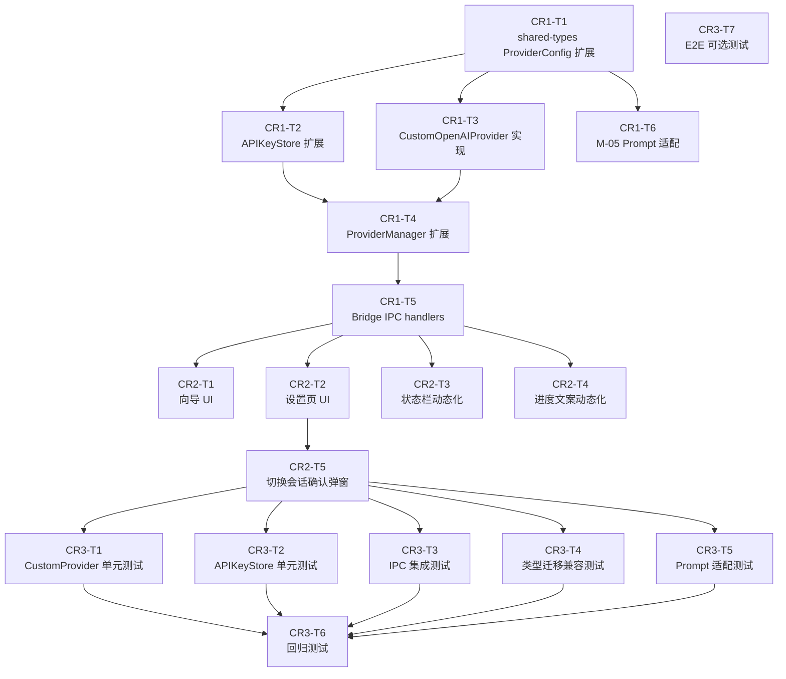

# CR-001 开发计划（增量）— dev-plan-delta.md

**关联 CR**：CR-001 支持自定义 URL + API Key 作为 AI Provider
**依据文档**：`CR-001/modules-delta.md`、`CR-001/spec-delta.md`
**变更性质**：在现有 dev-plan.md 迭代序列之后新增 CR-001 专属迭代

---

## 1. 迭代划分

CR-001 拆分为 3 个迭代，按顺序执行：

| 迭代 | 目标 | 验收重点 |
|------|------|---------|
| **Iter CR-1** | M-04 核心 Provider 实现 | `CustomOpenAIProvider` 可初始化、`planApp`/`generateCode` 流式正常 |
| **Iter CR-2** | UI 集成与 IPC 接入 | 设置页/向导 UI 功能完整，Provider 切换端到端通畅 |
| **Iter CR-3** | 集成测试与回归 | 新功能测试通过，现有 Claude API 流程无回归 |

---

## 2. Iter CR-1：M-04 核心 Provider 实现

### 目标

在 M-04 模块内完成 `CustomOpenAIProvider` 的完整实现，包括 `APIKeyStore` 扩展、`AIProviderManager` 扩展和 M-05 Prompt 适配。不涉及 UI 变更。

### 任务列表

| 任务 ID | 任务描述 | 模块 | 复杂度 | 可并行 |
|---------|---------|------|-------|-------|
| CR1-T1 | 更新 `@intentos/shared-types`：`ProviderConfig` 改为判别联合类型（新增 `custom` 分支） | shared-types | S | 否（其他任务依赖此产出） |
| CR1-T2 | 扩展 `APIKeyStore`：实现 `setKey(providerId, key)`/`getKey(providerId)`/`deleteKey(providerId)`，存储键名迁移（`intentos:apiKey:claude-api`），保留旧接口 `@deprecated` 委托 | M-04 | S | 在 CR1-T1 完成后与 CR1-T3 并行 |
| CR1-T3 | 新建 `custom-openai-provider.ts`：实现 `CustomOpenAIProvider` 类，包含 `initialize`（URL 校验 + 连接测试）、`planApp`（OpenAI Chat Completions 流式）、`generateCode`（独立 function calling 工具调用循环）、`executeSkill`、`cancelSession`、`dispose` | M-04 | L | 在 CR1-T1 完成后与 CR1-T2 并行 |
| CR1-T4 | 扩展 `AIProviderManager.switchProvider()`：增加 `'custom'` 分支，实例化 `CustomOpenAIProvider` | M-04 | S | 在 CR1-T2、CR1-T3 完成后 |
| CR1-T5 | 扩展 `AIProviderBridge`：注册 `settings:get-custom-provider-config`、`settings:set-custom-provider-config` IPC handler；扩展已有 `settings:get-api-key`/`settings:save-api-key` 支持 `providerId` 参数；扩展 `ai-provider:set-provider` 枚举；扩展 `settings:test-connection` 响应增加 `providerName` 字段 | M-04 | M | 在 CR1-T4 完成后 |
| CR1-T6 | 修改 M-05 `buildPlanSystemPrompt` 和 `buildGeneratePrompt`：新增 `options.providerId` 可选参数，`custom` 时移除 Claude 专有引导词 | M-05 | S | 在 CR1-T1 完成后，可与 CR1-T3 并行 |

### 任务依赖关系

```
CR1-T1 (shared-types 扩展)
    ├─→ CR1-T2 (APIKeyStore 扩展)    ┐
    ├─→ CR1-T3 (CustomOpenAIProvider) ├─→ CR1-T4 (ProviderManager 扩展) → CR1-T5 (Bridge IPC)
    └─→ CR1-T6 (M-05 Prompt 适配)   ┘
```

### 并行组

- **串行**：CR1-T1 必须先完成
- **并行组 A**（CR1-T1 完成后同时启动）：CR1-T2、CR1-T3、CR1-T6
- **串行**：CR1-T4 等待 CR1-T2 + CR1-T3
- **串行**：CR1-T5 等待 CR1-T4

### 验收标准

- [ ] `npm run typecheck` 全量通过（无 TypeScript 错误）
- [ ] `CustomOpenAIProvider.initialize()` 对合法端点成功初始化，对非法 URL 抛出 `INVALID_BASE_URL`，对 401 抛出 `API_KEY_INVALID`，对 404 抛出 `MODEL_NOT_FOUND`，对连接拒绝抛出 `CUSTOM_PROVIDER_UNREACHABLE`
- [ ] `CustomOpenAIProvider.planApp()` 以本地 Ollama 或 OpenAI 端点（或 Mock）可正常产出 `PlanChunk` 流，最终 `phase === 'complete'` 时携带有效 `planDraft`
- [ ] `CustomOpenAIProvider.generateCode()` 工具调用循环可正常执行 `write_file`/`run_command`/`read_file` 工具，产出 `GenProgressChunk` 流，最终 `phase === 'done'`
- [ ] `APIKeyStore.getKey('custom')` 存储和读取 Custom API Key，`getKey('claude-api')` 读取原 Claude Key，互不干扰
- [ ] 旧 `saveApiKey(key)` 接口委托给 `setKey('claude-api', key)`，行为与原有一致
- [ ] `buildPlanSystemPrompt(skills, { providerId: 'custom' })` 产出不含 `<thinking>` 引导词的 prompt

---

## 3. Iter CR-2：UI 集成与 IPC 接入

### 目标

完成 M-01 桌面容器的 UI 变更，使设置页和首次启动向导支持 Custom Provider 配置，实现端到端的 Provider 切换流程。

### 任务列表

| 任务 ID | 任务描述 | 模块 | 复杂度 | 可并行 |
|---------|---------|------|-------|-------|
| CR2-T1 | 首次启动向导 Step 1：添加「Custom（OpenAI-compatible）」选项；Step 2：根据选择分支渲染 Custom 配置表单（Base URL、API Key、规划模型、代码生成模型 4 个字段）；Step 3：连接测试结果展示 | M-01 UI | M | 否（首先执行） |
| CR2-T2 | 设置页 AI Provider 区块：Provider 下拉新增 Custom 选项；选择 Custom 时动态展开配置表单；隐私提示文案动态化（含本地地址例外逻辑）；「保存」按钮触发 `settings:set-custom-provider-config` | M-01 UI | M | 与 CR2-T3 并行 |
| CR2-T3 | 状态栏动态化：`updateStatusBar()` 读取当前激活 Provider 名称（`provider.name` 字段），状态栏显示「Custom (domain) ● 已连接」而非硬编码「Claude API」 | M-01 UI | S | 与 CR2-T2 并行 |
| CR2-T4 | 生成/修改窗口进度文案动态化：将「正在通过 Claude API 规划...」改为读取当前 Provider 名称的动态文案 | M-01 UI | S | 与 CR2-T2 并行 |
| CR2-T5 | Provider 切换中断会话确认弹窗：切换 Provider 时若有活跃生成/规划会话，弹出确认对话框逻辑 | M-01 UI | S | 在 CR2-T2 完成后 |

### 任务依赖关系

```
CR2-T1 (向导 UI)
    └─ 可独立完成，不阻塞 CR2-T2/T3/T4

并行组 B（同时启动）：CR2-T2、CR2-T3、CR2-T4

CR2-T5 依赖 CR2-T2 完成后启动
```

**前置条件**：Iter CR-1 全部验收通过，IPC handler 已就绪。

### 验收标准

- [ ] 首次启动向导 Step 1 展示 3 个选项（Claude API、Custom、OpenClaw 灰色），可选择 Custom
- [ ] 向导选择 Custom 后 Step 2 展示 4 个配置字段，Step 3 触发连接测试并展示结果（成功/失败）
- [ ] 设置页选择 Custom Provider 时，配置表单展开，保存后 IPC 调用成功
- [ ] 设置页 Custom 模式下隐私提示动态显示端点域名；localhost/127.0.0.1 时展示本地数据提示
- [ ] 状态栏正确显示当前激活 Provider 名称（切换后实时更新）
- [ ] 生成/修改窗口进度提示显示当前 Provider 名称而非硬编码「Claude API」
- [ ] Provider 切换时若有活跃会话，弹出确认弹窗；用户取消时保留原 Provider 状态
- [ ] Base URL 输入框实时校验 URL 格式，非法时红色边框 + 提示文案，保存按钮禁用

---

## 4. Iter CR-3：集成测试与回归

### 目标

对 CR-001 全部新增功能执行集成测试，对受影响的现有流程执行回归测试，确保无破坏性变更。

### 任务列表

| 任务 ID | 任务描述 | 类型 | 可并行 |
|---------|---------|------|-------|
| CR3-T1 | `CustomOpenAIProvider` 单元测试：针对 § Iter CR-1 验收标准中各错误码场景编写 Mock 测试；工具调用循环 happy path 和 TOOL_CALL_UNSUPPORTED 场景 | 单元测试 | 与 CR3-T2 并行 |
| CR3-T2 | `APIKeyStore` 多 Provider 存储单元测试：setKey/getKey/deleteKey 各 providerId、旧接口兼容性测试 | 单元测试 | 与 CR3-T1 并行 |
| CR3-T3 | IPC handler 集成测试：`settings:get-custom-provider-config`、`settings:set-custom-provider-config` 请求/响应格式验证；`settings:get-api-key` 带 `providerId` 参数的扩展验证 | 集成测试 | 与 CR3-T1 并行 |
| CR3-T4 | `ProviderConfig` 类型迁移兼容测试：旧格式 `{ providerId: 'claude-api' }` 配置文件读取后正确解析为新判别联合类型 | 单元测试 | 与 CR3-T1 并行 |
| CR3-T5 | M-05 Prompt 适配测试：`buildPlanSystemPrompt` 在 custom 模式下输出不含 Claude 专有引导词；claude 模式下输出包含引导词（回归） | 单元测试 | 与 CR3-T1 并行 |
| CR3-T6 | 回归测试 — Claude API 完整流程：使用 ClaudeAPIProvider Stub/Mock 跑完整规划→生成流程，验证无功能回归；`APIKeyStore.saveApiKey(key)` 旧接口行为不变 | 回归测试 | 在 CR3-T1~T5 完成后 |
| CR3-T7 | 端到端集成验证（可选，需要真实端点）：以本地 Ollama（`http://localhost:11434/v1`）作为测试端点，验证从设置页配置 → 连接测试 → 规划 → 代码生成的完整流程 | E2E 测试 | 独立，不阻塞回归通过 |

### 任务依赖关系

```
并行组 C（同时启动）：CR3-T1、CR3-T2、CR3-T3、CR3-T4、CR3-T5
    └─→ CR3-T6 (回归测试，等待并行组 C 全部通过)
CR3-T7 独立执行（需要真实端点，为可选）
```

### 验收标准

- [ ] 所有单元测试通过（CR3-T1 ~ CR3-T5）
- [ ] 所有集成测试通过（CR3-T3）
- [ ] 回归测试通过（CR3-T6）：Claude API 流程无功能回归，旧接口行为不变
- [ ] `npm run typecheck` 全量通过
- [ ] `npm run lint` 全量通过
- [ ] 测试报告存入 `.claude/test-reports/CR-001-iteration-3.md`

---

## 5. 任务依赖关系总图



---

## 6. 需要更新的开发文档（CR-6 范围）

CR-6 需要新增或更新以下 `docs/dev-docs/` 文件：

| 文件 | 变更类型 | 变更内容摘要 |
|------|---------|-------------|
| `docs/dev-docs/shared-types.md` | 更新 | `ProviderConfig` 改为判别联合类型，新增 `CustomProviderConfig` 接口定义 |
| `docs/dev-docs/interfaces.md` | 更新 | § 6.2 `ProviderConfig` 类型扩展；§ 4.5 settings 域新增 `getCustomProviderConfig`/`setCustomProviderConfig` 方法；§ 12.3 M-04 错误码表新增 4 个错误码 |
| `docs/dev-docs/ipc-channels.md` | 更新 | 新增 `settings:get-custom-provider-config` 和 `settings:set-custom-provider-config` channel 详细规范；扩展 `settings:get-api-key`/`settings:save-api-key` 的 `providerId` 参数说明；扩展 `ai-provider:set-provider` 枚举说明 |
| `docs/dev-docs/m04-ai-provider.md` | 更新 | 新增 `CustomOpenAIProvider` 完整实现规范（类定义、`planApp`、`generateCode`、`executeSkill`、`_testConnection`）；`APIKeyStore` 扩展接口；`AIProviderManager.switchProvider()` custom 分支；文件结构新增 `custom-openai-provider.ts` |

---

## 7. 测试策略

### 新增功能测试

| 测试类型 | 覆盖范围 | 优先级 |
|---------|---------|-------|
| 单元测试 | `CustomOpenAIProvider` 各错误码场景（Mock HTTP 响应） | P0 |
| 单元测试 | 工具调用循环（write_file/run_command/read_file 各场景） | P0 |
| 单元测试 | `APIKeyStore` 多 Provider Key 存储隔离 | P0 |
| 单元测试 | `buildPlanSystemPrompt` custom/claude 模式输出差异 | P1 |
| 集成测试 | 新增 IPC channel 请求/响应格式 | P0 |
| 集成测试 | Provider 切换流程（含活跃会话中断确认） | P1 |

### 回归测试范围

以下现有测试用例必须在 Iter CR-3 中全部通过：

- `ClaudeAPIProvider` 所有现有测试（`planApp`、`generateCode`、错误处理）
- `APIKeyStore.saveApiKey` / `loadApiKey` 旧接口行为
- `settings:get-api-key` / `settings:save-api-key` 不带 `providerId` 参数时的行为
- `settings:test-connection` 现有 Claude API 测试路径
- M-05 `buildPlanSystemPrompt` 不带 `options` 参数时（Claude API 模式）的输出格式

### 非确定性场景处理

`CustomOpenAIProvider.planApp()` 和 `generateCode()` 的 AI 输出具有非确定性，测试策略：
- 使用 Mock HTTP server 模拟 OpenAI-compatible 端点，返回固定的 SSE 响应（确定性）
- 验证 chunk 格式是否符合 `PlanChunk`/`GenProgressChunk` schema，不依赖内容本身
- `planDraft` 解析测试覆盖 JSON 格式正确和 JSON 格式错误（降级）两个分支
