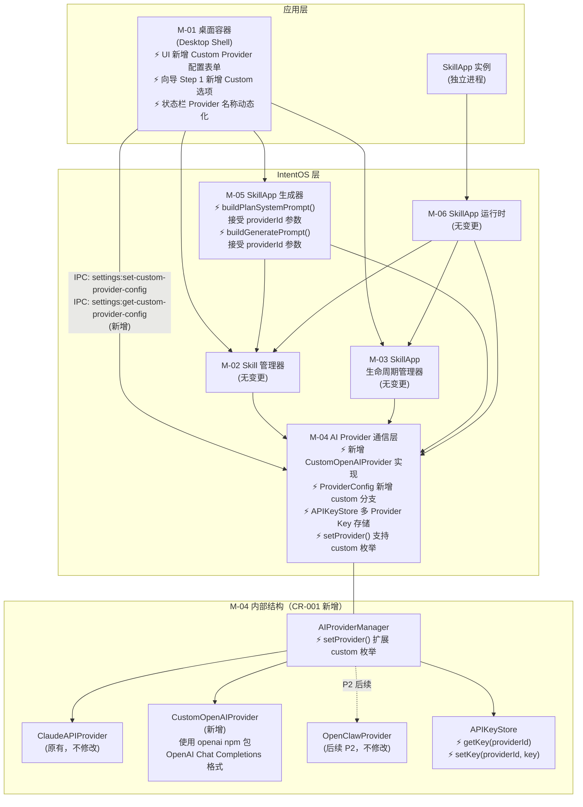

# CR-001 模块拆解（增量）— modules-delta.md

**关联 CR**：CR-001 支持自定义 URL + API Key 作为 AI Provider
**依据文档**：`CR-001/product-delta.md`、`docs/modules.md`
**变更性质**：在现有 modules.md 基础上新增/修改的模块描述（增量）

---

## 1. 新增模块

CR-001 **不引入新模块**。所有变更在现有 M-01、M-04、M-05 三个模块内部进行扩展。

---

## 2. 修改的现有模块

### 2.1 M-04 AI Provider 通信层（核心变更）

**变更范围**：在 M-04 内部新增 `CustomOpenAIProvider` 实现类，扩展 `ProviderConfig` 类型，扩展 `APIKeyStore` 多 Provider Key 存储，扩展 `AIProviderManager.setProvider()` 支持 `"custom"` 分支。

**修改后的职责说明**（在原有基础上新增）：
- **原有职责保持不变**：`AIProvider` 抽象接口定义、`ClaudeAPIProvider` 实现、连接状态监控、请求队列管理、IPC 转发
- **新增职责**：内置 `CustomOpenAIProvider` 实现，使用 `openai` npm 包（`new OpenAI({ baseURL, apiKey })`）对接任意兼容 OpenAI Chat Completions API 的端点；支持按 `providerId` 独立存储和读取 API Key（`APIKeyStore` 扩展）

**接口变更**（粗粒度，供 CR-4 细化）：
- `ProviderConfig` 联合类型：新增 `providerId: "custom"` 分支，携带 `customBaseUrl`、`customApiKey`（可选）、`customPlanModel`、`customCodegenModel` 字段
- `APIKeyStore`：`saveApiKey` / `loadApiKey` 接口扩展为 `setKey(providerId, key)` / `getKey(providerId)` 形式，支持多 Provider 独立条目
- `AIProviderManager.setProvider()`：参数枚举从 `"claude-api" | "openclaw"` 扩展为 `"claude-api" | "openclaw" | "custom"`
- 新增 IPC channel：`settings:get-custom-provider-config` 和 `settings:set-custom-provider-config`

**不变内容**：
- `AIProvider` 抽象接口定义（`planApp`、`generateCode`、`executeSkill`、`cancelSession`、`onStatusChanged`）保持不变
- `ClaudeAPIProvider` 实现不修改
- 请求队列管理器（`RequestQueueManager`）不修改
- `AIProviderBridge` IPC 桥接器框架不修改（仅新增 settings 相关 channel）
- 流式转发机制（SSE → IPC → 渲染进程）不修改

---

### 2.2 M-01 桌面容器（UI 变更）

**变更范围**：设置页「AI Provider 设置」区块 UI 扩展，首次启动向导 Step 1 新增选项。

**修改后的职责说明**（新增部分）：
- **新增职责**：在设置页 AI Provider 区块中渲染 Custom Provider 配置表单（Base URL、API Key、规划模型、代码生成模型）；在首次启动向导 Step 1 中展示 Custom 选项；状态栏动态显示当前激活 Provider 的名称

**接口变更**：
- 渲染进程通过新增的 `settings:get-custom-provider-config` / `settings:set-custom-provider-config` IPC channel 读写自定义 Provider 配置
- 状态栏 `updateStatusBar()` 接收的 `ProviderStatus` 中 `providerName` 字段需能动态反映 `"Claude API"` 或 `"Custom Provider"` 或其他名称

**不变内容**：
- M-01 整体布局、导航路由、窗口管理、首次启动引导其余步骤均不修改
- SkillApp 管理中心、Skill 管理中心 UI 不修改

---

### 2.3 M-05 SkillApp 生成器（Prompt 适配）

**变更范围**：`buildPlanSystemPrompt()` 和 `buildGeneratePrompt()` 需感知当前激活的 Provider 类型，移除 Claude 专有引导词。

**修改后的职责说明**（新增部分）：
- **新增职责**：在构建 prompt 时接受 `providerId` 参数，当 `providerId === "custom"` 时，移除 Claude 专有的 `<thinking>` 标签引导词及其他 Anthropic 特有格式指令，使 prompt 对标准 OpenAI Chat Completions 格式友好

**接口变更**：
- `buildPlanSystemPrompt(skills, options?: { providerId?: string })` — 新增可选 `options` 参数
- `buildGeneratePrompt(plan, appId, options?: { providerId?: string })` — 新增可选 `options` 参数
- 调用方（M-04 各 Provider 实现）在调用上述函数时传入自身的 `providerId`

**不变内容**：
- 生成流水线（规划 → 生成 → 打包）整体逻辑不修改
- 增量修改流程不修改
- M-05 与 M-04 的接口调用方式不修改

---

## 3. 不变的模块

| 模块 | 说明 |
|------|------|
| M-02 Skill 管理器 | 与 AI Provider 实现无关，无需修改 |
| M-03 SkillApp 生命周期管理器 | 与 AI Provider 切换无关，无需修改 |
| M-06 SkillApp 运行时 | 运行时通过 M-04 抽象接口调用，Provider 切换对其透明 |
| M-07 Skill 市场客户端 | 后续迭代，当前版本不含，与本 CR 无关 |

---

## 4. 更新后的模块依赖关系图

CR-001 不引入新的依赖关系，仅在 M-04 内部增加一个 Provider 实现类。原有依赖拓扑不变。

**说明**：
- `⚡` 标记表示 CR-001 引入的变更
- 虚线箭头表示后续迭代计划项
- M-04 内部依赖关系（`AIProviderManager` → Provider 实现）属于模块内部结构，不跨模块

---

## 5. 新增/修改的模块间接口（粗粒度）

以下为 CR-001 引入的跨模块接口变更，供 CR-4 技术方案进一步细化：

### 5.1 M-01 ↔ M-04（新增 IPC channel）

| 接口 | 方向 | 说明 |
|------|------|------|
| `settings:get-custom-provider-config` | M-01（渲染）→ M-04（主进程）| 读取当前自定义 Provider 配置（Base URL、模型名称等，不含 Key） |
| `settings:set-custom-provider-config` | M-01（渲染）→ M-04（主进程）| 写入自定义 Provider 配置，触发连接测试 |

**已有 IPC channel 复用**：
- `settings:get-api-key` / `settings:save-api-key`：已有接口需扩展支持 `providerId` 参数以区分 Claude API Key 和 Custom API Key
- `ai-provider:set-provider`：已有接口需扩展 `providerId` 枚举（加入 `"custom"`）
- `settings:test-connection`：已有接口需复用，对 Custom Provider 时传入 Base URL 和 API Key 发起测试

### 5.2 M-05 ↔ M-04（内部调用参数扩展）

| 接口 | 变更 | 说明 |
|------|------|------|
| `buildPlanSystemPrompt(skills, options?)` | 新增 `options.providerId` 可选参数 | 控制是否生成含 Claude 专有引导词的 prompt |
| `buildGeneratePrompt(plan, appId, options?)` | 新增 `options.providerId` 可选参数 | 同上，代码生成 prompt 适配 |

---

## 6. CR-001 模块变更范围摘要

| 维度 | 结论 |
|------|------|
| 是否引入新模块 | 否 |
| 是否修改模块间依赖拓扑 | 否（新增 2 个 IPC channel，但 M-01 → M-04 的依赖关系已存在） |
| 是否修改 AIProvider 抽象接口 | 否（接口保持稳定，仅新增 Provider 实现和配置类型扩展） |
| 修改影响范围 | M-04（核心）、M-01（UI）、M-05（prompt 适配） |
| M-02、M-03、M-06 是否受影响 | 否，完全隔离 |
| SkillApp 实例是否受影响 | 否，SkillApp 通过 M-04 抽象接口工作，Provider 切换对其透明 |
