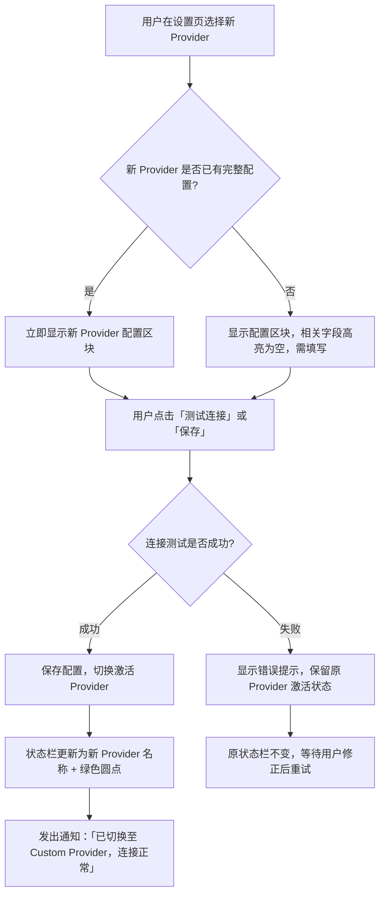
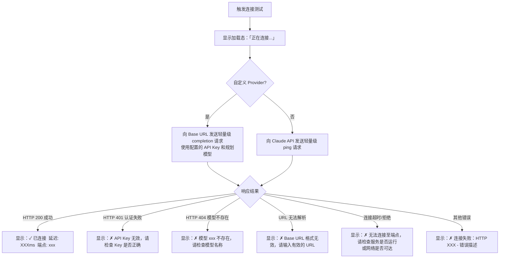

# CR-001 功能设计（增量）— product-delta.md

**关联 CR**：CR-001 支持自定义 URL + API Key 作为 AI Provider
**依据文档**：`docs/product.md`、`docs/requirements.md`、`CR-001.md`
**变更性质**：在现有 product.md 基础上新增/修改的功能描述（增量）

---

## 1. 新增/修改的用户流程

### 1.1 首次启动向导 — 「配置 AI Provider」步骤变更

**变更位置**：`docs/product.md` 流程一 — 「配置 AI Provider」向导弹窗 Step 1。

**原有内容（MVP）**：Step 1 仅列出「Claude API (Anthropic)」一个可选项；「OpenClaw（即将推出）」灰色不可选。

**新增内容**：Step 1 新增「Custom（OpenAI-compatible）」可选项，用户可选择自定义 Provider 并在后续步骤中输入 Base URL 和 API Key。

```
┌─────────────────────────────────────────────────────────┐
│  「配置 AI Provider」向导                                │
│                                                         │
│  Step 1: 选择 Provider                                  │
│                                                         │
│  ┌───────────────────────────────────────────────────┐  │
│  │  ● Claude API (Anthropic)                         │  │
│  │    使用 Anthropic Claude API，需要 API Key         │  │
│  ├───────────────────────────────────────────────────┤  │
│  │  ○ Custom（OpenAI-compatible）                    │  │
│  │    支持任意兼容 OpenAI Chat Completions API 的端点 │  │
│  │    （OpenAI、Azure OpenAI、Ollama、LM Studio 等） │  │
│  ├───────────────────────────────────────────────────┤  │
│  │  ○ OpenClaw [灰色，不可选，即将推出]               │  │
│  └───────────────────────────────────────────────────┘  │
│                                                         │
│                                      [下一步 →]         │
└─────────────────────────────────────────────────────────┘
```

**Step 2 — 输入凭据（根据选择分支）**：

分支 A：用户选择「Claude API」时，Step 2 与原流程一致（输入 Claude API Key）。

分支 B：用户选择「Custom（OpenAI-compatible）」时，Step 2 展示自定义 Provider 配置表单：

```
┌─────────────────────────────────────────────────────────┐
│  「配置 AI Provider」向导                                │
│                                                         │
│  Step 2: 配置自定义 Provider                            │
│                                                         │
│  Base URL                                               │
│  ┌───────────────────────────────────────────────────┐  │
│  │ https://api.openai.com/v1                          │  │
│  └───────────────────────────────────────────────────┘  │
│  示例：http://localhost:11434/v1（Ollama）              │
│         https://api.openai.com/v1（OpenAI）             │
│                                                         │
│  API Key（可选，部分本地服务无需 Key）                   │
│  ┌───────────────────────────────────────────── [👁] ┐  │
│  │ ••••••••••••••••••••••••••••                      │  │
│  └───────────────────────────────────────────────────┘  │
│                                                         │
│  规划模型（Plan Model）                                 │
│  ┌───────────────────────────────────────────────────┐  │
│  │ gpt-4o                                            │  │
│  └───────────────────────────────────────────────────┘  │
│  用于应用规划阶段（多轮交互），推荐使用能力较强的模型     │
│                                                         │
│  代码生成模型（Codegen Model）                          │
│  ┌───────────────────────────────────────────────────┐  │
│  │ gpt-4o                                            │  │
│  └───────────────────────────────────────────────────┘  │
│  用于代码生成阶段，可与规划模型相同或不同               │
│                                                         │
│  [← 上一步]                           [下一步 →]        │
└─────────────────────────────────────────────────────────┘
```

**Step 3 — 验证连通性（两分支相同）**：触发一次轻量级请求（向配置的端点发送最小化 completion 请求），验证 Base URL 和 API Key 有效性。展示结果如下：

```
┌─────────────────────────────────────────────────────────┐
│  「配置 AI Provider」向导                                │
│                                                         │
│  Step 3: 验证连接                                       │
│                                                         │
│  正在连接 https://api.openai.com/v1 ...                 │
│  ┌───────────────────────────────────────────────────┐  │
│  │  ✓ 连接成功                                        │  │
│  │  延迟: 450ms   模型: gpt-4o                        │  │
│  └───────────────────────────────────────────────────┘  │
│                                                         │
│  [← 上一步]                           [完成配置 ✓]      │
└─────────────────────────────────────────────────────────┘
```

验证失败时展示具体错误说明（见第 4 节边界情况）。

---

### 1.2 全局设置页 — AI Provider 设置区块变更

**变更位置**：`docs/product.md` 3.6 节「全局设置页面」中的「AI Provider 设置」区块。

**原有内容（MVP）**：仅显示 Claude API Provider 选择和 API Key 输入。

**新增内容**：Provider 下拉选单新增「Custom（OpenAI-compatible）」选项；选择 Custom 时，区块下方动态展开自定义 Provider 配置表单。

#### 选择 Claude API 时的设置页（与原有 MVP 一致）：

```
┌──────────────────────────────────────────────────────────┐
│  AI Provider 设置                                        │
│                                                          │
│  当前 Provider                                           │
│  ┌──────────────────────────────────────────────────┐    │
│  │ ● Claude API (Anthropic)                    ▼   │    │
│  │   Custom（OpenAI-compatible）                    │    │
│  │   OpenClaw（即将推出）[灰色，不可选]               │    │
│  └──────────────────────────────────────────────────┘    │
│                                                          │
│  Claude API Key                                          │
│  ┌────────────────────────────────────────────── [👁] ┐  │
│  │ ••••••••••••••••••••••••••••••••             │      │  │
│  └───────────────────────────────────────────────────┘   │
│                                                          │
│  [测试连接]                                              │
│  ✓ 已连接  延迟: 320ms  模型: claude-3-5-sonnet          │
│                                                          │
│  ⚠ 隐私提示：使用 Claude API 时，您的意图描述和          │
│    Skill 信息将发送至 Anthropic 服务器。                  │
│                                                          │
└──────────────────────────────────────────────────────────┘
```

#### 选择 Custom（OpenAI-compatible）时的设置页（新增）：

```
┌──────────────────────────────────────────────────────────┐
│  AI Provider 设置                                        │
│                                                          │
│  当前 Provider                                           │
│  ┌──────────────────────────────────────────────────┐    │
│  │ ● Custom（OpenAI-compatible）               ▼   │    │
│  └──────────────────────────────────────────────────┘    │
│                                                          │
│  ── 自定义 Provider 配置 ──────────────────────────────  │
│                                                          │
│  Base URL                                                │
│  ┌──────────────────────────────────────────────────┐    │
│  │ https://api.openai.com/v1                        │    │
│  └──────────────────────────────────────────────────┘    │
│                                                          │
│  API Key（可选）                                         │
│  ┌────────────────────────────────────────────── [👁] ┐  │
│  │ ••••••••••••••••••••••••••••••••             │      │  │
│  └───────────────────────────────────────────────────┘   │
│                                                          │
│  规划模型（Plan Model）                                  │
│  ┌──────────────────────────────────────────────────┐    │
│  │ gpt-4o                                           │    │
│  └──────────────────────────────────────────────────┘    │
│                                                          │
│  代码生成模型（Codegen Model）                           │
│  ┌──────────────────────────────────────────────────┐    │
│  │ gpt-4o                                           │    │
│  └──────────────────────────────────────────────────┘    │
│                                                          │
│  [测试连接]   [保存]                                     │
│  ✓ 已连接  延迟: 230ms  端点: api.openai.com            │
│                                                          │
│  ⚠ 隐私提示：使用自定义 Provider 时，您的意图描述和      │
│    Skill 信息将发送至您配置的端点（api.openai.com）。    │
│    请确认您信任该服务商并了解其数据处理政策。             │
│                                                          │
└──────────────────────────────────────────────────────────┘
```

**交互说明**：
- Provider 下拉切换为「Custom」时，页面动态展开自定义配置表单（Base URL、API Key、规划模型、代码生成模型）
- Base URL 输入框支持粘贴，输入时实时校验 URL 格式（不合法时显示红色边框 + 提示「请输入有效的 URL，例如 http://localhost:11434/v1」）
- API Key 字段为可选项，允许留空（适用于无需认证的本地服务如 Ollama）
- 规划模型和代码生成模型均为纯文本输入框，用户手动填写模型名称，不做预设枚举限制（因各端点支持的模型不同）
- 修改任意配置字段后，「保存」按钮变为可点击状态；点击「保存」保存配置，保存时自动触发连接测试
- 「测试连接」按钮可独立点击，不依赖「保存」
- 隐私提示中的端点域名从 Base URL 动态提取并显示

---

### 1.3 Provider 切换交互流程

**适用场景**：用户在设置页从 Claude API 切换到 Custom（或反向切换）。



**关键规则**：
- Provider 切换在连接测试**通过后**才实际生效；测试失败时，系统继续使用原有 Provider，不中断已有功能
- 切换过程中若有正在进行的生成/修改会话，弹出提示：「切换 Provider 将中断当前会话，是否继续？」，用户确认后才执行切换

---

### 1.4 连接测试流程

**适用场景**：用户点击设置页「测试连接」按钮，或配置保存时自动触发。



---

## 2. 与现有流程的衔接点

| 现有流程 / 界面 | 衔接方式 |
|----------------|---------|
| 流程一「首次启动」→「配置 AI Provider」向导 | Step 1 新增 Custom 选项；用户选择 Custom 时 Step 2 切换为自定义配置表单，Step 3 连通性验证逻辑不变（只是面向不同端点） |
| 3.6 全局设置页 AI Provider 设置区块 | Provider 下拉新增 Custom 选项；选中后动态展开额外配置字段；其余页面布局不变 |
| 3.1 Desktop 主界面状态栏 | 当激活 Provider 为 Custom 时，状态栏显示「Custom Provider ● 已连接」而非「Claude API ● 已连接」；状态逻辑（绿/黄/红圆点）不变 |
| 流程三「从 Skill 生成 SkillApp」阶段 2 规划交互 | 进度提示由「正在通过 Claude API 规划...」变为「正在通过 [Provider 名称] 规划...」，动态显示当前 Provider 名称 |
| 流程四「修改/扩展 SkillApp」阶段 2 规划交互 | 同上，进度提示动态化 |
| 4.2 AI Provider 不可用边界情况 | 原有场景（Claude API 不可用）保持；新增 Custom Provider 不可用场景（见第 4 节） |

---

## 3. 界面变化汇总

| 界面/位置 | 变化类型 | 具体变化 |
|----------|---------|---------|
| 首次启动向导 Step 1 | 修改 | Provider 列表新增「Custom（OpenAI-compatible）」可选项 |
| 首次启动向导 Step 2 | 修改 | 选择 Custom 时切换为自定义配置表单（4 个字段） |
| 设置页 3.6 — Provider 下拉 | 修改 | 下拉新增「Custom（OpenAI-compatible）」选项 |
| 设置页 3.6 — 配置区块 | 新增 | 选择 Custom 时动态展开：Base URL、API Key（可选）、规划模型、代码生成模型 |
| 设置页 3.6 — 隐私提示 | 修改 | 自定义 Provider 模式下提示文案更新，动态显示目标端点域名 |
| Desktop 主界面状态栏 | 修改 | AI Provider 名称由固定「Claude API」改为动态显示当前激活 Provider 的名称 |
| 生成/修改窗口进度提示 | 修改 | 「正在通过 Claude API 规划...」改为动态显示「正在通过 [Provider] 规划...」 |

---

## 4. 边界情况处理

### 4.1 自定义 Provider 特有的错误场景

| 场景 | 触发条件 | 用户感知 | 处理方式 |
|------|---------|---------|---------|
| Base URL 格式无效 | 输入的 URL 不合法（缺少协议头、非法字符等） | 设置页输入框红色边框 | 输入时实时校验，显示：「请输入有效的 URL，例如 http://localhost:11434/v1」；禁止保存和测试 |
| API Key 错误（401） | 测试连接返回 HTTP 401 | 测试结果区显示错误 | 显示：「✗ API Key 无效，请检查 Key 是否正确」；若 API Key 字段为空则提示「该端点要求提供 API Key」 |
| 模型不存在（404） | 测试连接或生成阶段返回 HTTP 404 | 测试结果区或生成窗口显示错误 | 显示：「✗ 模型 [模型名] 不存在，请检查模型名称是否与端点支持的模型一致」 |
| 端点不可达（连接拒绝/超时） | 服务未启动或 URL 指向无效地址 | 测试结果区显示错误 | 显示：「✗ 无法连接至 [URL]，请确认服务已启动且端点地址正确」 |
| 生成阶段端点不可达 | 规划/生成过程中自定义 Provider 断开 | 生成窗口进度中断 | 与现有 4.2「生成过程中网络断开」处理一致：显示中断提示，提供 [重试] 按钮 |
| 模型不支持工具调用 | 代码生成阶段模型不支持 function calling | 生成窗口阶段 3 中断 | 显示：「所配置的代码生成模型不支持工具调用功能，代码生成无法完成。请更换支持 function calling 的模型后重试」 |

### 4.2 Provider 切换中断会话

| 场景 | 触发条件 | 用户感知 | 处理方式 |
|------|---------|---------|---------|
| 切换时有活跃生成会话 | 用户在生成进行中切换 Provider | 弹出确认对话框 | 显示：「当前有应用正在生成，切换 Provider 将中断此次生成。是否继续？」，[继续切换（中断生成）] / [取消] |
| 切换时有活跃规划会话 | 用户在规划交互阶段切换 Provider | 弹出确认对话框 | 显示：「当前有规划会话进行中，切换 Provider 将清除本次规划内容。是否继续？」，[继续切换] / [取消] |

### 4.3 启动时 Custom Provider 不可用

| 场景 | 处理方式 |
|------|---------|
| 已配置 Custom Provider，启动时连接测试失败 | 与原有「启动时 API Key 无效」处理一致：状态栏显示红色圆点，弹出非阻塞提示「自定义 Provider 连接失败，生成功能暂不可用」，提供 [前往设置] 按钮；用户仍可进入主界面浏览已有 SkillApp |

### 4.4 API Key 字段为空（本地服务兼容）

部分本地服务（如 Ollama）不需要 API Key。系统允许 API Key 字段为空，连接测试时不因空 Key 报错，直接发送无授权头的请求。若端点实际需要 Key 而未提供，则由端点返回 401 错误，按 4.1 中「API Key 错误」场景处理。

---

## 5. 隐私提示说明

**设计原则**：使用自定义 Provider 时，用户的意图描述和 Skill 元信息将发送至用户自行指定的第三方端点。IntentOS 无法审查该端点的数据处理方式，因此需在设置页和首次配置向导中明确告知。

**隐私提示文案规则**：
- 使用 Claude API 时（原有）：「使用 Claude API 时，您的意图描述和 Skill 信息将发送至 Anthropic 服务器。」
- 使用 Custom Provider 时（新增）：「使用自定义 Provider 时，您的意图描述和 Skill 信息将发送至您配置的端点（[动态提取的域名]）。请确认您信任该服务商并了解其数据处理政策。」
- 本地地址例外：若 Base URL 为 `localhost` 或 `127.0.0.1`，提示文案改为：「数据将发送至您的本地服务（[URL]），不经过外部网络。」

---

## 6. 与原有功能的兼容性

- 已使用 Claude API 的用户配置不受影响，所有现有设置和 API Key 保持不变
- 未切换 Provider 的用户不会感知到任何界面变化（Custom 选项仅在下拉中新增一项）
- 已生成的 SkillApp 与 Provider 配置无关，可在任意 Provider 配置下正常启动和运行
- 增量修改已有 SkillApp 时，使用当前激活的 Provider（可能与生成时使用的 Provider 不同）；此为预期行为，不做额外限制
