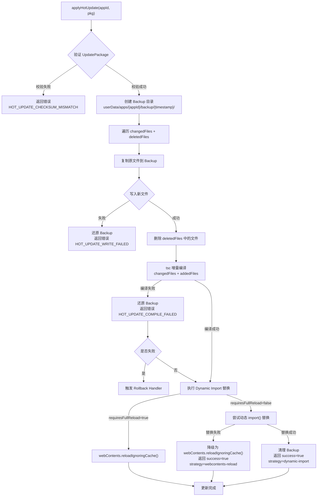
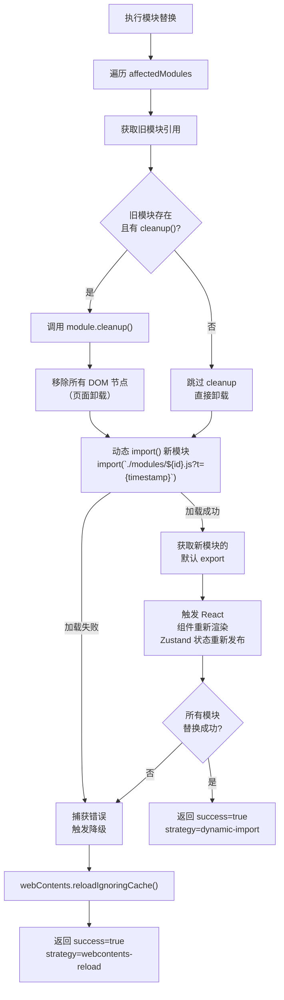
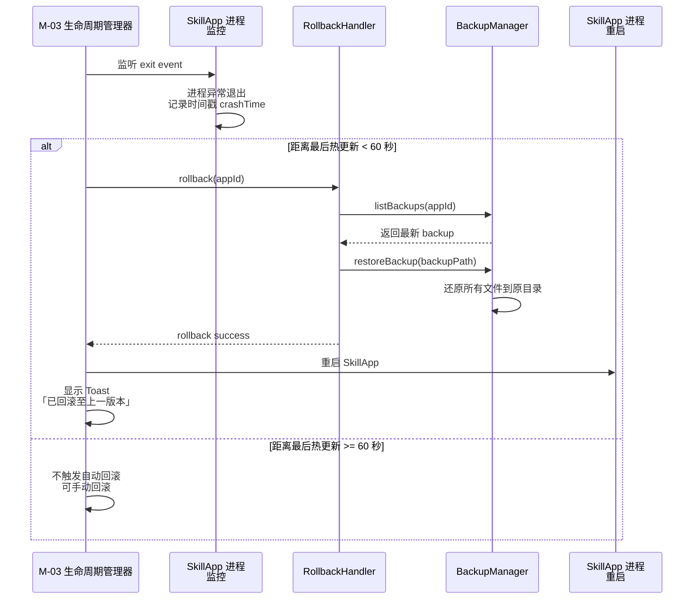
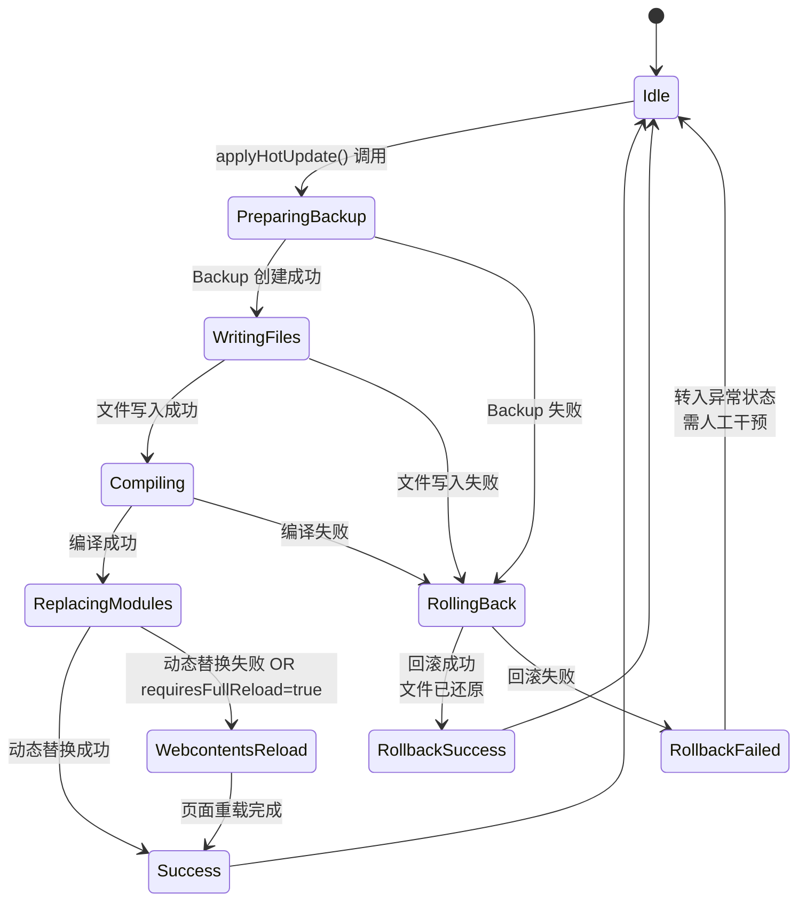

# IntentOS 热更新协议规范

> **版本**：v1.0 | **日期**：2026-03-13
> **状态**：正式文档
> **对应模块**：M-06 SkillApp 运行时、M-03 SkillApp 生命周期管理器、M-05 SkillApp 生成器

---

## 1. 概述

### 1.1 热更新目标

IntentOS 支持在运行时无需重启 SkillApp 进程，动态更新 UI 和业务逻辑。用户在管理中心提出修改需求后，系统通过增量生成、编译、打包，将更新推送到运行中的 SkillApp，实现秒级更新。

### 1.2 主要流程

```
1. 用户提出修改需求（在 SkillApp 管理中心）
   ↓
2. M-05 生成器分析现有 SkillApp 代码
   ↓
3. AI Provider 生成增量方案（新增/修改模块）
   ↓
4. 增量编译受影响模块
   ↓
5. 打包 UpdatePackage（包含修改文件、删除文件列表、元数据）
   ↓
6. 通过 IPC / Unix Socket 推送到 SkillApp 运行时
   ↓
7. SkillApp 运行时应用更新
   ├─ 动态 import() 热替换模块 → 成功则完成
   └─ 失败时降级为 webContents.reload()
```

### 1.3 文件目录

热更新相关模块位于 `src/main/modules/hot-updater/`：

```
src/main/modules/hot-updater/
├── types.ts                   # 类型定义（UpdatePackage、FileUpdate 等）
├── hot-updater.ts            # HotUpdater 接口 + 核心流程
├── backup-manager.ts         # 备份创建、还原、清理
├── rollback-handler.ts       # 回滚逻辑（崩溃自动回滚）
└── dynamic-import-helper.ts  # 动态 import() 替换工具集
```

---

## 2. UpdatePackage 完整类型定义

### 2.1 UpdatePackage 接口

```typescript
interface UpdatePackage {
  appId: string;
  fromVersion: string;
  toVersion: string;
  timestamp: number;
  changedFiles: FileUpdate[];
  addedFiles: FileUpdate[];
  deletedFiles: string[];
  manifestDelta?: ManifestDelta;
  checksum: string;
  description: string;
}
```

**字段说明**：

| 字段 | 类型 | 说明 |
|------|------|------|
| `appId` | `string` | 目标 SkillApp ID |
| `fromVersion` | `string` | 更新前版本号，格式如 `1.0.0` |
| `toVersion` | `string` | 更新后版本号，格式如 `1.0.1` |
| `timestamp` | `number` | 包生成时间戳（毫秒） |
| `changedFiles` | `FileUpdate[]` | 修改的文件列表 |
| `addedFiles` | `FileUpdate[]` | 新增的文件列表 |
| `deletedFiles` | `string[]` | 删除的文件路径列表（相对于 app outputDir） |
| `manifestDelta` | `ManifestDelta?` | Manifest 增量变更（新增/移除 Skill/权限） |
| `checksum` | `string` | 整包 SHA-256 校验值 |
| `description` | `string` | 本次更新的人类可读说明，例如「添加数据导出功能」 |

### 2.2 FileUpdate 接口

```typescript
interface FileUpdate {
  path: string;
  content: string;
  encoding: 'base64' | 'utf8';
  checksum: string;
}
```

**字段说明**：

| 字段 | 类型 | 说明 |
|------|------|------|
| `path` | `string` | 相对于 app outputDir 的路径，例如 `src/app/pages/ConfigPage.jsx` |
| `content` | `string` | 文件新内容。若 encoding='base64' 则内容为 Base64 编码的二进制；若 encoding='utf8' 则为纯文本 |
| `encoding` | `'base64' \| 'utf8'` | 内容编码方式 |
| `checksum` | `string` | 文件内容的 SHA-256 哈希值，用于校验完整性 |

### 2.3 ManifestDelta 接口

```typescript
interface ManifestDelta {
  addedSkills?: string[];
  removedSkills?: string[];
  addedPermissions?: PermissionDecl[];
  removedPermissions?: PermissionDecl[];
}
```

**字段说明**：

| 字段 | 类型 | 说明 |
|------|------|------|
| `addedSkills` | `string[]?` | 新增的 Skill 依赖 ID 列表 |
| `removedSkills` | `string[]?` | 移除的 Skill 依赖 ID 列表 |
| `addedPermissions` | `PermissionDecl[]?` | 新增的权限声明 |
| `removedPermissions` | `PermissionDecl[]?` | 移除的权限声明 |

---

## 3. HotUpdater 接口

### 3.1 HotUpdater 抽象接口

```typescript
interface HotUpdater {
  applyHotUpdate(appId: string, pkg: UpdatePackage): Promise<HotUpdateResult>;
}
```

### 3.2 HotUpdateResult 接口

```typescript
interface HotUpdateResult {
  success: boolean;
  strategy: 'dynamic-import' | 'webcontents-reload' | 'rollback';
  error?: Error;
}
```

**字段说明**：

| 字段 | 类型 | 说明 |
|------|------|------|
| `success` | `boolean` | 更新是否成功应用 |
| `strategy` | `'dynamic-import' \| 'webcontents-reload' \| 'rollback'` | 实际采用的更新策略。`dynamic-import` 表示模块热替换成功；`webcontents-reload` 表示降级为页面重载；`rollback` 表示触发了回滚 |
| `error` | `Error?` | 若 `success=false`，包含错误信息 |

---

## 4. applyHotUpdate 完整流程

### 4.1 流程图



### 4.2 详细步骤

#### Step 1：校验 UpdatePackage

- 检查 `pkg.appId` 是否合法（与当前 SkillApp ID 匹配）
- 验证 `changedFiles` + `addedFiles` 中每个文件的 `checksum`（SHA-256）
- 若校验失败，返回错误码 `HOT_UPDATE_CHECKSUM_MISMATCH`

#### Step 2：创建备份目录

```typescript
backupPath = `${userData}/apps/{appId}/backup/{timestamp}/`
```

- 时间戳格式：`YYYYMMDD-HHmmss-SSS`（精度至毫秒，确保唯一性）
- 递归创建目录结构

#### Step 3：备份当前文件

- 遍历 `changedFiles` 和 `deletedFiles` 中的文件路径
- 若原文件存在，复制到 backup 目录，保持原始目录结构
- 若原文件不存在（新增文件），则 changdFiles 中不应包含该路径，仅在 addedFiles 中出现

#### Step 4：写入新文件

- 遍历 `changedFiles` 和 `addedFiles`
- 根据 `encoding` 字段解码内容（base64 或 utf8）
- 写入到对应的 `path` 位置（覆盖或新建）
- 若任何写入失败，停止流程，触发还原备份并返回错误 `HOT_UPDATE_WRITE_FAILED`

#### Step 5：删除文件

- 遍历 `deletedFiles`
- 逐一删除指定的文件（使用 `fs.rmSync()` 或类似）
- 不删除空目录（保持目录结构）

#### Step 6：增量编译

```
tsc --project {appPath}/tsconfig.json \
    --listFiles \
    {changedFiles 和 addedFiles 的所有路径}
```

- 调用 tsc 进行增量编译，仅编译受影响的文件
- 编译产物输出到 `dist/`
- 若编译失败，返回错误 `HOT_UPDATE_COMPILE_FAILED`，触发备份还原

#### Step 7：动态模块替换

根据 `metadata.requiresFullReload` 和编译结果决定策略：

**策略 A：强制重载**（`requiresFullReload=true`）
```typescript
webContents.reloadIgnoringCache();
```

**策略 B：动态 import() 热替换**（`requiresFullReload=false`）
- 参见第 5 节详细规范
- 若替换失败，自动降级为 Strategy A

---

## 5. Dynamic Import 模块替换规范

### 5.1 前置准备：模块 cleanup 协议

每个可被热替换的模块（通常是页面组件或服务），**必须导出一个 `cleanup()` 函数**，用于清理旧模块的副作用：

```typescript
// src/app/pages/ConfigPage.jsx 示例
import React, { useEffect } from 'react';

export default function ConfigPage() {
  // 页面逻辑
}

// cleanup() 函数必须导出，热更新时由运行时调用
export function cleanup() {
  // 清理所有事件监听器
  window.removeEventListener('custom-event', handleEvent);

  // 清理所有定时器
  clearInterval(intervalId);
  clearTimeout(timeoutId);

  // 取消所有 Zustand 订阅
  unsubscribeFn();

  // 其他必要的清理逻辑
}
```

### 5.2 Dynamic Import 替换流程



### 5.3 缓存破坏机制

防止浏览器缓存旧模块，在 dynamic import 时添加时间戳查询参数：

```typescript
const timestamp = Date.now();
const newModule = await import(
  `./modules/ConfigPage.js?t=${timestamp}`
);
```

### 5.4 Zustand 状态无缝过渡

SkillApp 的所有状态必须存储在 Zustand store（不在 React 组件内），确保热更新时状态不丢失：

```typescript
// store.ts — 独立于 UI 层的状态管理
import { create } from 'zustand';

export const useDataStore = create((set) => ({
  data: [],
  setData: (data) => set({ data }),
}));

// ConfigPage.jsx — 页面组件从 store 读取和更新状态
export default function ConfigPage() {
  const data = useDataStore((state) => state.data);
  const setData = useDataStore((state) => state.setData);

  return <div>{/* UI */}</div>;
}

// cleanup() 时不需要手动清理状态，store 自动保留
export function cleanup() {
  // 仅清理事件/定时器等副作用
}
```

---

## 6. 降级策略

### 6.1 触发条件

#### 条件 A：`metadata.requiresFullReload === true`

直接调用 `webContents.reloadIgnoringCache()`，不尝试动态替换。

#### 条件 B：Dynamic import() 失败

如果任何被影响模块的 import() 调用失败（网络错误、语法错误、模块加载异常），自动降级为页面重载。

### 6.2 降级过程

```typescript
async function tryDynamicReplace(modules) {
  try {
    for (const mod of modules) {
      await import(`./modules/${mod}.js?t=${Date.now()}`);
    }
    return { success: true, strategy: 'dynamic-import' };
  } catch (error) {
    // 降级：整页面重载
    webContents.reloadIgnoringCache();
    return { success: true, strategy: 'webcontents-reload' };
  }
}
```

### 6.3 备份保留策略

- 降级时 backup 目录**保留不删除**
- 用户可在应用崩溃或异常时手动触发回滚
- 定期自动清理超过 7 天的备份文件

---

## 7. BackupManager 规范

### 7.1 BackupManager 接口

```typescript
interface BackupManager {
  createBackup(appId: string, files: string[]): Promise<string>;
  restoreBackup(backupPath: string): Promise<void>;
  cleanupBackup(backupPath: string): Promise<void>;
  listBackups(appId: string): Promise<BackupEntry[]>;
}

interface BackupEntry {
  timestamp: string;
  appId: string;
  backupPath: string;
  fileCount: number;
  sizeBytes: number;
  createdAt: Date;
}
```

### 7.2 Backup 目录结构

```
userData/apps/{appId}/backup/
├── {timestamp-1}/          # 最新的 backup
│   ├── src/
│   │   └── app/
│   │       ├── pages/
│   │       │   └── ConfigPage.jsx
│   │       └── services/
│   │           └── dataService.js
│   └── dist/
│       └── bundle.js
├── {timestamp-2}/
└── {timestamp-3}/          # 保留最近 3 个
```

### 7.3 自动清理规则

- **保留数量**：最近 3 个 backup
- **保留时间**：最近 7 天
- 超过上述条件的 backup 自动删除
- 清理检查间隔：每次写入新 backup 时触发一次检查

---

## 8. RollbackHandler 规范

### 8.1 RollbackHandler 接口

```typescript
interface RollbackHandler {
  rollback(appId: string): Promise<RollbackResult>;
  canRollback(appId: string): Promise<boolean>;
}

interface RollbackResult {
  success: boolean;
  error?: Error;
  previousVersion?: string;
  newVersion?: string;
}
```

### 8.2 回滚触发流程



### 8.3 回滚细节

**触发条件**：
- M-03 检测到 SkillApp 进程异常退出（exit code ≠ 0）
- 进程退出时间距离上次热更新完成时间 < 60 秒

**回滚流程**：
1. 查询最新的 backup（最近 3 个之一）
2. 还原 backup 中所有文件到原目录（覆盖当前版本）
3. 清理 `.skillapp/updates/pending/` 中的待处理更新
4. 通知 M-03 重启 SkillApp
5. 重启成功后，向用户展示 Toast：「已回滚至上一版本」
6. 保存回滚日志，记录原因和时间

**回滚后的 backup 处理**：
- 被还原的备份继续保留，不立即删除
- 新的更新推送时，重新创建新的 backup

---

## 9. 热更新推送协议

### 9.1 Desktop → SkillApp 推送消息格式

通过 Unix Socket / Named Pipe 发送 JSON-RPC notification：

```json
{
  "jsonrpc": "2.0",
  "method": "hotUpdate",
  "params": {
    "package": {
      "appId": "app-xxx",
      "fromVersion": "1.0.0",
      "toVersion": "1.1.0",
      "timestamp": 1710000000000,
      "changedFiles": [...],
      "addedFiles": [],
      "deletedFiles": [],
      "manifestDelta": { "addedSkills": [], "removedSkills": [], "permissions": [] },
      "checksum": "sha256:abc123",
      "description": "修改主题颜色为深色模式"
    }
  }
}
```

### 9.2 SkillApp 接收与处理

```typescript
// SkillApp Runtime 主进程模块接收推送
runtime.on('hotUpdate', async (params) => {
  const { package: pkg } = params;

  try {
    const result = await applyHotUpdate(pkg);

    // 向 Desktop 返回结果（响应或通知）
    if (result.success) {
      ipc.send('hotupdate.success', {
        appId: pkg.appId,
        strategy: result.strategy,
        version: pkg.version,
      });
    } else {
      ipc.send('hotupdate.error', {
        appId: pkg.appId,
        error: result.error.message,
      });
    }
  } catch (error) {
    // 意外错误处理
    ipc.send('hotupdate.error', {
      appId: pkg.appId,
      error: `Unexpected error: ${error.message}`,
    });
  }
});
```

---

## 10. 状态机

### 10.1 热更新状态转换图



### 10.2 状态定义

| 状态 | 含义 | 上一状态 | 下一状态 |
|------|------|---------|---------|
| `Idle` | 待命态 | `Success` / `RollbackSuccess` | `PreparingBackup` |
| `PreparingBackup` | 正在创建备份 | `Idle` | `WritingFiles` / `RollingBack` |
| `WritingFiles` | 正在写入新文件 | `PreparingBackup` | `Compiling` / `RollingBack` |
| `Compiling` | 正在增量编译 | `WritingFiles` | `ReplacingModules` / `RollingBack` |
| `ReplacingModules` | 执行动态 import 替换 | `Compiling` | `Success` / `WebcontentsReload` |
| `WebcontentsReload` | 降级为页面重载 | `ReplacingModules` | `Success` |
| `Success` | 更新成功 | `ReplacingModules` / `WebcontentsReload` | `Idle` |
| `RollingBack` | 回滚中 | `PreparingBackup` / `WritingFiles` / `Compiling` | `RollbackSuccess` / `RollbackFailed` |
| `RollbackSuccess` | 回滚成功 | `RollingBack` | `Idle` |
| `RollbackFailed` | 回滚失败（异常状态） | `RollingBack` | `Idle`（人工干预） |

---

## 11. 错误码定义

### 11.1 错误码范围

| 范围 | 含义 |
|------|------|
| `HOT_UPDATE_*` | 热更新流程错误 |
| `ROLLBACK_*` | 回滚流程错误 |

### 11.2 完整错误码表

```typescript
enum HotUpdateErrorCode {
  // 校验阶段
  HOT_UPDATE_CHECKSUM_MISMATCH = 'HOT_UPDATE_CHECKSUM_MISMATCH',
  // 备份阶段
  HOT_UPDATE_BACKUP_FAILED = 'HOT_UPDATE_BACKUP_FAILED',
  // 文件写入阶段
  HOT_UPDATE_WRITE_FAILED = 'HOT_UPDATE_WRITE_FAILED',
  // 编译阶段
  HOT_UPDATE_COMPILE_FAILED = 'HOT_UPDATE_COMPILE_FAILED',
  // 模块替换阶段
  HOT_UPDATE_IMPORT_FAILED = 'HOT_UPDATE_IMPORT_FAILED',  // 触发降级
  // 回滚相关
  ROLLBACK_NO_BACKUP = 'ROLLBACK_NO_BACKUP',
  ROLLBACK_RESTORE_FAILED = 'ROLLBACK_RESTORE_FAILED',
}
```

### 11.3 错误消息示例

```typescript
{
  code: 'HOT_UPDATE_CHECKSUM_MISMATCH',
  message: 'File src/app/pages/ConfigPage.jsx checksum mismatch: expected a1b2c3d4e5f6, got x1y2z3a4b5c6',
  data: {
    filePath: 'src/app/pages/ConfigPage.jsx',
    expectedChecksum: 'a1b2c3d4e5f6',
    actualChecksum: 'x1y2z3a4b5c6'
  }
}
```

---

## 12. 内存泄漏防护规范

### 12.1 模块 Cleanup 协议

每个可热替换的模块必须实现以下协议：

```typescript
/**
 * cleanup() - 清理模块所有副作用
 *
 * 热更新时，在卸载旧模块前调用此函数。
 * 必须清理以下资源：
 * 1. 事件监听器
 * 2. 定时器/超时器
 * 3. Zustand 订阅
 * 4. 其他持有资源的引用
 */
export function cleanup(): void {
  // 示例：清理事件监听器
  window.removeEventListener('resize', onWindowResize);
  document.removeEventListener('keydown', onKeyDown);

  // 示例：清理定时器
  if (intervalId) clearInterval(intervalId);
  if (timeoutId) clearTimeout(timeoutId);

  // 示例：取消 Zustand 订阅
  if (unsubscribe) unsubscribe();

  // 示例：清理其他资源
  if (abortController) abortController.abort();
}
```

### 12.2 清理检查清单

在编写可热替换模块时，确保清理了以下资源：

- [ ] 所有 `window.addEventListener()` / `document.addEventListener()`
- [ ] 所有 `setInterval()` / `setTimeout()`
- [ ] 所有 Zustand store 订阅（`useXxxStore.subscribe()`）
- [ ] 所有网络请求（AbortController）
- [ ] 所有 WebSocket / EventSource 连接
- [ ] 所有定时轮询或 polling
- [ ] 所有第三方库初始化的监听器

### 12.3 Runtime 验证机制

Runtime 在热更新后定期检查内存占用：

```typescript
// 每 10 秒采样一次内存使用
setInterval(() => {
  const mem = process.memoryUsage();

  // 若内存持续增长超过阈值，建议重启
  if (mem.heapUsed > MEMORY_THRESHOLD) {
    notifyUser('应用内存占用较高，建议重启以释放内存');
  }
}, 10000);
```

---

## 13. 测试要点

### 13.1 备份完整性测试

**用例**：验证 applyHotUpdate 开始前创建的 backup 完整无遗漏。

```typescript
test('backup should contain all changed and deleted files', async () => {
  const changedFiles = ['src/app/pages/Page1.jsx', 'src/services/api.js'];
  const deletedFiles = ['src/app/pages/Page2.jsx'];

  await applyHotUpdate(appId, {
    changedFiles: changedFiles.map(/* ... */),
    deletedFiles,
    // ...
  });

  // 验证 backup 中存在所有原始文件
  for (const file of [...changedFiles, ...deletedFiles]) {
    const backupFile = path.join(backupPath, file);
    assert(fs.existsSync(backupFile), `Backup missing: ${file}`);
  }
});
```

### 13.2 崩溃后备份还原测试

**用例**：验证热更新后应用崩溃，backup 能完整还原所有文件。

```typescript
test('rollback should restore all files from backup without loss', async () => {
  // 1. 应用热更新
  const backupPath = await createBackup(appId, filesBeforeUpdate);

  // 2. 模拟应用崩溃
  simulateProcessCrash(appId);

  // 3. 触发自动回滚
  const result = await rollbackHandler.rollback(appId);

  // 4. 验证所有文件已还原
  for (const file of filesBeforeUpdate) {
    const content = fs.readFileSync(file, 'utf8');
    assert.equal(content, originalContent[file]);
  }
});
```

### 13.3 动态 import 失败降级测试

**用例**：验证 dynamic import() 失败时自动降级为 webContents.reloadIgnoringCache()。

```typescript
test('dynamic import failure should fallback to webcontents reload', async () => {
  // 模拟 import() 抛出错误
  mockImport.mockRejectedValueOnce(new Error('Module not found'));

  const result = await applyHotUpdate(appId, pkg);

  // 验证：虽然 import 失败，但整体更新仍成功（降级重载）
  assert.equal(result.success, true);
  assert.equal(result.strategy, 'webcontents-reload');

  // 验证 webContents.reloadIgnoringCache() 被调用
  assert(webContents.reloadIgnoringCache.called);
});
```

### 13.4 旧模块 cleanup 调用测试

**用例**：验证替换前旧模块的 cleanup() 被正确调用。

```typescript
test('old module cleanup should be called before replacement', async () => {
  const cleanupSpy = sinon.spy();

  // 注册 cleanup 监听
  registerCleanupSpy(cleanupSpy);

  // 执行动态替换
  await applyDynamicImport(['pages.config']);

  // 验证 cleanup 被调用
  assert(cleanupSpy.called);

  // 验证清理了事件监听器（示例）
  const listeners = getEventListeners(window, 'resize');
  assert.equal(listeners.length, 0, 'Event listeners should be cleaned up');
});
```

---

## 14. 参考文档

- `docs/idea.md` — IntentOS 核心架构、原地变形理念
- `docs/modules.md` — M-03/M-05/M-06 模块接口定义
- `docs/spec/skillapp-spec.md` — SkillApp 运行时规范、热更新方案对比（第 5.2 节）、生成代码结构
- `docs/spec/spec.md` — 整体技术架构、技术栈确认

---

## 附录 A：完整示例

### A.1 生成 UpdatePackage 示例

```typescript
// M-05 生成器生成增量更新包
const updatePackage: UpdatePackage = {
  appId: 'csv-data-cleaner-a1b2c3',
  fromVersion: '1.0.0',
  toVersion: '1.1.0',
  timestamp: Date.now(),

  changedFiles: [
    {
      path: 'src/app/pages/ConfigPage.jsx',
      content: 'ZXhwb3J0IGRlZmF1bHQgZnVuY3Rpb24gQ29uZmlnUGFnZSgpIHs=',  // base64
      encoding: 'base64',
      checksum: 'abc123def456...'
    }
  ],

  addedFiles: [
    {
      path: 'src/app/pages/ExportPage.jsx',
      content: 'export default function ExportPage() { ... }',
      encoding: 'utf8',
      checksum: 'xyz789uvm456...'
    }
  ],

  deletedFiles: [
    'src/app/pages/OldPage.jsx'
  ],

  manifestDelta: { addedSkills: [], removedSkills: [], permissions: [] },
  checksum: 'sha256:...',
  description: '添加数据导出功能，移除废弃页面',
};
```

### A.2 调用 applyHotUpdate 示例

```typescript
// M-06 SkillApp 运行时接收并应用更新
const hotUpdater = new HotUpdater();

try {
  const result = await hotUpdater.applyHotUpdate(appId, updatePackage);

  if (result.success) {
    console.log(`Hot update applied with strategy: ${result.strategy}`);
    // 更新成功，UI 已自动刷新
  } else {
    console.error(`Hot update failed: ${result.error.message}`);
    // 更新失败，应用状态未变更（备份已还原）
  }
} catch (error) {
  console.error(`Unexpected error: ${error.message}`);
}
```

### A.3 模块 cleanup 实现示例

```typescript
// src/app/pages/ConfigPage.jsx
import React, { useEffect, useRef } from 'react';
import { useDataStore } from '../store';

let intervalId: NodeJS.Timeout | null = null;
let unsubscribe: (() => void) | null = null;

export default function ConfigPage() {
  const data = useDataStore((state) => state.data);
  const dataRef = useRef(data);

  useEffect(() => {
    // 设置定时器
    intervalId = setInterval(() => {
      console.log('Polling data...');
    }, 5000);

    // 订阅 Zustand store
    unsubscribe = useDataStore.subscribe(
      (state) => state.data,
      (newData) => {
        dataRef.current = newData;
      }
    );

    // 监听事件
    window.addEventListener('resize', handleResize);

    return () => {
      // 组件卸载时的临时清理（非热更新场景）
    };
  }, []);

  return <div>{/* 页面 UI */}</div>;
}

// 热更新时由运行时调用此函数
export function cleanup() {
  // 清理定时器
  if (intervalId) {
    clearInterval(intervalId);
    intervalId = null;
  }

  // 清理 Zustand 订阅
  if (unsubscribe) {
    unsubscribe();
    unsubscribe = null;
  }

  // 清理事件监听
  window.removeEventListener('resize', handleResize);

  console.log('ConfigPage cleanup completed');
}

function handleResize() {
  console.log('Window resized');
}
```

---

**文档编写日期**：2026-03-13
**最后更新**：2026-03-13
**状态**：正式版 v1.0
