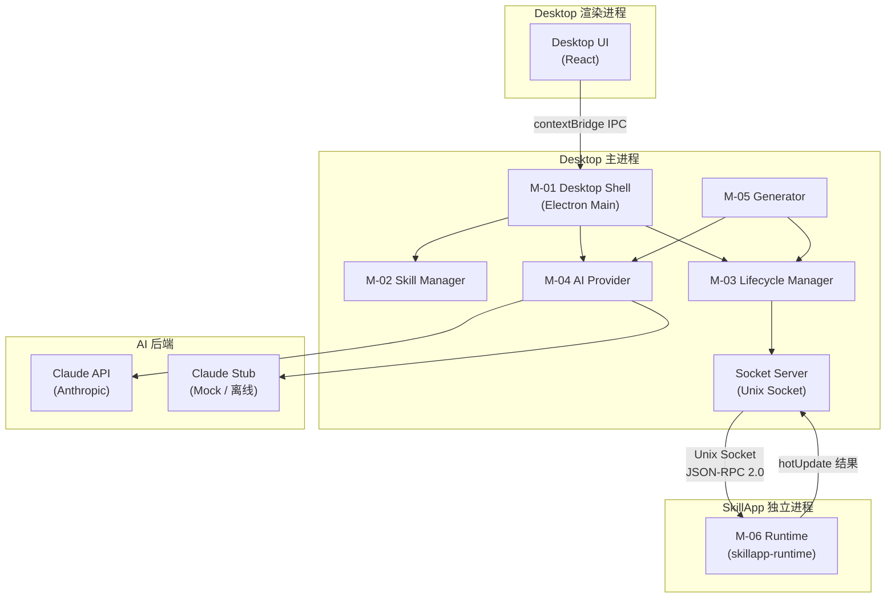
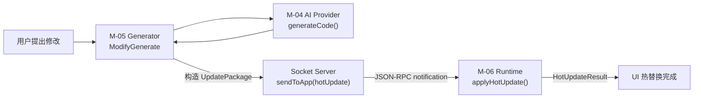
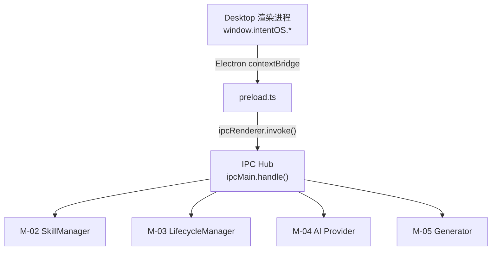
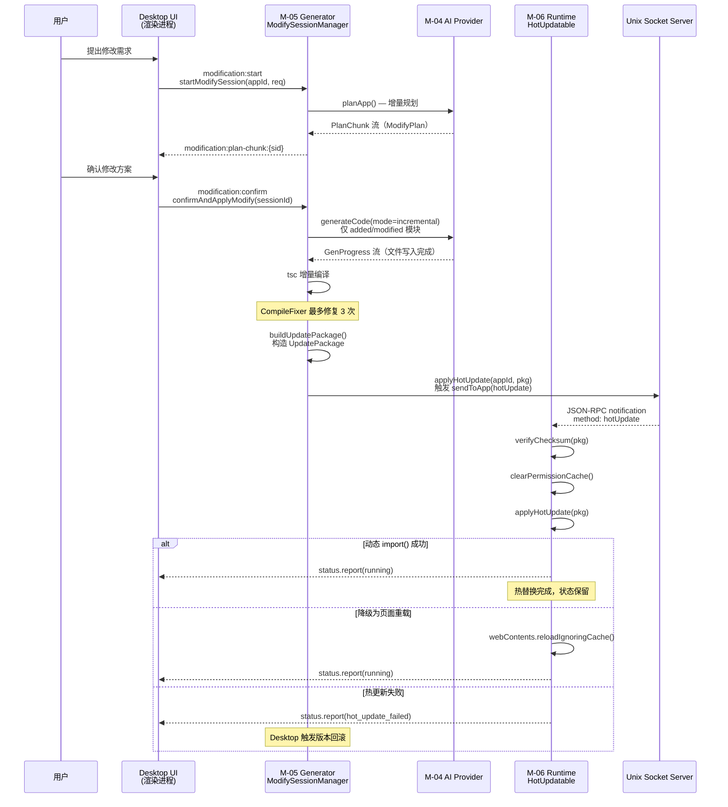

# IntentOS 全局接口文档

> **版本**：v1.0 | **日期**：2026-03-13 | **状态**：正式文档
> **权威说明**：当本文档与各模块文档存在不一致时，**本文档为权威来源**。

---

## 目录

1. [文档说明](#1-文档说明)
2. [模块间调用关系图](#2-模块间调用关系图)
3. [共享类型索引](#3-共享类型索引)
4. [Desktop ↔ 渲染进程接口（IPC）](#4-desktop--渲染进程接口ipc)
5. [Desktop ↔ SkillApp 接口（Unix Socket JSON-RPC）](#5-desktop--skillapp-接口unix-socket-json-rpc)
6. [M-04 AIProvider 接口](#6-m-04-aiprovider-接口)
7. [M-02 SkillManager 接口](#7-m-02-skillmanager-接口)
8. [M-03 LifecycleManager 接口](#8-m-03-lifecyclemanager-接口)
9. [M-05 Generator 接口](#9-m-05-generator-接口)
10. [M-06 Runtime 接口](#10-m-06-runtime-接口)
11. [热更新流程接口链](#11-热更新流程接口链)
12. [错误码汇总](#12-错误码汇总)
13. [版本兼容性说明](#13-版本兼容性说明)

---

## 1. 文档说明

### 定位与用途

本文档是 IntentOS 所有跨模块接口的**权威汇总**，供各模块开发人员在实现时对齐接口契约。它不替代各模块的详细开发文档，而是作为各模块文档之间的仲裁基准。

当你需要回答以下问题时，优先查阅本文档：

- 某个类型在哪个包中定义、被哪些模块使用？
- Desktop 渲染进程能调用哪些 IPC 方法，参数和返回值是什么？
- SkillApp 和 Desktop 之间通过 Unix Socket 传递哪些 JSON-RPC 消息？
- 某个模块对外暴露的接口精确签名是什么？

### 与各模块文档的关系

| 文档 | 用途 | 优先级 |
|------|------|--------|
| **本文档（interfaces.md）** | 跨模块接口权威定义、类型索引、错误码汇总 | **最高** |
| `shared-types.md` | `@intentos/shared-types` 包的完整类型和 Zod schema | 次之 |
| `ipc-channels.md` | IPC 通道的详细请求/响应格式、示例代码 | 次之 |
| `m02-skill-manager.md` ~ `m06-runtime.md` | 各模块实现细节、数据库 schema、测试用例 | 参考 |
| `unix-socket-ipc.md` | Unix Socket 服务端实现规范、粘包处理、并发安全 | 参考 |
| `hot-update-protocol.md` | 热更新完整流程、BackupManager、RollbackHandler | 参考 |

### 如何使用本文档

- **开发新模块**：先查第 2 节了解调用链，再查对应节的接口定义。
- **调试跨模块问题**：先查第 3 节确认类型来源，再查第 12 节匹配错误码。
- **接口变更**：变更前在本文档对应节提交修改，再同步各模块文档。

---

## 2. 模块间调用关系图

### 2.1 静态依赖关系



### 2.2 热更新数据流



### 2.3 IPC 通信分层



---

## 3. 共享类型索引

所有跨模块共享类型由 `@intentos/shared-types` 包统一定义（路径：`packages/shared-types/`）。

**权威来源**：`shared-types.md`

### 3.1 类型总览表

| 类型名 | 定义文件 | 使用模块 | 说明 |
|--------|---------|---------|------|
| `SkillMeta` | `types/skill.types.ts` | M-02, M-05, M-01 UI | Skill 元数据，含 id、version、permissions、methods 等 |
| `SkillMethod` | `types/skill.types.ts` | M-02 | Skill 暴露的单个方法签名 |
| `Permission` | `types/skill.types.ts` | M-02, M-03, M-05, M-06 | 权限声明（resource + actions + scope） |
| `JSONSchema` | `types/skill.types.ts` | M-02, M-05 | JSON Schema Draft 7 格式 |
| `AppMeta` | `types/app.types.ts` | M-03, M-01 UI | SkillApp 元数据，含 id、status、skillIds 等 |
| `AppStatus` | `types/app.types.ts` | M-03, M-01 UI | SkillApp 运行状态枚举 |
| `AppRegistryEntry` | `types/app.types.ts` | M-03, M-01 UI | 注册表项，扩展 AppMeta，含 pid、ipcPath |
| `ConnectionStatus` | `types/provider.types.ts` | M-04, M-01 UI | AI Provider 连接状态枚举 |
| `ProviderStatus` | `types/provider.types.ts` | M-04, M-01 UI | Provider 当前状态详情 |
| `ProviderConfig` | `types/provider.types.ts` | M-04, M-01 UI | Provider 初始化配置，判别联合类型（`claude-api` \| `custom` \| `openclaw`） |<!-- CR-001 新增 -->
| `PlanChunk` | `types/planning.types.ts` | M-04, M-05, M-01 UI | 规划流式输出块 |
| `PlanResult` | `types/planning.types.ts` | M-04, M-05, M-01 UI | 规划最终结果（含页面设计、Skill 映射） |
| `PageDesign` | `types/planning.types.ts` | M-04, M-05 | 单页面设计描述 |
| `GenProgress` | `types/generation.types.ts` | M-04, M-05, M-01 UI | 代码生成进度块 |
| `GenCompleteChunk` | `types/generation.types.ts` | M-04, M-05, M-03 | 生成完成信息，含 appId、entryPoint |
| `UpdatePackage` | `types/hotupdate.types.ts` | M-05, M-06 | 热更新包，含文件差量和 checksum |
| `FileUpdate` | `types/hotupdate.types.ts` | M-05, M-06 | 单文件更新内容（base64 + hash） |
| `ManifestDelta` | `types/hotupdate.types.ts` | M-05, M-06 | Manifest 增量变更（新增/移除 Skill/权限） |
| `SkillCallRequest` | `types/skill-call.types.ts` | M-04, M-06 | Skill 调用请求 |
| `SkillCallResult` | `types/skill-call.types.ts` | M-04, M-06 | Skill 调用结果 |
| `PermissionRequest` | `types/permission.types.ts` | M-06, M-03 | 权限授权请求 |
| `PermissionResult` | `types/permission.types.ts` | M-06, M-03 | 权限授权结果 |

### 3.2 类型导入方式

```typescript
import type {
  SkillMeta, AppMeta, AppStatus, AppRegistryEntry,
  ProviderStatus, ConnectionStatus, ProviderConfig,  // CR-001: ProviderConfig 新增
  PlanChunk, PlanResult, GenProgress, GenCompleteChunk,
  UpdatePackage, FileUpdate, ManifestDelta,
  SkillCallRequest, SkillCallResult,
  PermissionRequest, PermissionResult,
} from '@intentos/shared-types';
```

---

## 4. Desktop ↔ 渲染进程接口（IPC）

所有方法通过 `contextBridge.exposeInMainWorld('intentOS', {...})` 暴露，渲染进程通过 `window.intentOS.*` 调用。

**权威来源**：`ipc-channels.md § contextBridge 暴露结构`

### 4.1 skill 域（6 个方法）

```typescript
window.intentOS.skill: {
  /** 获取所有已安装 Skill 列表 */
  list(): Promise<{ skills: SkillMeta[]; totalCount: number }>;

  /** 获取单个 Skill 详情（含 readme） */
  get(skillId: string): Promise<SkillDetail>;

  /** 注册本地 Skill（扫描目录） */
  register(dirPath: string): Promise<{ skillId: string; meta: SkillMeta }>;

  /** 卸载 Skill（检查引用后执行） */
  unregister(skillId: string): Promise<{ success: boolean; blockedBy?: string[] }>;

  /** 检查 Skill 依赖是否满足 */
  checkDependencies(skillId: string): Promise<DependencyCheckResult>;

  /** 获取 Skill 被引用次数和引用方列表 */
  getRefCount(skillId: string): Promise<{ refCount: number; referencedBy: string[] }>;

  /** 订阅 Skill 变更事件，返回取消订阅函数 */
  onChanged(callback: (event: SkillChangedEvent) => void): () => void;
}
```

对应 IPC 通道：`skill:list`、`skill:get`、`skill:register`、`skill:unregister`、`skill:check-dependencies`、`skill:get-ref-count`、`skill-manager:changed`（事件推送）

### 4.2 app 域（5 个方法）

```typescript
window.intentOS.app: {
  /** 获取所有 SkillApp 列表 */
  list(): Promise<{ apps: AppRegistryEntry[]; totalCount: number }>;

  /** 获取单个 SkillApp 运行状态 */
  getStatus(appId: string): Promise<AppStatusResponse>;

  /** 启动 SkillApp */
  launch(appId: string): Promise<{ success: boolean; pid?: number }>;

  /** 停止 SkillApp */
  stop(appId: string): Promise<{ success: boolean }>;

  /** 重启 SkillApp */
  restart(appId: string): Promise<{ success: boolean; pid?: number }>;

  /** 聚焦 SkillApp 窗口 */
  focusWindow(appId: string): Promise<{ success: boolean }>;

  /** 卸载 SkillApp（清理进程、文件、数据库） */
  uninstall(appId: string): Promise<{ success: boolean }>;

  /** 订阅 SkillApp 状态变更事件 */
  onStatusChanged(callback: (event: AppStatusChangedEvent) => void): () => void;
}
```

> 注：`app` 域实际暴露 7 个方法（含 `restart`、`focusWindow`、`uninstall`），`ipc-channels.md` 列出的 5 个为核心请求方法（不含两个事件订阅类方法）。

对应 IPC 通道：`app:list`、`app:get-status`、`app:launch`、`app:stop`、`app:restart`、`app:focus-window`、`app:uninstall`、`app-lifecycle:status-changed`（事件推送）

### 4.3 generation 域（4 个核心方法）

```typescript
window.intentOS.generation: {
  /** 启动规划会话，返回 sessionId */
  startPlan(skillIds: string[], intent: string): Promise<{ sessionId: string; status: string }>;

  /** 多轮交互调整规划 */
  refinePlan(sessionId: string, feedback: string): Promise<{ status: string }>;

  /** 确认方案并开始代码生成 */
  confirmGenerate(sessionId: string, appName?: string): Promise<{ appId: string; status: string }>;

  /** 启动增量修改会话 */
  startModify(appId: string, requirement: string, newSkillIds?: string[]): Promise<{ sessionId: string; status: string }>;

  /** 确认增量修改方案并应用 */
  confirmApplyModify(sessionId: string): Promise<{ appId: string; status: string }>;

  /** 取消当前生成/修改会话 */
  cancel(sessionId: string): Promise<{ success: boolean }>;

  /** 订阅规划方案更新（流式） */
  onPlanUpdate(sessionId: string, callback: (update: PlanUpdate) => void): () => void;

  /** 订阅生成进度（流式） */
  onBuildProgress(sessionId: string, callback: (progress: BuildProgress) => void): () => void;

  /** 订阅原地变形就绪信号 */
  onTransformReady(callback: (event: TransformReadyEvent) => void): () => void;

  /** 订阅生成错误 */
  onError(sessionId: string, callback: (error: GenerationError) => void): () => void;
}
```

对应 IPC 通道：`generation:start-plan`、`generation:refine-plan`、`generation:confirm-generate`、`generation:start-modify`、`generation:confirm-apply-modify`、`generation:cancel`（请求），`generation:plan-update:{sessionId}`、`generation:build-progress:{sessionId}`、`generation:transform-ready`、`generation:error:{sessionId}`（事件推送）

### 4.4 ai-provider 域（5 个方法）

```typescript
window.intentOS.aiProvider: {
  /** 发起规划请求（由 M-05 内部转发，渲染进程一般不直接调用） */
  plan(request: AIPlanRequest): Promise<{ sessionId: string; status: string }>;

  /** 发起代码生成请求 */
  generate(request: AIGenerateRequest): Promise<{ sessionId: string; status: string }>;

  /** 触发 Skill 执行 */
  skillCall(request: SkillCallRequest): Promise<SkillCallResult>;

  /** 取消指定 sessionId 的会话 */
  cancel(sessionId: string): Promise<{ success: boolean }>;

  /** 查询当前 Provider 连接状态 */
  status(): Promise<ProviderStatus>;

  /** 订阅规划流式 chunk */
  onPlanChunk(sessionId: string, callback: (chunk: PlanChunk) => void): () => void;

  /** 订阅规划完成信号 */
  onPlanComplete(sessionId: string, callback: () => void): () => void;

  /** 订阅规划错误 */
  onPlanError(sessionId: string, callback: (error: AIError) => void): () => void;

  /** 订阅生成进度 chunk */
  onGenProgress(sessionId: string, callback: (chunk: GenProgress) => void): () => void;

  /** 订阅生成完成信号 */
  onGenComplete(sessionId: string, callback: (chunk: GenCompleteChunk) => void): () => void;

  /** 订阅生成错误 */
  onGenError(sessionId: string, callback: (error: AIError) => void): () => void;

  /** 订阅 Provider 状态变化（全局广播） */
  onStatusChanged(callback: (status: ProviderStatus) => void): () => void;
}
```

对应 IPC 通道：`ai-provider:plan`、`ai-provider:generate`、`ai-provider:skill-call`、`ai-provider:cancel`、`ai-provider:status`（请求），`ai-provider:plan-chunk:{sessionId}`、`ai-provider:plan-complete:{sessionId}`、`ai-provider:plan-error:{sessionId}`、`ai-provider:gen-progress:{sessionId}`、`ai-provider:gen-complete:{sessionId}`、`ai-provider:gen-error:{sessionId}`、`ai-provider:status-changed`（事件推送）

### 4.5 settings 域（4 个核心方法）

```typescript
window.intentOS.settings: {
  /** 获取设置项值 */
  get(key: string): Promise<any>;

  /** 更新设置项值 */
  set(key: string, value: any): Promise<{ success: boolean }>;

  /** 获取 AI Provider 配置 */
  getProviderConfig(): Promise<ProviderConfig>;

  /** 更新 AI Provider 配置 */
  setProviderConfig(config: Partial<ProviderConfig>): Promise<{ success: boolean }>;

  /** 获取 API Key（masked）；providerId 缺省为 'claude-api'，向后兼容 */  // CR-001 扩展
  getApiKey(providerId?: string): Promise<{ key: string | null; configured: boolean }>;

  /** 保存 API Key（加密存储）；providerId 缺省为 'claude-api'，向后兼容 */  // CR-001 扩展
  saveApiKey(key: string, providerId?: string): Promise<{ success: boolean }>;

  /** 删除 API Key */
  deleteApiKey(): Promise<{ success: boolean }>;

  /** 测试 AI Provider 连接；providerName 用于显示，缺省为当前活跃 Provider */  // CR-001 扩展
  testConnection(providerName?: string): Promise<{ success: boolean; latencyMs?: number; error?: AIError }>;

  /** 获取自定义 Provider 配置（不含 API Key） */  // CR-001 新增
  getCustomProviderConfig(): Promise<{ baseURL: string; model: string; providerName: string }>;

  /** 保存自定义 Provider 配置（不含 API Key） */  // CR-001 新增
  setCustomProviderConfig(config: { baseURL: string; model: string; providerName: string }): Promise<{ success: boolean }>;

  /** 切换激活 Provider */  // CR-001 新增
  setProvider(config: ProviderConfig): Promise<{ success: boolean }>;

  /** 订阅连接状态变更事件 */
  onConnectionStatusChanged(callback: (event: ConnectionStatusChangedEvent) => void): () => void;
}
```

对应 IPC 通道：`settings:get`、`settings:set`、`settings:get-provider-config`、`settings:set-provider-config`、`settings:get-api-key`、`settings:save-api-key`、`settings:delete-api-key`、`settings:test-connection`、`settings:get-custom-provider-config`、`settings:set-custom-provider-config`（请求），`ai-provider:set-provider`（切换 Provider 请求），`settings:connection-status-changed`（事件推送）

### 4.6 modification 域（3 个方法）

```typescript
window.intentOS.modification: {
  /** 启动增量修改会话 */
  start(appId: string, requirement: string, newSkillIds?: string[]): Promise<{ sessionId: string; status: string }>;

  /** 确认增量修改 */
  confirm(sessionId: string): Promise<{ appId: string; status: string }>;

  /** 取消修改会话 */
  cancel(sessionId: string): Promise<{ success: boolean }>;

  /** 订阅增量修改规划流式 chunk */
  onPlanChunk(sessionId: string, callback: (chunk: PlanChunk) => void): () => void;

  /** 订阅修改进度 */
  onProgress(sessionId: string, callback: (progress: ModifyProgress) => void): () => void;

  /** 订阅修改失败错误 */
  onError(sessionId: string, callback: (error: GenerationError) => void): () => void;
}
```

对应 IPC 通道：`modification:start`、`modification:confirm`、`modification:cancel`（请求），`modification:plan-chunk:{sessionId}`、`modification:progress:{sessionId}`、`modification:error:{sessionId}`（事件推送）

---

## 5. Desktop ↔ SkillApp 接口（Unix Socket JSON-RPC）

Desktop 作为 Unix Socket Server，SkillApp 主进程作为客户端。协议为 JSON-RPC 2.0，消息以 `\n` 分隔。

**权威来源**：`unix-socket-ipc.md § 5`、`m06-runtime.md § 8`

### 5.1 方法汇总表

| Method | 方向 | 类型 | Params 类型 | Result 类型 | 超时 |
|--------|------|------|------------|------------|------|
| `handshake` | SkillApp → Desktop | 请求 | `HandshakeParams` | `HandshakeResult` | 15s |
| `skill.call` | SkillApp → Desktop | 请求 | `SkillCallParams` | `SkillCallResult` | 30s |
| `resource.access` | SkillApp → Desktop | 请求 | `ResourceAccessParams` | `ResourceAccessResult` | 10s |
| `permission.request` | SkillApp → Desktop | 请求 | `PermissionRequestParams` | `PermissionGrantResult` | 60s（等待用户） |
| `status.report` | SkillApp → Desktop | 请求 | `StatusReportParams` | `{}` | — |
| `heartbeat` | SkillApp → Desktop | 请求 | `HeartbeatParams` | `HeartbeatResult` | 5s |
| `hotUpdate` | Desktop → SkillApp | 通知（无 id） | `UpdatePackageNotification` | void | — |
| `lifecycle.focus` | Desktop → SkillApp | 通知（无 id） | `{}` | void | — |
| `lifecycle.stop` | Desktop → SkillApp | 通知（无 id） | `{}` | void | — |

### 5.2 Params / Result 类型定义

#### HandshakeParams / HandshakeResult

```typescript
interface HandshakeParams {
  appId: string;           // 从环境变量 INTENTOS_APP_ID 读取
  version: string;         // SkillApp 版本号（来自 manifest.json）
  runtimeVersion: string;  // @intent-os/skillapp-runtime 版本
  pid: number;             // SkillApp 进程 PID
  electronVersion?: string;
}

interface HandshakeResult {
  permissions: PermissionEntry[];  // 已授权权限列表
  config: {
    heartbeatInterval: number;       // 心跳间隔（ms），默认 30000
    skillCallTimeout: number;        // Skill 调用超时（ms），默认 10000
    resourceAccessTimeout: number;   // 资源访问超时（ms），默认 10000
  };
}
```

#### SkillCallParams / SkillCallResult

```typescript
interface SkillCallParams {
  skillId: string;                 // 格式：name@version
  method: string;                  // Skill 方法名
  params: Record<string, any>;     // 调用参数
  callId: string;                  // 调用 ID（UUID）
  callerAppId: string;             // 发起调用的 SkillApp ID
}

// 成功响应的 result 字段
interface SkillCallSuccess {
  data: any;                       // Skill 返回值
}
```

#### ResourceAccessParams / ResourceAccessResult

```typescript
interface ResourceAccessParams {
  type: 'fs' | 'net' | 'process';
  action: 'read' | 'write' | 'execute' | 'connect';
  path?: string;                   // 文件路径或域名
  metadata?: Record<string, unknown>;
}

interface ResourceAccessResult {
  data?: unknown;                  // 访问返回的数据（base64 或字符串）
}
```

#### PermissionRequestParams / PermissionGrantResult

```typescript
interface PermissionRequestParams {
  resourceType: 'fs' | 'net' | 'process';
  resourcePath: string;
  action: string;
  reason?: string;                 // 向用户说明请求原因
}

interface PermissionGrantResult {
  granted: boolean;
  persistUntil?: number | null;    // null = 永久，number = Unix 时间戳（ms）
}
```

#### StatusReportParams

```typescript
interface StatusReportParams {
  appId: string;
  status: AppRuntimeStatus;        // 见 M-06 § AppRuntimeStatus
  timestamp: number;
  message?: string;
}
```

#### HeartbeatParams / HeartbeatResult

```typescript
interface HeartbeatParams {
  appId: string;
  timestamp: number;
  status: 'running';
  metrics: {
    memoryUsageMB: number;
    cpuPercent: number;
    activeSkillCalls: number;
    permissionCacheSize: number;
  };
}

interface HeartbeatResult {
  timestamp: number;               // Desktop 当前时间戳
}
```

#### UpdatePackageNotification（hotUpdate 通知 params）

```typescript
interface UpdatePackageNotification {
  appId: string;
  fromVersion: string;
  toVersion: string;
  timestamp: number;
  changedFiles: FileUpdate[];
  addedFiles: FileUpdate[];
  deletedFiles: string[];
  manifestDelta?: ManifestDelta;
  checksum: string;                // 整包 SHA-256
  description: string;
}
```

### 5.3 JSON-RPC 错误码

| 错误码 | 含义 | 场景 |
|--------|------|------|
| `-32700` | Parse error（无效 JSON） | 消息格式错误 |
| `-32600` | Invalid request（缺少必要字段） | 握手 appId 不合法 |
| `-32601` | Method not found | RPC 方法未注册 |
| `-32602` | Invalid params | 参数类型或数量错误 |
| `-32000` | Skill not found | Skill 未安装 |
| `-32001` | Permission denied | 权限被拒绝 |
| `-32002` | Resource not found | 文件/路径不存在 |
| `-32003` | Skill call timeout | Skill 调用超时（30s） |
| `-32004` | App not connected | SkillApp 未连接或已断开 |

---

## 6. M-04 AIProvider 接口

**权威来源**：`m04-ai-provider.md § 3 AIProvider 接口定义`

### 6.1 AIProvider 接口

```typescript
interface AIProvider {
  /**
   * 初始化 Provider（读取 API Key、验证连接）
   */
  initialize(config: ProviderConfig): Promise<void>;

  /**
   * 规划应用：接收用户意图和 Skill 列表，返回流式规划方案
   * 支持多轮对话（通过 contextHistory 传入历史）
   */
  planApp(request: PlanRequest): AsyncGenerator<PlanChunk>;

  /**
   * 生成代码：根据规划结果生成完整 Electron 应用代码
   * 通过 Claude Agent with MCP 工具写文件、执行 tsc 等
   */
  generateCode(request: GenerateRequest): AsyncGenerator<GenProgress>;

  /**
   * 执行 Skill：由 SkillApp 通过 Unix Socket 发起，Desktop 转发给 Skill 执行
   */
  executeSkill(request: SkillCallRequest): Promise<SkillCallResult>;

  /**
   * 取消正在进行的 AI 会话
   */
  cancelSession(sessionId: string): Promise<void>;

  /**
   * 获取当前 Provider 状态
   */
  getStatus(): ProviderStatus;

  /**
   * 订阅 Provider 状态变化，返回取消订阅函数
   */
  onStatusChanged(handler: (status: ProviderStatus) => void): () => void;
}
```

### 6.2 相关请求类型

<!-- CR-001: ProviderConfig 更新为判别联合类型，新增 custom 分支 -->
```typescript
/** 判别联合：各分支通过 providerId 区分 */
type ProviderConfig =
  | ClaudeProviderConfig
  | CustomProviderConfig
  | OpenClawProviderConfig;

interface ClaudeProviderConfig {
  providerId: 'claude-api';
  claudeModel?: string;        // 规划用模型，如 'claude-opus-4-6'
  claudeCodegenModel?: string; // 代码生成用模型
}

/** CR-001 新增：任意 OpenAI-compatible 端点 */
interface CustomProviderConfig {
  providerId: 'custom';
  baseURL: string;     // OpenAI-compatible Base URL，如 'https://api.openai.com/v1'
  model: string;       // 目标模型名称，如 'gpt-4o'
  providerName: string; // 用户自定义名称，用于 UI 显示
}

interface OpenClawProviderConfig {
  providerId: 'openclaw';
  openclawHost?: string; // 默认 '127.0.0.1'
  openclawPort?: number; // 默认 7890
}

interface PlanRequest {
  sessionId: string;             // UUID v4
  intent: string;                // 用户自然语言意图
  skills: SkillMeta[];           // 选中的 Skill 元数据列表
  contextHistory?: Array<{       // 多轮对话历史
    role: 'user' | 'assistant';
    content: string;
  }>;
}

interface GenerateRequest {
  sessionId: string;
  appId: string;
  plan: PlanResult;              // 规划阶段的输出
  targetDir: string;             // 代码输出目录
  mode: 'full' | 'incremental'; // 完整生成或增量生成
}
```

### 6.3 AIProviderManager 接口

```typescript
interface AIProviderManager {
  /**
   * 获取当前激活的 AIProvider 实例
   */
  getProvider(): AIProvider;

  /**
   * 切换 Provider 实现（如从 claude-api 切换到 openclaw）
   */
  switchProvider(config: ProviderConfig): Promise<void>;
}
```

---

## 7. M-02 SkillManager 接口

**权威来源**：`m02-skill-manager.md § 3 完整 API 接口`

### 7.1 SkillManager 接口

```typescript
interface SkillManager {
  /**
   * 注册一个本地 Skill（扫描目录、解析 skill.json、写入数据库）
   * @throws INVALID_SKILL_MANIFEST | SKILL_ALREADY_REGISTERED | IO_ERROR
   */
  registerSkill(dirPath: string): Promise<SkillMeta>;

  /**
   * 卸载已注册的 Skill（有引用时返回 blocked 而非抛出异常）
   * @throws SKILL_NOT_FOUND
   */
  unregisterSkill(skillId: string): Promise<UnregisterResult>;

  /**
   * 获取单个 Skill 元数据，不存在返回 null
   */
  getSkill(skillId: string): Promise<SkillMeta | null>;

  /**
   * 列出所有已注册的 Skill
   */
  listSkills(): Promise<SkillMeta[]>;

  /**
   * 检查 Skill 依赖关系（版本约束、缺失依赖）
   */
  checkDependencies(skillIds: string[]): Promise<DependencyCheckResult>;

  /**
   * 增加一个 Skill 被 SkillApp 引用的计数
   * @throws SKILL_NOT_FOUND | REFERENCE_ALREADY_EXISTS
   */
  addReference(skillId: string, appId: string): Promise<void>;

  /**
   * 减少引用计数（SkillApp 卸载时调用）
   */
  removeReference(skillId: string, appId: string): Promise<void>;

  /**
   * 获取 Skill 被引用总数
   */
  getReferenceCount(skillId: string): Promise<number>;

  /**
   * 获取引用该 Skill 的所有 SkillApp ID 列表
   */
  getReferencedBy(skillId: string): Promise<string[]>;

  /**
   * 扫描目录识别 Skill（不自动注册，仅返回预览）
   */
  scanLocalDirectory(dirPath: string): Promise<SkillMeta[]>;

  /**
   * 刷新 Skill 元数据（重读 skill.json，内容变化则更新数据库）
   * @throws SKILL_NOT_FOUND | INVALID_SKILL_MANIFEST
   */
  refreshSkillMetadata(skillId: string): Promise<SkillMeta>;

  /**
   * 订阅 Skill 变更事件，返回取消订阅函数
   */
  onSkillChanged(callback: (event: SkillChangedEvent) => void): () => void;
}
```

### 7.2 M-02 内部类型

```typescript
// M-02 内部使用的 SkillMeta（与 @intentos/shared-types 的 SkillMeta 字段有差异）
interface SkillMeta {
  id: string;                      // 格式：{name}@{version}
  name: string;
  version: string;                 // semver：major.minor.patch
  description?: string;
  entryPoint: string;              // 相对于 dirPath 的路径
  dirPath: string;                 // 本地绝对路径
  permissions: PermissionDecl[];
  dependencies: DependencyDecl[];
  installedAt: number;             // 时间戳（ms）
  updatedAt: number;
}

type UnregisterResult =
  | { success: true }
  | { success: false; blockedBy: string[]; reason: 'HAS_REFERENCES' };

interface DependencyCheckResult {
  satisfied: boolean;
  missing: MissingDep[];
  conflicts: ConflictDep[];
}

interface SkillChangedEvent {
  type: 'added' | 'removed' | 'updated';
  skillId: string;
  timestamp: number;
  metadata?: SkillMeta;
}
```

---

## 8. M-03 LifecycleManager 接口

**权威来源**：`m03-lifecycle-manager.md § 4 完整 API 接口`

### 8.1 LifecycleManager 接口

```typescript
interface LifecycleManager {
  /**
   * 注册新生成的 SkillApp（M-05 生成完成后调用，状态初始为 'registered'）
   */
  registerApp(meta: AppMeta): Promise<void>;

  /**
   * 卸载 SkillApp（停止进程 → 删除数据库 → 清理文件 → 解除 Skill 引用）
   * @throws APP_NOT_FOUND
   */
  uninstallApp(appId: string): Promise<void>;

  /**
   * 启动 SkillApp 进程（spawn + IPC 握手，超时 5s 标记为 crashed）
   * @throws APP_NOT_FOUND | APP_ALREADY_RUNNING | APP_START_FAILED
   */
  launchApp(appId: string): Promise<void>;

  /**
   * 停止 SkillApp 进程（SIGTERM → 5s 超时 → SIGKILL，幂等）
   * @throws APP_NOT_FOUND
   */
  stopApp(appId: string): Promise<void>;

  /**
   * 聚焦 SkillApp 窗口（通过 Unix Socket 发送 lifecycle.focus 指令）
   * @throws APP_NOT_FOUND | APP_NOT_RUNNING
   */
  focusAppWindow(appId: string): Promise<void>;

  /**
   * 获取 SkillApp 当前状态
   * @throws APP_NOT_FOUND
   */
  getAppStatus(appId: string): Promise<AppStatus>;

  /**
   * 获取所有已注册的 SkillApp 元数据（按 createdAt 降序）
   */
  listApps(): Promise<AppMeta[]>;

  /**
   * 订阅应用状态变更事件，返回取消订阅函数
   */
  onAppStatusChanged(handler: (event: AppStatusEvent) => void): () => void;

  /**
   * 供 ProcessWatcher 通知崩溃（内部方法，public 供协作模块调用）
   */
  handleCrash(appId: string, info: ICrashNotification): Promise<void>;
}
```

### 8.2 M-03 内部类型

```typescript
type AppStatus =
  | 'registered'    // 已注册但从未启动
  | 'starting'      // 进程启动中（等待 IPC 握手）
  | 'running'       // 正常运行中
  | 'crashed'       // 进程异常退出
  | 'restarting'    // 崩溃后自动重启中
  | 'uninstalling'  // 卸载流程进行中
  | 'stopped';      // 已停止

interface AppMeta {
  id: string;
  name: string;
  description?: string;
  skillIds: string[];
  status: AppStatus;
  outputDir: string;
  entryPoint: string;
  createdAt: string;         // ISO 8601
  updatedAt: string;
  version: number;           // 热更新后递增
  crashCount: number;
  lastCrashAt?: string;
  pid?: number;
  windowBounds?: { x: number; y: number; width: number; height: number; isMaximized?: boolean };
}

interface AppStatusEvent {
  appId: string;
  status: AppStatus;
  previousStatus: AppStatus;
  timestamp: number;         // ms
  crashCount?: number;
  error?: { code: string; message: string };
}

interface ICrashNotification {
  appId: string;
  exitCode: number;
  signal: string;
  timestamp: number;
}
```

---

## 9. M-05 Generator 接口

**权威来源**：`m05-generator.md`

### 9.1 PlanSessionManager 接口

```typescript
interface PlanSessionManager {
  /**
   * 启动规划会话，调用 M-04 planApp()，流式转发 PlanChunk 到渲染进程
   */
  startPlanSession(request: StartPlanRequest): Promise<{ sessionId: string }>;

  /**
   * 追加用户反馈，调用 M-04 planApp() 继续规划（携带完整 contextHistory）
   */
  refinePlan(sessionId: string, feedback: string): Promise<void>;

  /**
   * 获取当前规划结果（仅 awaiting_feedback 状态下可用）
   */
  getPlanResult(sessionId: string): Promise<PlanResult | null>;

  /**
   * 取消规划会话，调用 M-04 cancelSession()
   */
  cancelPlanSession(sessionId: string): void;
}

interface StartPlanRequest {
  skillIds: string[];          // 至少 1 个
  intent: string;              // 用户自然语言意图
}
```

### 9.2 GenerateSessionManager 接口

```typescript
interface GenerateSessionManager {
  /**
   * 用户确认规划方案后，开始代码生成与打包
   * 生成完成后调用 M-03 registerApp()
   */
  confirmAndGenerate(sessionId: string, appName: string): Promise<void>;
}
```

### 9.3 CompileFixer 接口

```typescript
interface CompileFixer {
  /**
   * 尝试修复编译错误（最多 3 次），失败时返回剩余错误
   */
  tryFix(
    appDir: string,
    errors: CompileError[],
    provider: AIProvider
  ): Promise<CompileFixResult>;
}

interface CompileError {
  file: string;        // 相对路径，如 'src/app/pages/ImportPage.tsx'
  line: number;        // 1-based
  column: number;      // 1-based
  message: string;
  code: string;        // TypeScript 错误码，如 'TS2345'
}

interface CompileFixResult {
  success: boolean;
  attempts: number;              // 实际尝试次数（1-3）
  finalErrors?: CompileError[];  // 失败时的最后一次错误列表
}
```

### 9.4 ModifySessionManager 接口

```typescript
interface ModifySessionManager {
  /**
   * 启动增量修改会话，分析现有代码并生成 ModifyPlan
   */
  startModifySession(appId: string, requirement: string): Promise<{ sessionId: string }>;

  /**
   * 用户确认增量方案后，开始增量生成（仅 added/modified 模块）
   * 生成完成后构造 UpdatePackage，调用 M-06 applyHotUpdate()
   */
  confirmAndApplyModify(sessionId: string): Promise<void>;

  /**
   * 取消增量修改会话
   */
  cancelModifySession(sessionId: string): void;
}
```

### 9.5 M-05 内部类型

```typescript
interface PlanResult {
  appName: string;
  description: string;
  modules: PlanModule[];
  skillUsage: SkillUsageItem[];
  techStack: string[];
}

interface PlanModule {
  name: string;
  filePath: string;             // 相对路径
  description: string;
  skillIds: string[];
}

interface ModifyPlan {
  sessionId: string;
  added: ModuleChange[];
  modified: ModuleChange[];
  unchanged: string[];          // 相对路径列表
}

interface ModuleChange {
  filePath: string;
  description: string;
  content?: string;             // confirmAndApplyModify 后填充
}

type GeneratorErrorCode =
  | 'PLAN_SESSION_NOT_FOUND'
  | 'PLAN_SESSION_EXPIRED'
  | 'PLAN_SESSION_WRONG_STATE'
  | 'GENERATION_FAILED'
  | 'COMPILE_MAX_RETRIES_EXCEEDED'
  | 'MODIFY_SESSION_NOT_FOUND'
  | 'MODIFY_SESSION_EXPIRED'
  | 'MODIFY_SESSION_WRONG_STATE'
  | 'APP_DIR_NOT_FOUND'
  | 'PLAN_RESULT_MISSING';
```

---

## 10. M-06 Runtime 接口

**权威来源**：`m06-runtime.md § 4、§ 7`

### 10.1 RuntimeMain 接口

```typescript
interface RuntimeMain {
  /**
   * 初始化：读取环境变量、创建 Unix Socket 连接、完成握手、缓存权限
   * 握手超时 15s，超时后 process.exit(1)
   * @throws SOCKET_CONNECT_FAILED | HANDSHAKE_TIMEOUT | HANDSHAKE_REJECTED
   */
  initialize(): Promise<void>;

  /**
   * 调用 Skill：通过 Unix Socket 向 Desktop 发送 skill.call 请求
   * @throws SKILL_CALL_TIMEOUT | SKILL_EXECUTION_ERROR
   */
  callSkill(skillId: string, method: string, params: unknown): Promise<unknown>;

  /**
   * 访问资源：先查权限缓存，命中直接转发，未命中请求授权
   * @throws PERMISSION_DENIED | RESOURCE_ACCESS_TIMEOUT
   */
  accessResource(request: ResourceRequest): Promise<ResourceResult>;

  /**
   * 请求权限（触发 Desktop 弹出用户授权弹窗）
   */
  requestPermission(request: PermissionRequest): Promise<PermissionResult>;

  /**
   * 上报运行状态（向 Desktop 发送 status.report 通知）
   */
  reportStatus(status: AppRuntimeStatus): Promise<void>;

  /**
   * 注册热更新处理器（Desktop 推送 hotUpdate 通知时触发）
   */
  onHotUpdate(handler: (pkg: UpdatePackage) => void): void;

  /**
   * 销毁运行时（关闭 Socket、停止心跳）
   * 在 app.on('window-all-closed') 中调用
   */
  destroy(): void;
}
```

### 10.2 HotUpdatable 接口

```typescript
interface HotUpdatable {
  /**
   * 接收并应用热更新包
   * 策略：动态 import() 热替换为主，webContents.reloadIgnoringCache() 为兜底
   */
  applyHotUpdate(pkg: UpdatePackage): Promise<HotUpdateResult>;
}

interface HotUpdateResult {
  success: boolean;
  degraded: boolean;      // true = 降级为 webContents 重载
  error?: string;
}
```

### 10.3 RuntimeAPI（暴露给 SkillApp 渲染进程）

```typescript
// 通过 contextBridge.exposeInMainWorld('intentOS', ...) 暴露
interface RuntimeAPI {
  /** 调用 Skill（渲染进程业务代码直接调用） */
  callSkill(skillId: string, method: string, params: unknown): Promise<unknown>;

  /** 访问宿主 OS 资源 */
  accessResource(request: ResourceRequest): Promise<ResourceResult>;

  /** 请求权限（触发 Desktop 弹出授权弹窗） */
  requestPermission(request: PermissionRequest): Promise<PermissionResult>;
}
```

### 10.4 AppRuntimeStatus 枚举

```typescript
type AppRuntimeStatus =
  | 'starting'          // 进程已启动，正在执行 Runtime initialize()
  | 'ready'             // 握手完成，UI 已渲染，准备就绪
  | 'running'           // 正常运行中
  | 'updating'          // 正在应用热更新
  | 'hot_update_failed' // 热更新失败
  | 'stopping';         // 正在退出
```

---

## 11. 热更新流程接口链

**权威来源**：`hot-update-protocol.md § 4`、`m05-generator.md § 7`、`m06-runtime.md § 7`



---

## 12. 错误码汇总

### 12.1 M-02 SkillManager 错误码

**权威来源**：`m02-skill-manager.md § 11`

| 错误码 | 含义 | 恢复策略 |
|--------|------|---------|
| `SKILL_NOT_FOUND` | 指定 skillId 不存在 | 检查 skillId 格式是否正确 |
| `SKILL_ALREADY_REGISTERED` | Skill 已注册（同名不同版本不允许） | 先卸载旧版本再注册 |
| `SKILL_HAS_REFERENCES` | Skill 被 SkillApp 引用，无法卸载 | 先卸载引用该 Skill 的 SkillApp |
| `INVALID_SKILL_MANIFEST` | skill.json 格式不合法 | 修复 skill.json 后重新注册 |
| `DEPENDENCY_MISSING` | 缺失依赖 Skill | 安装缺失的依赖 Skill |
| `DEPENDENCY_CONFLICT` | 版本约束冲突 | 更新冲突 Skill 的版本 |
| `IO_ERROR` | 文件 I/O 错误 | 检查文件系统权限 |
| `DATABASE_ERROR` | 数据库操作错误 | 查看日志或重启应用 |
| `REFERENCE_ALREADY_EXISTS` | 引用记录已存在（内部使用） | 检查业务逻辑 |
| `INVALID_VERSION_FORMAT` | 版本号不符合 semver 格式 | 修改版本号为 major.minor.patch |

### 12.2 M-03 LifecycleManager 错误码

**权威来源**：`m03-lifecycle-manager.md § 11`

| 错误码 | 含义 | 恢复策略 |
|--------|------|---------|
| `APP_NOT_FOUND` | 应用不存在或已被删除 | 刷新应用列表 |
| `APP_ALREADY_RUNNING` | 应用已在运行，无法重复启动 | 自动跳过或聚焦窗口 |
| `APP_START_FAILED` | 应用启动失败 | 检查 entryPoint 文件是否存在 |
| `APP_NOT_RUNNING` | 应用未运行，无法停止/聚焦 | 检查应用状态 |
| `PROCESS_NOT_FOUND` | 进程对象不存在（内部错误） | 内部诊断 |
| `IPC_SEND_FAILED` | IPC 消息发送失败 | 检查 Unix Socket 连接 |
| `PROCESS_DEAD` | 进程已意外退出 | 重新启动应用 |
| `UNINSTALL_FAILED` | 卸载失败（可重试） | 重试卸载 |

### 12.3 M-04 AI Provider 错误码

**权威来源**：`m04-ai-provider.md § 错误处理规范`

| 错误码 | 含义 | 恢复策略 |
|--------|------|---------|
| `PROVIDER_NOT_INITIALIZED` | Provider 未初始化 | 先调用 initialize() |
| `API_KEY_INVALID` | Claude API Key 无效 | 提示用户重新输入 Key |
| `RATE_LIMITED` | API 配额受限 | 自动重试（指数退避） |
| `NETWORK_UNAVAILABLE` | 网络不可用 | 检查网络连接 |
| `SESSION_CANCELLED` | 会话被用户取消 | 静默处理，回退 UI |
| `CODEGEN_FAILED` | AI 代码生成失败 | 提示用户简化需求或重试 |
| `COMPILE_FAILED` | 编译失败 | 提示用户联系支持，导出日志 |
| `INVALID_BASE_URL` | Custom Provider Base URL 格式不合法 | 提示用户检查 URL 格式（需以 http/https 开头） |<!-- CR-001 新增 -->
| `MODEL_NOT_FOUND` | 指定模型不存在或端点不支持 | 提示用户检查模型名称 |<!-- CR-001 新增 -->
| `CUSTOM_PROVIDER_UNREACHABLE` | Custom Provider 端点不可达 | 提示用户检查 Base URL 和网络连接 |<!-- CR-001 新增 -->
| `TOOL_CALL_UNSUPPORTED` | Custom Provider 不支持 function calling | 提示用户选择支持工具调用的模型 |<!-- CR-001 新增 -->

### 12.4 M-05 Generator 错误码

**权威来源**：`m05-generator.md § 9`

| 错误码 | 含义 | 恢复策略 |
|--------|------|---------|
| `PLAN_SESSION_NOT_FOUND` | 规划会话不存在 | 提示用户重新开始 |
| `PLAN_SESSION_EXPIRED` | 规划会话已超时清理（30 分钟） | 提示「会话已超时，请重新开始」 |
| `PLAN_SESSION_WRONG_STATE` | 会话状态不允许当前操作 | 检查调用时序 |
| `GENERATION_FAILED` | 代码生成不可恢复错误 | 提示用户重试 |
| `COMPILE_MAX_RETRIES_EXCEEDED` | 编译修复达到最大重试次数（3次） | 显示错误详情，提示用户报告 |
| `MODIFY_SESSION_NOT_FOUND` | 增量修改会话不存在 | 提示用户重新开始修改 |
| `MODIFY_SESSION_EXPIRED` | 增量修改会话已超时清理 | 提示「会话已超时，请重新开始」 |
| `APP_DIR_NOT_FOUND` | 目标 SkillApp 目录不存在 | 检查应用是否已卸载 |
| `PLAN_RESULT_MISSING` | confirmAndGenerate 时规划结果为 null | 确保先完成规划再确认生成 |

### 12.5 M-06 Runtime 错误码

**权威来源**：`m06-runtime.md § 13`

| 错误码 | 值 | 含义 |
|--------|-----|------|
| `SOCKET_CONNECT_FAILED` | 1001 | Unix Socket 不存在或连接被拒 |
| `SOCKET_DISCONNECTED` | 1002 | 连接意外断开 |
| `RECONNECT_EXHAUSTED` | 1003 | 重连次数耗尽 |
| `HANDSHAKE_TIMEOUT` | 1100 | 15s 内未完成握手 |
| `HANDSHAKE_REJECTED` | 1101 | Desktop 返回握手失败 |
| `HANDSHAKE_INVALID_RESPONSE` | 1102 | 握手响应格式错误 |
| `SKILL_CALL_TIMEOUT` | 2001 | Skill 调用超时（默认 10s） |
| `SKILL_NOT_FOUND` | 2002 | Skill 未安装或 ID 不合法 |
| `SKILL_EXECUTION_ERROR` | 2100 | Skill 运行时抛出异常 |
| `PERMISSION_DENIED` | 3001 | 权限未声明于 manifest |
| `PERMISSION_USER_DENIED` | 3002 | 用户手动拒绝授权 |
| `RESOURCE_ACCESS_TIMEOUT` | 4001 | 资源访问超时（默认 10s） |
| `RESOURCE_NOT_FOUND` | 4002 | 文件/路径不存在 |
| `RESOURCE_ACCESS_DENIED` | 4003 | 系统级权限拒绝 |
| `HOT_UPDATE_CHECKSUM_MISMATCH` | 5001 | 热更新包校验失败 |
| `HOT_UPDATE_APPLY_FAILED` | 5002 | 热更新应用失败 |

### 12.6 热更新错误码

**权威来源**：`hot-update-protocol.md § 11`

| 错误码 | 含义 |
|--------|------|
| `HOT_UPDATE_CHECKSUM_MISMATCH` | 文件 checksum 不匹配 |
| `HOT_UPDATE_BACKUP_FAILED` | 备份创建失败 |
| `HOT_UPDATE_WRITE_FAILED` | 新文件写入失败（触发还原） |
| `HOT_UPDATE_COMPILE_FAILED` | 增量编译失败（触发还原） |
| `HOT_UPDATE_IMPORT_FAILED` | 动态 import() 失败（触发降级重载） |
| `ROLLBACK_NO_BACKUP` | 无可用备份，无法回滚 |
| `ROLLBACK_RESTORE_FAILED` | 备份还原失败 |

---

## 13. 版本兼容性说明

### 13.1 `@intentos/shared-types` 包版本升级规则

遵循语义化版本（semver）：

| 变更类型 | 版本升级 | 示例 |
|---------|---------|------|
| 新增可选字段 | patch 版本升级 | 1.0.0 → 1.0.1 |
| 新增类型或接口 | minor 版本升级 | 1.0.0 → 1.1.0 |
| 修改现有字段类型、删除字段 | major 版本升级 | 1.0.0 → 2.0.0 |
| 修复 Zod schema 校验逻辑（不影响类型） | patch 版本升级 | 1.0.0 → 1.0.1 |

**规则**：所有消费 `@intentos/shared-types` 的模块（M-01 至 M-06）必须指定精确的 `^major.minor` 版本依赖，确保 minor 版本升级不会破坏运行时。

### 13.2 IPC Channel 变更的兼容策略

#### 新增 Channel

直接新增，不影响已有渲染进程功能。渲染进程可选择监听新 channel。

#### 修改现有 Channel 的 Params/Result 结构

1. **向后兼容变更**（新增可选字段）：可直接修改，同步更新本文档第 4 节。
2. **破坏性变更**（修改必填字段类型、删除字段）：必须引入新 channel 并保留旧 channel 一个迭代周期，使用 `deprecated` 注释标记旧 channel。

#### 废弃 Channel

在本文档标注 `@deprecated`，保留至少一个完整迭代后删除。

#### Unix Socket JSON-RPC 方法变更

JSON-RPC 方法名一旦发布不得修改（SkillApp 可能运行旧版 runtime）。新功能通过新增方法名实现，旧方法保持兼容。

### 13.3 Runtime 版本兼容矩阵

SkillApp 打包时内嵌 `@intent-os/skillapp-runtime`，版本由 M-05 生成器写入 package.json。Desktop 在握手时通过 `runtimeVersion` 字段判断兼容性：

| Desktop 版本 | 支持的 Runtime 版本 |
|-------------|-------------------|
| 1.x | 1.x（major 相同） |
| 2.x | 2.x（major 相同）；1.x 降级模式（部分功能不可用） |

---

## 变更记录

| 版本 | 日期 | 主要变更 |
|------|------|---------|
| 1.0 | 2026-03-13 | 初始文档，汇总 MVP 所有跨模块接口、共享类型索引、IPC 方法、JSON-RPC 方法、错误码 |
| 1.1 | 2026-03-14 | CR-001：`ProviderConfig` 改为判别联合类型（新增 `custom` 分支）、`§ 4.5` settings 域新增 `getCustomProviderConfig`/`setCustomProviderConfig`/`setProvider` 方法及 `getApiKey`/`saveApiKey` 参数扩展、`§ 12.3` 新增 4 个 Custom Provider 错误码 |
