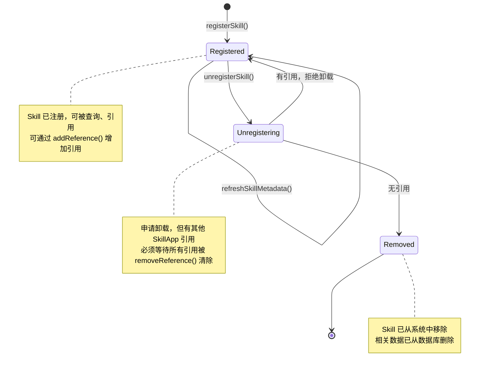

# M-02 Skill 管理器 开发文档

> **版本**：v1.0 | **日期**：2026-03-13
> **状态**：正式文档 | **对应模块**：M-02 Skill 管理器

---

## 1. 模块概述

### 1.1 职责

M-02 Skill 管理器负责管理本地已安装 Skill 的完整生命周期。核心职责包括：

- **Skill 注册**：扫描本地目录、解析 skill.md 元数据、写入 SQLite 数据库
- **Skill 卸载**：检查引用计数、验证无依赖后从数据库删除
- **元数据管理**：维护 Skill 的 name、version、description、entryPoint、permissions、dependencies 等信息
- **依赖检查**：验证 Skill 的所有依赖是否已安装且版本兼容
- **引用计数**：追踪每个 Skill 被多少个 SkillApp 引用，保护有引用的 Skill 不被卸载
- **版本管理**：支持同一 Skill 的多版本并存，版本格式验证
- **本地目录扫描**：自动识别本地 Skill 目录结构，批量注册

### 1.2 边界（不做什么）

- **不负责 Skill 运行时执行**：Skill 的实际执行由 AI Provider（M-04）负责
- **不负责 Skill 市场网络通信**：Skill 市场相关功能由 M-07 Skill 市场客户端负责
- **不负责 SkillApp 生成逻辑**：应用生成由 M-05 SkillApp 生成器负责
- **不直接调用 AI Provider**：M-02 仅管理元数据，不参与 Skill 执行链路

### 1.3 文件目录

```
src/main/modules/skill-manager/
├── index.ts                    # 模块导出入口
├── manager.ts                  # SkillManager 接口实现
├── database.ts                 # SQLite 数据库初始化与 schema
├── types.ts                    # TypeScript 类型定义
├── scanner.ts                  # 本地目录扫描器
├── manifest-parser.ts          # skill.md 解析与验证
├── dependency-checker.ts       # 依赖检查逻辑
├── errors.ts                   # 错误码与错误类定义
└── __tests__/
    ├── manager.test.ts
    ├── scanner.test.ts
    ├── dependency-checker.test.ts
    └── database.test.ts
```

---

## 2. SQLite 数据库 Schema

### 2.1 skills 表

存储已注册 Skill 的完整元数据。

```sql
CREATE TABLE skills (
  id TEXT PRIMARY KEY NOT NULL,
  name TEXT NOT NULL UNIQUE,
  version TEXT NOT NULL,
  description TEXT,
  entryPoint TEXT NOT NULL,
  dirPath TEXT NOT NULL UNIQUE,
  permissions TEXT,
  dependencies TEXT,
  installedAt INTEGER NOT NULL,
  updatedAt INTEGER NOT NULL,

  CHECK (
    id IS NOT NULL AND
    name IS NOT NULL AND
    version IS NOT NULL AND
    entryPoint IS NOT NULL AND
    dirPath IS NOT NULL
  )
);

CREATE INDEX idx_skills_name ON skills(name);
CREATE INDEX idx_skills_version ON skills(version);
CREATE INDEX idx_skills_installedAt ON skills(installedAt DESC);
```

**字段详解**：

| 字段 | 类型 | 约束 | 说明 |
|------|------|------|------|
| `id` | TEXT | PRIMARY KEY | Skill 唯一标识符（格式：`{name}@{version}`，如 `data-cleaner@1.0.0`) |
| `name` | TEXT | UNIQUE NOT NULL | Skill 名称（全局唯一） |
| `version` | TEXT | NOT NULL | 版本号（遵循 semver 格式：major.minor.patch） |
| `description` | TEXT | 可选 | Skill 简述 |
| `entryPoint` | TEXT | NOT NULL | 入口文件路径（相对于 dirPath，如 `dist/index.js`） |
| `dirPath` | TEXT | UNIQUE NOT NULL | Skill 所在本地目录的绝对路径 |
| `permissions` | TEXT | 可选 | JSON 数组，如 `[{"resource":"fs","actions":["read","write"]}]` |
| `dependencies` | TEXT | 可选 | JSON 数组，如 `[{"name":"data-processor","version":">=1.0.0"}]` |
| `installedAt` | INTEGER | NOT NULL | 注册时间戳（ms，由 `Date.now()` 生成） |
| `updatedAt` | INTEGER | NOT NULL | 最后更新时间戳（ms） |

**JSON 字段格式**：

```typescript
// permissions 字段存储为 JSON 字符串
[
  {
    "resource": "fs",        // 资源类型：fs, net, process
    "actions": ["read"],     // 操作：read, write, delete, watch, fetch, spawn 等
    "scope": "user-selected" // 作用域：可选，如 "*" 或 "*.example.com"
  }
]

// dependencies 字段存储为 JSON 字符串
[
  {
    "name": "data-processor",
    "version": ">=1.0.0"     // 版本约束表达式（npm semver 格式）
  }
]
```

### 2.2 skill_references 表

追踪每个 Skill 被哪些 SkillApp 引用，用于引用计数和卸载保护。

```sql
CREATE TABLE skill_references (
  skillId TEXT NOT NULL,
  appId TEXT NOT NULL,
  createdAt INTEGER NOT NULL,

  PRIMARY KEY (skillId, appId),
  FOREIGN KEY (skillId) REFERENCES skills(id) ON DELETE CASCADE
);

CREATE INDEX idx_skill_references_skillId ON skill_references(skillId);
CREATE INDEX idx_skill_references_appId ON skill_references(appId);
```

**字段详解**：

| 字段 | 类型 | 约束 | 说明 |
|------|------|------|------|
| `skillId` | TEXT | PRIMARY KEY（联合） | 被引用的 Skill ID |
| `appId` | TEXT | PRIMARY KEY（联合） | 引用该 Skill 的 SkillApp ID |
| `createdAt` | INTEGER | NOT NULL | 引用创建时间戳（ms） |

### 2.3 数据库初始化函数

```typescript
async function initializeDatabase(dbPath: string): Promise<Database> {
  const db = new Database(dbPath);

  // 启用外键约束
  db.pragma('foreign_keys = ON');
  db.pragma('journal_mode = WAL');

  // 创建表
  db.exec(`
    CREATE TABLE IF NOT EXISTS skills (
      id TEXT PRIMARY KEY NOT NULL,
      name TEXT NOT NULL UNIQUE,
      version TEXT NOT NULL,
      description TEXT,
      entryPoint TEXT NOT NULL,
      dirPath TEXT NOT NULL UNIQUE,
      permissions TEXT,
      dependencies TEXT,
      installedAt INTEGER NOT NULL,
      updatedAt INTEGER NOT NULL
    );

    CREATE INDEX IF NOT EXISTS idx_skills_name ON skills(name);
    CREATE INDEX IF NOT EXISTS idx_skills_version ON skills(version);
    CREATE INDEX IF NOT EXISTS idx_skills_installedAt ON skills(installedAt DESC);

    CREATE TABLE IF NOT EXISTS skill_references (
      skillId TEXT NOT NULL,
      appId TEXT NOT NULL,
      createdAt INTEGER NOT NULL,
      PRIMARY KEY (skillId, appId),
      FOREIGN KEY (skillId) REFERENCES skills(id) ON DELETE CASCADE
    );

    CREATE INDEX IF NOT EXISTS idx_skill_references_skillId ON skill_references(skillId);
    CREATE INDEX IF NOT EXISTS idx_skill_references_appId ON skill_references(appId);
  `);

  return db;
}
```

---

## 3. 完整 API 接口

### 3.1 SkillManager 接口定义

```typescript
interface SkillManager {
  /**
   * 注册一个本地 Skill
   * @param dirPath 本地 Skill 目录的绝对路径
   * @returns 注册后的 Skill 元数据
   * @throws SkillManagerError.INVALID_SKILL_MANIFEST | SKILL_ALREADY_REGISTERED | IO_ERROR
   */
  registerSkill(dirPath: string): Promise<SkillMeta>;

  /**
   * 卸载一个已注册的 Skill
   * @param skillId Skill ID（格式：name@version）
   * @returns 卸载结果（success 或 被引用的 appId 列表）
   * @throws SkillManagerError.SKILL_NOT_FOUND | SKILL_HAS_REFERENCES
   */
  unregisterSkill(skillId: string): Promise<UnregisterResult>;

  /**
   * 获取单个 Skill 的元数据
   * @param skillId Skill ID
   * @returns Skill 元数据，如不存在返回 null
   */
  getSkill(skillId: string): Promise<SkillMeta | null>;

  /**
   * 列出所有已注册的 Skill
   * @returns SkillMeta 数组
   */
  listSkills(): Promise<SkillMeta[]>;

  /**
   * 检查指定 Skill 列表的依赖关系
   * @param skillIds 待检查的 Skill ID 列表
   * @returns 依赖检查结果
   */
  checkDependencies(skillIds: string[]): Promise<DependencyCheckResult>;

  /**
   * 增加一个 Skill 被 SkillApp 引用的计数
   * @param skillId Skill ID
   * @param appId SkillApp ID
   * @throws SkillManagerError.SKILL_NOT_FOUND | REFERENCE_ALREADY_EXISTS
   */
  addReference(skillId: string, appId: string): Promise<void>;

  /**
   * 减少一个 Skill 被 SkillApp 引用的计数
   * @param skillId Skill ID
   * @param appId SkillApp ID
   */
  removeReference(skillId: string, appId: string): Promise<void>;

  /**
   * 获取 Skill 被引用的总数
   * @param skillId Skill ID
   * @returns 引用次数
   */
  getReferenceCount(skillId: string): Promise<number>;

  /**
   * 获取引用该 Skill 的所有 SkillApp ID 列表
   * @param skillId Skill ID
   * @returns 引用该 Skill 的 appId 列表
   */
  getReferencedBy(skillId: string): Promise<string[]>;

  /**
   * 扫描本地目录并自动识别 Skill
   * @param dirPath 要扫描的目录路径
   * @returns 扫描到的 Skill 元数据（不自动注册，仅返回信息）
   * @throws SkillManagerError.INVALID_SKILL_MANIFEST | IO_ERROR
   */
  scanLocalDirectory(dirPath: string): Promise<SkillMeta>;

  /**
   * 刷新已注册 Skill 的元数据（重新读取 skill.md）
   * @param skillId Skill ID
   * @returns 更新后的元数据
   * @throws SkillManagerError.SKILL_NOT_FOUND | INVALID_SKILL_MANIFEST
   */
  refreshSkillMetadata(skillId: string): Promise<SkillMeta>;
}
```

### 3.2 事件接口

```typescript
interface SkillManagerEvents {
  /**
   * Skill 状态变更事件
   * 事件类型：'added' | 'removed' | 'updated'
   */
  onSkillChanged(
    callback: (event: SkillChangedEvent) => void
  ): () => void;  // 返回取消订阅函数
}

interface SkillChangedEvent {
  type: 'added' | 'removed' | 'updated';
  skillId: string;
  timestamp: number;
  metadata?: SkillMeta;  // type='added' 或 'updated' 时包含
}
```

---

## 4. 相关类型定义

### 4.1 SkillMeta 类型

```typescript
interface SkillMeta {
  id: string;                      // 格式：{name}@{version}
  name: string;
  version: string;                 // 遵循 semver：major.minor.patch
  description?: string;
  entryPoint: string;              // 相对于 dirPath 的路径，如 "dist/index.js"
  dirPath: string;                 // 本地绝对路径
  permissions: PermissionDecl[];    // 权限声明
  dependencies: DependencyDecl[];   // 依赖声明
  installedAt: number;             // 时间戳（ms）
  updatedAt: number;               // 时间戳（ms）
}

interface PermissionDecl {
  resource: 'fs' | 'net' | 'process';
  actions: string[];               // 如 ["read", "write"]
  scope?: string;                  // 可选，如 "*.example.com"
}

interface DependencyDecl {
  name: string;                    // 依赖的 Skill name
  version: string;                 // 版本约束（npm semver），如 ">=1.0.0"
}
```

### 4.2 UnregisterResult 类型

```typescript
type UnregisterResult =
  | {
      success: true;
    }
  | {
      success: false;
      blockedBy: string[];          // 阻止卸载的 appId 列表
      reason: 'HAS_REFERENCES';     // 卸载被拒绝的原因
    };
```

### 4.3 DependencyCheckResult 类型

```typescript
interface DependencyCheckResult {
  satisfied: boolean;              // 所有依赖是否满足
  missing: MissingDep[];           // 缺失的依赖列表
  conflicts: ConflictDep[];        // 版本冲突的依赖列表
}

interface MissingDep {
  skillId: string;                 // 缺失的 Skill ID（name）
  requiredBy: string;              // 要求该依赖的 Skill ID
  requiredVersion: string;         // 要求的版本约束
}

interface ConflictDep {
  skillId: string;                 // 存在冲突的 Skill ID
  requiredVersions: string[];      // 不兼容的版本约束列表，如 [">=1.0.0", ">=2.0.0"]
  installedVersion: string;        // 实际安装的版本
}
```

### 4.4 错误类型

```typescript
type SkillManagerError =
  | { code: 'SKILL_NOT_FOUND'; message: string; skillId: string }
  | { code: 'SKILL_ALREADY_REGISTERED'; message: string; skillId: string }
  | { code: 'SKILL_HAS_REFERENCES'; message: string; skillId: string; blockedBy: string[] }
  | { code: 'INVALID_SKILL_MANIFEST'; message: string; reason: string; dirPath: string }
  | { code: 'DEPENDENCY_MISSING'; message: string; missing: MissingDep[] }
  | { code: 'DEPENDENCY_CONFLICT'; message: string; conflicts: ConflictDep[] }
  | { code: 'IO_ERROR'; message: string; originalError: Error }
  | { code: 'DATABASE_ERROR'; message: string; originalError: Error }
  | { code: 'REFERENCE_ALREADY_EXISTS'; message: string; skillId: string; appId: string }
  | { code: 'INVALID_VERSION_FORMAT'; message: string; version: string };
```

---

## 5. Skill 元数据文件格式

### 5.1 skill.md 完整 Schema

每个 Skill 目录根目录下必须包含 `skill.md` 文件，定义 Skill 的完整元数据。

```markdown
---
name: data-cleaner
version: 1.0.0
description: 清洗和转换 CSV/Excel 数据
author: John Doe
license: MIT
entryPoint: dist/index.js
capabilities:
  - fs.read
  - fs.write
dependencies:
  - csv-parser@>=1.5.0
---

# data-cleaner

（可选）Markdown 格式的详细说明文档，供开发者阅读。此部分内容不会被解析器读取。
```

### 5.2 字段详解

| 字段 | 类型 | 必填 | 说明 |
|------|------|------|------|
| `name` | string | 是 | Skill 名称（全局唯一，仅允许小写字母、数字、-、_） |
| `version` | string | 是 | 版本号，遵循 semver (major.minor.patch) |
| `description` | string | 否 | Skill 简述（推荐），用于管理台展示 |
| `author` | string | 否 | 作者名称 |
| `license` | string | 否 | 许可证类型 |
| `entryPoint` | string | 是 | 入口文件的相对路径（相对于 skill.md 所在目录） |
| `permissions` | array | 否 | 权限声明列表 |
| `dependencies` | array | 否 | 依赖的其他 Skill 列表 |
| `metadata` | object | 否 | 扩展元数据（category, tags, icon 等） |

### 5.3 验证规则

```typescript
interface SkillManifestValidation {
  // name 验证
  name: {
    pattern: /^[a-z0-9\-_]+$/,     // 仅允许小写字母、数字、-、_
    minLength: 1,
    maxLength: 64,
    uniqueGlobally: true            // 不允许与已注册 Skill 重名
  },

  // version 验证
  version: {
    pattern: /^\d+\.\d+\.\d+$/,     // semver 格式：major.minor.patch
    strictSemver: true
  },

  // entryPoint 验证
  entryPoint: {
    mustBeRelative: true,           // 必须是相对路径
    mustExist: true,                // 文件必须存在于 dirPath 目录下
    extensions: ['.js', '.ts']      // 允许的扩展名
  },

  // dependencies 验证
  dependencies: {
    each: {
      name: {
        pattern: /^[a-z0-9\-_]+$/,
        maxLength: 64
      },
      version: {
        validSemverRange: true      // 版本约束必须是有效的 semver range
      }
    }
  }
}
```

---

## 6. registerSkill 实现规范

### 6.1 流程

```
1. 验证 dirPath 存在且可读
   ↓
2. 读取 dirPath/skill.md
   ↓
3. 解析 YAML frontmatter 并验证必填字段
   ↓
4. 验证 version 格式和 entryPoint 文件存在
   ↓
5. 生成 skillId = {name}@{version}
   ↓
6. 检查 skillId 是否已注册（幂等性）
   ↓ 如已注册，比较版本
     ├─ 版本相同：返回现有记录（幂等）
     └─ 版本不同：抛出 SKILL_ALREADY_REGISTERED（同一 name，不同 version，不允许）
   ↓
7. 在事务中执行 INSERT → skills 表
   ↓
8. 发出 'added' 事件
   ↓
9. 返回 SkillMeta
```

### 6.2 幂等性处理

**相同 skillId 已存在时的处理**：

- 如果 skill.md 内容与数据库记录完全相同 → 返回现有记录，事务回滚，无副作用
- 如果 skill.md 内容有更新（permissions/dependencies 变更）→ 更新数据库记录，发出 'updated' 事件

**检测内容变化的方法**：比较以下字段的哈希值：

```typescript
const hash = sha256(JSON.stringify({
  version: manifest.version,
  entryPoint: manifest.entryPoint,
  permissions: manifest.permissions,
  dependencies: manifest.dependencies,
  description: manifest.description
}));
```

### 6.3 实现代码框架

```typescript
async registerSkill(dirPath: string): Promise<SkillMeta> {
  try {
    // 1. 验证目录存在
    await fs.promises.access(dirPath, fs.constants.R_OK);

    // 2. 读取 skill.md
    const manifestPath = path.join(dirPath, 'skill.md');
    const manifestContent = await fs.promises.readFile(manifestPath, 'utf-8');
    const manifest = parseSkillMarkdown(manifestContent);

    // 3. 验证清单
    validateSkillManifest(manifest);

    // 4. 验证 entryPoint 文件存在
    const entryPointPath = path.join(dirPath, manifest.entryPoint);
    await fs.promises.access(entryPointPath, fs.constants.R_OK);

    // 5. 生成 skillId
    const skillId = `${manifest.name}@${manifest.version}`;

    // 6. 检查幂等性
    const existing = this.db.prepare('SELECT * FROM skills WHERE id = ?').get(skillId);
    if (existing) {
      // 如果内容相同，直接返回
      if (this.contentHashUnchanged(existing, manifest)) {
        return this.mapRowToSkillMeta(existing);
      }
      // 内容有变化，则更新
      return this.updateExistingSkill(skillId, manifest, dirPath);
    }

    // 7. 检查 name 唯一性（同名不同版本不允许）
    const sameName = this.db.prepare('SELECT * FROM skills WHERE name = ?').get(manifest.name);
    if (sameName) {
      throw new SkillManagerError('SKILL_ALREADY_REGISTERED', `Skill "${manifest.name}" already registered with version ${sameName.version}`);
    }

    // 8. 在事务中插入
    const insertStmt = this.db.transaction(() => {
      const now = Date.now();
      this.db.prepare(`
        INSERT INTO skills (id, name, version, description, entryPoint, dirPath, permissions, dependencies, installedAt, updatedAt)
        VALUES (?, ?, ?, ?, ?, ?, ?, ?, ?, ?)
      `).run(
        skillId,
        manifest.name,
        manifest.version,
        manifest.description || null,
        manifest.entryPoint,
        dirPath,
        JSON.stringify(manifest.permissions || []),
        JSON.stringify(manifest.dependencies || []),
        now,
        now
      );
    });

    insertStmt();

    // 9. 发出事件
    this.emit('skillChanged', {
      type: 'added',
      skillId,
      timestamp: Date.now(),
      metadata: await this.getSkill(skillId)
    });

    // 10. 返回元数据
    return this.getSkill(skillId);
  } catch (error) {
    if (error instanceof SkillManagerError) throw error;
    throw new SkillManagerError('IO_ERROR', `Failed to register skill: ${error.message}`, error);
  }
}
```

---

## 7. unregisterSkill 实现规范

### 7.1 流程

```
1. 检查 skillId 是否存在
   ↓ 不存在：抛出 SKILL_NOT_FOUND
   ↓
2. 检查引用计数
   ↓ 有引用：返回 UnregisterResult { success: false, blockedBy: [...] }
   ↓ 无引用：继续
   ↓
3. 在事务中执行 DELETE → skills 表（cascade 删除 skill_references）
   ↓
4. 发出 'removed' 事件
   ↓
5. 返回 { success: true }
```

### 7.2 实现代码框架

```typescript
async unregisterSkill(skillId: string): Promise<UnregisterResult> {
  try {
    // 1. 检查 Skill 存在
    const skill = this.db.prepare('SELECT * FROM skills WHERE id = ?').get(skillId);
    if (!skill) {
      throw new SkillManagerError('SKILL_NOT_FOUND', `Skill "${skillId}" not found`);
    }

    // 2. 检查引用计数
    const references = this.db.prepare(
      'SELECT appId FROM skill_references WHERE skillId = ?'
    ).all(skillId) as { appId: string }[];

    if (references.length > 0) {
      return {
        success: false,
        blockedBy: references.map(r => r.appId),
        reason: 'HAS_REFERENCES'
      };
    }

    // 3. 在事务中删除
    const deleteStmt = this.db.transaction(() => {
      this.db.prepare('DELETE FROM skills WHERE id = ?').run(skillId);
      // skill_references 由于 FOREIGN KEY CASCADE 自动删除
    });

    deleteStmt();

    // 4. 发出事件
    this.emit('skillChanged', {
      type: 'removed',
      skillId,
      timestamp: Date.now()
    });

    return { success: true };
  } catch (error) {
    if (error instanceof SkillManagerError) throw error;
    throw new SkillManagerError('DATABASE_ERROR', `Failed to unregister skill: ${error.message}`, error);
  }
}
```

---

## 8. 依赖检查实现规范

### 8.1 流程

```
对于 skillIds 中的每个 Skill：
  1. 获取其 dependencies 列表
  2. 对于每个依赖：
     a. 查询 skills 表是否存在该 name 的 Skill
        ├─ 不存在：记录到 missing[]
        └─ 存在：检查版本兼容性
     b. 使用 semver 库解析版本约束，检查是否满足
        ├─ 不满足：记录到 conflicts[]
        └─ 满足：继续

返回：
  satisfied = (missing.length === 0 AND conflicts.length === 0)
  missing: 缺失依赖列表
  conflicts: 版本冲突列表
```

### 8.2 版本兼容性检查

使用 npm `semver` 库：

```typescript
import semver from 'semver';

// 验证版本范围是否满足
const satisfies = semver.satisfies(installedVersion, versionConstraint);
// 例：semver.satisfies('1.5.0', '>=1.0.0') → true
```

### 8.3 实现代码框架

```typescript
async checkDependencies(skillIds: string[]): Promise<DependencyCheckResult> {
  const missing: MissingDep[] = [];
  const conflicts: ConflictDep[] = [];

  for (const skillId of skillIds) {
    const skill = this.db.prepare('SELECT * FROM skills WHERE id = ?').get(skillId);
    if (!skill) continue;

    const dependencies = JSON.parse(skill.dependencies || '[]') as DependencyDecl[];

    for (const dep of dependencies) {
      // 查询依赖的 Skill
      const depSkill = this.db.prepare('SELECT * FROM skills WHERE name = ?').get(dep.name);

      if (!depSkill) {
        missing.push({
          skillId: dep.name,
          requiredBy: skillId,
          requiredVersion: dep.version
        });
        continue;
      }

      // 检查版本兼容性
      if (!semver.satisfies(depSkill.version, dep.version)) {
        conflicts.push({
          skillId: dep.name,
          requiredVersions: [dep.version],
          installedVersion: depSkill.version
        });
      }
    }
  }

  return {
    satisfied: missing.length === 0 && conflicts.length === 0,
    missing,
    conflicts
  };
}
```

---

## 9. 引用计数管理

### 9.1 addReference 实现

```typescript
async addReference(skillId: string, appId: string): Promise<void> {
  try {
    // 1. 检查 Skill 存在
    const skill = this.db.prepare('SELECT * FROM skills WHERE id = ?').get(skillId);
    if (!skill) {
      throw new SkillManagerError('SKILL_NOT_FOUND', `Skill "${skillId}" not found`);
    }

    // 2. 检查引用是否已存在
    const existing = this.db.prepare(
      'SELECT * FROM skill_references WHERE skillId = ? AND appId = ?'
    ).get(skillId, appId);

    if (existing) {
      throw new SkillManagerError(
        'REFERENCE_ALREADY_EXISTS',
        `Reference from "${appId}" to "${skillId}" already exists`
      );
    }

    // 3. 插入引用记录
    this.db.prepare(`
      INSERT INTO skill_references (skillId, appId, createdAt)
      VALUES (?, ?, ?)
    `).run(skillId, appId, Date.now());
  } catch (error) {
    if (error instanceof SkillManagerError) throw error;
    throw new SkillManagerError('DATABASE_ERROR', `Failed to add reference: ${error.message}`, error);
  }
}
```

### 9.2 removeReference 实现

```typescript
async removeReference(skillId: string, appId: string): Promise<void> {
  try {
    this.db.prepare(
      'DELETE FROM skill_references WHERE skillId = ? AND appId = ?'
    ).run(skillId, appId);
  } catch (error) {
    throw new SkillManagerError('DATABASE_ERROR', `Failed to remove reference: ${error.message}`, error);
  }
}
```

### 9.3 getReferenceCount 实现

```typescript
async getReferenceCount(skillId: string): Promise<number> {
  const result = this.db.prepare(
    'SELECT COUNT(*) as count FROM skill_references WHERE skillId = ?'
  ).get(skillId) as { count: number };

  return result.count;
}
```

---

## 10. 状态机

Skill 的生命周期状态转移图：



---

## 11. 错误码定义

所有错误均继承自 `SkillManagerError` 类型。

```typescript
enum SkillManagerErrorCode {
  SKILL_NOT_FOUND = 'SKILL_NOT_FOUND',
  SKILL_ALREADY_REGISTERED = 'SKILL_ALREADY_REGISTERED',
  SKILL_HAS_REFERENCES = 'SKILL_HAS_REFERENCES',
  INVALID_SKILL_MANIFEST = 'INVALID_SKILL_MANIFEST',
  DEPENDENCY_MISSING = 'DEPENDENCY_MISSING',
  DEPENDENCY_CONFLICT = 'DEPENDENCY_CONFLICT',
  IO_ERROR = 'IO_ERROR',
  DATABASE_ERROR = 'DATABASE_ERROR',
  REFERENCE_ALREADY_EXISTS = 'REFERENCE_ALREADY_EXISTS',
  INVALID_VERSION_FORMAT = 'INVALID_VERSION_FORMAT'
}
```

### 11.1 错误码详解

| 错误码 | HTTP 对应 | 说明 | 用户提示 | 恢复策略 |
|--------|---------|------|---------|---------|
| `SKILL_NOT_FOUND` | 404 | 指定 skillId 不存在 | "Skill 未找到" | 检查 skillId 是否正确 |
| `SKILL_ALREADY_REGISTERED` | 409 | Skill 已注册（同名不同版本不允许） | "该 Skill 已注册" | 卸载旧版本后重新注册 |
| `SKILL_HAS_REFERENCES` | 409 | Skill 有 SkillApp 引用，无法卸载 | "无法卸载：该 Skill 被以下应用引用：..." + 列表 | 卸载引用该 Skill 的 SkillApp |
| `INVALID_SKILL_MANIFEST` | 400 | skill.md 内容不合法 | "Skill 配置文件无效：[详细原因]" | 修复 skill.md 后重新注册 |
| `DEPENDENCY_MISSING` | 400 | 检查依赖时发现缺失的依赖 | "缺失依赖：[列表]，请先安装" | 安装缺失的依赖 Skill |
| `DEPENDENCY_CONFLICT` | 400 | 版本约束冲突 | "版本冲突：[列表]" | 更新冲突 Skill 的版本 |
| `IO_ERROR` | 500 | 文件 I/O 错误 | "文件读写失败：[原因]" | 检查文件系统权限 |
| `DATABASE_ERROR` | 500 | 数据库操作错误 | "数据库操作失败" | 查看日志或重启应用 |
| `REFERENCE_ALREADY_EXISTS` | 409 | 引用记录已存在 | 通常不展示给用户，仅在内部调用时返回 | 检查业务逻辑 |
| `INVALID_VERSION_FORMAT` | 400 | 版本号格式不符合 semver | "版本号格式不合法，应为 major.minor.patch" | 修改版本号 |

---

## 12. SQLite 事务规范

### 12.1 必须使用事务的操作

以下操作必须在事务（`db.transaction()`）中执行，确保原子性：

1. **registerSkill**：INSERT into skills（涉及唯一性检查）
2. **unregisterSkill**：DELETE from skills（需确保与 skill_references 的一致性）
3. **addReference** 和 **removeReference** 的批量操作（当多个引用同时变更时）

### 12.2 事务失败处理

```typescript
const txn = db.transaction(() => {
  // ... 数据库操作
  // 若任何操作失败，整个事务自动回滚
});

try {
  txn();  // 执行事务
} catch (error) {
  // 事务自动回滚，此处捕获错误
  if (error instanceof DatabaseError) {
    // ... 处理数据库错误
  }
}
```

### 12.3 隔离级别

使用 `better-sqlite3` 的默认隔离级别（SERIALIZABLE），不需要显式设置。

---

## 13. 测试要点

### 13.1 registerSkill 测试用例

```typescript
describe('registerSkill', () => {
  it('should register a valid skill', async () => {
    const dirPath = await createTempSkill('data-cleaner', '1.0.0');
    const result = await manager.registerSkill(dirPath);
    expect(result.id).toBe('data-cleaner@1.0.0');
    expect(result.name).toBe('data-cleaner');
  });

  it('should be idempotent: registering same skill twice returns same result', async () => {
    const dirPath = await createTempSkill('data-cleaner', '1.0.0');
    const result1 = await manager.registerSkill(dirPath);
    const result2 = await manager.registerSkill(dirPath);
    expect(result1).toEqual(result2);
  });

  it('should fail if skill.md is invalid', async () => {
    const dirPath = await createTempSkill('invalid', '1.0.0', { name: '' }); // 缺少 name
    await expect(manager.registerSkill(dirPath))
      .rejects.toThrow(SkillManagerError);
  });

  it('should fail if same name with different version', async () => {
    await createAndRegisterSkill('data-cleaner', '1.0.0');
    const dirPath = await createTempSkill('data-cleaner', '2.0.0');
    await expect(manager.registerSkill(dirPath))
      .rejects.toHaveProperty('code', 'SKILL_ALREADY_REGISTERED');
  });

  it('should update metadata if content changed', async () => {
    const dirPath = await createTempSkill('data-cleaner', '1.0.0');
    await manager.registerSkill(dirPath);

    // 修改 skill.md
    await updateSkillJson(dirPath, { description: 'New description' });

    const updated = await manager.registerSkill(dirPath);
    expect(updated.description).toBe('New description');
  });
});
```

### 13.2 unregisterSkill 测试用例

```typescript
describe('unregisterSkill', () => {
  it('should unregister skill with no references', async () => {
    const skillId = await createAndRegisterSkill('data-cleaner', '1.0.0');
    const result = await manager.unregisterSkill(skillId);
    expect(result.success).toBe(true);

    const skill = await manager.getSkill(skillId);
    expect(skill).toBeNull();
  });

  it('should refuse to unregister skill with references', async () => {
    const skillId = await createAndRegisterSkill('data-cleaner', '1.0.0');
    await manager.addReference(skillId, 'app-1');

    const result = await manager.unregisterSkill(skillId);
    expect(result.success).toBe(false);
    expect(result.blockedBy).toContain('app-1');

    // Skill 仍然存在
    const skill = await manager.getSkill(skillId);
    expect(skill).not.toBeNull();
  });

  it('should allow unregister after all references removed', async () => {
    const skillId = await createAndRegisterSkill('data-cleaner', '1.0.0');
    await manager.addReference(skillId, 'app-1');
    await manager.removeReference(skillId, 'app-1');

    const result = await manager.unregisterSkill(skillId);
    expect(result.success).toBe(true);
  });
});
```

### 13.3 checkDependencies 测试用例

```typescript
describe('checkDependencies', () => {
  it('should detect missing dependencies', async () => {
    const skill = await createAndRegisterSkill('skill-a', '1.0.0', {
      dependencies: [{ name: 'skill-b', version: '>=1.0.0' }]
    });

    const result = await manager.checkDependencies([skill.id]);
    expect(result.satisfied).toBe(false);
    expect(result.missing).toHaveLength(1);
    expect(result.missing[0].skillId).toBe('skill-b');
  });

  it('should detect version conflicts', async () => {
    await createAndRegisterSkill('skill-b', '1.5.0');
    const skill = await createAndRegisterSkill('skill-a', '1.0.0', {
      dependencies: [{ name: 'skill-b', version: '>=2.0.0' }]
    });

    const result = await manager.checkDependencies([skill.id]);
    expect(result.satisfied).toBe(false);
    expect(result.conflicts).toHaveLength(1);
    expect(result.conflicts[0].installedVersion).toBe('1.5.0');
  });

  it('should pass when all dependencies satisfied', async () => {
    await createAndRegisterSkill('skill-b', '1.5.0');
    const skill = await createAndRegisterSkill('skill-a', '1.0.0', {
      dependencies: [{ name: 'skill-b', version: '>=1.0.0' }]
    });

    const result = await manager.checkDependencies([skill.id]);
    expect(result.satisfied).toBe(true);
  });
});
```

### 13.4 SQLite 事务测试

```typescript
describe('Database transactions', () => {
  it('should rollback on error during registerSkill', async () => {
    const dirPath = await createTempSkill('data-cleaner', '1.0.0');

    // 模拟数据库约束冲突
    const spy = jest.spyOn(db, 'prepare');
    spy.mockImplementationOnce(() => ({
      run: jest.fn().mockImplementation(() => {
        throw new Error('UNIQUE constraint failed');
      })
    }));

    await expect(manager.registerSkill(dirPath))
      .rejects.toThrow();

    // 验证没有留下部分数据
    const skill = await manager.getSkill('data-cleaner@1.0.0');
    expect(skill).toBeNull();
  });

  it('should maintain referential integrity on cascade delete', async () => {
    const skillId = await createAndRegisterSkill('data-cleaner', '1.0.0');
    await manager.addReference(skillId, 'app-1');

    // 删除 skill
    await manager.unregisterSkill(skillId);

    // 验证引用记录也被删除
    const references = db.prepare('SELECT COUNT(*) as cnt FROM skill_references WHERE skillId = ?').get(skillId);
    expect(references.cnt).toBe(0);
  });
});
```

### 13.5 重启恢复测试

```typescript
describe('Persistence and recovery', () => {
  it('should recover skill list after restart', async () => {
    const skillId = await createAndRegisterSkill('data-cleaner', '1.0.0');
    await manager.addReference(skillId, 'app-1');

    // 关闭并重新打开数据库
    manager.close();
    const newManager = new SkillManager(dbPath);

    // 验证数据完整恢复
    const skill = await newManager.getSkill(skillId);
    expect(skill).not.toBeNull();

    const refCount = await newManager.getReferenceCount(skillId);
    expect(refCount).toBe(1);
  });
});
```

---

## 14. 与其他模块的集成

### 14.1 M-01 桌面容器 → M-02 Skill 管理器

```typescript
// M-01 需要调用 M-02 接口
const skillManager = getSkillManager();
const skills = await skillManager.listSkills();
// 展示在 Skill 管理中心 UI
```

### 14.2 M-05 SkillApp 生成器 → M-02 Skill 管理器

```typescript
// M-05 在生成 SkillApp 前需要查询 Skill 元数据
const skillMeta = await skillManager.getSkill(skillId);
const dependencies = skillMeta.dependencies;
// M-05 将依赖信息传递给 AI Provider 规划
```

在生成完成后，增加引用计数：

```typescript
// M-05 注册新 SkillApp 时
for (const skillId of appManifest.skills) {
  await skillManager.addReference(skillId, appId);
}
```

### 14.3 M-03 SkillApp 生命周期管理器 → M-02 Skill 管理器

```typescript
// M-03 卸载 SkillApp 时，清理引用
for (const skillId of appManifest.skills) {
  await skillManager.removeReference(skillId, appId);
}
```

---

## 15. 扩展性设计

### 15.1 版本管理扩展

将来可支持同一 Skill 的多版本并存。当前设计中 skillId 已包含版本号，为此做了准备：

```typescript
// 当前：name 全局唯一，version 唯一决定记录
// 未来：允许 name 相同但 version 不同的多记录并存
const skillsWithSameName = db.prepare('SELECT * FROM skills WHERE name = ?').all('data-cleaner');
// 返回 data-cleaner@1.0.0, data-cleaner@1.1.0, data-cleaner@2.0.0 等
```

### 15.2 权限系统扩展

当前设计将权限信息存储在 JSON 字段。未来可拆分为独立的 `skill_permissions` 表以支持更精细的权限管理：

```sql
CREATE TABLE skill_permissions (
  id INTEGER PRIMARY KEY,
  skillId TEXT NOT NULL,
  resource TEXT NOT NULL,
  action TEXT NOT NULL,
  scope TEXT,
  FOREIGN KEY (skillId) REFERENCES skills(id) ON DELETE CASCADE
);
```

---

## 16. 本地目录扫描规范

### 16.1 scanLocalDirectory 接口

扫描本地目录（递归），识别所有 Skill 子目录，但**不自动注册**：

```typescript
async scanLocalDirectory(dirPath: string): Promise<SkillMeta[]> {
  const results: SkillMeta[] = [];

  // 递归遍历目录
  const entries = await fs.promises.readdir(dirPath, { withFileTypes: true });

  for (const entry of entries) {
    if (!entry.isDirectory()) continue;

    const manifestPath = path.join(dirPath, entry.name, 'skill.md');

    // 检查是否存在 skill.md
    if (!(await fileExists(manifestPath))) continue;

    try {
      // 解析 skill.md frontmatter
      const content = await fs.promises.readFile(manifestPath, 'utf-8');
      const manifest = parseSkillMarkdown(content);
      validateSkillManifest(manifest);

      // 验证 entryPoint 存在
      const entryPointPath = path.join(dirPath, entry.name, manifest.entryPoint);
      await fs.promises.access(entryPointPath, fs.constants.R_OK);

      // 返回元数据（不插入数据库）
      results.push({
        id: `${manifest.name}@${manifest.version}`,
        name: manifest.name,
        version: manifest.version,
        description: manifest.description,
        entryPoint: manifest.entryPoint,
        dirPath: path.join(dirPath, entry.name),
        permissions: manifest.permissions || [],
        dependencies: manifest.dependencies || [],
        installedAt: 0,  // 未安装
        updatedAt: 0
      });
    } catch (error) {
      // 扫描错误不阻止其他目录扫描，仅记录
      logger.warn(`Failed to scan ${path.join(dirPath, entry.name)}: ${error.message}`);
    }
  }

  return results;
}
```

### 16.2 GUI 集成示例

```typescript
// M-01 桌面容器中的用户流程：
// 1. 用户点击「添加本地 Skill」
// 2. 弹出文件夹选择对话框
const dirPath = await dialog.showOpenDialog({ properties: ['openDirectory'] });

// 3. 调用 scanLocalDirectory 显示预览
const skillsPreview = await skillManager.scanLocalDirectory(dirPath);
// 展示列表：「检测到 2 个 Skill: data-cleaner@1.0.0, csv-parser@2.1.0」

// 4. 用户确认后，逐一调用 registerSkill
for (const skill of skillsPreview) {
  await skillManager.registerSkill(skill.dirPath);
}
```

---

## 17. 日志与诊断

### 17.1 日志级别

```typescript
logger.info(`Registering Skill: ${skillId}`);
logger.debug(`Database insert statement: ${stmt.source}`);
logger.warn(`Skill ${skillId} has ${refCount} references, skipping unregister`);
logger.error(`Failed to parse skill.md: ${error.message}`);
```

### 17.2 可导出诊断信息

```typescript
async getDiagnostics(): Promise<DiagnosticsReport> {
  return {
    totalSkills: await this.getTotalSkillCount(),
    totalReferences: await this.getTotalReferenceCount(),
    databaseSize: await this.getDatabaseSizeInMB(),
    lastRegisteredAt: await this.getLastRegistrationTime(),
    recentErrors: this.getRecentErrors(limit: 20),
    skillsByCategory: await this.groupSkillsByCategory()
  };
}
```

---

## 附录 A：快速参考

### 常用方法调用

```typescript
const manager = getSkillManager();

// 注册
const skill = await manager.registerSkill('/path/to/skill');

// 列表
const all = await manager.listSkills();

// 获取单个
const meta = await manager.getSkill('data-cleaner@1.0.0');

// 检查依赖
const depCheck = await manager.checkDependencies(['skill-a@1.0.0']);
if (!depCheck.satisfied) {
  console.log('Missing:', depCheck.missing);
  console.log('Conflicts:', depCheck.conflicts);
}

// 管理引用
await manager.addReference('data-cleaner@1.0.0', 'app-123');
const count = await manager.getReferenceCount('data-cleaner@1.0.0');
const apps = await manager.getReferencedBy('data-cleaner@1.0.0');
await manager.removeReference('data-cleaner@1.0.0', 'app-123');

// 卸载
const unregResult = await manager.unregisterSkill('data-cleaner@1.0.0');
if (!unregResult.success) {
  console.log('Cannot unregister, referenced by:', unregResult.blockedBy);
}
```

---

## 附录 B：参考文档

- `docs/idea.md` -- 核心 Skill 原子化设计理念
- `docs/modules.md` -- M-02 接口定义与模块依赖
- `docs/requirements.md` -- 功能与非功能需求
- `docs/spec/spec.md` -- 整体技术方案
