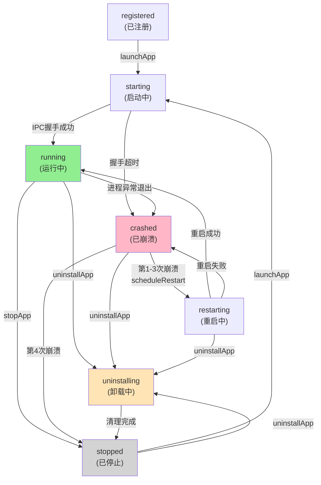

# M-03 SkillApp 生命周期管理器 开发规格

> **版本**：v1.0 | **日期**：2026-03-13
> **状态**：正式规格文档
> **目标受众**：Executor Agent（Iter 3 实现）

---

## 1. 模块概述

### 1.1 职责范围

M-03 SkillApp 生命周期管理器是 IntentOS 管理层的核心组件，负责所有已生成 SkillApp 的生命周期管理。

**核心职责**：
- **进程管理**：SkillApp 进程的启动（spawn）、停止（graceful shutdown）、重启
- **状态监控**：实时监控每个 SkillApp 的运行状态（已启动、运行中、已停止、已崩溃等）
- **注册表维护**：已生成 SkillApp 的元数据和状态记录（SQLite 数据库）
- **崩溃检测与恢复**：进程异常退出的检测、重启策略、计数限制
- **窗口调度**：SkillApp 窗口的聚焦、最小化恢复、Z-Order 管理
- **App 卸载清理**：停止进程 → 删除数据库记录 → 清理文件系统 → 解除 Skill 引用

**不涉及**：
- SkillApp 代码的生成和编译（由 M-05 生成器负责）
- SkillApp 内部的业务逻辑执行（由运行时 M-06 负责）
- 热更新代码包的推送（由 M-05 负责，M-03 负责状态监控）

### 1.2 文件目录结构

```
src/main/modules/lifecycle-manager/
├── index.ts                          # 主导出文件
├── lifecycle-manager.ts              # LifecycleManager 核心实现
├── app-registry.ts                   # SQLite 数据库操作层
├── process-watcher.ts                # 进程监控（与 process 事件对接）
├── app-status.ts                     # AppStatus 枚举与类型定义
├── types.ts                          # 完整类型定义
├── config.ts                         # 常量配置（重启策略、超时参数等）
└── __tests__/                        # 测试文件
    ├── lifecycle-manager.spec.ts
    ├── crash-recovery.spec.ts
    └── window-scheduling.spec.ts
```

---

## 2. SQLite 数据库 Schema

### 2.1 apps 表 DDL

所有已生成的 SkillApp 元数据和状态存储在 SQLite 的 `apps` 表中。使用 `better-sqlite3` 库操作（同步 API，适合 Electron 主进程）。

```sql
CREATE TABLE IF NOT EXISTS apps (
  -- 基础标识
  id TEXT PRIMARY KEY,
  name TEXT NOT NULL,
  description TEXT,
  version INTEGER DEFAULT 1,

  -- 技能关联
  skillIds TEXT NOT NULL,  -- JSON array: ["skill-id-1", "skill-id-2"]

  -- 状态字段
  status TEXT NOT NULL DEFAULT 'registered',
  -- 枚举值: 'registered' | 'starting' | 'running' | 'crashed' | 'restarting' | 'uninstalling' | 'stopped'

  -- 进程和文件信息
  outputDir TEXT NOT NULL UNIQUE,  -- SkillApp 输出目录路径（绝对路径）
  entryPoint TEXT NOT NULL,        -- main.js 入口文件相对路径（通常为 'main.js'）
  pid INTEGER,                     -- 当前进程 ID（running 时有值）

  -- 窗口信息（原地变形与窗口管理）
  windowBounds TEXT,               -- JSON: {x, y, width, height, isMaximized}
  windowBoundsSaved TEXT,          -- 最后保存的窗口状态

  -- 崩溃与重启统计
  crashCount INTEGER DEFAULT 0,    -- 累计崩溃次数
  lastCrashAt TEXT,               -- 最后一次崩溃时间戳（ISO 8601）
  lastRestartAt TEXT,             -- 最后一次重启时间戳（ISO 8601）
  stableRunningSeconds INTEGER,   -- 本轮稳定运行时间（秒）

  -- 时间戳
  createdAt TEXT NOT NULL,         -- 创建时间（ISO 8601）
  updatedAt TEXT NOT NULL,         -- 最后更新时间（ISO 8601）

  -- 权限与配置
  permissions TEXT,                -- JSON: 应用声明的权限列表
  environment TEXT                 -- JSON: 启动时传递的环境变量
);

-- 创建索引加速查询
CREATE INDEX IF NOT EXISTS idx_apps_status ON apps(status);
CREATE INDEX IF NOT EXISTS idx_apps_pid ON apps(pid);
CREATE INDEX IF NOT EXISTS idx_apps_createdAt ON apps(createdAt);
```

### 2.2 表字段说明

| 字段 | 类型 | 说明 |
|------|------|------|
| `id` | TEXT | SkillApp 唯一标识（appId），由 M-05 生成器分配 |
| `name` | TEXT | 应用名称（如「CSV 数据清洗工具」） |
| `skillIds` | TEXT | JSON 数组，存储该 App 使用的所有 Skill ID |
| `status` | TEXT | 当前状态（见 AppStatus 枚举） |
| `outputDir` | TEXT | SkillApp 源码和编译产物所在目录的绝对路径 |
| `entryPoint` | TEXT | Electron 主进程入口文件路径（相对于 outputDir） |
| `pid` | INTEGER | 当前运行进程 ID（仅在 status='running' 时有值） |
| `windowBounds` | TEXT | 窗口当前位置/尺寸（JSON 序列化），用于窗口恢复和原地变形 |
| `crashCount` | INTEGER | 本轮（自重置后）的崩溃次数，超过 3 次不再自动重启 |
| `lastCrashAt` | TEXT | 上次崩溃时间戳，用于计算稳定运行时间 |
| `permissions` | TEXT | 应用声明的权限列表（JSON 格式） |
| `createdAt` | TEXT | 应用生成时间 |
| `updatedAt` | TEXT | 最后状态变更时间 |

---

## 3. AppStatus 枚举定义

```typescript
type AppStatus =
  | 'registered'     // 应用已注册到数据库，但从未启动过
  | 'starting'       // 进程正在启动（从 spawn 到 IPC 握手成功）
  | 'running'        // 正常运行中
  | 'crashed'        // 进程异常退出（exit code ≠ 0 或被信号终止）
  | 'restarting'     // 进程崩溃后正在重启
  | 'uninstalling'   // 应用卸载中（清理文件前的中间态）
  | 'stopped';       // 应用已停止（用户主动停止或卸载完成）

// 状态转换图
/*
                    ┌─────────────┐
                    │ registered  │
                    └──────┬──────┘
                           │ launchApp()
                           ▼
                    ┌─────────────┐
                    │  starting   │ ──IPC 握手失败──→ crashed
                    └──────┬──────┘
                           │ IPC 握手成功
                           ▼
                    ┌─────────────┐
                    │   running   │ ◄─────────┐
                    └──────┬──────┘           │
              ┌────────────┼────────────┐     │
              │ 正常退出   │ 进程崩溃  │     │
              ▼            ▼            ▼     │
         stopped        crashed → restarting─┘（重启成功）
              │            │               （第 1-3 次）
              │            └───→ stopped （超过重启次数）
              │
         stopApp() 或
         uninstallApp()

   ┌──────────────────────────────┐
   │    任何状态 → uninstalling   │
   │    (uninstallApp 触发)       │
   │    uninstalling → stopped    │
   └──────────────────────────────┘
*/

// 各状态含义详解
export const AppStatusMeanings = {
  registered: '应用已注册，未曾启动',
  starting: '正在启动中，等待 IPC 握手完成',
  running: '进程正常运行中',
  crashed: '进程异常退出，等待手动干预或自动重启',
  restarting: '检测到崩溃，正在重启（第 N 次）',
  uninstalling: '应用卸载流程进行中',
  stopped: '应用已停止或卸载完成'
} as const;
```

---

## 4. 完整 API 接口

### 4.1 LifecycleManager 接口定义

```typescript
interface LifecycleManager {
  /**
   * 注册新生成的 SkillApp 到系统
   *
   * 调用场景：M-05 生成器完成代码生成后，在原地变形前调用
   * 副作用：在数据库 apps 表中插入新记录，状态初始为 'registered'
   */
  registerApp(meta: AppMeta): Promise<void>;

  /**
   * 卸载 SkillApp（完整清理流程）
   *
   * 流程：
   *   1. 更新数据库状态为 'uninstalling'
   *   2. 如果进程运行中，发送 SIGTERM 终止
   *   3. 删除数据库记录
   *   4. 清理文件系统（rm -rf outputDir）
   *   5. 解除 Skill 引用计数
   *   6. 更新状态为 'stopped'
   *
   * 参数：appId - 待卸载应用的 ID
   * 错误：APP_NOT_FOUND
   */
  uninstallApp(appId: string): Promise<void>;

  /**
   * 启动 SkillApp 进程
   *
   * 流程：
   *   1. 检查应用是否已在运行（status = 'running'），若是抛出错误
   *   2. 更新状态为 'starting'
   *   3. 通过 child_process.spawn() 启动新进程
   *   4. 启动超时 5 秒（等待 IPC 握手），超时则标记为 'crashed'
   *   5. IPC 握手成功后更新状态为 'running'
   *
   * 参数：appId - 待启动应用的 ID
   * 错误：APP_NOT_FOUND, APP_ALREADY_RUNNING, APP_START_FAILED
   */
  launchApp(appId: string): Promise<void>;

  /**
   * 停止 SkillApp 进程（优雅退出）
   *
   * 流程：
   *   1. 若状态为 'stopped'，直接返回（幂等）
   *   2. 更新状态为 'stopped'
   *   3. 通过 IPC 发送 {domain: 'lifecycle', action: 'shutdown'} 指令
   *   4. 等待进程自动退出，超时 5 秒
   *   5. 若 5 秒内未退出，发送 SIGKILL 强制终止
   *
   * 参数：appId - 待停止应用的 ID
   * 错误：APP_NOT_FOUND, APP_NOT_RUNNING
   */
  stopApp(appId: string): Promise<void>;

  /**
   * 聚焦 SkillApp 的窗口（置顶 + 获焦）
   *
   * 流程：
   *   1. 检查应用是否运行中，否则抛出错误
   *   2. 通过 IPC 发送 {domain: 'lifecycle', action: 'focus'} 指令
   *   3. 若窗口最小化，先恢复再聚焦
   *
   * 参数：appId - 待聚焦应用的 ID
   * 错误：APP_NOT_FOUND, APP_NOT_RUNNING
   */
  focusAppWindow(appId: string): Promise<void>;

  /**
   * 获取 SkillApp 当前运行状态
   *
   * 参数：appId - 应用 ID
   * 返回值：AppStatus 枚举值
   * 错误：APP_NOT_FOUND
   */
  getAppStatus(appId: string): Promise<AppStatus>;

  /**
   * 获取所有已注册的 SkillApp 元数据列表
   *
   * 返回值：AppMeta[] 数组，按 createdAt 降序排列（最新在前）
   */
  listApps(): Promise<AppMeta[]>;

  /**
   * 订阅应用状态变更事件
   *
   * 参数：
   *   handler - 事件处理函数，在任何应用状态发生变化时回调
   *
   * 返回值：取消订阅函数，调用后停止监听此处理函数
   *
   * 示例：
   *   const unsubscribe = lifecycleManager.onAppStatusChanged(event => {
   *     console.log(`${event.appId} 从 ${event.previousStatus} 变为 ${event.status}`);
   *   });
   *   unsubscribe(); // 停止监听
   */
  onAppStatusChanged(handler: (event: AppStatusEvent) => void): () => void;
}
```

### 4.2 类型定义

```typescript
/**
 * SkillApp 元数据（向外暴露的结构体）
 */
interface AppMeta {
  id: string;                   // 唯一标识
  name: string;                 // 应用名称
  description?: string;         // 应用描述
  skillIds: string[];          // 使用的 Skill ID 列表
  status: AppStatus;           // 当前状态
  outputDir: string;           // 文件系统路径
  entryPoint: string;          // 主进程入口文件相对路径
  createdAt: string;           // ISO 8601 时间戳
  updatedAt: string;           // ISO 8601 时间戳
  version: number;             // 修改版本号（热更新后递增）
  crashCount: number;          // 本轮崩溃次数
  lastCrashAt?: string;        // 上次崩溃时间戳
  pid?: number;                // 当前进程 ID（运行中时有值）
  windowBounds?: {
    x: number;
    y: number;
    width: number;
    height: number;
    isMaximized?: boolean;
  };
}

/**
 * 应用状态变更事件
 */
interface AppStatusEvent {
  appId: string;               // 应用 ID
  status: AppStatus;           // 新状态
  previousStatus: AppStatus;   // 旧状态
  timestamp: number;           // 事件时间戳（ms）
  crashCount?: number;         // 若新状态为 'crashed'，包含崩溃计数
  error?: {
    code: string;
    message: string;
  };
}

/**
 * 进程管理中的启动配置
 */
interface LaunchConfig {
  appId: string;
  appPath: string;             // 应用文件系统路径
  ipcPath: string;             // Unix Socket 路径（如 /tmp/intentos-ipc/{appId}.sock）
  windowBounds?: {
    x: number;
    y: number;
    width: number;
    height: number;
  };
  environment?: Record<string, string>;  // 额外环境变量
}
```

---

## 5. 进程管理规范

### 5.1 launchApp 实现

```typescript
/**
 * launchApp 完整实现规范
 */
async function launchApp(appId: string): Promise<void> {
  // 1. 数据库查询与状态检查
  const appRecord = db.prepare('SELECT * FROM apps WHERE id = ?').get(appId);
  if (!appRecord) {
    throw new AppError('APP_NOT_FOUND', `应用 ${appId} 不存在`);
  }

  if (appRecord.status === 'running') {
    throw new AppError('APP_ALREADY_RUNNING', `应用 ${appId} 已在运行`);
  }

  // 2. 更新状态为 'starting'
  db.prepare('UPDATE apps SET status = ?, updatedAt = ? WHERE id = ?')
    .run('starting', new Date().toISOString(), appId);
  emitStatusChanged(appId, 'starting', appRecord.status);

  try {
    // 3. 准备启动参数
    const ipcPath = getIPCPath(appId);  // /tmp/intentos-ipc/{appId}.sock (macOS/Linux)
    const electronPath = process.execPath;
    const appPath = path.join(appRecord.outputDir, appRecord.entryPoint);

    // 4. 通过 child_process.spawn 启动进程
    const child = spawn(electronPath, [appPath], {
      env: {
        ...process.env,
        INTENTOS_APP_ID: appId,
        INTENTOS_IPC_PATH: ipcPath,
        INTENTOS_DESKTOP_PID: String(process.pid),
      },
      stdio: ['pipe', 'pipe', 'pipe', 'ipc'],  // 启用 Node.js IPC channel
      detached: false,  // 子进程跟随父进程
    });

    // 5. 保存进程引用，供后续管理
    processRegistry.set(appId, {
      child,
      ipcPath,
      startedAt: Date.now(),
    });

    // 6. 启动握手超时计时器（5 秒）
    const handshakeTimeout = setTimeout(() => {
      if (processRegistry.has(appId)) {
        // 握手失败，标记为 crashed
        updateAppStatus(appId, 'crashed');
        child.kill('SIGKILL');
        processRegistry.delete(appId);
      }
    }, 5000);

    // 7. 监听 IPC 握手信号（来自运行时的 'ready' 消息）
    const onIpcReady = (msg) => {
      if (msg.type === 'ready' && msg.appId === appId) {
        clearTimeout(handshakeTimeout);
        child.off('message', onIpcReady);

        // 握手成功，更新状态为 'running'
        db.prepare('UPDATE apps SET status = ?, pid = ?, updatedAt = ? WHERE id = ?')
          .run('running', child.pid, new Date().toISOString(), appId);
        emitStatusChanged(appId, 'running', 'starting');
      }
    };
    child.on('message', onIpcReady);

    // 8. 监听进程退出事件（见 ProcessWatcher）
    processWatcher.watchProcess(child, appId);

  } catch (err) {
    // 启动失败
    updateAppStatus(appId, 'crashed');
    processRegistry.delete(appId);
    throw new AppError('APP_START_FAILED', `应用启动失败: ${err.message}`);
  }
}

/**
 * 启动参数传递方案
 */
function getIPCPath(appId: string): string {
  if (process.platform === 'win32') {
    return `\\.\pipe\intentos-ipc-${appId}`;
  } else {
    return `/tmp/intentos-ipc/${appId}.sock`;
  }
}
```

### 5.2 stopApp 实现（优雅退出）

```typescript
/**
 * stopApp 完整实现规范：优雅退出 + 超时 SIGKILL
 */
async function stopApp(appId: string): Promise<void> {
  const appRecord = db.prepare('SELECT * FROM apps WHERE id = ?').get(appId);
  if (!appRecord) {
    throw new AppError('APP_NOT_FOUND', `应用 ${appId} 不存在`);
  }

  // 幂等性：如果已停止，直接返回
  if (appRecord.status === 'stopped') {
    return;
  }

  // 更新状态为 'stopped'
  db.prepare('UPDATE apps SET status = ?, updatedAt = ? WHERE id = ?')
    .run('stopped', new Date().toISOString(), appId);
  emitStatusChanged(appId, 'stopped', appRecord.status);

  const processEntry = processRegistry.get(appId);
  if (!processEntry) {
    // 进程已不存在，直接返回
    return;
  }

  const { child } = processEntry;

  try {
    // 1. 尝试通过 IPC 发送优雅关闭指令（如果 IPC 连接仍存活）
    try {
      child.send({
        type: 'lifecycle-shutdown',
        appId,
      });
    } catch (err) {
      // IPC 连接已断开，跳过
    }

    // 2. 发送 SIGTERM 信号
    child.kill('SIGTERM');

    // 3. 等待 5 秒让进程优雅退出
    await waitForProcessExit(child, 5000);

  } catch (timeoutErr) {
    // 5 秒内未退出，强制 SIGKILL
    if (!child.killed) {
      child.kill('SIGKILL');
      await waitForProcessExit(child, 1000);  // 再给 1 秒强制终止
    }
  } finally {
    // 清理进程注册表
    processRegistry.delete(appId);
  }
}

/**
 * 等待进程退出（超时则抛出错误）
 */
function waitForProcessExit(child: ChildProcess, timeoutMs: number): Promise<void> {
  return new Promise((resolve, reject) => {
    const timeout = setTimeout(() => {
      reject(new Error('Process exit timeout'));
    }, timeoutMs);

    child.once('exit', () => {
      clearTimeout(timeout);
      resolve();
    });

    child.once('error', (err) => {
      clearTimeout(timeout);
      reject(err);
    });
  });
}
```

### 5.3 进程句柄管理

```typescript
/**
 * 全局进程注册表（内存中维护）
 */
interface ProcessEntry {
  child: ChildProcess;        // Node.js ChildProcess 对象
  ipcPath: string;           // Unix Socket 路径
  startedAt: number;         // 启动时间戳（ms）
  lastHeartbeatAt?: number;  // 最后心跳时间戳
}

const processRegistry = new Map<string, ProcessEntry>();

/**
 * 辅助函数：获取运行中的进程
 */
function getRunningProcess(appId: string): ChildProcess | null {
  const entry = processRegistry.get(appId);
  return entry?.child ?? null;
}

/**
 * 辅助函数：检查进程是否存活
 */
function isProcessAlive(appId: string): boolean {
  const entry = processRegistry.get(appId);
  if (!entry) return false;
  return !entry.child.killed;
}
```

---

## 6. 崩溃检测与重启规范

### 6.1 崩溃检测机制

```typescript
/**
 * ProcessWatcher：独立的进程监控模块
 * 负责：
 *   1. 监听进程 'exit' 和 'error' 事件
 *   2. 检测异常退出（exit code ≠ 0）
 *   3. 触发重启或标记为崩溃
 */
class ProcessWatcher {
  watchProcess(child: ChildProcess, appId: string): void {
    // 监听进程异常退出
    child.on('exit', (code, signal) => {
      const isAbnormal = code !== 0 || signal !== null;

      if (isAbnormal) {
        // 记录崩溃事件
        recordCrash(appId, { exitCode: code, signal });

        // 触发重启逻辑
        this.handleCrash(appId, code, signal);
      } else {
        // 正常退出，清理状态
        processRegistry.delete(appId);
      }
    });

    // 监听进程错误（如 spawn 失败）
    child.on('error', (err) => {
      recordCrash(appId, { error: err.message });
      this.handleCrash(appId, -1, 'error');
    });
  }

  private async handleCrash(appId: string, exitCode: number, signal: string | null): Promise<void> {
    const appRecord = db.prepare('SELECT * FROM apps WHERE id = ?').get(appId);
    if (!appRecord) return;

    // 1. 更新崩溃统计
    const newCrashCount = (appRecord.crashCount || 0) + 1;
    db.prepare(
      'UPDATE apps SET crashCount = ?, lastCrashAt = ?, status = ?, updatedAt = ? WHERE id = ?'
    ).run(
      newCrashCount,
      new Date().toISOString(),
      'crashed',
      new Date().toISOString(),
      appId
    );

    // 2. 触发状态变更事件
    emitStatusChanged(appId, 'crashed', appRecord.status, {
      crashCount: newCrashCount,
      error: { code: 'CRASH', message: `Process exited with code ${exitCode}, signal ${signal}` },
    });

    // 3. 决策是否重启
    if (newCrashCount <= 3) {
      // 可以重启（第 1-3 次崩溃）
      await scheduleRestart(appId, newCrashCount);
    } else {
      // 已超过重启次数限制，不再自动重启
      // 用户可通过管理中心手动重启
    }
  }
}

/**
 * 记录崩溃日志（便于诊断）
 */
function recordCrash(appId: string, details: any): void {
  const crashLogPath = path.join(getTempDir(), `crash-${appId}-${Date.now()}.json`);
  fs.writeFileSync(crashLogPath, JSON.stringify({
    appId,
    timestamp: new Date().toISOString(),
    details,
  }, null, 2));
}
```

### 6.2 重启策略与限制

```typescript
/**
 * 重启策略配置
 */
const CRASH_RECOVERY_CONFIG = {
  MAX_CRASH_COUNT: 3,              // 最多自动重启 3 次，第 4 次不再重启
  RESTART_DELAY_MS: [0, 1000, 2000], // 第 1/2/3 次重启的延迟（ms）
  // 第 1 次立即重启，第 2 次延迟 1s，第 3 次延迟 2s

  STABLE_RUNNING_DURATION_MS: 5 * 60 * 1000,  // 5 分钟稳定运行后重置崩溃计数
};

/**
 * 计划重启（带延迟）
 */
async function scheduleRestart(appId: string, crashCount: number): Promise<void> {
  const delayMs = CRASH_RECOVERY_CONFIG.RESTART_DELAY_MS[crashCount - 1] || 0;

  // 更新状态为 'restarting'
  db.prepare('UPDATE apps SET status = ?, updatedAt = ? WHERE id = ?')
    .run('restarting', new Date().toISOString(), appId);
  emitStatusChanged(appId, 'restarting', 'crashed');

  // 延迟后重启
  setTimeout(() => {
    launchApp(appId).catch(err => {
      console.error(`重启应用 ${appId} 失败: ${err.message}`);
      updateAppStatus(appId, 'crashed');
    });
  }, delayMs);
}

/**
 * 稳定运行检查与崩溃计数重置
 *
 * 规则：如果应用连续稳定运行 5 分钟以上，则崩溃计数重置为 0
 * 这样即使之前崩溃过 3 次，只要稳定运行 5 分钟，又可以有 3 次重启机会
 */
function monitorStableRunning(): void {
  setInterval(() => {
    const runningApps = db.prepare('SELECT * FROM apps WHERE status = ? AND pid IS NOT NULL')
      .all('running');

    for (const app of runningApps) {
      const lastCrashTime = app.lastCrashAt ? new Date(app.lastCrashAt).getTime() : 0;
      const runningDuration = Date.now() - lastCrashTime;

      if (runningDuration >= CRASH_RECOVERY_CONFIG.STABLE_RUNNING_DURATION_MS && app.crashCount > 0) {
        // 重置崩溃计数
        db.prepare('UPDATE apps SET crashCount = 0, updatedAt = ? WHERE id = ?')
          .run(new Date().toISOString(), app.id);
        console.log(`应用 ${app.id} 稳定运行，重置崩溃计数`);
      }
    }
  }, 10000);  // 每 10 秒检查一次
}
```

---

## 7. 状态机与转换规范

### 7.1 完整状态转换图



### 7.2 状态转换规则

| 源状态 | 触发动作 | 目标状态 | 条件 |
|--------|---------|---------|------|
| `registered` | `launchApp()` | `starting` | 应用未在运行 |
| `starting` | IPC 握手成功 | `running` | 5 秒内完成握手 |
| `starting` | 握手超时 | `crashed` | 5 秒内未握手 |
| `running` | 进程正常退出 | `stopped` | exit code = 0 |
| `running` | 进程异常退出 | `crashed` | exit code ≠ 0 或被信号终止 |
| `running` | `stopApp()` | `stopped` | 用户主动停止 |
| `crashed` | 自动重启 | `restarting` | 崩溃计数 ≤ 3 |
| `crashed` | 用户手动重启 | `starting` | `launchApp()` 调用 |
| `restarting` | 重启成功 | `running` | 重启后握手成功 |
| `restarting` | 重启失败 | `crashed` | 重启启动失败 |
| 任何状态 | `uninstallApp()` | `uninstalling` | 卸载开始 |
| `uninstalling` | 清理完成 | `stopped` | 数据库记录删除 |

---

## 8. 窗口调度规范

### 8.1 focusAppWindow 实现

```typescript
/**
 * focusAppWindow：聚焦应用窗口（置顶 + 获焦）
 */
async function focusAppWindow(appId: string): Promise<void> {
  const appRecord = db.prepare('SELECT * FROM apps WHERE id = ?').get(appId);
  if (!appRecord) {
    throw new AppError('APP_NOT_FOUND', `应用 ${appId} 不存在`);
  }

  if (appRecord.status !== 'running') {
    throw new AppError('APP_NOT_RUNNING', `应用 ${appId} 未运行`);
  }

  // 通过 IPC 发送 focus 指令给 SkillApp 进程
  const processEntry = processRegistry.get(appId);
  if (!processEntry) {
    throw new AppError('PROCESS_NOT_FOUND', '进程不存在');
  }

  try {
    processEntry.child.send({
      type: 'lifecycle-focus',
      appId,
    });
  } catch (err) {
    throw new AppError('IPC_SEND_FAILED', `IPC 发送失败: ${err.message}`);
  }
}

/**
 * 窗口状态恢复
 * 当用户点击"打开"已启动的 SkillApp 时，调用此函数
 * 如果窗口被最小化，先恢复再聚焦
 */
async function restoreAndFocusWindow(appId: string): Promise<void> {
  const appRecord = db.prepare('SELECT * FROM apps WHERE id = ?').get(appId);
  if (!appRecord?.pid) {
    throw new AppError('APP_NOT_RUNNING', '应用未运行');
  }

  // 检查进程是否仍存活
  if (!isProcessAlive(appId)) {
    // 进程已死亡，更新状态
    updateAppStatus(appId, 'stopped');
    throw new AppError('PROCESS_DEAD', '应用进程已意外退出');
  }

  try {
    // 通过 IPC 指令先恢复窗口（如果最小化）
    processRegistry.get(appId)?.child.send({
      type: 'lifecycle-restore-and-focus',
      appId,
    });
  } catch (err) {
    throw new AppError('IPC_SEND_FAILED', `IPC 发送失败: ${err.message}`);
  }
}
```

### 8.2 窗口 Bounds 持久化

```typescript
/**
 * 保存窗口位置和大小
 * 在以下场景调用：
 *   1. 用户调整窗口大小/位置时（通过心跳消息同步）
 *   2. SkillApp 卸载前（备份最后的窗口状态）
 */
function saveWindowBounds(appId: string, bounds: WindowBounds): void {
  db.prepare('UPDATE apps SET windowBounds = ?, windowBoundsSaved = ?, updatedAt = ? WHERE id = ?')
    .run(
      JSON.stringify(bounds),
      JSON.stringify(bounds),
      new Date().toISOString(),
      appId
    );
}

/**
 * 窗口 Bounds 类型定义
 */
interface WindowBounds {
  x: number;
  y: number;
  width: number;
  height: number;
  isMaximized?: boolean;
  isMinimized?: boolean;
}
```

### 8.3 Desktop 重启后窗口恢复

```typescript
/**
 * Desktop 启动时，恢复上次关闭前的 SkillApp 窗口状态
 *
 * 场景：用户 Desktop 重启，有些 SkillApp 之前正在运行，重启后应该恢复
 */
function restoreAppsOnStartup(): void {
  const previouslyRunningApps = db.prepare(
    'SELECT * FROM apps WHERE status = ? OR status = ?'
  ).all('running', 'restarting');

  for (const app of previouslyRunningApps) {
    // 清理进程状态（重启意味着之前的进程已死亡）
    db.prepare('UPDATE apps SET status = ?, pid = NULL, updatedAt = ? WHERE id = ?')
      .run('stopped', new Date().toISOString(), app.id);

    // 不自动重启，让用户从管理中心手动启动
    // 原因：避免启动时大量并发启动所有 App，导致系统过载
  }
}
```

---

## 9. App 卸载清理规范

### 9.1 uninstallApp 完整流程

```typescript
/**
 * uninstallApp：完整卸载流程（原子操作，失败可重试）
 */
async function uninstallApp(appId: string): Promise<void> {
  const appRecord = db.prepare('SELECT * FROM apps WHERE id = ?').get(appId);
  if (!appRecord) {
    throw new AppError('APP_NOT_FOUND', `应用 ${appId} 不存在`);
  }

  // 第 1 步：更新状态为 'uninstalling'（中间态，防止并发卸载）
  db.prepare('UPDATE apps SET status = ?, updatedAt = ? WHERE id = ?')
    .run('uninstalling', new Date().toISOString(), appId);
  emitStatusChanged(appId, 'uninstalling', appRecord.status);

  try {
    // 第 2 步：停止进程
    const processEntry = processRegistry.get(appId);
    if (processEntry) {
      try {
        // 尝试优雅关闭
        processEntry.child.send({ type: 'lifecycle-shutdown', appId });
        await waitForProcessExit(processEntry.child, 2000);
      } catch (err) {
        // 超时或 IPC 失败，强制杀死
        if (!processEntry.child.killed) {
          processEntry.child.kill('SIGKILL');
        }
      }
      processRegistry.delete(appId);
    }

    // 第 3 步：删除数据库记录
    db.prepare('DELETE FROM apps WHERE id = ?').run(appId);

    // 第 4 步：清理文件系统（outputDir）
    const outputDir = appRecord.outputDir;
    if (fs.existsSync(outputDir)) {
      fs.rmSync(outputDir, { recursive: true, force: true });
      console.log(`已删除 SkillApp 目录: ${outputDir}`);
    }

    // 第 5 步：解除 Skill 引用（调用 M-02 Skill 管理器）
    const skillIds = JSON.parse(appRecord.skillIds);
    for (const skillId of skillIds) {
      try {
        skillManager.decrementRefCount(skillId);
      } catch (err) {
        console.warn(`解除 Skill ${skillId} 引用计数失败: ${err.message}`);
      }
    }

    // 第 6 步：触发最终状态事件
    emitStatusChanged(appId, 'stopped', 'uninstalling');

  } catch (err) {
    // 卸载失败，恢复状态为 'stopped'（让用户可重试）
    db.prepare('UPDATE apps SET status = ?, updatedAt = ? WHERE id = ?')
      .run('stopped', new Date().toISOString(), appId);
    emitStatusChanged(appId, 'stopped', 'uninstalling', {
      error: { code: 'UNINSTALL_FAILED', message: err.message },
    });
    throw err;
  }
}
```

---

## 10. AppStatusEvent 定义

```typescript
/**
 * 应用状态变更事件（发送给 Desktop 渲染进程和外部订阅者）
 */
interface AppStatusEvent {
  /**
   * 应用 ID
   */
  appId: string;

  /**
   * 新状态
   */
  status: AppStatus;

  /**
   * 旧状态（用于状态机验证）
   */
  previousStatus: AppStatus;

  /**
   * 事件时间戳（毫秒）
   */
  timestamp: number;

  /**
   * 可选：崩溃计数（新状态为 'crashed' 或 'restarting' 时填充）
   */
  crashCount?: number;

  /**
   * 可选：错误信息（状态变更是由错误引起时填充）
   */
  error?: {
    code: string;
    message: string;
  };
}

/**
 * 状态变更事件发射
 */
function emitStatusChanged(
  appId: string,
  newStatus: AppStatus,
  previousStatus: AppStatus,
  extra?: { crashCount?: number; error?: { code: string; message: string } }
): void {
  const event: AppStatusEvent = {
    appId,
    status: newStatus,
    previousStatus,
    timestamp: Date.now(),
    ...extra,
  };

  // 通知所有订阅者（内存中的处理器函数）
  statusChangeHandlers.forEach(handler => {
    try {
      handler(event);
    } catch (err) {
      console.error(`状态变更处理器异常: ${err.message}`);
    }
  });

  // 通过 IPC 通知 Desktop 渲染进程
  if (mainWindow && mainWindow.webContents) {
    mainWindow.webContents.send('app-lifecycle:status-changed', event);
  }
}
```

---

## 11. 错误码定义

```typescript
/**
 * 生命周期管理器的错误码范围：1000-1999
 */
const APP_ERRORS = {
  // 应用查询相关
  APP_NOT_FOUND: {
    code: 'APP_NOT_FOUND',
    httpStatus: 404,
    message: '应用不存在或已被删除',
  },

  // 启动相关
  APP_ALREADY_RUNNING: {
    code: 'APP_ALREADY_RUNNING',
    httpStatus: 409,
    message: '应用已在运行，无法重复启动',
  },
  APP_START_FAILED: {
    code: 'APP_START_FAILED',
    httpStatus: 500,
    message: '应用启动失败，请检查日志',
  },

  // 停止相关
  APP_NOT_RUNNING: {
    code: 'APP_NOT_RUNNING',
    httpStatus: 400,
    message: '应用未运行，无法停止',
  },

  // 进程相关
  PROCESS_NOT_FOUND: {
    code: 'PROCESS_NOT_FOUND',
    httpStatus: 500,
    message: '进程对象不存在（内部错误）',
  },
  IPC_SEND_FAILED: {
    code: 'IPC_SEND_FAILED',
    httpStatus: 500,
    message: 'IPC 消息发送失败',
  },
  PROCESS_DEAD: {
    code: 'PROCESS_DEAD',
    httpStatus: 500,
    message: '应用进程已意外退出',
  },

  // 卸载相关
  UNINSTALL_FAILED: {
    code: 'UNINSTALL_FAILED',
    httpStatus: 500,
    message: '应用卸载失败',
  },

  // 通用
  INTERNAL_ERROR: {
    code: 'INTERNAL_ERROR',
    httpStatus: 500,
    message: '内部错误',
  },
};

class AppError extends Error {
  constructor(
    public code: string,
    public message: string,
    public httpStatus: number = 500
  ) {
    super(message);
    this.name = 'AppError';
  }
}
```

---

## 12. ProcessWatcher 规范

### 12.1 独立模块设计

```typescript
/**
 * ProcessWatcher：独立的进程监控模块
 *
 * 职责：
 *   - 监听进程的 'exit' 和 'error' 事件
 *   - 检测异常退出（非零 exit code 或被信号终止）
 *   - 触发崩溃处理流程（重启或标记崩溃）
 *   - 与 LifecycleManager 协作管理应用状态
 *
 * 不涉及：
 *   - 进程的启动（由 LifecycleManager 负责）
 *   - 进程的停止（由 LifecycleManager 负责）
 *   - 数据库操作（由 AppRegistry 负责）
 */
export class ProcessWatcher {
  private lifecycleManager: LifecycleManager;

  constructor(lifecycleManager: LifecycleManager) {
    this.lifecycleManager = lifecycleManager;
  }

  /**
   * 开始监控一个进程
   * 由 launchApp 在成功 spawn 进程后调用
   */
  watchProcess(child: ChildProcess, appId: string): void {
    let isMonitoring = true;

    // 监听进程正常或异常退出
    child.once('exit', (code: number | null, signal: string | null) => {
      if (!isMonitoring) return;
      isMonitoring = false;

      const isAbnormal = code !== 0 || signal !== null;
      const isUserInitiatedStop = this.lifecycleManager.isStopRequested(appId);

      if (isAbnormal && !isUserInitiatedStop) {
        // 进程异常退出，触发崩溃处理
        this.handleCrash(appId, code, signal);
      }
    });

    // 监听进程错误（如 spawn 失败、信号错误等）
    child.once('error', (err: Error) => {
      if (!isMonitoring) return;
      isMonitoring = false;

      this.handleCrash(appId, -1, 'error');
    });
  }

  /**
   * 处理进程崩溃
   */
  private async handleCrash(appId: string, exitCode: number | null, signal: string | null): Promise<void> {
    // 委托给 LifecycleManager 处理
    await this.lifecycleManager.handleCrash(appId, {
      exitCode: exitCode ?? -1,
      signal: signal ?? 'unknown',
      timestamp: Date.now(),
    });
  }
}
```

### 12.2 进程通知 LifecycleManager 的机制

```typescript
/**
 * 崩溃事件的逆向通知：进程 → LifecycleManager
 *
 * 设计：ProcessWatcher 监听进程事件后，调用 LifecycleManager 的 public 方法
 * （而不是 LifecycleManager 主动轮询）
 */
export interface ICrashNotification {
  appId: string;
  exitCode: number;
  signal: string;
  timestamp: number;
}

// LifecycleManager 暴露的 public 方法
export class LifecycleManager {
  /**
   * ProcessWatcher 通知 LifecycleManager 进程已崩溃
   */
  async handleCrash(appId: string, info: ICrashNotification): Promise<void> {
    const appRecord = db.prepare('SELECT * FROM apps WHERE id = ?').get(appId);
    if (!appRecord) return;

    // 更新数据库
    const newCrashCount = (appRecord.crashCount || 0) + 1;
    db.prepare(
      'UPDATE apps SET crashCount = ?, lastCrashAt = ?, status = ?, updatedAt = ? WHERE id = ?'
    ).run(
      newCrashCount,
      new Date(info.timestamp).toISOString(),
      'crashed',
      new Date().toISOString(),
      appId
    );

    // 发出状态变更事件
    emitStatusChanged(appId, 'crashed', appRecord.status, { crashCount: newCrashCount });

    // 决策是否自动重启
    if (newCrashCount <= CRASH_RECOVERY_CONFIG.MAX_CRASH_COUNT) {
      await scheduleRestart(appId, newCrashCount);
    }
  }

  /**
   * 检查是否用户主动请求停止（用于区分异常退出 vs 正常停止）
   */
  isStopRequested(appId: string): boolean {
    // 检查内存中的标记
    return this.stopRequests.has(appId);
  }

  private stopRequests = new Set<string>();

  async stopApp(appId: string): Promise<void> {
    // 标记用户已请求停止
    this.stopRequests.add(appId);
    try {
      // ... stopApp 逻辑 ...
    } finally {
      this.stopRequests.delete(appId);
    }
  }
}
```

---

## 13. 测试要点

### 13.1 状态机转换测试

```typescript
/**
 * 测试用例：正常启动 → 运行 → 停止
 */
describe('LifecycleManager - 状态机转换', () => {
  it('应该支持 stopped → starting → running → stopped 转换', async () => {
    const lifecycle = new LifecycleManager();
    const appId = 'test-app-1';

    // 1. 注册应用
    await lifecycle.registerApp({
      id: appId,
      name: 'Test App',
      skillIds: ['skill-1'],
      outputDir: '/tmp/test-app',
      entryPoint: 'main.js',
    });

    // 验证初始状态为 'registered'
    expect(await lifecycle.getAppStatus(appId)).toBe('registered');

    // 2. 启动应用
    const statusChanges: AppStatus[] = [];
    lifecycle.onAppStatusChanged(event => {
      statusChanges.push(event.status);
    });

    await lifecycle.launchApp(appId);
    // 应该经过 starting → running
    expect(statusChanges).toContain('starting');
    expect(statusChanges).toContain('running');

    // 3. 停止应用
    await lifecycle.stopApp(appId);
    expect(statusChanges).toContain('stopped');
    expect(await lifecycle.getAppStatus(appId)).toBe('stopped');
  });
});

/**
 * 测试用例：崩溃检测与自动重启
 */
describe('LifecycleManager - 崩溃检测与重启', () => {
  it('第 1-3 次崩溃应自动重启，第 4 次不再重启', async () => {
    const lifecycle = new LifecycleManager();
    const appId = 'crash-test-app';

    // 启动应用
    await lifecycle.registerApp({
      id: appId,
      name: 'Crash Test',
      skillIds: [],
      outputDir: '/tmp/crash-test',
      entryPoint: 'main.js',
    });

    const statusChanges: AppStatus[] = [];
    const statusEvents: AppStatusEvent[] = [];
    lifecycle.onAppStatusChanged(event => {
      statusChanges.push(event.status);
      statusEvents.push(event);
    });

    // 模拟第 1-3 次崩溃
    for (let i = 1; i <= 3; i++) {
      // 启动
      await lifecycle.launchApp(appId);
      expect(await lifecycle.getAppStatus(appId)).toBe('running');

      // 模拟崩溃（直接调用 handleCrash）
      await lifecycle.handleCrash(appId, {
        appId,
        exitCode: 1,
        signal: null,
        timestamp: Date.now(),
      });

      // 验证状态：crashed → restarting
      const lastEvent = statusEvents[statusEvents.length - 1];
      expect(lastEvent.status).toBe('crashed');
      expect(lastEvent.crashCount).toBe(i);

      // 等待自动重启
      await new Promise(resolve => setTimeout(resolve, 100));
    }

    // 模拟第 4 次崩溃
    await lifecycle.launchApp(appId);
    await lifecycle.handleCrash(appId, {
      appId,
      exitCode: 1,
      signal: null,
      timestamp: Date.now(),
    });

    const lastEvent = statusEvents[statusEvents.length - 1];
    expect(lastEvent.crashCount).toBe(4);

    // 第 4 次崩溃后，应该停留在 crashed，不再自动重启
    // 等待一段时间，验证没有触发重启
    await new Promise(resolve => setTimeout(resolve, 100));
    expect(await lifecycle.getAppStatus(appId)).toBe('crashed');
  });
});

/**
 * 测试用例：停止进程的优雅退出 + SIGKILL 超时
 */
describe('LifecycleManager - 进程优雅退出', () => {
  it('stopApp 应先发送 SIGTERM，5 秒超时后发送 SIGKILL', async () => {
    const lifecycle = new LifecycleManager();
    const appId = 'sigterm-test';

    // 启动应用
    await lifecycle.registerApp({
      id: appId,
      name: 'SIGTERM Test',
      skillIds: [],
      outputDir: '/tmp/sigterm-test',
      entryPoint: 'main.js',
    });

    await lifecycle.launchApp(appId);

    // 测量停止所需时间
    const startTime = Date.now();
    await lifecycle.stopApp(appId);
    const duration = Date.now() - startTime;

    // 应该在 5-7 秒内完成（允许误差）
    expect(duration).toBeLessThan(7000);
    expect(duration).toBeGreaterThan(4000);

    expect(await lifecycle.getAppStatus(appId)).toBe('stopped');
  });
});

/**
 * 测试用例：卸载应用完整清理流程
 */
describe('LifecycleManager - App 卸载', () => {
  it('uninstallApp 应清理进程、数据库、文件系统', async () => {
    const lifecycle = new LifecycleManager();
    const appId = 'uninstall-test';
    const outputDir = '/tmp/uninstall-test';

    // 创建 outputDir
    fs.mkdirSync(outputDir, { recursive: true });
    fs.writeFileSync(path.join(outputDir, 'test.txt'), 'test');

    // 注册和启动
    await lifecycle.registerApp({
      id: appId,
      name: 'Uninstall Test',
      skillIds: ['skill-1'],
      outputDir,
      entryPoint: 'main.js',
    });

    await lifecycle.launchApp(appId);
    expect(await lifecycle.getAppStatus(appId)).toBe('running');

    // 卸载
    await lifecycle.uninstallApp(appId);

    // 验证清理
    expect(fs.existsSync(outputDir)).toBe(false);  // 目录已删除
    expect(await lifecycle.listApps()).not.toContainEqual(expect.objectContaining({ id: appId }));
    expect(await lifecycle.getAppStatus(appId)).toThrow('APP_NOT_FOUND');
  });
});
```

---

## 14. 总结与交付清单

### 14.1 实现清单

- [ ] AppStatus 枚举与类型定义（`app-status.ts`）
- [ ] SQLite schema 和 AppRegistry 类（`app-registry.ts`）
- [ ] LifecycleManager 核心类（`lifecycle-manager.ts`）
  - [ ] `registerApp()`
  - [ ] `launchApp()` 与进程启动
  - [ ] `stopApp()` 与优雅退出
  - [ ] `uninstallApp()` 与完整清理
  - [ ] `focusAppWindow()`
  - [ ] `getAppStatus()` 与 `listApps()`
  - [ ] `onAppStatusChanged()` 事件订阅
- [ ] ProcessWatcher 监控模块（`process-watcher.ts`）
  - [ ] 进程事件监听
  - [ ] 崩溃检测与重启调度
- [ ] 崩溃恢复机制
  - [ ] 崩溃计数与重启限制
  - [ ] 稳定运行计时与重置
  - [ ] 心跳监控（与 M-06 Runtime 协作）
- [ ] 窗口调度与持久化
  - [ ] 窗口聚焦与恢复
  - [ ] Bounds 持久化
  - [ ] Desktop 重启恢复
- [ ] 错误处理与日志
- [ ] 单元测试（状态机、崩溃恢复、优雅退出、卸载）

### 14.2 与其他模块的协作界面

| 模块 | 交互方式 | 说明 |
|------|---------|------|
| **M-05 生成器** | `registerApp()` 输入，`onAppStatusChanged()` 输出 | 生成完成后注册，监听状态用于原地变形 |
| **M-06 运行时** | Unix Socket IPC（JSON-RPC 2.0）、心跳消息 | 控制指令（focus、shutdown）+ 状态汇报 |
| **M-02 Skill 管理器** | `decrementRefCount()` 调用 | 卸载时解除 Skill 引用 |
| **Desktop UI（M-01）** | IPC 通道 (`app-lifecycle:*` channel) | 状态变更事件、启动/停止指令 |

---

**文档完成。此规格可直接供 Executor Agent 在 Iter 3 实现 M-03 模块。**
