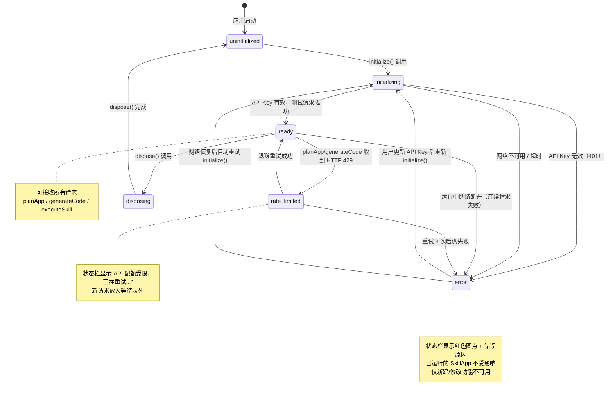

# M-04 AI Provider 通信层开发文档

> **版本**：v1.0 | **日期**：2026-03-13 | **状态**：正式文档
> **服务迭代**：Iter 1
> **依赖文档**：`docs/dev-docs/shared-types.md`、`docs/spec/ai-provider-spec.md`

---

## 目录

1. [模块概述](#模块概述)
2. [文件目录结构](#文件目录结构)
3. [AIProvider 接口定义](#aiprovider-接口定义)
4. [所有相关类型定义](#所有相关类型定义)
5. [ClaudeAPIProvider 实现规范](#claudeapiprovider-实现规范)
6. [APIKeyStore 规范](#apikeystore-规范)
7. [AIProviderManager 规范](#aiproviderManager-规范)
8. [流式 IPC 转发桥接](#流式-ipc-转发桥接)
9. [Preload API](#preload-api)
10. [连接状态机](#连接状态机)
11. [错误处理规范](#错误处理规范)
12. [测试要点](#测试要点)

---

## 模块概述

### 职责

M-04 AI Provider 通信层是 IntentOS Desktop 与 AI 后端之间的**唯一通信层**。它运行在 Electron 主进程中，向上层模块（M-05 SkillApp 生成器、M-06 SkillApp 运行时）提供统一的 `AIProvider` 抽象接口，向下对接具体的 AI 后端实现。

MVP 阶段的唯一内置实现是 `ClaudeAPIProvider`，通过 `@anthropic-ai/sdk` 和 `@anthropic-ai/claude-agent-sdk` 对接 Anthropic Claude API。

**M-04 负责：**

- 定义 `AIProvider` 抽象接口，屏蔽底层 AI 实现差异
- 内置 `ClaudeAPIProvider`（MVP），后续支持 `OpenClawProvider`（P2）
- 安全存储和读取 API Key（通过 `APIKeyStore`）
- 管理 Provider 连接状态，通过 IPC 实时通知渲染进程
- 将 Claude API 的 SSE 流式数据转发给渲染进程（sessionId 隔离）
- 管理请求队列，控制并发，避免 Rate Limit
- 为代码生成 Agent 启动内置 MCP Server（提供文件系统工具）

**M-04 不负责：**

- AI 推理逻辑（由各 Provider 实现负责）
- UI 渲染和用户交互
- SkillApp 进程的生命周期管理（由 M-03 负责）
- MCP 资源访问的权限控制（由 M-06 SkillApp 运行时负责）
- 代码生成的规划逻辑（由 M-05 SkillApp 生成器负责）

---

## 文件目录结构

```
src/main/modules/ai-provider/
├── index.ts                    # 模块入口，导出 AIProviderManager 和 registerBridgeHandlers
├── interfaces.ts               # AIProvider 接口和所有相关类型定义
├── claude-api-provider.ts      # ClaudeAPIProvider 实现
├── api-key-store.ts            # APIKeyStore：API Key 加密存储
├── provider-manager.ts         # AIProviderManager：Provider 注册与切换
├── ai-provider-bridge.ts       # IPC 桥接：将 Provider 方法注册为 IPC channel handler
├── build-mcp-server.ts         # 内置 MCP Server：为代码生成 Agent 提供文件系统工具
└── prompts/
    ├── plan-system-prompt.ts   # planApp 系统 prompt 构造
    └── generate-system-prompt.ts # generateCode 系统 prompt 构造

src/preload/api/
└── ai-provider.ts              # Preload 暴露给渲染进程的 aiProvider API
```

---

## AIProvider 接口定义

文件：`src/main/modules/ai-provider/interfaces.ts`

```typescript
import type { SkillMeta, PlanChunk, GenProgress, SkillCallRequest, SkillCallResult } from "@intentos/shared-types";

/**
 * AIProvider 抽象接口
 * 所有 AI 后端（ClaudeAPIProvider、OpenClawProvider 等）必须实现此接口。
 * 上层模块（M-05、M-06）只依赖此接口，切换 Provider 不需要修改调用方代码。
 */
export interface AIProvider {
  /** Provider 唯一标识，如 "claude-api" | "openclaw" */
  readonly id: string;

  /** 用于 UI 显示的名称，如 "Claude API" | "OpenClaw（本地）" */
  readonly name: string;

  /**
   * 初始化 Provider。
   * 从 APIKeyStore 读取凭证，建立连接，发送测试请求验证有效性。
   * 成功后内部状态变为 "ready"，失败则变为 "error" 并抛出 ProviderError。
   * @throws {ProviderError} errorCode: "API_KEY_MISSING" | "API_KEY_INVALID" | "NETWORK_UNAVAILABLE" | "NETWORK_TIMEOUT"
   */
  initialize(config: ProviderConfig): Promise<void>;

  /**
   * 释放 Provider 持有的资源，断开连接。
   * 内部状态变为 "disposing" → "uninitialized"。
   * 所有进行中的流式请求会收到 AbortError。
   */
  dispose(): Promise<void>;

  /**
   * 意图规划：将用户自然语言意图 + 可用 Skill 列表 → 流式返回 SkillApp 设计方案。
   * 使用 @anthropic-ai/sdk 的 messages.stream() 发起 SSE 请求。
   * @returns AsyncIterable，逐块 yield PlanChunk（thinking → drafting → complete）
   * @throws {ProviderError} 规划失败时抛出，调用方通过 try/catch 捕获
   */
  planApp(request: PlanRequest): AsyncIterable<PlanChunk>;

  /**
   * 代码生成：将规划结果 → 生成 SkillApp 源码并编译打包。
   * 使用 @anthropic-ai/claude-agent-sdk 的 query() API，Agent 自主完成工具调用循环。
   * @returns AsyncIterable，逐块 yield GenProgress（codegen → compile → bundle → done）
   * @throws {ProviderError} 生成失败时抛出
   */
  generateCode(request: GenerateRequest): AsyncIterable<GenProgress>;

  /**
   * Skill 执行：由 SkillApp 通过 M-06 运行时触发，调用指定 Skill 的指定方法。
   * 非流式，等待单次完整执行结果后返回。
   * @throws {ProviderError} Skill 执行失败或超时时抛出
   */
  executeSkill(request: SkillCallRequest): Promise<SkillCallResult>;

  /**
   * 取消正在进行的会话。
   * 调用对应 AbortController.abort()，使进行中的流式请求停止。
   * 若 sessionId 不存在则静默忽略（不抛出错误）。
   */
  cancelSession(sessionId: string): Promise<void>;

  /** 获取当前 Provider 状态快照 */
  getStatus(): ProviderStatus;

  /**
   * 订阅 Provider 状态变化事件。
   * 每次状态变化时调用 handler。
   * @returns 取消订阅函数，调用后不再接收事件
   */
  onStatusChanged(handler: (status: ProviderStatus) => void): () => void;
}
```

### 方法行为说明

| 方法 | 调用前提 | 并发行为 | 超时 |
|------|---------|---------|------|
| `initialize()` | 可在任意状态调用 | 串行，若已 initializing 则等待 | 10 秒 |
| `dispose()` | 可在任意状态调用 | 幂等，重复调用无副作用 | 5 秒 |
| `planApp()` | status 必须为 "ready" | 经队列管理，最多 1 个并发 | 30 秒 |
| `generateCode()` | status 必须为 "ready" | 经队列管理，最多 1 个并发 | 5 分钟 |
| `executeSkill()` | status 必须为 "ready" | 独立计数，最多 5 个并发 | 30 秒 |
| `cancelSession()` | 任意状态 | 立即执行，不排队 | 无 |

---

## 所有相关类型定义

文件：`src/main/modules/ai-provider/interfaces.ts`（续）

### ProviderConfig

```typescript
/**
 * Provider 初始化配置。
 * claudeApiKey 从 APIKeyStore 解密后传入，不从外部直接传入明文。
 */
export interface ProviderConfig {
  /** Provider 类型标识 */
  providerId: "claude-api" | "openclaw";

  // --- Claude API Provider 配置 ---

  /**
   * Anthropic API Key，由 APIKeyStore.loadApiKey() 解密后传入。
   * initialize() 内部不从磁盘读取，由调用方（AIProviderManager）传入。
   */
  claudeApiKey?: string;

  /**
   * 规划阶段使用的模型 ID。
   * 默认值："claude-opus-4-6"
   */
  claudePlanModel?: string;

  /**
   * 代码生成阶段使用的模型 ID。
   * 默认值："claude-sonnet-4-6"
   */
  claudeCodegenModel?: string;

  /**
   * API 请求基础 URL，用于代理或测试环境覆盖。
   * 默认值：undefined（使用 SDK 内置默认值 https://api.anthropic.com）
   */
  baseURL?: string;

  /**
   * 单次请求超时时间（毫秒）。
   * 默认值：30000（30 秒），generateCode 单独使用 300000（5 分钟）
   */
  timeout?: number;

  /**
   * 429 重试最大次数。
   * 默认值：3
   */
  maxRetries?: number;

  // --- OpenClaw Provider 配置（后续 P2 实现使用）---

  /** OpenClaw 服务主机地址，默认 "127.0.0.1" */
  openclawHost?: string;

  /** OpenClaw 服务端口，默认 7890 */
  openclawPort?: number;
}
```

### PlanRequest

```typescript
/**
 * planApp() 的请求参数。
 */
export interface PlanRequest {
  /** 会话 ID，由调用方（M-05）生成，格式为 UUID v4 */
  sessionId: string;

  /** 用户自然语言意图描述 */
  intent: string;

  /**
   * 当前可用 Skill 的元数据列表。
   * 注入到系统 prompt 中，让 Claude 了解可以使用哪些 Skill。
   */
  skills: SkillMeta[];

  /**
   * 多轮交互历史（refinePlan 时使用）。
   * 格式与 Anthropic messages API 的 messages 数组一致。
   * 首次规划时为空数组。
   */
  contextHistory?: Array<{
    role: "user" | "assistant";
    content: string;
  }>;
}
```

### GenerateRequest

```typescript
/**
 * generateCode() 的请求参数。
 */
export interface GenerateRequest {
  /** 会话 ID，UUID v4，与 planApp 阶段的 sessionId 保持一致 */
  sessionId: string;

  /** 规划阶段产出的完整规划结果 */
  planResult: import("@intentos/shared-types").PlanResult;

  /** 正在生成的 SkillApp ID */
  appId: string;

  /**
   * 代码生成的目标目录（绝对路径）。
   * Agent 的 write_file 工具写文件到此目录。
   */
  targetDir: string;

  /**
   * 生成模式：
   * - "full"：完整生成（首次生成）
   * - "incremental"：增量生成（修改流程，配合 existingAppDir）
   */
  mode: "full" | "incremental";

  /**
   * 增量生成时，现有 SkillApp 的代码目录（绝对路径）。
   * mode 为 "incremental" 时必须提供。
   */
  existingAppDir?: string;
}
```

### ProviderStatus

```typescript
/**
 * Provider 当前状态快照。
 * 由 getStatus() 返回，也通过 onStatusChanged 推送给订阅方。
 */
export interface ProviderStatus {
  /** 连接状态，详见 ConnectionStatus */
  status: ConnectionStatus;

  /** 状态描述消息，用于状态栏显示（如 "Claude API 已连接" | "API Key 无效，请重新配置"） */
  message: string;

  /** 错误状态时的具体错误码 */
  errorCode?: ProviderErrorCode;

  /** 最近一次成功请求的响应延迟（毫秒），仅 status="ready" 时有值 */
  latency?: number;

  /** 最近一次错误详情，仅 status="error" 时有值 */
  lastError?: string;

  /** 状态最后变化时间（ISO 8601） */
  lastChangedAt: string;
}

/**
 * Provider 连接状态枚举。
 * 状态转换规则见第 10 节状态机图。
 */
export type ConnectionStatus =
  | "uninitialized"   // 未初始化，尚未调用 initialize()
  | "initializing"    // 初始化中，正在验证 API Key 和网络连通性
  | "ready"           // 就绪，可接收规划/生成/Skill 调用请求
  | "error"           // 错误，API Key 无效或网络不可用
  | "rate_limited"    // 速率受限（HTTP 429），正在重试
  | "disposing";      // 正在释放资源，即将变回 uninitialized
```

### ProviderErrorCode

```typescript
/**
 * Provider 错误码枚举。
 * 用于 ProviderStatus.errorCode 和 ProviderError.code。
 */
export enum ProviderErrorCode {
  /** HTTP 401：API Key 格式错误或已失效 */
  API_KEY_INVALID = "API_KEY_INVALID",

  /** 未配置 API Key，APIKeyStore 返回 null */
  API_KEY_MISSING = "API_KEY_MISSING",

  /** HTTP 429：请求超过速率限制，已触发重试 */
  RATE_LIMITED = "RATE_LIMITED",

  /** 网络连接不可用（DNS 解析失败、连接拒绝等） */
  NETWORK_UNAVAILABLE = "NETWORK_UNAVAILABLE",

  /** 请求在超时时间内未收到响应 */
  NETWORK_TIMEOUT = "NETWORK_TIMEOUT",

  /** HTTP 5xx：Anthropic 服务端内部错误 */
  PROVIDER_ERROR = "PROVIDER_ERROR",

  /** planApp 失败：Claude 返回无法解析为 PlanResult 的响应 */
  PLAN_FAILED = "PLAN_FAILED",

  /** generateCode 失败：Agent 无法完成文件写入或工具调用循环超出上限 */
  CODEGEN_FAILED = "CODEGEN_FAILED",

  /** 编译失败：run_command tsc 返回非 0 退出码，且自动修复循环（最多 3 次）后仍失败 */
  COMPILE_FAILED = "COMPILE_FAILED",

  /** 会话被取消：用户主动调用 cancelSession()，静默处理不展示错误 */
  SESSION_CANCELLED = "SESSION_CANCELLED",

  /** Skill 执行超时：executeSkill 超过 30 秒未返回 */
  SKILL_TIMEOUT = "SKILL_TIMEOUT",
}

/**
 * Provider 错误对象，继承自 Error。
 */
export class ProviderError extends Error {
  constructor(
    public readonly code: ProviderErrorCode,
    message: string,
    public readonly details?: unknown,
  ) {
    super(message);
    this.name = "ProviderError";
  }
}
```

### 其他内部类型

```typescript
/**
 * 请求队列中的活跃请求记录。
 */
export interface ActiveRequest {
  sessionId: string;
  type: "plan" | "generate" | "skill";
  controller: AbortController;
  startedAt: number;
  timeoutHandle: ReturnType<typeof setTimeout>;
}

/**
 * 等待队列中的挂起请求。
 */
export interface PendingRequest {
  sessionId: string;
  type: "plan" | "generate";
  resolve: () => void;
  reject: (error: ProviderError) => void;
  enqueuedAt: number;
}
```

---

## ClaudeAPIProvider 实现规范

文件：`src/main/modules/ai-provider/claude-api-provider.ts`

### 类结构

```typescript
import Anthropic from "@anthropic-ai/sdk";
import { query } from "@anthropic-ai/claude-agent-sdk";
import type { AIProvider, ProviderConfig, PlanRequest, GenerateRequest, ProviderStatus } from "./interfaces";
import type { PlanChunk, GenProgress, SkillCallRequest, SkillCallResult } from "@intentos/shared-types";
import { ProviderError, ProviderErrorCode, ConnectionStatus } from "./interfaces";

export class ClaudeAPIProvider implements AIProvider {
  readonly id = "claude-api";
  readonly name = "Claude API";

  private anthropic: Anthropic | null = null;
  private config: ProviderConfig | null = null;
  private _status: ProviderStatus = {
    status: "uninitialized",
    message: "未初始化",
    lastChangedAt: new Date().toISOString(),
  };
  private statusHandlers: Set<(status: ProviderStatus) => void> = new Set();

  /** sessionId → AbortController，用于 cancelSession */
  private activeSessions: Map<string, AbortController> = new Map();

  // 方法实现见下方各小节
}
```

### initialize(config)

```typescript
async initialize(config: ProviderConfig): Promise<void> {
  this.setStatus("initializing", "正在验证 API Key...");
  this.config = config;

  if (!config.claudeApiKey) {
    this.setStatus("error", "未配置 API Key，请在设置中配置 Anthropic API Key", ProviderErrorCode.API_KEY_MISSING);
    throw new ProviderError(ProviderErrorCode.API_KEY_MISSING, "claudeApiKey 未提供");
  }

  // 创建 Anthropic 客户端
  this.anthropic = new Anthropic({
    apiKey: config.claudeApiKey,
    baseURL: config.baseURL,
    timeout: config.timeout ?? 30000,
    maxRetries: 0, // 重试由 M-04 自行管理，不依赖 SDK 内置重试
  });

  // 发送最小测试请求验证 Key 有效性
  // 使用 max_tokens: 1 最小化 token 消耗
  const startTime = Date.now();
  try {
    await this.anthropic.messages.create({
      model: config.claudePlanModel ?? "claude-opus-4-6",
      max_tokens: 1,
      messages: [{ role: "user", content: "ping" }],
    });
  } catch (error) {
    this.handleInitError(error);
    return; // handleInitError 内部已调用 setStatus 和 throw
  }

  const latency = Date.now() - startTime;
  this.setStatus("ready", "Claude API 已连接", undefined, latency);
}

private handleInitError(error: unknown): never {
  if (error instanceof Anthropic.AuthenticationError) {
    this.setStatus("error", "API Key 无效，请检查后重新配置", ProviderErrorCode.API_KEY_INVALID);
    throw new ProviderError(ProviderErrorCode.API_KEY_INVALID, "HTTP 401: API Key 无效");
  }
  if (error instanceof Anthropic.APIConnectionTimeoutError) {
    this.setStatus("error", "连接超时，请检查网络连接", ProviderErrorCode.NETWORK_TIMEOUT);
    throw new ProviderError(ProviderErrorCode.NETWORK_TIMEOUT, "连接超时（10 秒内未响应）");
  }
  if (error instanceof Anthropic.APIConnectionError) {
    this.setStatus("error", "网络不可用，请检查网络连接", ProviderErrorCode.NETWORK_UNAVAILABLE);
    throw new ProviderError(ProviderErrorCode.NETWORK_UNAVAILABLE, "网络连接失败");
  }
  this.setStatus("error", "AI 服务暂时不可用，请稍后重试", ProviderErrorCode.PROVIDER_ERROR);
  throw new ProviderError(ProviderErrorCode.PROVIDER_ERROR, String(error));
}
```

**关键点：**
- `claudeApiKey` 由调用方（`AIProviderManager`）从 `APIKeyStore` 解密后传入，`initialize()` 内部不读磁盘
- 测试请求使用 `max_tokens: 1` 以最小化 token 消耗，仅用于验证 Key 有效性
- 失败时先调用 `setStatus()` 更新内部状态（触发订阅方的 UI 更新），再 `throw`

### planApp(request)

```typescript
async *planApp(request: PlanRequest): AsyncIterable<PlanChunk> {
  if (!this.anthropic) throw new ProviderError(ProviderErrorCode.PROVIDER_ERROR, "Provider 未初始化");

  const controller = new AbortController();
  this.activeSessions.set(request.sessionId, controller);

  try {
    const stream = await this.anthropic.messages.stream(
      {
        model: this.config!.claudePlanModel ?? "claude-opus-4-6",
        max_tokens: 4096,
        system: buildPlanSystemPrompt(request.skills),
        messages: buildPlanMessages(request.intent, request.contextHistory),
      },
      { signal: controller.signal },
    );

    let accumulatedText = "";

    for await (const event of stream) {
      if (event.type === "content_block_delta" && event.delta.type === "text_delta") {
        const text = event.delta.text;
        accumulatedText += text;

        // 简单状态机：检测是否进入 JSON 规划结果区域
        const phase = detectPlanPhase(accumulatedText);

        yield {
          sessionId: request.sessionId,
          phase,
          content: text,
          timestamp: new Date().toISOString(),
        } satisfies PlanChunk;
      }
    }

    // message_stop 后解析累积文本中的 JSON 规划结果
    const finalMessage = await stream.finalMessage();
    const fullText = finalMessage.content
      .filter((b): b is Anthropic.TextBlock => b.type === "text")
      .map((b) => b.text)
      .join("");

    const planResult = parsePlanResult(fullText);
    if (!planResult) {
      throw new ProviderError(ProviderErrorCode.PLAN_FAILED, "无法从响应中解析规划结果，请重新描述需求");
    }

    yield {
      sessionId: request.sessionId,
      phase: "complete",
      content: "",
      planResult,
      timestamp: new Date().toISOString(),
    } satisfies PlanChunk;

  } catch (error) {
    if (error instanceof Error && error.name === "AbortError") {
      // 用户主动取消，静默退出，不 yield 错误
      return;
    }
    throw this.mapToProviderError(error);
  } finally {
    this.activeSessions.delete(request.sessionId);
  }
}
```

**系统 Prompt 构造规范（`buildPlanSystemPrompt`）：**

系统 prompt 必须包含以下三个部分，缺一不可：

1. **角色定义**：IntentOS 规划引擎，负责将用户意图转化为 SkillApp 设计方案
2. **Skill 列表注入**：将每个 Skill 的 `id`、`name`、`description`、`methods`（方法名+描述）以 YAML 或 JSON 格式注入
3. **输出格式约束**：要求响应包含可解析的 JSON 块，格式为 `PlanResult`（参见 `shared-types.md`），JSON 块前后用 `\`\`\`json` 和 `\`\`\`` 包裹

`parsePlanResult` 从响应文本中提取第一个 `\`\`\`json` 块并用 `JSON.parse` 解析为 `PlanResult`，解析失败时返回 `null`。

**`detectPlanPhase` 状态机：**

```
检测规则（顺序优先级）：
1. 若 accumulatedText 包含 "```json"  → 返回 "drafting"
2. 否则                                → 返回 "thinking"
（phase "complete" 仅在 message_stop 后的最终 yield 中使用）
```

### generateCode(request)

```typescript
async *generateCode(request: GenerateRequest): AsyncIterable<GenProgress> {
  if (!this.anthropic) throw new ProviderError(ProviderErrorCode.PROVIDER_ERROR, "Provider 未初始化");

  const controller = new AbortController();
  this.activeSessions.set(request.sessionId, controller);

  // 启动内置 MCP Server，暴露文件系统工具给 Agent
  const mcpServer = await createBuildMCPServer(request.targetDir);

  try {
    const prompt = buildGenerateSystemPrompt(request.planResult, request.appId, request.mode, request.existingAppDir);

    for await (const event of query({
      model: this.config!.claudeCodegenModel ?? "claude-sonnet-4-6",
      prompt,
      tools: mcpServer.tools,
      signal: controller.signal,
    })) {
      const chunk = mapAgentEventToProgress(event, request.sessionId);
      if (chunk) {
        yield chunk;
      }
    }

    // 所有工具调用完成后，yield 最终完成 chunk
    yield {
      sessionId: request.sessionId,
      stage: "done",
      percent: 100,
      message: "应用生成完成",
      completeChunk: {
        appId: request.appId,
        entryPoint: "dist/main/index.js",
        outputDir: request.targetDir,
        buildStats: await collectBuildStats(request.targetDir),
      },
      timestamp: new Date().toISOString(),
    } satisfies GenProgress;

  } catch (error) {
    if (error instanceof Error && error.name === "AbortError") {
      // 用户取消：清理不完整的构建产物
      await cleanupBuildDir(request.targetDir);
      return;
    }
    throw this.mapToProviderError(error);
  } finally {
    this.activeSessions.delete(request.sessionId);
    await mcpServer.dispose();
  }
}
```

**内置 MCP Server 工具集（`createBuildMCPServer`）：**

由 `build-mcp-server.ts` 实现，向 Agent 暴露三个工具：

| 工具名 | 参数 | 说明 |
|--------|------|------|
| `write_file` | `path: string, content: string` | 写文件到 `targetDir` 内（路径必须在 targetDir 内，越界拒绝） |
| `read_file` | `path: string` | 读取文件内容（同样限制在 targetDir 内） |
| `run_command` | `cmd: string, args: string[]` | 执行命令，仅允许白名单命令：`tsc`、`node`、`npm`（限定参数） |

**工具调用事件 → GenProgress 映射规则（`mapAgentEventToProgress`）：**

```
event.type === "tool_use" 时：
  tool.name === "write_file"
    → stage: "codegen", percent: 递增（每个文件 +5，上限 70）, message: "正在生成 {path}"
  tool.name === "run_command" && args 包含 "tsc"
    → stage: "compile", percent: 75, message: "正在编译 TypeScript..."
  tool.name === "run_command" && args 包含 "build" 或 "bundle"
    → stage: "bundle", percent: 90, message: "正在打包应用..."

其他 event 类型（text、thinking 等）→ 返回 null（不 yield）
```

**代码生成系统 Prompt 构造规范（`buildGenerateSystemPrompt`）：**

必须包含以下内容：

1. **角色定义**：IntentOS 代码生成引擎，生成可在 Electron v33 中运行的 SkillApp
2. **技术栈约束**：React 18 + TypeScript 5.x + Electron v33 + shadcn/ui + Tailwind CSS 4 + Zustand 5
3. **目录结构约束**：注入 SkillApp 模板的完整目录结构（`skillapp-template/` 的结构，详见 electron-spec.md）
4. **PlanResult 注入**：将 `request.planResult` 序列化为 JSON 注入，包含 `appName`、`pages`、`skillUsage`、`permissions`
5. **Runtime 接口约束**：说明 `window.intentOS.callSkill(request)` 的调用方式（Skill 调用必须通过此 API）
6. **增量模式额外指令**（`mode === "incremental"`）：注入 `existingAppDir` 目录结构，指示只修改受影响的文件

### executeSkill(request)

```typescript
async executeSkill(request: SkillCallRequest): Promise<SkillCallResult> {
  if (!this.anthropic) throw new ProviderError(ProviderErrorCode.PROVIDER_ERROR, "Provider 未初始化");

  const controller = new AbortController();
  const sessionKey = `skill-${request.requestId}`;
  this.activeSessions.set(sessionKey, controller);

  // 30 秒超时
  const timeoutHandle = setTimeout(() => {
    controller.abort();
  }, 30000);

  try {
    const startTime = Date.now();

    const response = await this.anthropic.messages.create(
      {
        model: this.config!.claudeCodegenModel ?? "claude-sonnet-4-6",
        max_tokens: 2048,
        tools: [buildSkillTool(request.skillId, request.method)],
        tool_choice: { type: "any" },
        messages: [
          {
            role: "user",
            content: buildSkillCallPrompt(request),
          },
        ],
      },
      { signal: controller.signal },
    );

    const toolUseBlock = response.content.find(
      (b): b is Anthropic.ToolUseBlock => b.type === "tool_use"
    );

    if (!toolUseBlock) {
      throw new ProviderError(ProviderErrorCode.CODEGEN_FAILED, "Claude 未返回 tool_use 响应");
    }

    return {
      requestId: request.requestId,
      success: true,
      data: toolUseBlock.input,
      duration: Date.now() - startTime,
      timestamp: new Date().toISOString(),
    };

  } catch (error) {
    if (error instanceof Error && error.name === "AbortError") {
      throw new ProviderError(ProviderErrorCode.SKILL_TIMEOUT, "Skill 执行超时（30 秒）");
    }
    const mapped = this.mapToProviderError(error);
    return {
      requestId: request.requestId,
      success: false,
      error: { code: mapped.code, message: mapped.message },
      duration: 0,
      timestamp: new Date().toISOString(),
    };
  } finally {
    clearTimeout(timeoutHandle);
    this.activeSessions.delete(sessionKey);
  }
}
```

### cancelSession(sessionId)

```typescript
async cancelSession(sessionId: string): Promise<void> {
  const controller = this.activeSessions.get(sessionId);
  if (controller) {
    controller.abort();
    // activeSessions 的清理由各方法的 finally 块负责
  }
  // 若 sessionId 不存在，静默忽略
}
```

**效果：** `controller.abort()` 调用后，`@anthropic-ai/sdk` 的 `messages.stream()` 和 `query()` 均会立即停止输出，抛出 `AbortError`。各方法的 `catch` 块检测到 `AbortError` 后静默退出（不向上层抛出错误，不向渲染进程发送错误事件）。

### 指数退避重试策略

遇到 HTTP 429（Rate Limit）时执行以下策略。重试逻辑封装在 `withRetry` 工具函数中，仅用于 `planApp` 和 `generateCode`（`executeSkill` 不重试，直接返回失败结果）：

```typescript
async function withRetry<T>(
  fn: () => Promise<T>,
  onStatusChange: (status: ConnectionStatus, message: string) => void,
  maxRetries: number = 3,
): Promise<T> {
  for (let attempt = 0; attempt <= maxRetries; attempt++) {
    try {
      return await fn();
    } catch (error) {
      if (error instanceof Anthropic.RateLimitError && attempt < maxRetries) {
        // 指数退避：第 n 次重试等待 2^(n-1) 秒：1s → 2s → 4s
        const waitMs = Math.pow(2, attempt) * 1000;
        onStatusChange("rate_limited", `API 配额受限，${waitMs / 1000} 秒后重试（${attempt + 1}/${maxRetries}）...`);
        await sleep(waitMs);
        continue;
      }
      throw error;
    }
  }
  // maxRetries 次后仍失败
  throw new ProviderError(ProviderErrorCode.RATE_LIMITED, `已达最大重试次数（${maxRetries} 次），请稍后再试`);
}
```

**退避间隔公式：** `waitMs = 2^(attempt) * 1000`（attempt 从 0 开始）
- 第 1 次重试前等待：`2^0 * 1000 = 1000ms`（1 秒）
- 第 2 次重试前等待：`2^1 * 1000 = 2000ms`（2 秒）
- 第 3 次重试前等待：`2^2 * 1000 = 4000ms`（4 秒）

---

## APIKeyStore 规范

文件：`src/main/modules/ai-provider/api-key-store.ts`

### 接口定义

```typescript
import { safeStorage, app } from "electron";
import * as fs from "node:fs/promises";
import * as path from "node:path";
import { getLogger } from "../logger";

const log = getLogger("api-key-store");

/**
 * APIKeyStore：API Key 的本地加密存储。
 *
 * 存储路径：app.getPath('userData')/secure/api-key.bin
 * 加密方式：electron.safeStorage（macOS: Keychain, Windows: DPAPI, Linux: libsecret）
 * 明文禁止：API Key 绝不写入任何明文文件或日志
 */
export class APIKeyStore {
  private readonly storePath: string;

  constructor() {
    this.storePath = path.join(app.getPath("userData"), "secure", "api-key.bin");
  }

  /**
   * 加密并保存 API Key。
   * @param key 明文 API Key（格式 sk-ant-...）
   */
  async saveApiKey(key: string): Promise<void> {
    if (!safeStorage.isEncryptionAvailable()) {
      log.warn("safeStorage 不可用，使用降级存储方案");
      await this.saveApiKeyFallback(key);
      return;
    }

    const encrypted = safeStorage.encryptString(key);
    await fs.mkdir(path.dirname(this.storePath), { recursive: true });
    await fs.writeFile(this.storePath, encrypted);

    log.info("API Key 已加密保存", { masked: maskApiKey(key) });
  }

  /**
   * 读取并解密 API Key。
   * @returns 解密后的明文 Key，若未存储则返回 null
   */
  async loadApiKey(): Promise<string | null> {
    try {
      const encrypted = await fs.readFile(this.storePath);

      if (!safeStorage.isEncryptionAvailable()) {
        return this.loadApiKeyFallback();
      }

      const key = safeStorage.decryptString(encrypted);
      log.info("API Key 已加载", { masked: maskApiKey(key) });
      return key;
    } catch (error) {
      if ((error as NodeJS.ErrnoException).code === "ENOENT") {
        return null; // 未配置
      }
      log.error("API Key 读取失败", { error: String(error) });
      return null;
    }
  }

  /**
   * 删除已存储的 API Key。
   */
  async deleteApiKey(): Promise<void> {
    try {
      await fs.unlink(this.storePath);
      log.info("API Key 已删除");
    } catch (error) {
      if ((error as NodeJS.ErrnoException).code !== "ENOENT") {
        throw error;
      }
    }
  }

  // 降级方案实现（见下方说明）
  private async saveApiKeyFallback(key: string): Promise<void> { /* ... */ }
  private async loadApiKeyFallback(): Promise<string | null> { /* ... */ }
}
```

### 跨平台兼容策略

| 平台 | safeStorage 可用性 | 实际加密机制 |
|------|-------------------|-------------|
| macOS 12+ | 可用 | Keychain Services（AES-256-GCM） |
| Windows 10+ | 可用 | Windows DPAPI |
| Linux（GNOME） | 可用（需 libsecret） | GNOME Keyring |
| Linux（无桌面环境） | 不可用 | 降级方案（见下） |

**降级方案（`safeStorage.isEncryptionAvailable()` 返回 `false` 时）：**

使用 `crypto.createCipher` 基于机器特征（hostname + 用户名 + Node.js 版本的哈希）派生密钥，将密文写入 `userData/secure/api-key-fallback.enc`。降级方案仅作为最后手段，在应用日志中记录 warn 级别消息提示用户。

### 日志 Masking 规范

API Key 在任何日志输出中必须 Masking。`maskApiKey` 函数规范：

```typescript
/**
 * 将 API Key 脱敏用于日志输出。
 * 输入：sk-ant-api03-xxxxx...
 * 输出：sk-ant-***
 */
function maskApiKey(key: string): string {
  if (!key) return "(empty)";
  const prefix = key.substring(0, 6); // "sk-ant"
  return `${prefix}-***`;
}
```

规则：日志中凡涉及 API Key 的字段，统一使用 `maskApiKey(key)` 处理后再传入 logger。禁止使用 `log.debug(key)` 或将 key 拼入字符串后 log。

---

## AIProviderManager 规范

文件：`src/main/modules/ai-provider/provider-manager.ts`

### 接口定义

```typescript
import type { AIProvider, ProviderConfig, ProviderStatus } from "./interfaces";
import { APIKeyStore } from "./api-key-store";
import { ClaudeAPIProvider } from "./claude-api-provider";

/**
 * AIProviderManager：管理激活的 AIProvider 实例。
 *
 * 职责：
 * - 持有当前激活的 Provider 实例
 * - 在切换 Provider 时正确 dispose 旧实例、初始化新实例
 * - 管理请求队列（并发槽位、FIFO 排队、超时）
 * - 将 Provider 状态变化广播给所有订阅方（IPC Bridge）
 */
export class AIProviderManager {
  private provider: AIProvider | null = null;
  private apiKeyStore: APIKeyStore;
  private queue: RequestQueueManager;
  private statusHandlers: Set<(status: ProviderStatus) => void> = new Set();

  constructor() {
    this.apiKeyStore = new APIKeyStore();
    this.queue = new RequestQueueManager({
      maxConcurrentGenerate: 1,
      maxConcurrentSkill: 5,
      maxQueueSize: 10,
      queueTimeoutMs: 300000, // 5 分钟排队超时
    });
  }

  /**
   * 设置并激活新的 Provider。
   * 若当前已有 Provider，先 dispose() 再初始化新的。
   * 初始化失败时保留旧 Provider（降级为错误状态）。
   */
  async setProvider(config: ProviderConfig): Promise<void> {
    if (this.provider) {
      await this.provider.dispose();
    }

    const apiKey = await this.apiKeyStore.loadApiKey();
    const newProvider = this.createProvider(config.providerId);

    newProvider.onStatusChanged((status) => {
      this.broadcastStatus(status);
    });

    this.provider = newProvider;
    await newProvider.initialize({ ...config, claudeApiKey: apiKey ?? undefined });
  }

  /**
   * 获取当前 Provider 状态快照。
   * 若无 Provider，返回 uninitialized 状态。
   */
  getProviderStatus(): ProviderStatus {
    return this.provider?.getStatus() ?? {
      status: "uninitialized",
      message: "AI Provider 未配置",
      lastChangedAt: new Date().toISOString(),
    };
  }

  /**
   * 订阅 Provider 状态变化。
   * @returns 取消订阅函数
   */
  onStatusChanged(handler: (status: ProviderStatus) => void): () => void {
    this.statusHandlers.add(handler);
    return () => this.statusHandlers.delete(handler);
  }

  /**
   * 获取当前激活的 Provider（内部使用）。
   * 若 Provider 未就绪则抛出 ProviderError。
   */
  getActiveProvider(): AIProvider {
    if (!this.provider) {
      throw new ProviderError(ProviderErrorCode.API_KEY_MISSING, "AI Provider 未初始化");
    }
    return this.provider;
  }

  private createProvider(id: string): AIProvider {
    switch (id) {
      case "claude-api":
        return new ClaudeAPIProvider();
      default:
        throw new Error(`未知的 Provider ID: ${id}`);
    }
  }

  private broadcastStatus(status: ProviderStatus): void {
    for (const handler of this.statusHandlers) {
      handler(status);
    }
  }
}
```

### 请求队列管理（RequestQueueManager）

```typescript
interface QueueConfig {
  /** 规划/生成请求最大并发数，默认 1 */
  maxConcurrentGenerate: number;
  /** Skill 调用请求最大并发数，默认 5 */
  maxConcurrentSkill: number;
  /** 等待队列最大容量，超出返回 RATE_LIMITED 错误，默认 10 */
  maxQueueSize: number;
  /** 请求在队列中的最大等待时间（毫秒），默认 300000（5 分钟） */
  queueTimeoutMs: number;
}

class RequestQueueManager {
  private config: QueueConfig;
  private activeGenerate: Map<string, ActiveRequest> = new Map(); // sessionId → ActiveRequest
  private activeSkill: Map<string, ActiveRequest> = new Map();
  private pendingQueue: PendingRequest[] = []; // FIFO

  constructor(config: QueueConfig) {
    this.config = config;
  }

  /**
   * 尝试进入生成槽位。
   * 若槽位已满，放入 FIFO 等待队列，等待前一个请求完成后被唤醒。
   * 若队列已满（>= maxQueueSize），立即拒绝并抛出 RATE_LIMITED 错误。
   */
  async acquireGenerateSlot(sessionId: string): Promise<AbortController> {
    if (this.activeGenerate.size < this.config.maxConcurrentGenerate) {
      return this.createSlot(this.activeGenerate, sessionId, this.config.queueTimeoutMs);
    }

    if (this.pendingQueue.length >= this.config.maxQueueSize) {
      throw new ProviderError(ProviderErrorCode.RATE_LIMITED, "当前请求队列已满，请稍后重试");
    }

    // 放入等待队列
    return new Promise<AbortController>((resolve, reject) => {
      const queued: PendingRequest = {
        sessionId,
        type: "generate",
        resolve: () => resolve(this.createSlot(this.activeGenerate, sessionId, this.config.queueTimeoutMs)),
        reject,
        enqueuedAt: Date.now(),
      };

      // 队列超时处理
      const timeoutHandle = setTimeout(() => {
        const idx = this.pendingQueue.indexOf(queued);
        if (idx !== -1) {
          this.pendingQueue.splice(idx, 1);
          reject(new ProviderError(ProviderErrorCode.RATE_LIMITED, "排队等待超时，请重试"));
        }
      }, this.config.queueTimeoutMs);

      // 取消超时定时器的引用需存储（此处省略，完整实现需处理）
      this.pendingQueue.push(queued);
    });
  }

  /**
   * 释放生成槽位，唤醒等待队列中的下一个请求。
   */
  releaseGenerateSlot(sessionId: string): void {
    this.activeGenerate.delete(sessionId);
    const next = this.pendingQueue.shift();
    if (next) {
      next.resolve();
    }
  }

  private createSlot(
    map: Map<string, ActiveRequest>,
    sessionId: string,
    timeoutMs: number,
  ): AbortController {
    const controller = new AbortController();
    const timeoutHandle = setTimeout(() => controller.abort(), timeoutMs);
    map.set(sessionId, { sessionId, type: "generate", controller, startedAt: Date.now(), timeoutHandle });
    return controller;
  }
}
```

**队列规则汇总：**

| 规则 | 值 |
|------|-----|
| 规划/生成最大并发 | 1 |
| Skill 调用最大并发 | 5 |
| FIFO 排队顺序 | 先到先服务 |
| 最大排队数 | 10（超出立即拒绝） |
| 排队超时 | 5 分钟（超时自动拒绝） |
| Skill 调用 | 不占用生成槽位，独立计数 |

---

## 流式 IPC 转发桥接

文件：`src/main/modules/ai-provider/ai-provider-bridge.ts`

### 注册所有 IPC Handler

```typescript
import { ipcMain } from "electron";
import type { AIProviderManager } from "./provider-manager";
import type { PlanChunk, GenProgress } from "@intentos/shared-types";

/**
 * 注册 M-04 的所有 ipcMain handler。
 * 在 Electron 主进程启动时调用一次。
 */
export function registerBridgeHandlers(manager: AIProviderManager): void {
  registerPlanHandler(manager);
  registerGenerateHandler(manager);
  registerSkillCallHandler(manager);
  registerCancelHandler(manager);
  registerStatusHandler(manager);
  registerStatusChangedBroadcast(manager);
}
```

### Channel 完整列表

| Channel 名称 | 方向 | 类型 | 说明 |
|-------------|------|------|------|
| `ai-provider:plan` | Renderer → Main | invoke | 发起规划请求，返回 `{ sessionId, status: "streaming" }` |
| `ai-provider:plan-chunk:{sessionId}` | Main → Renderer | send | 逐块转发 PlanChunk |
| `ai-provider:plan-complete:{sessionId}` | Main → Renderer | send | 规划流结束信号 |
| `ai-provider:plan-error:{sessionId}` | Main → Renderer | send | 规划失败，携带 `{ code, message }` |
| `ai-provider:generate` | Renderer → Main | invoke | 发起代码生成请求，返回 `{ sessionId, status: "streaming" }` |
| `ai-provider:gen-progress:{sessionId}` | Main → Renderer | send | 逐块转发 GenProgress |
| `ai-provider:gen-complete:{sessionId}` | Main → Renderer | send | 生成完成信号，携带 `GenCompleteChunk` |
| `ai-provider:gen-error:{sessionId}` | Main → Renderer | send | 生成失败，携带 `{ code, message }` |
| `ai-provider:skill-call` | Renderer → Main | invoke | Skill 执行请求，直接返回 `SkillCallResult` |
| `ai-provider:cancel` | Renderer → Main | invoke | 取消指定 sessionId 的会话 |
| `ai-provider:status` | Renderer → Main | invoke | 查询当前 Provider 状态，返回 `ProviderStatus` |
| `ai-provider:status-changed` | Main → Renderer（广播） | send | Provider 状态变化通知，携带 `ProviderStatus` |

### ai-provider:plan Handler 实现

```typescript
function registerPlanHandler(manager: AIProviderManager): void {
  ipcMain.handle("ai-provider:plan", async (event, payload: PlanRequest) => {
    const { sessionId } = payload;
    const provider = manager.getActiveProvider();

    // 异步启动流式转发，不 await（避免阻塞 invoke 返回）
    ;(async () => {
      try {
        const controller = await manager.queue.acquireGenerateSlot(sessionId);

        try {
          for await (const chunk of provider.planApp({ ...payload, signal: controller.signal })) {
            // sessionId 隔离：每个会话使用独立的 channel，防止跨会话数据污染
            event.sender.send(`ai-provider:plan-chunk:${sessionId}`, chunk satisfies PlanChunk);
          }
          event.sender.send(`ai-provider:plan-complete:${sessionId}`);
        } finally {
          manager.queue.releaseGenerateSlot(sessionId);
        }

      } catch (error) {
        const providerError = error instanceof ProviderError
          ? error
          : new ProviderError(ProviderErrorCode.PROVIDER_ERROR, String(error));

        // SESSION_CANCELLED 不发送错误事件，静默退出
        if (providerError.code !== ProviderErrorCode.SESSION_CANCELLED) {
          event.sender.send(`ai-provider:plan-error:${sessionId}`, {
            code: providerError.code,
            message: providerError.message,
          });
        }
      }
    })();

    // 立即返回，让渲染进程开始监听 chunk 事件
    return { sessionId, status: "streaming" };
  });
}
```

### ai-provider:generate Handler 实现

与 `ai-provider:plan` 结构相同，将 chunk 发送到 `ai-provider:gen-progress:{sessionId}`，完成后发送到 `ai-provider:gen-complete:{sessionId}`，错误发送到 `ai-provider:gen-error:{sessionId}`。

### ai-provider:skill-call Handler 实现

```typescript
function registerSkillCallHandler(manager: AIProviderManager): void {
  ipcMain.handle("ai-provider:skill-call", async (_event, payload: SkillCallRequest) => {
    // Skill 调用非流式，直接 invoke 返回结果
    const provider = manager.getActiveProvider();
    const controller = await manager.queue.acquireSkillSlot(payload.requestId);
    try {
      return await provider.executeSkill(payload);
    } finally {
      manager.queue.releaseSkillSlot(payload.requestId);
    }
  });
}
```

### sessionId 隔离机制

每个流式会话（planApp / generateCode）使用独立的 IPC channel 名称：
- `ai-provider:plan-chunk:{sessionId}` — 仅对应 sessionId 的渲染进程接收
- `ai-provider:gen-progress:{sessionId}` — 同上

隔离保证：即使同一渲染进程内同时发起多个会话（如用户快速点击多次），每个会话的 chunk 只流向监听了对应 sessionId channel 的回调，不会串流。渲染进程监听时必须传入 sessionId，监听完成后调用返回的取消订阅函数移除监听器，防止内存泄漏。

---

## Preload API

文件：`src/preload/api/ai-provider.ts`

```typescript
import { ipcRenderer, type IpcRendererEvent } from "electron";
import type {
  PlanRequest,
  PlanChunk,
  GenerateRequest,
  GenProgress,
  SkillCallRequest,
  SkillCallResult,
  ProviderStatus,
} from "@intentos/shared-types";

/**
 * window.intentOS.aiProvider 暴露给渲染进程的 AI Provider API。
 * 通过 contextBridge 注册，渲染进程不能直接访问 ipcRenderer。
 */
export const aiProviderPreloadApi = {
  /**
   * 发起规划请求。
   * 立即返回 { sessionId, status: "streaming" }。
   * chunk 数据通过 onPlanChunk / onPlanComplete / onPlanError 订阅接收。
   */
  plan: (payload: PlanRequest): Promise<{ sessionId: string; status: string }> =>
    ipcRenderer.invoke("ai-provider:plan", payload),

  /**
   * 订阅规划流 chunk。
   * @returns 取消订阅函数，组件卸载时必须调用
   */
  onPlanChunk: (sessionId: string, cb: (chunk: PlanChunk) => void): (() => void) => {
    const channel = `ai-provider:plan-chunk:${sessionId}`;
    const handler = (_e: IpcRendererEvent, chunk: PlanChunk) => cb(chunk);
    ipcRenderer.on(channel, handler);
    return () => ipcRenderer.removeListener(channel, handler);
  },

  /**
   * 订阅规划完成信号。
   * @returns 取消订阅函数
   */
  onPlanComplete: (sessionId: string, cb: () => void): (() => void) => {
    const channel = `ai-provider:plan-complete:${sessionId}`;
    const handler = (_e: IpcRendererEvent) => cb();
    ipcRenderer.once(channel, handler); // once：完成信号只触发一次
    return () => ipcRenderer.removeListener(channel, handler);
  },

  /**
   * 订阅规划错误事件。
   * @returns 取消订阅函数
   */
  onPlanError: (
    sessionId: string,
    cb: (error: { code: string; message: string }) => void,
  ): (() => void) => {
    const channel = `ai-provider:plan-error:${sessionId}`;
    const handler = (_e: IpcRendererEvent, error: { code: string; message: string }) => cb(error);
    ipcRenderer.once(channel, handler);
    return () => ipcRenderer.removeListener(channel, handler);
  },

  /**
   * 发起代码生成请求。
   * 返回 { sessionId, status: "streaming" }。
   */
  generate: (payload: GenerateRequest): Promise<{ sessionId: string; status: string }> =>
    ipcRenderer.invoke("ai-provider:generate", payload),

  /** 订阅代码生成进度 chunk */
  onGenProgress: (sessionId: string, cb: (chunk: GenProgress) => void): (() => void) => {
    const channel = `ai-provider:gen-progress:${sessionId}`;
    const handler = (_e: IpcRendererEvent, chunk: GenProgress) => cb(chunk);
    ipcRenderer.on(channel, handler);
    return () => ipcRenderer.removeListener(channel, handler);
  },

  /** 订阅代码生成完成信号（携带 GenCompleteChunk） */
  onGenComplete: (sessionId: string, cb: (chunk: GenProgress) => void): (() => void) => {
    const channel = `ai-provider:gen-complete:${sessionId}`;
    const handler = (_e: IpcRendererEvent, chunk: GenProgress) => cb(chunk);
    ipcRenderer.once(channel, handler);
    return () => ipcRenderer.removeListener(channel, handler);
  },

  /** 订阅代码生成错误事件 */
  onGenError: (
    sessionId: string,
    cb: (error: { code: string; message: string }) => void,
  ): (() => void) => {
    const channel = `ai-provider:gen-error:${sessionId}`;
    const handler = (_e: IpcRendererEvent, error: { code: string; message: string }) => cb(error);
    ipcRenderer.once(channel, handler);
    return () => ipcRenderer.removeListener(channel, handler);
  },

  /** 取消指定会话 */
  cancelSession: (sessionId: string): Promise<void> =>
    ipcRenderer.invoke("ai-provider:cancel", { sessionId }),

  /** 查询当前 Provider 状态 */
  getStatus: (): Promise<ProviderStatus> =>
    ipcRenderer.invoke("ai-provider:status"),

  /**
   * 订阅 Provider 状态变化事件（广播）。
   * 适用于状态栏的实时状态显示。
   * @returns 取消订阅函数
   */
  onStatusChanged: (cb: (status: ProviderStatus) => void): (() => void) => {
    const handler = (_e: IpcRendererEvent, status: ProviderStatus) => cb(status);
    ipcRenderer.on("ai-provider:status-changed", handler);
    return () => ipcRenderer.removeListener("ai-provider:status-changed", handler);
  },
};

// 类型：window.intentOS.aiProvider 的完整类型
export type AIProviderPreloadApi = typeof aiProviderPreloadApi;
```

在 `src/preload/index.ts` 的 `contextBridge.exposeInMainWorld` 中挂载：

```typescript
import { aiProviderPreloadApi } from "./api/ai-provider";

contextBridge.exposeInMainWorld("intentOS", {
  aiProvider: aiProviderPreloadApi,
  // ...其他域 API
});
```

**渲染进程类型扩展（`src/renderer/src/types/electron.d.ts`）：**

```typescript
import type { AIProviderPreloadApi } from "../../preload/api/ai-provider";

declare global {
  interface Window {
    intentOS: {
      aiProvider: AIProviderPreloadApi;
      // ...其他域
    };
  }
}
```

---

## 连接状态机



**状态转换触发条件汇总：**

| 源状态 | 目标状态 | 触发条件 |
|--------|---------|---------|
| `uninitialized` | `initializing` | `initialize()` 被调用 |
| `initializing` | `ready` | 测试请求返回 HTTP 2xx |
| `initializing` | `error` | HTTP 401 / 网络超时 / 连接失败 |
| `ready` | `rate_limited` | 请求收到 HTTP 429 |
| `ready` | `error` | 运行中连续请求失败（非 429） |
| `ready` | `disposing` | `dispose()` 被调用 |
| `rate_limited` | `ready` | 退避重试成功 |
| `rate_limited` | `error` | 3 次重试后仍失败 |
| `error` | `initializing` | 用户更新 Key 或网络恢复后触发重连 |
| `disposing` | `uninitialized` | `dispose()` 完成 |

---

## 错误处理规范

### 错误码完整定义

| 错误码 | HTTP 状态 | 含义 | 触发条件 | recoverable |
|--------|----------|------|---------|-------------|
| `API_KEY_INVALID` | 401 | API Key 无效或已失效 | HTTP 401 响应 | false（需用户重新配置） |
| `API_KEY_MISSING` | — | 未配置 API Key | `APIKeyStore.loadApiKey()` 返回 null | false（需用户配置） |
| `RATE_LIMITED` | 429 | 超过速率限制 | HTTP 429 响应，且重试 3 次后仍失败 | true（退避重试） |
| `NETWORK_UNAVAILABLE` | — | 网络连接不可用 | DNS 解析失败 / 连接拒绝 | true（网络恢复后可重连） |
| `NETWORK_TIMEOUT` | — | 请求超时 | 超时时间内未收到响应 | true（可重试） |
| `PROVIDER_ERROR` | 5xx | AI 服务内部错误 | HTTP 5xx 响应 | true（稍后可重试） |
| `PLAN_FAILED` | — | 规划失败 | 无法从响应解析 PlanResult JSON | true（简化意图后可重试） |
| `CODEGEN_FAILED` | — | 代码生成失败 | Agent 工具调用循环超出上限（3 次） | true（可重试） |
| `COMPILE_FAILED` | — | 编译失败 | tsc 修复循环超出上限（3 次）后仍报错 | true（可修改规划后重试） |
| `SESSION_CANCELLED` | — | 会话已取消 | 用户主动调用 cancelSession() | — （不展示错误） |
| `SKILL_TIMEOUT` | — | Skill 执行超时 | executeSkill 超过 30 秒 | true（可重试） |

### 各类错误处理策略

```mermaid
flowchart TD
    Error[收到错误] --> CheckCode{错误码}

    CheckCode -->|API_KEY_INVALID| KeyInvalid["状态 → error\n中止当前请求\n渲染进程收到 plan-error/gen-error\nUI 引导用户前往设置更新 Key"]
    CheckCode -->|API_KEY_MISSING| KeyMissing["状态 → error\n渲染进程收到错误\nUI 引导用户前往设置配置 Key"]
    CheckCode -->|RATE_LIMITED| RateLimit["状态 → rate_limited\n退避重试（1s/2s/4s，最多 3 次）\n状态栏显示"正在重试..."\n重试成功 → 状态回 ready\n重试失败 → 状态 → error"]
    CheckCode -->|NETWORK_UNAVAILABLE| NetUnavail["状态 → error\n监听 online 事件\n网络恢复后自动 initialize()\n状态栏：红点 + '网络不可用'"]
    CheckCode -->|PLAN_FAILED| PlanFail["第一次：自动重试一次\n仍失败：发送 plan-error\nUI 提示用户简化或重新描述意图"]
    CheckCode -->|COMPILE_FAILED| CompileFail["发送 gen-error\nUI 提示：'编译失败，请联系支持'\n提供 [导出日志] 按钮"]
    CheckCode -->|SESSION_CANCELLED| Cancelled["静默退出\n不发送任何错误事件\nUI 已回退到规划阶段"]
    CheckCode -->|SKILL_TIMEOUT| SkillTO["返回 SkillCallResult { success: false }\nSkillApp 内提示"操作超时，请稍后重试""]
```

### 上报给渲染进程的错误格式

通过 `ai-provider:plan-error:{sessionId}` 和 `ai-provider:gen-error:{sessionId}` 发送：

```typescript
interface ProviderErrorEvent {
  /** 错误码，对应 ProviderErrorCode 枚举值 */
  code: string;

  /** 用户可理解的错误消息（中文），直接用于 UI 展示 */
  message: string;

  /** 是否可重试，渲染进程据此决定是否展示 [重试] 按钮 */
  recoverable: boolean;
}
```

渲染进程收到错误后：
- `recoverable: true` → 展示 `[重试]` 按钮，允许用户重新发起请求
- `recoverable: false` → 不展示重试，引导用户到设置页或联系支持

---

## 测试要点

### 单元测试必须覆盖的场景

**APIKeyStore（`api-key-store.test.ts`）：**

| 场景 | 验证点 |
|------|-------|
| `saveApiKey` + `loadApiKey` 往返 | 读取结果与写入内容一致 |
| `loadApiKey` 在无文件时返回 `null` | 不抛出异常，返回 null |
| `deleteApiKey` 删除后 `loadApiKey` 返回 `null` | 文件已删除 |
| 日志输出中不含明文 Key | spy logger，断言无 `sk-ant-api` 出现 |
| `safeStorage` 不可用时的降级方案 | mock `safeStorage.isEncryptionAvailable` 返回 false，验证降级逻辑执行 |

**ClaudeAPIProvider（`claude-api-provider.test.ts`）：**

使用 Claude Stub（见下方说明）替代真实 Anthropic SDK。

| 场景 | 验证点 |
|------|-------|
| `initialize()` 成功 | status 变为 "ready"，onStatusChanged 回调被调用 |
| `initialize()` 收到 401 | status 变为 "error"，errorCode 为 `API_KEY_INVALID` |
| `initialize()` 网络超时 | status 变为 "error"，errorCode 为 `NETWORK_TIMEOUT` |
| `planApp()` 正常流式输出 | 按顺序 yield thinking → drafting → complete chunk |
| `planApp()` 响应中包含合法 PlanResult JSON | complete chunk 携带正确解析的 planResult |
| `planApp()` 响应中无法解析 JSON | 抛出 `PLAN_FAILED` 错误 |
| `planApp()` 收到 429 后退避重试 | 重试 3 次，等待间隔符合指数退避公式 |
| `cancelSession()` 取消进行中的 planApp | 流停止，不发出错误事件 |
| `generateCode()` 工具调用事件正确映射 | write_file → codegen chunk，tsc → compile chunk |
| `generateCode()` 被取消时清理 targetDir | spy fs.rm，验证 targetDir 被清理 |
| `executeSkill()` 返回正确结果 | SkillCallResult.success 为 true，data 正确 |
| `executeSkill()` 超时 | 30 秒后返回 `SKILL_TIMEOUT` 错误结果 |

**AIProviderManager（`provider-manager.test.ts`）：**

| 场景 | 验证点 |
|------|-------|
| 第 2 次 `setProvider()` 会 dispose 旧 Provider | spy 旧 Provider.dispose，验证被调用 |
| `getProviderStatus()` 在无 Provider 时返回 uninitialized | status 为 "uninitialized" |
| 状态变化通过 `onStatusChanged` 广播 | 注册多个 handler，全部收到通知 |
| `onStatusChanged` 返回的取消函数生效 | 取消后不再收到通知 |
| 队列满时（>= 10）拒绝新请求 | 抛出 `RATE_LIMITED` 错误 |
| FIFO 排队顺序 | 两个并发请求，先入队的先执行 |

**AIProviderBridge（`ai-provider-bridge.test.ts`）：**

| 场景 | 验证点 |
|------|-------|
| `ai-provider:plan` invoke 后 chunk 通过正确 channel 转发 | `event.sender.send` 调用的 channel 含 sessionId |
| 两个并发 sessionId 的 chunk 不串流 | session A 的 chunk 只发送到 `*:{sessionIdA}` channel |
| `SESSION_CANCELLED` 错误不发送到渲染进程 | 取消后无 plan-error send 调用 |
| `ai-provider:status` invoke 返回当前状态 | 返回值与 `manager.getProviderStatus()` 一致 |

### 与 Claude Stub 的配合方式

所有 `ClaudeAPIProvider` 单元测试使用 Claude Stub 替代真实 API 调用。Claude Stub 是一个实现 `@anthropic-ai/sdk` 接口的 mock，用于：

- 模拟 `messages.stream()` 的 SSE 事件序列
- 模拟 HTTP 401 / 429 / 5xx 响应
- 模拟网络超时（通过 delay + AbortController）
- 模拟 `query()` 的工具调用事件序列

Claude Stub 的完整实现规范见 `docs/dev-docs/claude-api-mock.md`。

**在测试中注入 Stub：**

```typescript
// claude-api-provider.test.ts 示例
import { ClaudeAPIProvider } from "../claude-api-provider";
import { createClaudeStub } from "../../test-utils/claude-stub";

describe("ClaudeAPIProvider.planApp", () => {
  it("正常流式输出 thinking → complete", async () => {
    const stub = createClaudeStub();
    stub.messages.stream.mockReturnValue(
      stub.createStreamFixture([
        { type: "content_block_delta", delta: { type: "text_delta", text: "分析中..." } },
        { type: "content_block_delta", delta: { type: "text_delta", text: "```json\n{...}\n```" } },
        { type: "message_stop" },
      ], { finalText: '```json\n{"appName":"测试","pages":[],"skillUsage":{},"permissions":[]}\n```' })
    );

    const provider = new ClaudeAPIProvider(stub as any);
    await provider.initialize({ providerId: "claude-api", claudeApiKey: "sk-ant-test" });

    const chunks: PlanChunk[] = [];
    for await (const chunk of provider.planApp({ sessionId: "s1", intent: "测试", skills: [] })) {
      chunks.push(chunk);
    }

    expect(chunks.at(-1)?.phase).toBe("complete");
    expect(chunks.at(-1)?.planResult?.appName).toBe("测试");
  });
});
```

---

## 相关文档

- [`docs/idea.md`](../idea.md) — 核心设计理念，AI Provider 层职责
- [`docs/modules.md`](../modules.md) — M-04 模块定义，跨模块接口
- [`docs/requirements.md`](../requirements.md) — M05a/M05b/M05e 需求，安全需求
- [`docs/spec/ai-provider-spec.md`](../spec/ai-provider-spec.md) — AI Provider 技术规格原始文档
- [`docs/spec/electron-spec.md`](../spec/electron-spec.md) — IPC 架构、contextBridge、安全策略
- [`docs/dev-docs/shared-types.md`](./shared-types.md) — 共享类型定义（PlanChunk、GenProgress 等）
- [`docs/dev-docs/claude-api-mock.md`](./claude-api-mock.md) — Claude Stub 实现规范（Iter 1 前产出）

---

## 变更记录

| 版本 | 日期 | 主要变更 |
|------|------|---------|
| 1.0 | 2026-03-13 | 初始文档，覆盖 MVP Iter 1 所需全部实现规范 |
