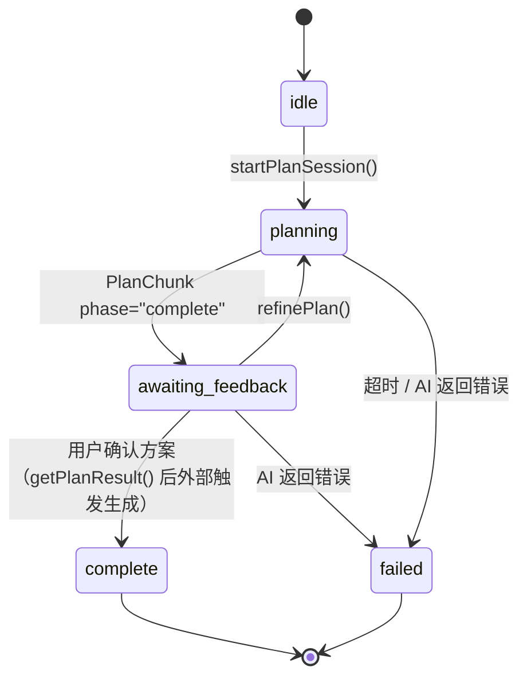

# M-05 SkillApp 生成器开发文档

> **版本**：v1.0 | **日期**：2026-03-13
> **状态**：开发文档，供 executor agent 在 Iter 3/5 中实现时直接使用
> **对应模块**：M-05 SkillApp 生成器

---

## 目录

1. [模块概述](#1-模块概述)
2. [完整文件结构](#2-完整文件结构)
3. [PlanSession 规范](#3-plansession-规范)
4. [GenerateSession 规范](#4-generatesession-规范)
5. [CompileFixer 规范](#5-compilefixer-规范)
6. [ModifySession 规范](#6-modifysession-规范)
7. [ModifyGenerate 规范](#7-modifygenerate-规范)
8. [会话生命周期](#8-会话生命周期)
9. [错误码定义](#9-错误码定义)
10. [测试要点](#10-测试要点)

---

## 1. 模块概述

### 职责

M-05 SkillApp 生成器承载从用户意图到可运行 SkillApp 的完整生成流水线，分三个阶段：

1. **规划阶段**：接收用户自然语言意图和选定的 Skill 列表，通过 M-04 AI Provider 通信层调用规划能力，支持多轮交互式方案调整，直至用户确认方案
2. **生成阶段**：用户确认方案后，调用 M-04 AI Provider 通信层的代码生成能力，产出完整的 Electron 应用源码，并驱动编译、打包流程
3. **增量修改阶段**：对已生成的 SkillApp 进行分析，生成增量修改方案，只对受影响的模块重新生成，并通过 M-06 热更新机制推送到运行中的 SkillApp

### 文件目录

```
src/main/modules/generator/
├── plan-session.ts       # 规划会话管理（多轮交互、历史累积）
├── generate-session.ts   # 生成会话管理（代码生成、进度上报）
├── compile-fixer.ts      # 编译错误自动修复循环
├── modify-session.ts     # 增量修改会话管理（分析现有代码、生成增量方案）
├── modify-generate.ts    # 增量生成执行（只生成受影响模块、热更新）
├── types.ts              # 模块内部类型定义
└── index.ts              # 公开接口导出
```

### 与 M-04 AI Provider 的关系

M-05 不直接访问任何 AI 后端（Claude API、OpenClaw 等），所有 AI 能力调用都通过 M-04 AI Provider 通信层的抽象接口进行：

- `planApp()` — 规划阶段调用，返回 `AsyncIterable<PlanChunk>`
- `generateCode()` — 生成阶段调用，返回 `AsyncIterable<GenProgressChunk>`
- `cancelSession()` — 取消正在进行的 AI 请求

这一设计确保 M-05 不关心底层 AI 实现，切换 Provider（Claude API → OpenClaw）时 M-05 代码无需改动。

---

## 2. 完整文件结构

### `types.ts` — 模块内部类型定义

定义 M-05 内部使用的会话状态、请求/结果类型，以及供外部使用的公开数据结构。详见各节规范中的类型定义。

### `plan-session.ts` — 规划会话管理器

**职责**：
- 创建和管理规划会话（`PlanSession`）
- 维护每个会话的多轮对话历史（`contextHistory`）
- 调用 M-04 `planApp()`，将流式 `PlanChunk` 通过 IPC 转发给渲染进程
- 在用户每次 `refinePlan()` 时将新一轮对话追加到历史，确保 Claude API 收到完整对话上下文

### `generate-session.ts` — 生成会话管理器

**职责**：
- 从 `PlanSession` 中读取已确认的 `PlanResult`
- 调用 M-04 `generateCode()`，消费 `GenProgressChunk` 流
- 将 Agent 工具调用事件映射为三段式进度（codegen 0-40% / compile 40-80% / bundle 80-100%）
- 将产物写入 `userData/apps/{appId}/`
- 生成完成后通知 M-03 注册新 App

### `compile-fixer.ts` — 编译错误修复器

**职责**：
- 捕获 tsc 编译错误，格式化为结构化的 `CompileError[]`
- 构造修复 prompt，通过 M-04 AI Provider 调用 Claude 修复代码
- 最多重试 3 次，超过限制后返回结构化的失败结果（含所有编译错误详情）

### `modify-session.ts` — 增量修改会话管理器

**职责**：
- 读取现有 SkillApp 的代码结构
- 调用 M-04 AI Provider 生成增量修改方案（`ModifyPlan`）
- 返回分类结果：新增（added）/ 修改（modified）/ 不变（unchanged）模块列表

### `modify-generate.ts` — 增量生成执行器

**职责**：
- 只对 `ModifyPlan.added` 和 `ModifyPlan.modified` 模块调用 M-04 AI Provider 重新生成
- 执行 tsc 增量编译
- 构造 `UpdatePackage`，调用 M-06 `applyHotUpdate()`

### `index.ts` — 公开接口导出

向外（M-01 桌面容器、IPC Handler）暴露 M-05 的全部公开方法：

```typescript
export { PlanSessionManager } from './plan-session';
export { GenerateSessionManager } from './generate-session';
export { ModifySessionManager } from './modify-session';
export type {
  StartPlanRequest,
  PlanResult,
  PlanModule,
  SkillUsageItem,
  ModifyPlan,
  ModuleChange,
  CompileError,
  CompileFixResult,
  GeneratorError,
} from './types';
```

---

## 3. PlanSession 规范

**文件**：`src/main/modules/generator/plan-session.ts`

### 状态机



### 接口定义

```typescript
interface PlanSessionManager {
  /**
   * 启动规划会话，调用 M-04 planApp()，流式返回规划方案
   * 同时通过 IPC 将 PlanChunk 转发给渲染进程
   */
  startPlanSession(request: StartPlanRequest): Promise<{ sessionId: string }>;

  /**
   * 在规划会话中追加用户反馈，调用 M-04 planApp() 继续规划
   * 必须将完整的 contextHistory（含本轮之前所有对话）传入 M-04
   */
  refinePlan(sessionId: string, feedback: string): Promise<void>;

  /**
   * 获取当前会话的规划结果（仅 awaiting_feedback 状态下可用）
   */
  getPlanResult(sessionId: string): Promise<PlanResult | null>;

  /**
   * 取消规划会话，调用 M-04 cancelSession()
   */
  cancelPlanSession(sessionId: string): void;
}
```

### StartPlanRequest 类型

```typescript
interface StartPlanRequest {
  /** 用户选择的 Skill ID 列表（至少 1 个） */
  skillIds: string[];

  /** 用户输入的自然语言意图描述 */
  intent: string;
}
```

### contextHistory 上下文历史管理

#### 数据结构

每个 `PlanSession` 内部维护一个消息历史数组，结构如下：

```typescript
interface ContextHistoryEntry {
  role: 'user' | 'assistant';
  content: string;
}

// 会话内部状态（不对外暴露）
interface PlanSessionState {
  sessionId: string;
  status: 'idle' | 'planning' | 'awaiting_feedback' | 'complete' | 'failed';
  request: StartPlanRequest;
  contextHistory: ContextHistoryEntry[];
  lastPlanResult: PlanResult | null;
  createdAt: number;
  lastActiveAt: number;
}
```

#### refinePlan 的历史累积规则

`refinePlan` 必须保证 Claude API 收到完整对话历史，实现如下：

```typescript
async refinePlan(sessionId: string, feedback: string): Promise<void> {
  const session = this.sessions.get(sessionId);
  if (!session) throw new GeneratorError('PLAN_SESSION_NOT_FOUND');

  // 1. 将用户新一轮反馈追加到历史
  session.contextHistory.push({ role: 'user', content: feedback });

  // 2. 调用 M-04，传入包含所有历史的 contextHistory
  const stream = await this.aiProvider.planApp({
    sessionId,
    intent: session.request.intent,
    skills: await this.skillManager.getSkillDetails(session.request.skillIds),
    contextHistory: session.contextHistory,  // 传入完整历史
  });

  // 3. 消费流式响应，累积 assistant 回复
  let assistantContent = '';
  for await (const chunk of stream) {
    assistantContent += chunk.content;
    // 通过 IPC 转发给渲染进程
    this.ipcBridge.sendToRenderer(
      `ai-provider:plan-chunk:${sessionId}`,
      chunk
    );
    if (chunk.phase === 'complete' && chunk.planDraft) {
      session.lastPlanResult = chunk.planDraft;
    }
  }

  // 4. 将 assistant 回复追加到历史，供下一轮使用
  session.contextHistory.push({ role: 'assistant', content: assistantContent });
  session.lastActiveAt = Date.now();
}
```

**关键规则**：
- `startPlanSession` 发起第一轮时，以用户 intent 作为第一条 `user` 消息，完成后将 assistant 回复追加
- 每次 `refinePlan` 先追加 `user` 消息，完成后追加 `assistant` 消息
- 传给 M-04 `planApp()` 的 `contextHistory` 字段包含当前轮之前的所有对话历史（不含当前轮的 user 消息，因为 intent/feedback 字段已经传入）

### PlanResult 类型

```typescript
interface PlanResult {
  /** 应用名称，如 "CSV 数据清洗工具" */
  appName: string;

  /** 应用简短描述（50-200字） */
  description: string;

  /**
   * 应用模块列表（对应页面/功能模块）
   * 每个模块对应生成时的一个独立文件单元
   */
  modules: PlanModule[];

  /**
   * Skill 使用映射：每个 Skill 在应用中的用途描述
   * key = skillId，value = 用途描述
   */
  skillUsage: SkillUsageItem[];

  /** 技术栈说明（由 AI 生成，如 ['React 18', 'TypeScript', 'Electron']） */
  techStack: string[];
}

interface PlanModule {
  /** 模块名称，如 "ImportPage" */
  name: string;

  /** 相对路径，如 "src/app/pages/ImportPage.jsx" */
  filePath: string;

  /** 模块的功能描述 */
  description: string;

  /** 该模块关联的 Skill ID 列表 */
  skillIds: string[];
}

interface SkillUsageItem {
  /** Skill ID */
  skillId: string;

  /** 该 Skill 在应用中的具体用途 */
  usage: string;
}
```

**字段含义**：
- `appName`：用于生成 `appId`（slugify 后加随机后缀）和 SkillApp 窗口标题
- `description`：展示在 SkillApp 管理中心的应用卡片描述
- `modules`：规划阶段产出的模块列表，生成阶段按此列表逐一生成代码文件
- `skillUsage`：用于展示在规划方案预览 UI 中，告知用户每个 Skill 的用途
- `techStack`：信息展示用，不影响生成逻辑（生成时技术栈由代码生成 prompt 约束）

### 流式输出 IPC 链路

`startPlanSession` 和 `refinePlan` 调用 M-04 `planApp()` 后，将 `PlanChunk` 转发到渲染进程的完整链路：

```
M-04 AI Provider (Claude API SSE)
  → PlanChunk (AsyncIterable)
  → M-05 PlanSessionManager (消费流)
  → ipcMain / event.sender.send(channel, chunk)
  → channel: "ai-provider:plan-chunk:{sessionId}"
  → 渲染进程 preload onPlanChunk 监听器
  → 生成窗口 UI 更新规划方案显示
```

完成信号通过 `ai-provider:plan-complete:{sessionId}` channel 发送。

---

## 4. GenerateSession 规范

**文件**：`src/main/modules/generator/generate-session.ts`

### 接口定义

```typescript
interface GenerateSessionManager {
  /**
   * 用户确认规划方案后，开始代码生成与打包
   * @param sessionId 规划阶段产生的 sessionId
   * @param appName 应用名称（用于生成 appId 和目录名）
   */
  confirmAndGenerate(sessionId: string, appName: string): Promise<void>;
}
```

### 生成流程

```
1. 从 PlanSessionManager 获取 PlanResult（调用 getPlanResult(sessionId)）
   └─ 若 PlanResult 为 null，抛出 GENERATION_FAILED 错误

2. 生成 appId（格式：slugify(appName) + '-' + nanoid(6)，如 csv-data-cleaner-a1b2c3）

3. 确定 targetDir（路径：app.getPath('userData') + '/apps/' + appId + '/'）
   └─ 创建目录（mkdir -p）

4. 调用 M-04 generateCode(request)，其中：
   request = {
     sessionId,
     plan: planResult,
     appId,
     targetDir,
     mode: 'full',
   }

5. 消费 GenProgressChunk 流，映射进度并通过 IPC 转发：

   write_file 工具调用事件   → stage: 'codegen', percent: 0-40%
   run_command tsc 事件      → stage: 'compile', percent: 40-80%
   run_command bundle 事件   → stage: 'bundle',  percent: 80-100%
   phase: 'done'             → stage: 'done',    percent: 100%

6. 生成完成后，调用 M-03 registerApp()：
   registerApp({
     appId,
     meta: buildAppMeta(planResult, appId, targetDir),
     path: targetDir,
   })

7. 通过 IPC channel "ai-provider:gen-complete:{sessionId}" 通知渲染进程生成完成
```

### targetDir 路径规范

```
userData/
└── apps/
    └── {appId}/              ← targetDir，如 csv-data-cleaner-a1b2c3/
        ├── package.json
        ├── main.js
        ├── preload.js
        ├── manifest.json
        ├── src/
        ├── dist/
        └── .skillapp/
```

`userData` 通过 `app.getPath('userData')` 获取，跨平台兼容（macOS: `~/Library/Application Support/IntentOS/`，Windows: `%AppData%\IntentOS\`）。

### 进度上报 IPC channel

每个 `GenProgressChunk` 通过以下 channel 转发给渲染进程：

```
"ai-provider:gen-progress:{sessionId}"
```

完成信号通过以下 channel 发送：

```
"ai-provider:gen-complete:{sessionId}"
```

进度映射表：

| GenProgressChunk 事件 | 映射阶段 | 进度范围 |
|-----------------------|---------|---------|
| `write_file` 工具调用（每次 +N%） | `codegen` | 0% → 40% |
| `run_command tsc` 触发 | `compile` | 40% → 80% |
| `run_command bundle` 触发 | `bundle` | 80% → 100% |
| `phase: 'done'` | `done` | 100% |

进度计算逻辑：codegen 阶段按已生成文件数 / 计划文件总数线性插值（总数来自 `PlanResult.modules.length`）；compile 和 bundle 阶段由 Agent 工具调用的子进度决定。

---

## 5. CompileFixer 规范

**文件**：`src/main/modules/generator/compile-fixer.ts`

### 接口定义

```typescript
interface CompileFixer {
  /**
   * 尝试修复编译错误
   * @param appDir SkillApp 根目录（targetDir）
   * @param errors 当前编译错误列表
   * @param provider M-04 AI Provider 实例（已初始化）
   * @returns 修复结果（成功或失败，含剩余错误）
   */
  tryFix(
    appDir: string,
    errors: CompileError[],
    provider: AIProvider
  ): Promise<CompileFixResult>;
}

interface CompileFixResult {
  /** 是否修复成功（最终编译通过） */
  success: boolean;

  /** 实际尝试次数（1-3） */
  attempts: number;

  /** 修复失败时，最后一次编译的错误列表 */
  finalErrors?: CompileError[];
}
```

### CompileError 类型

```typescript
interface CompileError {
  /** 出错文件的相对路径，如 'src/app/pages/ImportPage.tsx' */
  file: string;

  /** 出错行号（1-based） */
  line: number;

  /** 出错列号（1-based） */
  column: number;

  /** TypeScript 错误消息 */
  message: string;

  /** TypeScript 错误码，如 'TS2345' */
  code: string;
}
```

### 修复循环实现

```typescript
async tryFix(
  appDir: string,
  errors: CompileError[],
  provider: AIProvider
): Promise<CompileFixResult> {
  const MAX_RETRIES = 3;
  let currentErrors = errors;

  for (let attempt = 1; attempt <= MAX_RETRIES; attempt++) {
    // 1. 格式化错误信息为人类可读文本
    const errorText = formatErrors(currentErrors);
    // 格式：
    // src/app/pages/ImportPage.tsx(12,5): error TS2345: Argument of type...
    // src/app/services/dataService.ts(8,3): error TS2304: Cannot find name...

    // 2. 读取出错文件的当前内容
    const fileContents = await readErrorFiles(appDir, currentErrors);

    // 3. 构造修复 prompt
    const fixPrompt = buildFixPrompt(errorText, fileContents);

    // 4. 调用 M-04 AI Provider（使用 planApp 的流式接口进行单轮修复）
    const fixedFiles = await requestFix(provider, fixPrompt, appDir);

    // 5. 将修复后的文件写回磁盘
    await writeFixedFiles(appDir, fixedFiles);

    // 6. 重新执行 tsc 编译
    const compileResult = await runTsc(appDir);

    if (compileResult.success) {
      return { success: true, attempts: attempt };
    }

    currentErrors = compileResult.errors;

    // 第 3 次失败后不再重试，直接返回
    if (attempt === MAX_RETRIES) {
      return {
        success: false,
        attempts: MAX_RETRIES,
        finalErrors: currentErrors,
      };
    }
  }

  // 不应到达此处，但 TypeScript 要求明确返回
  return { success: false, attempts: MAX_RETRIES, finalErrors: currentErrors };
}
```

### 错误格式化规则

`formatErrors()` 将 `CompileError[]` 格式化为 tsc 标准错误格式：

```
{file}({line},{column}): error {code}: {message}
```

示例：
```
src/app/pages/ImportPage.tsx(12,5): error TS2345: Argument of type 'string' is not assignable to parameter of type 'number'.
src/app/services/dataService.ts(8,3): error TS2304: Cannot find name 'cleanData'.
```

格式化时必须包含精确的文件名、行号、列号和错误码，确保 Claude 能够定位并修复正确的位置。

---

## 6. ModifySession 规范

**文件**：`src/main/modules/generator/modify-session.ts`

### 接口定义

```typescript
interface ModifySessionManager {
  /**
   * 启动增量修改会话，分析现有代码并生成增量方案
   * @param appId 目标 SkillApp 的 appId
   * @param requirement 用户的修改需求描述
   * @returns 会话 ID
   */
  startModifySession(
    appId: string,
    requirement: string
  ): Promise<{ sessionId: string }>;

  /**
   * 用户确认增量方案后，开始增量生成
   */
  confirmAndApplyModify(sessionId: string): Promise<void>;

  /**
   * 取消增量修改会话
   */
  cancelModifySession(sessionId: string): void;
}
```

### 增量分析流程

```
1. 读取现有 SkillApp 代码结构
   ├─ 读取 {appDir}/manifest.json → 获取 appId、版本、skillIds、权限声明
   └─ 扫描 {appDir}/src/app/ 目录 → 获取所有源文件路径和内容摘要

2. 构建现有代码上下文（用于传给 AI Provider）：
   existingContext = {
     manifest: { appId, version, skillIds, description },
     files: [
       { path: 'src/app/pages/ImportPage.tsx', firstLines: '...' },
       { path: 'src/app/services/dataService.ts', firstLines: '...' },
       ...
     ]
   }

3. 调用 M-04 planApp()（增量规划），传入：
   {
     sessionId,
     intent: requirement,             // 用户修改需求
     skills: updatedSkillList,         // 修改后可能涉及的 Skill 列表
     contextHistory: [
       {
         role: 'user',
         content: buildModifyContext(existingContext, requirement)
         // 包含现有代码结构描述 + 修改需求
       }
     ]
   }

4. 解析 AI 返回的 ModifyPlan：
   ├─ added：新增文件列表（含路径和功能描述）
   ├─ modified：需修改的文件列表（含路径和修改描述）
   └─ unchanged：不变的文件路径列表

5. 将 ModifyPlan 存入会话状态，等待用户确认
```

### ModifyPlan 类型

```typescript
interface ModifyPlan {
  /** 修改会话 ID */
  sessionId: string;

  /** 新增的模块列表 */
  added: ModuleChange[];

  /** 需修改的模块列表 */
  modified: ModuleChange[];

  /**
   * 不变的文件路径列表（相对于 appDir）
   * 展示给用户看，明确哪些部分不受影响
   */
  unchanged: string[];
}

interface ModuleChange {
  /** 文件相对路径，如 'src/app/pages/SchedulePage.tsx' */
  filePath: string;

  /**
   * 变更描述（展示给用户）
   * 如 "新增调度配置页面，支持设置定时任务参数"
   */
  description: string;

  /**
   * 文件新内容（confirmation 后由 ModifyGenerate 填充）
   * startModifySession 返回时此字段为 undefined
   * confirmAndApplyModify 执行时填充
   */
  content?: string;
}
```

---

## 7. ModifyGenerate 规范

**文件**：`src/main/modules/generator/modify-generate.ts`

### 增量生成策略

只对 `ModifyPlan.added` 和 `ModifyPlan.modified` 中的模块调用 M-04 AI Provider 重新生成。`unchanged` 列表中的文件不触发任何 AI Provider 调用，直接保留原文件。

```
ModifyPlan
├─ added[]    → 逐一调用 M-04 generateCode(mode: 'incremental') 生成新文件
├─ modified[] → 逐一调用 M-04 generateCode(mode: 'incremental') 生成修改后内容
└─ unchanged  → 直接跳过，不调用 M-04，不写文件
```

### 增量生成流程

```typescript
async function runModifyGenerate(
  modifyPlan: ModifyPlan,
  appDir: string,
  provider: AIProvider,
  sessionId: string
): Promise<void> {
  const changedModules = [...modifyPlan.added, ...modifyPlan.modified];

  // 1. 逐一生成受影响的模块（不变模块不触发 AI 调用）
  for (const module of changedModules) {
    const stream = provider.generateCode({
      sessionId,
      plan: buildSingleModulePlan(module),
      appId: modifyPlan.sessionId,
      targetDir: appDir,
      mode: 'incremental',
    });

    // 消费流，写文件
    for await (const chunk of stream) {
      sendProgressToRenderer(sessionId, chunk);
    }
  }

  // 2. tsc 增量编译（只编译受影响文件）
  const compileResult = await runTscIncremental(appDir, changedModules.map(m => m.filePath));

  if (!compileResult.success) {
    // 进入 CompileFixer 修复循环
    const fixer = new CompileFixer();
    const fixResult = await fixer.tryFix(appDir, compileResult.errors, provider);
    if (!fixResult.success) {
      throw new GeneratorError('COMPILE_MAX_RETRIES_EXCEEDED', {
        finalErrors: fixResult.finalErrors,
      });
    }
  }

  // 3. 构造 UpdatePackage
  const updatePackage = buildUpdatePackage(modifyPlan, appDir);

  // 4. 调用 M-06 applyHotUpdate()
  await m06Runtime.applyHotUpdate(modifyPlan.sessionId.split(':')[0], updatePackage);
}
```

### UpdatePackage 构造

`UpdatePackage` 的 `changedFiles` 和 `addedFiles` 分别对应 `ModifyPlan.modified` 和 `ModifyPlan.added`：

```typescript
function buildUpdatePackage(modifyPlan: ModifyPlan, appDir: string): UpdatePackage {
  return {
    appId: extractAppId(modifyPlan),
    fromVersion: readCurrentVersion(appDir),
    toVersion: bumpVersion(readCurrentVersion(appDir)),
    timestamp: Date.now(),
    changedFiles: modifyPlan.modified.map(m => ({
      path: m.filePath,
      content: Buffer.from(m.content ?? '').toString('base64'),
      hash: sha256(m.content ?? ''),
    })),
    addedFiles: modifyPlan.added.map(m => ({
      path: m.filePath,
      content: Buffer.from(m.content ?? '').toString('base64'),
      hash: sha256(m.content ?? ''),
    })),
    deletedFiles: [],   // 增量修改阶段不删除文件（当前版本不支持删除模块）
    checksum: computePackageChecksum(modifyPlan),
    description: `增量更新：新增 ${modifyPlan.added.length} 个模块，修改 ${modifyPlan.modified.length} 个模块`,
  };
}
```

---

## 8. 会话生命周期

### sessionId 生成规范

所有会话（PlanSession、ModifySession）的 `sessionId` 使用 UUID v4 生成：

```typescript
import { randomUUID } from 'crypto';

const sessionId = randomUUID();
// 示例：'9b1deb4d-3b7d-4bad-9bdd-2b0d7b3dcb6d'
```

UUID v4 由 Node.js 标准库 `crypto.randomUUID()` 生成，无需额外依赖。

### 内存存储结构

所有会话存储在各自管理器的 `Map` 中，不持久化到磁盘（会话是临时状态）：

```typescript
// PlanSessionManager 内部
private sessions: Map<string, PlanSessionState> = new Map();

// ModifySessionManager 内部
private sessions: Map<string, ModifySessionState> = new Map();
```

### 会话超时清理

超过 30 分钟无操作的 session 自动清理：

```typescript
private readonly SESSION_TIMEOUT_MS = 30 * 60 * 1000; // 30 分钟

// 在 constructor 中启动定时清理任务（每 5 分钟扫描一次）
private startCleanupTimer(): void {
  setInterval(() => {
    const now = Date.now();
    for (const [sessionId, session] of this.sessions.entries()) {
      if (now - session.lastActiveAt > this.SESSION_TIMEOUT_MS) {
        // 取消正在进行的 AI 请求
        this.aiProvider.cancelSession(sessionId).catch(() => {});
        this.sessions.delete(sessionId);
      }
    }
  }, 5 * 60 * 1000); // 每 5 分钟运行一次
}
```

`lastActiveAt` 在以下操作时更新：`startPlanSession()`、`refinePlan()`、`getPlanResult()`、`startModifySession()`、`confirmAndApplyModify()`。

---

## 9. 错误码定义

M-05 模块内部使用 `GeneratorError` 类封装所有错误：

```typescript
class GeneratorError extends Error {
  constructor(
    public readonly code: GeneratorErrorCode,
    public readonly context?: Record<string, unknown>
  ) {
    super(`[M-05] ${code}`);
    this.name = 'GeneratorError';
  }
}

type GeneratorErrorCode =
  | 'PLAN_SESSION_NOT_FOUND'         // 规划会话不存在（sessionId 无效）
  | 'PLAN_SESSION_EXPIRED'           // 规划会话已超时清理
  | 'PLAN_SESSION_WRONG_STATE'       // 会话状态不允许当前操作（如在 planning 状态下调用 getPlanResult）
  | 'GENERATION_FAILED'              // 代码生成过程中发生不可恢复的错误
  | 'COMPILE_MAX_RETRIES_EXCEEDED'   // 编译修复达到最大重试次数（context 中含 finalErrors: CompileError[]）
  | 'MODIFY_SESSION_NOT_FOUND'       // 增量修改会话不存在
  | 'MODIFY_SESSION_EXPIRED'         // 增量修改会话已超时清理
  | 'MODIFY_SESSION_WRONG_STATE'     // 修改会话状态不允许当前操作
  | 'APP_DIR_NOT_FOUND'              // 目标 SkillApp 目录不存在（修改时）
  | 'PLAN_RESULT_MISSING';           // 尝试 confirmAndGenerate 时规划结果为 null
```

### 错误上报规则

- `COMPILE_MAX_RETRIES_EXCEEDED`：`context.finalErrors` 必须包含最后一次编译的完整 `CompileError[]`，供 UI 展示给用户或写入日志
- `PLAN_SESSION_NOT_FOUND` vs `PLAN_SESSION_EXPIRED`：区分两种情况，便于 UI 给出不同提示（"会话不存在" vs "会话已超时，请重新开始"）
- 所有错误通过 IPC 返回给渲染进程，渲染进程根据 `code` 字段展示对应的错误提示

---

## 10. 测试要点

测试文件位置：`src/main/modules/generator/__tests__/`

### 10.1 多轮 refinePlan 后 contextHistory 累积正确性

**目标**：验证每次 `refinePlan` 后，传递给 M-04 `planApp()` 的 `contextHistory` 包含所有历史轮次的完整对话。

```typescript
it('应在 3 轮 refinePlan 后保留完整的 6 条历史记录', async () => {
  // 捕获每次调用 planApp 时的 contextHistory 参数
  const capturedHistories: ContextHistoryEntry[][] = [];
  mockProvider.planApp = vi.fn().mockImplementation((req) => {
    capturedHistories.push([...req.contextHistory]);
    return mockPlanStream('complete');
  });

  const manager = new PlanSessionManager(mockProvider, mockSkillManager, mockIpc);
  const { sessionId } = await manager.startPlanSession({
    skillIds: ['data-cleaner'],
    intent: '我需要一个 CSV 清洗工具',
  });

  // 第一轮：startPlanSession 时 contextHistory 为空（intent 作为独立字段传入）
  expect(capturedHistories[0]).toHaveLength(0);

  await manager.refinePlan(sessionId, '需要支持批量处理');
  // 第二轮：contextHistory 包含第一轮的 user + assistant
  expect(capturedHistories[1]).toHaveLength(2);
  expect(capturedHistories[1][0].role).toBe('user');
  expect(capturedHistories[1][1].role).toBe('assistant');

  await manager.refinePlan(sessionId, '还需要进度显示');
  // 第三轮：contextHistory 包含前两轮共 4 条记录
  expect(capturedHistories[2]).toHaveLength(4);
});
```

### 10.2 编译错误修复：mock 失败 3 次，验证第 3 次后不再重试

**目标**：验证 `CompileFixer` 在 3 次尝试全部失败后，返回 `COMPILE_MAX_RETRIES_EXCEEDED` 并包含最终错误列表，不发起第 4 次修复请求。

```typescript
it('应在 3 次失败后停止重试并返回结构化错误', async () => {
  let callCount = 0;
  // mock tsc 始终返回编译错误
  mockRunTsc.mockResolvedValue({
    success: false,
    errors: [
      { file: 'src/app/App.tsx', line: 5, column: 3, message: 'Type error', code: 'TS2345' }
    ],
  });
  // mock AI Provider 始终返回（但修复无效）
  mockProvider.planApp = vi.fn().mockImplementation(() => {
    callCount++;
    return mockFixStream();
  });

  const fixer = new CompileFixer();
  const result = await fixer.tryFix(appDir, initialErrors, mockProvider);

  expect(result.success).toBe(false);
  expect(result.attempts).toBe(3);
  expect(result.finalErrors).toHaveLength(1);
  expect(result.finalErrors![0].code).toBe('TS2345');
  // 验证 AI Provider 恰好被调用了 3 次，不多不少
  expect(callCount).toBe(3);
});
```

### 10.3 增量修改：只有 added/modified 模块触发 AI Provider 调用

**目标**：验证 `ModifyGenerate` 不对 `unchanged` 列表中的文件调用 M-04 `generateCode()`。

```typescript
it('unchanged 模块不应触发任何 AI Provider 调用', async () => {
  const modifyPlan: ModifyPlan = {
    sessionId: 'test-session',
    added: [{ filePath: 'src/app/pages/NewPage.tsx', description: '新增页面' }],
    modified: [{ filePath: 'src/app/App.tsx', description: '更新路由' }],
    unchanged: ['src/app/pages/ImportPage.tsx', 'src/app/services/dataService.ts'],
  };

  const generateCodeSpy = vi.spyOn(mockProvider, 'generateCode');

  await runModifyGenerate(modifyPlan, appDir, mockProvider, 'test-session');

  // AI Provider 只被调用 2 次（1 added + 1 modified）
  expect(generateCodeSpy).toHaveBeenCalledTimes(2);

  // 验证调用的文件路径只包含 added 和 modified，不包含 unchanged
  const calledPaths = generateCodeSpy.mock.calls.map(
    call => call[0].plan.modules[0]?.filePath
  );
  expect(calledPaths).toContain('src/app/pages/NewPage.tsx');
  expect(calledPaths).toContain('src/app/App.tsx');
  expect(calledPaths).not.toContain('src/app/pages/ImportPage.tsx');
  expect(calledPaths).not.toContain('src/app/services/dataService.ts');
});
```

### 10.4 进度映射：write_file 事件正确映射为 0-40% 进度

**目标**：验证 `GenerateSessionManager` 将 `write_file` 工具调用事件正确映射到 `codegen` 阶段的 0-40% 区间。

```typescript
it('write_file 事件应映射为 codegen 阶段 0-40% 进度', async () => {
  const planResult = mockPlanResult({ modulesCount: 4 }); // 4 个模块
  const capturedProgress: GenProgress[] = [];

  // Mock IPC 发送，捕获进度
  mockIpc.sendToRenderer = vi.fn().mockImplementation((channel, chunk) => {
    if (channel.startsWith('ai-provider:gen-progress:')) {
      capturedProgress.push(chunk);
    }
  });

  // Mock generateCode 返回 4 个 write_file 事件
  mockProvider.generateCode = vi.fn().mockImplementation(async function* () {
    for (let i = 1; i <= 4; i++) {
      yield {
        sessionId: 'test-session',
        phase: 'codegen',
        percent: (i / 4) * 40,       // 10%, 20%, 30%, 40%
        message: `正在生成文件 ${i}/4`,
        filesGenerated: [`src/app/pages/Page${i}.tsx`],
      };
    }
    yield { sessionId: 'test-session', phase: 'done', percent: 100, message: '生成完成' };
  });

  const manager = new GenerateSessionManager(mockProvider, mockPlanManager, mockM03, mockIpc);
  await manager.confirmAndGenerate('test-session', '测试应用');

  // 验证 codegen 阶段的进度在 0-40% 之间
  const codegenProgress = capturedProgress.filter(p => p.stage === 'codegen');
  expect(codegenProgress).toHaveLength(4);
  codegenProgress.forEach(p => {
    expect(p.percent).toBeGreaterThanOrEqual(0);
    expect(p.percent).toBeLessThanOrEqual(40);
  });
});
```

### 10.5 会话超时清理

**目标**：验证超过 30 分钟无操作的 session 被自动清理，并在清理时取消正在进行的 AI 请求。

```typescript
it('超过 30 分钟无操作的 session 应被自动清理', async () => {
  vi.useFakeTimers();
  const manager = new PlanSessionManager(mockProvider, mockSkillManager, mockIpc);
  const { sessionId } = await manager.startPlanSession(mockRequest);

  // 快进 31 分钟
  vi.advanceTimersByTime(31 * 60 * 1000);

  // 清理后，访问该 session 应抛出 PLAN_SESSION_EXPIRED
  await expect(manager.getPlanResult(sessionId))
    .rejects.toMatchObject({ code: 'PLAN_SESSION_EXPIRED' });

  vi.useRealTimers();
});
```

---

## 相关文档

- [`docs/idea.md`](../idea.md) — 核心设计理念、生成流程、修改流程
- [`docs/modules.md`](../modules.md) — M-05 模块接口定义（第 5 节）、跨模块协作流程（第 5 节流程一、流程二）
- [`docs/spec/ai-provider-spec.md`](../spec/ai-provider-spec.md) — AIProvider 接口（`planApp`、`generateCode`）、PlanChunk / GenProgressChunk 类型、IPC channel 命名规范
- [`docs/spec/skillapp-spec.md`](../spec/skillapp-spec.md) — SkillApp 目录结构、UpdatePackage 格式、热更新 `applyHotUpdate()` 接口
- [`docs/dev-docs/shared-types.md`](./shared-types.md) — `PlanResult`、`GenProgress`、`UpdatePackage` 等共享类型定义

---

## 变更记录

| 版本 | 日期 | 主要变更 |
|------|------|---------|
| 1.0 | 2026-03-13 | 初始文档，覆盖 PlanSession / GenerateSession / CompileFixer / ModifySession / ModifyGenerate 完整规范 |
