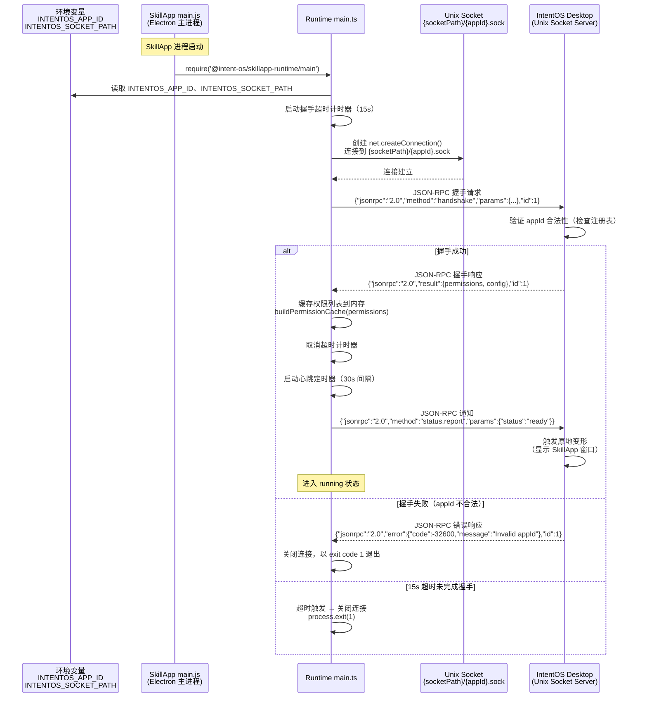
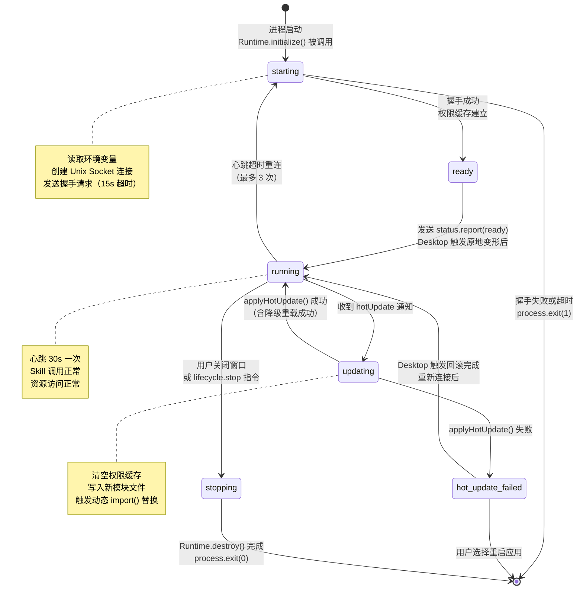

# M-06 SkillApp Runtime 开发文档

> **版本**：v1.0 | **日期**：2026-03-13
> **状态**：正式文档 | **对应模块**：M-06 SkillApp 运行时

---

## 1. 模块概述

### 1.1 职责

M-06 SkillApp Runtime 是内嵌在每个 SkillApp 进程中的运行时库，负责：

- **Unix Socket 握手**：SkillApp 启动后连接到 IntentOS Desktop 的 Unix Socket 服务端，完成 JSON-RPC 握手，获取权限列表和配置信息
- **权限缓存**：握手时将已授权权限列表缓存在内存中，本地命中即返回，减少跨进程调用
- **Skill 调用桥接**：将渲染进程的 `window.intentOS.callSkill()` 调用，通过 Electron IPC → Unix Socket 转发到 Desktop 的 M-04 AI Provider 通信层
- **MCP 资源访问代理**：将渲染进程的资源访问请求经 Desktop 中转到 MCP Server
- **热更新接收**：监听 Desktop 推送的 `hotUpdate` JSON-RPC 通知，触发 `applyHotUpdate()` 完成模块热替换
- **状态同步**：定期心跳、状态上报，保持与 Desktop 的生命周期同步

### 1.2 边界（不做什么）

- **不负责 SkillApp 的代码生成和编译**：由 M-05 SkillApp 生成器负责
- **不负责 SkillApp 的 UI 设计**：UI 由 M-05 生成器产出
- **不负责 Skill 的安装和管理**：由 M-02 Skill 管理器负责
- **不直接访问 MCP Server**：所有 MCP 访问经 Desktop 代理中转
- **不自行启动进程**：进程启动由 M-03 生命周期管理器负责

### 1.3 包路径与分发形式

Runtime 以 npm 包形式分发，包名为 `@intent-os/skillapp-runtime`，由 M-05 生成器在产出代码时自动写入 SkillApp 的 `package.json` 依赖。

```
packages/skillapp-runtime/
├── src/
│   ├── main.ts           # 主进程侧：Unix Socket 连接、握手、权限缓存、热更新接收
│   ├── renderer.ts       # 渲染进程侧：contextBridge 暴露给业务代码的 API
│   └── types.ts          # 共享 TypeScript 类型定义
├── dist/                 # 编译产物
│   ├── main.js
│   ├── renderer.js
│   └── types.d.ts
├── package.json
└── tsconfig.json
```

**文件职责说明**：

| 文件 | 运行位置 | 职责 |
|------|----------|------|
| `main.ts` | SkillApp Electron 主进程 | Unix Socket 连接管理、握手、权限缓存、Skill 调用转发、热更新接收、心跳、状态上报 |
| `renderer.ts` | SkillApp preload 脚本 | 通过 `contextBridge` 将 Runtime API 安全暴露到渲染进程 |
| `types.ts` | 共享 | 所有 TypeScript 接口和类型定义（主进程和渲染进程均引用） |

---

## 2. Runtime 初始化握手时序

SkillApp 启动后必须完成握手才能进入正常运行状态。Desktop 负责创建 Unix Socket 服务端，Runtime 作为客户端主动连接。



**关键约束**：
- Desktop 在 M-03 调用 `launchApp()` 前必须已创建 Unix Socket 监听端点
- SkillApp 从环境变量读取 `INTENTOS_APP_ID` 和 `INTENTOS_SOCKET_PATH`，不从命令行参数读取（防止进程列表泄露）
- 握手超时为 **15 秒**，超时后 `process.exit(1)`，M-03 检测到异常退出后触发崩溃处理

---

## 3. 握手消息格式（JSON-RPC 2.0）

### 3.1 握手请求（SkillApp → Desktop）

```json
{
  "jsonrpc": "2.0",
  "method": "handshake",
  "params": {
    "appId": "csv-data-cleaner-a1b2c3",
    "version": "1.0.0",
    "runtimeVersion": "1.0.0",
    "pid": 12345,
    "electronVersion": "33.0.0"
  },
  "id": 1
}
```

**params 字段说明**：

| 字段 | 类型 | 必填 | 说明 |
|------|------|------|------|
| `appId` | string | 是 | SkillApp 唯一标识，从环境变量 `INTENTOS_APP_ID` 读取 |
| `version` | string | 是 | SkillApp 版本号（来自 manifest.json） |
| `runtimeVersion` | string | 是 | Runtime 包自身版本号（来自 package.json） |
| `pid` | number | 是 | SkillApp 进程 PID，用于 Desktop 端进程追踪 |
| `electronVersion` | string | 否 | 运行的 Electron 版本，用于兼容性检查 |

### 3.2 握手响应（Desktop → SkillApp）

```json
{
  "jsonrpc": "2.0",
  "result": {
    "permissions": [
      {
        "resourceType": "fs",
        "resourcePath": "/Users/jimmy/Documents",
        "action": "read",
        "grantedAt": "2026-03-13T10:00:00Z",
        "persistent": true
      }
    ],
    "config": {
      "heartbeatInterval": 30000,
      "skillCallTimeout": 10000,
      "resourceAccessTimeout": 10000
    }
  },
  "id": 1
}
```

**result 字段说明**：

| 字段 | 类型 | 说明 |
|------|------|------|
| `permissions` | PermissionEntry[] | 已授权权限列表，Runtime 初始化时缓存到内存 |
| `config.heartbeatInterval` | number | 心跳间隔（ms），默认 30000 |
| `config.skillCallTimeout` | number | Skill 调用超时（ms），默认 10000 |
| `config.resourceAccessTimeout` | number | 资源访问超时（ms），默认 10000 |

### 3.3 握手失败响应

```json
{
  "jsonrpc": "2.0",
  "error": {
    "code": -32600,
    "message": "Invalid appId: csv-data-cleaner-a1b2c3 not found in registry"
  },
  "id": 1
}
```

---

## 4. Runtime main.ts API 接口

`main.ts` 运行在 SkillApp 的 Electron **主进程**中，负责 Unix Socket 通信和所有跨进程协调。

```typescript
interface RuntimeMain {
  /**
   * 初始化运行时：读取环境变量、创建 Unix Socket 连接、完成握手、缓存权限
   * 握手超时 15s，超时后 process.exit(1)
   * @throws RuntimeError.SOCKET_CONNECT_FAILED | HANDSHAKE_TIMEOUT | HANDSHAKE_REJECTED
   */
  initialize(): Promise<void>;

  /**
   * 调用 Skill：通过 Unix Socket 向 Desktop 发送 skill.call 请求
   * @param skillId Skill 唯一标识（格式：name@version）
   * @param method Skill 暴露的方法名
   * @param params 调用参数
   * @returns Skill 执行结果
   * @throws RuntimeError.SKILL_CALL_TIMEOUT | SKILL_EXECUTION_ERROR
   */
  callSkill(skillId: string, method: string, params: unknown): Promise<unknown>;

  /**
   * 访问资源：先查权限缓存，命中则直接转发到 Desktop，未命中则请求授权
   * @param request 资源访问请求描述
   * @returns 资源访问结果
   * @throws RuntimeError.PERMISSION_DENIED | RESOURCE_ACCESS_TIMEOUT
   */
  accessResource(request: ResourceRequest): Promise<ResourceResult>;

  /**
   * 请求权限：向 Desktop 发起权限授权请求（弹出用户确认弹窗）
   * @param request 权限请求描述
   * @returns 授权结果（granted/denied/deferred）
   */
  requestPermission(request: PermissionRequest): Promise<PermissionResult>;

  /**
   * 上报运行状态：向 Desktop 发送 status.report 通知
   * @param status 当前状态
   */
  reportStatus(status: AppRuntimeStatus): Promise<void>;

  /**
   * 注册热更新处理器：当 Desktop 推送 hotUpdate 通知时触发
   * @param handler 热更新处理函数，接收 UpdatePackage 并返回应用结果
   */
  onHotUpdate(handler: (pkg: UpdatePackage) => void): void;

  /**
   * 销毁运行时：关闭 Unix Socket 连接、停止心跳、清理资源
   * 在 app.on('window-all-closed') 中调用
   */
  destroy(): void;
}
```

### 4.1 RuntimeMain 实现说明

- `initialize()` 必须在 `app.whenReady()` 中、创建 `BrowserWindow` 之前调用
- `callSkill()` 等方法在内部使用 UUID 作为 JSON-RPC `id`，通过 `Map<id, PendingCall>` 管理挂起的请求，超时后自动 reject
- `destroy()` 必须在进程退出前调用，确保 Desktop 能正确更新 SkillApp 状态

---

## 5. Runtime renderer.ts API

`renderer.ts` 运行在 SkillApp 的 **preload 脚本**中，通过 `contextBridge` 将 Runtime 能力安全暴露到渲染进程（业务代码）。

### 5.1 暴露给业务代码的接口

```typescript
// 通过 contextBridge.exposeInMainWorld('intentOS', ...) 暴露
interface RuntimeAPI {
  /**
   * 调用 Skill
   * 渲染进程业务代码直接调用：window.intentOS.callSkill(...)
   */
  callSkill(skillId: string, method: string, params: unknown): Promise<unknown>;

  /**
   * 访问宿主 OS 资源（文件系统、网络、进程）
   */
  accessResource(request: ResourceRequest): Promise<ResourceResult>;

  /**
   * 请求权限（触发 Desktop 弹出授权弹窗）
   */
  requestPermission(request: PermissionRequest): Promise<PermissionResult>;
}
```

### 5.2 renderer.ts 与 main.ts 的通信方式

`renderer.ts`（preload 中）不能直接访问 `main.ts` 的内存对象，二者通过 **Electron IPC** 通信：

```
渲染进程业务代码
  │ window.intentOS.callSkill(...)
  ▼
renderer.ts（preload）
  │ ipcRenderer.invoke('runtime:callSkill', { skillId, method, params })
  ▼
main.ts（主进程 ipcMain.handle）
  │ JSON-RPC over Unix Socket
  ▼
IntentOS Desktop
```

**renderer.ts 实现模板**：

```typescript
// renderer.ts — 在 preload 脚本中引入
import { contextBridge, ipcRenderer } from 'electron';

contextBridge.exposeInMainWorld('intentOS', {
  callSkill: (skillId: string, method: string, params: unknown) =>
    ipcRenderer.invoke('runtime:callSkill', { skillId, method, params }),

  accessResource: (request: ResourceRequest) =>
    ipcRenderer.invoke('runtime:accessResource', request),

  requestPermission: (request: PermissionRequest) =>
    ipcRenderer.invoke('runtime:requestPermission', request),
});
```

**main.ts 中对应的 IPC handler 注册**：

```typescript
// main.ts initialize() 内部注册
ipcMain.handle('runtime:callSkill', async (_, args) => {
  return runtime.callSkill(args.skillId, args.method, args.params);
});

ipcMain.handle('runtime:accessResource', async (_, request) => {
  return runtime.accessResource(request);
});

ipcMain.handle('runtime:requestPermission', async (_, request) => {
  return runtime.requestPermission(request);
});
```

---

## 6. 权限缓存规范

### 6.1 缓存结构

Runtime 在握手时从 Desktop 获取已授权权限列表，以内存 `Map` 缓存，避免每次资源访问都经过 Unix Socket 请求。

```typescript
// 缓存 key 生成规则：${resourceType}:${resourcePath}:${action}
type PermissionCacheKey = string; // 示例："fs:/Users/jimmy/Documents:read"

interface PermissionEntry {
  resourceType: 'fs' | 'net' | 'process';
  resourcePath: string;           // 具体路径或域名，如 "/Users/jimmy/Documents"
  action: 'read' | 'write' | 'execute' | 'connect';
  grantedAt: string;              // ISO 8601 时间戳
  persistent: boolean;            // 是否持久化（false 表示仅本次会话有效）
}

// 内存缓存：Map<resourceKey, PermissionEntry>
const permissionCache = new Map<PermissionCacheKey, PermissionEntry>();
```

### 6.2 resourceKey 生成规则

```typescript
function buildResourceKey(
  resourceType: string,
  resourcePath: string,
  action: string
): PermissionCacheKey {
  return `${resourceType}:${resourcePath}:${action}`;
}

// 示例：
// buildResourceKey('fs', '/Users/jimmy/Documents', 'read')
// → "fs:/Users/jimmy/Documents:read"
//
// buildResourceKey('net', 'api.example.com', 'connect')
// → "net:api.example.com:connect"
```

### 6.3 accessResource 缓存查询流程

```
accessResource(request) 被调用
    │
    ▼
buildResourceKey(request.type, request.path, request.action)
    │
    ▼
查询 permissionCache.has(resourceKey)？
    │
    ├─ 命中（true）→ 直接通过 Unix Socket 发送 resource.access 请求
    │               （权限已确认，无需再次授权，直接执行访问）
    │
    └─ 未命中（false）→ 发送 permission.request 请求 → 弹出用户授权弹窗
                        │
                        ├─ 用户授权（persistent=true）→ 写入 permissionCache，执行访问
                        ├─ 用户授权（persistent=false）→ 不写入缓存，执行访问
                        └─ 用户拒绝 → 返回 PERMISSION_DENIED 错误
```

### 6.4 缓存初始化与失效

```typescript
// 握手成功后初始化缓存
function buildPermissionCache(permissions: PermissionEntry[]): void {
  permissionCache.clear();
  for (const entry of permissions) {
    const key = buildResourceKey(entry.resourceType, entry.resourcePath, entry.action);
    permissionCache.set(key, entry);
  }
}

// 热更新时清空缓存（热更新可能引入新权限需求）
function clearPermissionCache(): void {
  permissionCache.clear();
}
```

**缓存失效规则**：
- 热更新完成时调用 `clearPermissionCache()`，下次资源访问时重新从 Desktop 获取授权
- 运行时不支持主动 TTL 过期，生命周期与 SkillApp 进程相同
- 重启 SkillApp 后缓存从握手响应中重新建立

---

## 7. 热更新接收规范

### 7.1 hotUpdate 通知格式

Desktop 通过 Unix Socket 主动推送热更新通知（JSON-RPC notification，无 `id` 字段）：

```json
{
  "jsonrpc": "2.0",
  "method": "hotUpdate",
  "params": {
    "appId": "csv-data-cleaner-a1b2c3",
    "fromVersion": "1.0.0",
    "toVersion": "1.1.0",
    "timestamp": 1741776000000,
    "modules": [
      {
        "path": "src/app/pages/PreviewPage.jsx",
        "action": "modify",
        "content": "base64encodedcontent...",
        "compiledContent": "base64encodedcompiled..."
      }
    ],
    "manifest": {
      "addedSkills": [],
      "removedSkills": [],
      "addedPermissions": [],
      "removedPermissions": []
    },
    "checksum": "sha256hexstring"
  }
}
```

### 7.2 applyHotUpdate 接口

`applyHotUpdate` 由 Runtime 实现，供 Iter 5 热更新引擎完成具体模块替换逻辑。Runtime 仅负责接收通知和调度：

```typescript
interface HotUpdatable {
  /**
   * 接收并应用热更新包
   * 实现策略：动态 import() 替换为主，webContents.reloadIgnoringCache() 为兜底
   * @param pkg 热更新包
   * @returns 应用结果（含是否降级为重载）
   */
  applyHotUpdate(pkg: UpdatePackage): Promise<HotUpdateResult>;
}

interface HotUpdateResult {
  success: boolean;
  degraded: boolean;    // true 表示降级为 webContents 重载
  error?: string;       // 失败时的错误信息
}
```

### 7.3 热更新接收流程

```typescript
// main.ts 中注册热更新监听
runtime.onHotUpdate(async (pkg: UpdatePackage) => {
  // 1. 验证 checksum
  if (!verifyChecksum(pkg)) {
    await runtime.reportStatus('hot_update_failed');
    return;
  }

  // 2. 上报更新中状态
  await runtime.reportStatus('updating');

  // 3. 清空权限缓存（热更新可能引入新权限需求）
  clearPermissionCache();

  try {
    // 4. 应用热更新（由 HotUpdatable 实现）
    const result = await hotUpdater.applyHotUpdate(pkg);

    if (result.success) {
      await runtime.reportStatus('running');
    } else {
      await runtime.reportStatus('hot_update_failed');
      // Desktop 收到 hot_update_failed 后触发回滚
    }
  } catch (err) {
    await runtime.reportStatus('hot_update_failed');
  }
});
```

### 7.4 热更新失败降级

| 失败场景 | 降级行为 |
|----------|----------|
| 动态 import() 替换失败 | 降级为 `webContents.reloadIgnoringCache()`，返回 `degraded: true` |
| 增量编译失败 | 从 `.skillapp/updates/backup/` 还原，重新加载 |
| `applyHotUpdate` 抛出异常 | 上报 `hot_update_failed` → Desktop 触发版本回滚 → 通知用户重启 |
| SkillApp 热更新后 30s 内崩溃 | M-03 检测到崩溃，通知 Runtime 还原备份并重启 |

---

## 8. JSON-RPC 所有消息类型

Runtime 与 Desktop 之间的完整 JSON-RPC 消息列表：

| 方向 | Method | 类型 | 说明 |
|------|--------|------|------|
| SkillApp → Desktop | `handshake` | 请求 | 初始握手，建立通信通道 |
| SkillApp → Desktop | `skill.call` | 请求 | 调用指定 Skill 的指定方法 |
| SkillApp → Desktop | `resource.access` | 请求 | 通过 MCP 代理访问宿主 OS 资源 |
| SkillApp → Desktop | `permission.request` | 请求 | 请求用户授权访问特定资源 |
| SkillApp → Desktop | `status.report` | 通知 | 上报 SkillApp 运行状态 |
| SkillApp → Desktop | `heartbeat` | 通知 | 心跳保活，附带运行指标 |
| Desktop → SkillApp | `hotUpdate` | 通知 | 热更新包推送 |
| Desktop → SkillApp | `lifecycle.focus` | 通知 | 指令：聚焦窗口 |
| Desktop → SkillApp | `lifecycle.stop` | 通知 | 指令：请求优雅退出 |

### 8.1 skill.call

```json
// 请求
{
  "jsonrpc": "2.0",
  "method": "skill.call",
  "params": {
    "skillId": "data-cleaner@1.0.0",
    "method": "clean",
    "params": {
      "filePath": "/Users/jimmy/data.csv",
      "options": { "dedup": true }
    },
    "callerAppId": "csv-data-cleaner-a1b2c3"
  },
  "id": "uuid-1234"
}

// 成功响应
{
  "jsonrpc": "2.0",
  "result": {
    "outputPath": "/Users/jimmy/data_cleaned.csv",
    "rowsProcessed": 1024,
    "rowsRemoved": 12
  },
  "id": "uuid-1234"
}

// 失败响应
{
  "jsonrpc": "2.0",
  "error": {
    "code": 2100,
    "message": "Skill execution error: file not found",
    "data": { "skillId": "data-cleaner@1.0.0" }
  },
  "id": "uuid-1234"
}
```

### 8.2 resource.access

```json
// 请求
{
  "jsonrpc": "2.0",
  "method": "resource.access",
  "params": {
    "type": "fs",
    "path": "/Users/jimmy/Documents/data.csv",
    "action": "read",
    "metadata": { "encoding": "utf-8" },
    "callerAppId": "csv-data-cleaner-a1b2c3"
  },
  "id": "uuid-5678"
}

// 成功响应
{
  "jsonrpc": "2.0",
  "result": {
    "content": "base64encodedcontent...",
    "size": 10240,
    "mimeType": "text/csv"
  },
  "id": "uuid-5678"
}
```

### 8.3 permission.request

```json
// 请求
{
  "jsonrpc": "2.0",
  "method": "permission.request",
  "params": {
    "resourceType": "fs",
    "resourcePath": "/Users/jimmy/Documents",
    "action": "write",
    "reason": "保存清洗后的 CSV 文件",
    "callerAppId": "csv-data-cleaner-a1b2c3"
  },
  "id": "uuid-9012"
}

// 授权响应
{
  "jsonrpc": "2.0",
  "result": {
    "granted": true,
    "persistent": true,
    "grantedAt": "2026-03-13T10:00:00Z"
  },
  "id": "uuid-9012"
}

// 拒绝响应
{
  "jsonrpc": "2.0",
  "result": {
    "granted": false,
    "persistent": false
  },
  "id": "uuid-9012"
}
```

### 8.4 status.report

```json
// 通知（无 id，单向推送）
{
  "jsonrpc": "2.0",
  "method": "status.report",
  "params": {
    "appId": "csv-data-cleaner-a1b2c3",
    "status": "ready",
    "timestamp": 1741776000000
  }
}
```

### 8.5 heartbeat

```json
// 通知（无 id）
{
  "jsonrpc": "2.0",
  "method": "heartbeat",
  "params": {
    "appId": "csv-data-cleaner-a1b2c3",
    "timestamp": 1741776000000,
    "status": "running",
    "metrics": {
      "memoryUsageMB": 120,
      "cpuPercent": 2.5,
      "activeSkillCalls": 0,
      "permissionCacheSize": 5
    }
  }
}
```

### 8.6 hotUpdate（Desktop → SkillApp）

见第 7.1 节完整格式。

---

## 9. 心跳机制

### 9.1 心跳参数

| 参数 | 值 | 说明 |
|------|-----|------|
| 间隔 | 30 秒 | 握手响应的 `config.heartbeatInterval` 可覆盖 |
| 超时阈值 | 连续 3 次无响应（约 90 秒） | 标记连接断开，进入重连流程 |
| 重连次数 | 最多 3 次 | 指数退避：1s、2s、4s |
| 重连失败后 | 上报 Desktop 连接断开，进程继续运行但功能降级 |

**注意**：心跳是 JSON-RPC **通知**（无 `id`），Desktop 不返回响应。Runtime 通过心跳发出后监听下一条 Desktop 消息的到达时间来判断连接活性（收到任意消息即重置计时器）。

### 9.2 心跳超时与重连流程

```typescript
class HeartbeatManager {
  private missedCount = 0;
  private timer: NodeJS.Timeout | null = null;

  start(interval: number): void {
    this.timer = setInterval(async () => {
      // 发送心跳通知
      await sendNotification('heartbeat', buildHeartbeatParams());

      this.missedCount++;

      if (this.missedCount >= 3) {
        // 连续 3 次无任何消息到达 → 连接断开
        this.stop();
        await this.reconnect();
      }
    }, interval);
  }

  // 收到 Desktop 任意消息时重置计数
  resetMissedCount(): void {
    this.missedCount = 0;
  }

  private async reconnect(): Promise<void> {
    const delays = [1000, 2000, 4000];
    for (const delay of delays) {
      await sleep(delay);
      try {
        await runtime.initialize();
        return; // 重连成功
      } catch {
        // 继续下一次重连
      }
    }
    // 3 次重连失败 → 上报断开状态，功能降级
    await runtime.reportStatus('stopping');
  }
}
```

---

## 10. AppRuntimeStatus 枚举

```typescript
type AppRuntimeStatus =
  | 'starting'           // 进程已启动，正在执行 Runtime initialize()
  | 'ready'              // 握手完成，UI 已渲染，准备就绪
  | 'running'            // 正常运行中
  | 'updating'           // 正在应用热更新
  | 'hot_update_failed'  // 热更新失败（Desktop 触发回滚）
  | 'stopping';          // 正在退出（app.on('window-all-closed') 触发）
```

**状态与 Desktop M-03 的映射关系**：

| AppRuntimeStatus | M-03 AppStatus |
|-----------------|----------------|
| `starting` | `starting` |
| `ready` / `running` | `running` |
| `updating` | `running`（更新期间对外仍显示运行中） |
| `hot_update_failed` | `running`（等待用户决定是否重启） |
| `stopping` | `stopped` |

---

## 11. Runtime 状态机



---

## 12. ResourceRequest / ResourceResult 类型

```typescript
interface ResourceRequest {
  /** 资源类型 */
  type: 'fs' | 'net' | 'process';
  /** 资源路径：文件路径、域名或进程名称 */
  path?: string;
  /** 操作类型 */
  action: 'read' | 'write' | 'execute' | 'connect';
  /** 附加元数据，如 fs 访问的 encoding、net 访问的 method 等 */
  metadata?: Record<string, unknown>;
}

interface ResourceResult {
  /** 访问是否成功 */
  success: boolean;
  /** 访问返回的数据（base64 编码的二进制或字符串） */
  data?: unknown;
  /** 失败时的错误信息 */
  error?: ResourceError;
}

interface ResourceError {
  code: number;          // 错误码（见第 13 节）
  message: string;
  resourceType?: string;
  resourcePath?: string;
}

interface PermissionRequest {
  /** 资源类型 */
  resourceType: 'fs' | 'net' | 'process';
  /** 请求访问的具体路径或域名 */
  resourcePath: string;
  /** 操作类型 */
  action: 'read' | 'write' | 'execute' | 'connect';
  /** 向用户说明请求原因（显示在授权弹窗中） */
  reason?: string;
}

interface PermissionResult {
  /** 是否已授权 */
  granted: boolean;
  /** 是否持久化（false 表示仅本次会话有效，不写入权限缓存） */
  persistent: boolean;
  /** 授权时间（仅 granted=true 时有效） */
  grantedAt?: string;
}

interface UpdatePackage {
  appId: string;
  fromVersion: string;
  toVersion: string;
  timestamp: number;
  modules: ModuleUpdate[];
  manifest: ManifestDelta;
  checksum: string;       // 整包 SHA-256 校验
}

interface ModuleUpdate {
  path: string;           // 相对路径，如 "src/app/pages/PreviewPage.jsx"
  action: 'add' | 'modify' | 'delete';
  content?: string;       // add/modify 时的文件内容（base64）
  compiledContent?: string;
}

interface ManifestDelta {
  addedSkills?: string[];
  removedSkills?: string[];
  addedPermissions?: PermissionEntry[];
  removedPermissions?: PermissionEntry[];
}
```

---

## 13. 错误处理规范

### 13.1 错误码定义

```typescript
enum RuntimeErrorCode {
  // Socket 连接错误（1000-1099）
  SOCKET_CONNECT_FAILED     = 1001,  // Unix Socket 文件不存在或连接被拒绝
  SOCKET_DISCONNECTED       = 1002,  // 连接意外断开
  RECONNECT_EXHAUSTED       = 1003,  // 重连次数耗尽

  // 握手错误（1100-1199）
  HANDSHAKE_TIMEOUT         = 1100,  // 15s 内未完成握手
  HANDSHAKE_REJECTED        = 1101,  // Desktop 返回握手失败（appId 不合法等）
  HANDSHAKE_INVALID_RESPONSE= 1102,  // 响应格式错误

  // Skill 调用错误（2000-2099）
  SKILL_CALL_TIMEOUT        = 2001,  // 超过 skillCallTimeout（默认 10s）
  SKILL_NOT_FOUND           = 2002,  // Skill 未安装或 ID 不合法

  // Skill 执行错误（2100-2199）
  SKILL_EXECUTION_ERROR     = 2100,  // Skill 运行时抛出异常

  // 权限错误（3000-3099）
  PERMISSION_DENIED         = 3001,  // 权限未声明于 manifest
  PERMISSION_USER_DENIED    = 3002,  // 用户手动拒绝授权

  // 资源访问错误（4000-4099）
  RESOURCE_ACCESS_TIMEOUT   = 4001,  // 超过 resourceAccessTimeout（默认 10s）
  RESOURCE_NOT_FOUND        = 4002,  // 文件/路径不存在
  RESOURCE_ACCESS_DENIED    = 4003,  // 系统级权限拒绝

  // 热更新错误（5000-5099）
  HOT_UPDATE_CHECKSUM_MISMATCH = 5001,
  HOT_UPDATE_APPLY_FAILED   = 5002,
}
```

### 13.2 各场景错误处理策略

**Unix Socket 连接失败（Socket 文件不存在）**

```
触发：net.createConnection() 抛出 ENOENT 或 ECONNREFUSED
处理：
  1. 等待 500ms 后重试（Desktop 可能仍在创建 socket 文件）
  2. 重试最多 5 次（总等待约 2.5s）
  3. 超过重试次数 → 抛出 SOCKET_CONNECT_FAILED → process.exit(1)
原因：Desktop 必须在 SkillApp spawn 前已创建监听端点，
      如果连接失败说明 Desktop 侧异常，SkillApp 无法运行
```

**握手超时（15 秒）**

```
触发：initialize() 调用后 15s 内未收到握手响应
处理：
  1. 关闭 Unix Socket 连接
  2. process.exit(1)（exit code 1 触发 M-03 崩溃处理）
原因：正常情况下 Desktop 响应握手应在毫秒级完成，15s 超时说明异常
```

**JSON-RPC 调用超时（默认 10 秒）**

```
触发：callSkill() / accessResource() 等待响应超过 config.skillCallTimeout
处理：
  1. 从 pendingCalls Map 中移除该请求
  2. reject Promise，错误码 SKILL_CALL_TIMEOUT 或 RESOURCE_ACCESS_TIMEOUT
  3. 渲染进程业务代码捕获错误后自行决定是否重试
  4. 不影响 Runtime 整体状态（其他调用继续正常进行）
```

**热更新失败的降级行为**

```
一级降级（动态 import 失败）：
  → webContents.reloadIgnoringCache()
  → 返回 HotUpdateResult { success: true, degraded: true }
  → 页面状态丢失，但功能正常

二级降级（增量编译失败 / reloadIgnoringCache 也失败）：
  → 从 .skillapp/updates/backup/ 还原文件
  → webContents.reloadIgnoringCache()
  → 应用回退到上一个版本

三级降级（全部失败）：
  → reportStatus('hot_update_failed')
  → Desktop 收到后：
      1. 触发版本回滚（还原 SkillApp 文件）
      2. 向 Desktop UI 推送通知：「[AppName] 热更新失败，建议重启应用」
      3. 提供 [重启应用] 操作按钮
```

---

## 14. 测试要点

### 14.1 握手时序正确性（mock Socket Server）

```typescript
describe('Runtime handshake', () => {
  it('should complete handshake within timeout', async () => {
    // 启动 mock Unix Socket Server
    const server = createMockDesktopServer();
    server.onHandshake((params) => ({
      permissions: [],
      config: { heartbeatInterval: 30000, skillCallTimeout: 10000, resourceAccessTimeout: 10000 }
    }));

    const runtime = new RuntimeMain();
    await expect(runtime.initialize()).resolves.not.toThrow();
  });

  it('should exit with code 1 if handshake times out', async () => {
    // Server 不响应握手
    const server = createMockDesktopServer({ ignoreHandshake: true });

    const runtime = new RuntimeMain({ handshakeTimeout: 500 }); // 测试用短超时
    const exitSpy = jest.spyOn(process, 'exit').mockImplementation(() => undefined as never);

    await runtime.initialize().catch(() => {});

    expect(exitSpy).toHaveBeenCalledWith(1);
  });

  it('should exit with code 1 if socket file not found after retries', async () => {
    process.env.INTENTOS_SOCKET_PATH = '/tmp/nonexistent';
    const runtime = new RuntimeMain();
    const exitSpy = jest.spyOn(process, 'exit').mockImplementation(() => undefined as never);

    await runtime.initialize().catch(() => {});

    expect(exitSpy).toHaveBeenCalledWith(1);
  });
});
```

### 14.2 权限缓存命中/未命中逻辑

```typescript
describe('Permission cache', () => {
  it('should hit cache on second accessResource call', async () => {
    const server = createMockDesktopServer();
    server.onHandshake(() => ({
      permissions: [
        { resourceType: 'fs', resourcePath: '/tmp', action: 'read', grantedAt: '...', persistent: true }
      ],
      config: defaultConfig
    }));

    const runtime = new RuntimeMain();
    await runtime.initialize();

    const requestSpy = jest.spyOn(runtime, 'sendRequest');

    // 第一次访问：有缓存，不发 permission.request，直接发 resource.access
    await runtime.accessResource({ type: 'fs', path: '/tmp/file.txt', action: 'read' });

    // 不应调用 permission.request
    const permissionRequests = requestSpy.mock.calls.filter(c => c[0] === 'permission.request');
    expect(permissionRequests).toHaveLength(0);
  });

  it('should request permission on cache miss', async () => {
    const server = createMockDesktopServer();
    server.onHandshake(() => ({ permissions: [], config: defaultConfig }));
    server.onPermissionRequest(() => ({ granted: true, persistent: true, grantedAt: '...' }));

    const runtime = new RuntimeMain();
    await runtime.initialize();

    // 无缓存，触发 permission.request
    await runtime.accessResource({ type: 'fs', path: '/tmp/file.txt', action: 'write' });

    // 二次访问应命中缓存
    const requestSpy = jest.spyOn(runtime, 'sendRequest');
    await runtime.accessResource({ type: 'fs', path: '/tmp/file.txt', action: 'write' });
    const permissionRequests = requestSpy.mock.calls.filter(c => c[0] === 'permission.request');
    expect(permissionRequests).toHaveLength(0);
  });

  it('should clear cache on hot update', async () => {
    const runtime = new RuntimeMain();
    await runtime.initialize();

    // 手动注入缓存
    runtime['permissionCache'].set('fs:/tmp:read', { ... });
    expect(runtime['permissionCache'].size).toBe(1);

    // 触发热更新
    runtime['clearPermissionCache']();
    expect(runtime['permissionCache'].size).toBe(0);
  });
});
```

### 14.3 热更新接收和 applyHotUpdate 触发

```typescript
describe('Hot update', () => {
  it('should call applyHotUpdate when hotUpdate notification received', async () => {
    const server = createMockDesktopServer();
    const runtime = new RuntimeMain();
    await runtime.initialize();

    const applySpy = jest.fn().mockResolvedValue({ success: true, degraded: false });
    runtime.onHotUpdate(applySpy);

    // Server 推送热更新通知
    server.pushNotification('hotUpdate', buildMockUpdatePackage('1.0.0', '1.1.0'));

    // 等待异步处理
    await flushPromises();

    expect(applySpy).toHaveBeenCalledWith(
      expect.objectContaining({ fromVersion: '1.0.0', toVersion: '1.1.0' })
    );
  });

  it('should report hot_update_failed status if applyHotUpdate throws', async () => {
    const server = createMockDesktopServer();
    const runtime = new RuntimeMain();
    await runtime.initialize();

    runtime.onHotUpdate(async () => { throw new Error('apply failed'); });

    const statusReports: AppRuntimeStatus[] = [];
    server.onStatusReport((status) => statusReports.push(status));

    server.pushNotification('hotUpdate', buildMockUpdatePackage('1.0.0', '1.1.0'));
    await flushPromises();

    expect(statusReports).toContain('hot_update_failed');
  });
});
```

### 14.4 心跳超时触发重连

```typescript
describe('Heartbeat', () => {
  it('should attempt reconnect after 3 missed heartbeats', async () => {
    const server = createMockDesktopServer({ silentAfterHandshake: true });
    const runtime = new RuntimeMain({
      heartbeatInterval: 100, // 100ms 间隔用于测试
    });
    await runtime.initialize();

    const initializeSpy = jest.spyOn(runtime, 'initialize');

    // 等待 3 次心跳超时（300ms+）
    await sleep(400);

    expect(initializeSpy).toHaveBeenCalled();
  });

  it('should reset missed count on receiving any message from Desktop', async () => {
    const server = createMockDesktopServer();
    const runtime = new RuntimeMain({ heartbeatInterval: 100 });
    await runtime.initialize();

    // 发送两次心跳
    await sleep(250);

    // Desktop 推送任意消息（重置计数）
    server.pushNotification('lifecycle.focus', {});

    // 再等待两次心跳，总计不超过 3 次 missed
    await sleep(250);

    const initializeSpy = jest.spyOn(runtime, 'initialize');
    expect(initializeSpy).not.toHaveBeenCalled();
  });
});
```

---

## 附录 A：SkillApp main.js 集成示例

```javascript
// main.js — SkillApp Electron 主进程入口（由 M-05 生成器自动生成）
const { app, BrowserWindow } = require('electron');
const path = require('path');
const runtime = require('@intent-os/skillapp-runtime/main');

let mainWindow;

app.whenReady().then(async () => {
  // 1. 初始化运行时（连接 + 握手，超时 15s）
  await runtime.initialize();

  // 2. 获取初始窗口 bounds（原地变形场景）
  const boundsArg = process.env.INTENTOS_INITIAL_BOUNDS;
  const bounds = boundsArg ? JSON.parse(boundsArg) : { width: 1024, height: 768 };

  // 3. 创建主窗口
  mainWindow = new BrowserWindow({
    ...bounds,
    show: !boundsArg,  // 原地变形模式：先隐藏，由 Desktop 在变形时显示
    webPreferences: {
      preload: path.join(__dirname, 'preload.js'),
      contextIsolation: true,
      nodeIntegration: false,
      sandbox: true,
    },
  });

  // 4. 加载应用页面
  mainWindow.loadFile(path.join(__dirname, 'dist', 'index.html'));

  // 5. 注册热更新处理器
  runtime.onHotUpdate(async (updatePackage) => {
    // HotUpdatable 实现在 Iter 5 接入
    const result = await hotUpdater.applyHotUpdate(updatePackage);
    return result;
  });

  // 6. 上报就绪状态（触发原地变形）
  await runtime.reportStatus('ready');
});

app.on('window-all-closed', async () => {
  await runtime.reportStatus('stopping');
  runtime.destroy();
  app.quit();
});
```

---

## 附录 B：参考文档

- `docs/idea.md` — IntentOS 核心架构分层、SkillApp 定义、原地变形设计理念
- `docs/modules.md` — M-06 接口定义（第 246-272 行）、模块依赖矩阵（第 121-131 行）
- `docs/spec/spec.md` — 整体技术方案、关键决策汇总
- `docs/spec/electron-spec.md` — 进程模型、IPC 通信架构、Unix Socket 握手时序
- `docs/spec/skillapp-spec.md` — 进程隔离方案、Runtime 嵌入方式、热更新方案、权限控制模型
