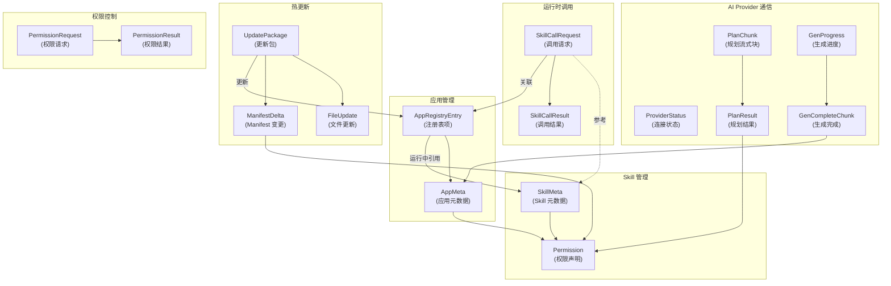

# IntentOS 跨模块共享类型定义

> **版本**：v1.0 | **日期**：2026-03-13 | **状态**：正式文档
> **包名**：`@intentos/shared-types`
> **路径**：`packages/shared-types/`

---

## 目录

1. [包信息与用途](#包信息与用途)
2. [类型定义](#类型定义)
3. [Zod 运行时校验](#zod-运行时校验)
4. [类型关系图](#类型关系图)
5. [文件组织结构](#文件组织结构)
6. [导入与使用示例](#导入与使用示例)
7. [Zod 校验错误处理](#zod-校验错误处理)

---

## 包信息与用途

### 包定义

**包名**：`@intentos/shared-types`
**路径**：`packages/shared-types/`
**用途**：定义 IntentOS 所有跨模块共享的数据结构，包括 Skill 元数据、SkillApp 管理、AI Provider 通信、规划结果、代码生成进度、热更新包、权限请求等类型。

### 使用方

- **IntentOS Desktop 主进程**（M-01～M-05 模块）：类型校验、IPC 通信契约定义
- **SkillApp 独立进程**（M-06 运行时）：Skill 调用、权限请求、热更新包处理
- **渲染进程**（UI 层）：数据绑定、表单验证
- **AI Provider 实现**（ClaudeAPIProvider / OpenClawProvider）：请求/响应结构化定义

---

## 类型定义

### 一、Skill 相关类型

#### SkillMeta（Skill 元数据）

```typescript
interface SkillMeta {
  /** Skill 唯一标识，如 'data-cleaner' */
  id: string;

  /** 显示名称，如 '数据清洗工具' */
  name: string;

  /** 版本号，遵循 semver，如 '1.0.0' */
  version: string;

  /** 简短描述（50-200字） */
  description: string;

  /** 作者名称或组织 */
  author: string;

  /** 权限声明列表 */
  permissions: Permission[];

  /** 输入参数的 JSON Schema（用于验证和生成 UI） */
  inputSchema: JSONSchema;

  /** 输出结果的 JSON Schema */
  outputSchema: JSONSchema;

  /** 所有公开方法列表 */
  methods: SkillMethod[];

  /** 依赖的其他 Skill ID 列表，如 ['logger', 'cache'] */
  dependencies: string[];

  /** Skill 的 npm 包路径或本地目录路径 */
  entryPoint: string;

  /** Skill 最后修改时间（ISO 8601） */
  updatedAt: string;
}

interface SkillMethod {
  /** 方法名 */
  name: string;

  /** 方法的参数 JSON Schema */
  inputSchema: JSONSchema;

  /** 返回值 JSON Schema */
  outputSchema: JSONSchema;

  /** 方法描述 */
  description: string;
}

interface Permission {
  /** 资源类型：'fs' | 'net' | 'process' */
  resource: "fs" | "net" | "process";

  /** 允许的操作列表 */
  actions: string[];

  /** 权限作用域说明 */
  scope: string;
}

interface JSONSchema {
  /** JSON Schema Draft 7 格式 */
  [key: string]: any;
}
```

**Zod Schema**：
```typescript
const permissionSchema = z.object({
  resource: z.enum(["fs", "net", "process"]),
  actions: z.array(z.string()).min(1),
  scope: z.string(),
});

const skillMethodSchema = z.object({
  name: z.string().min(1),
  inputSchema: z.record(z.any()),
  outputSchema: z.record(z.any()),
  description: z.string(),
});

const skillMetaSchema = z.object({
  id: z.string().regex(/^[a-z0-9-]+$/),
  name: z.string().min(1),
  version: z.string().regex(/^\d+\.\d+\.\d+$/),
  description: z.string().min(10).max(200),
  author: z.string().min(1),
  permissions: z.array(permissionSchema),
  inputSchema: z.record(z.any()),
  outputSchema: z.record(z.any()),
  methods: z.array(skillMethodSchema),
  dependencies: z.array(z.string()),
  entryPoint: z.string(),
  updatedAt: z.string().datetime(),
});
```

---

### 二、SkillApp 相关类型

#### AppMeta（SkillApp 元数据）

```typescript
type AppStatus =
  | "registered"    // 已注册但未启动
  | "starting"      // 启动中
  | "running"       // 运行中
  | "stopped"       // 已停止
  | "crashed"       // 崩溃
  | "uninstalled";  // 已卸载

interface AppMeta {
  /** 应用唯一标识，如 'csv-data-cleaner-a1b2c3' */
  id: string;

  /** 应用显示名称 */
  name: string;

  /** 应用使用的 Skill ID 列表 */
  skillIds: string[];

  /** 当前应用状态 */
  status: AppStatus;

  /** 应用创建时间（ISO 8601） */
  createdAt: string;

  /** 最后修改时间（ISO 8601） */
  updatedAt: string;

  /** 应用文件存放路径 */
  appPath: string;

  /** 应用版本号（从 1 开始递增，每次修改 +1） */
  version: number;

  /** Electron 应用主进程入口文件 */
  entryPoint: string;

  /** 应用源码输出目录 */
  outputDir: string;

  /** 应用声明的权限列表 */
  permissions: Permission[];
}

interface AppRegistryEntry extends AppMeta {
  // 注册表项额外字段

  /** 应用进程 PID（运行中时） */
  pid?: number;

  /** 进程监听的 IPC socket 路径 */
  ipcPath?: string;
}
```

**Zod Schema**：
```typescript
const appStatusEnum = z.enum(["registered", "starting", "running", "stopped", "crashed", "uninstalled"]);

const appMetaSchema = z.object({
  id: z.string().regex(/^[a-z0-9-]{8,}$/),
  name: z.string().min(1),
  skillIds: z.array(z.string()).min(0),
  status: appStatusEnum,
  createdAt: z.string().datetime(),
  updatedAt: z.string().datetime(),
  appPath: z.string(),
  version: z.number().int().min(1),
  entryPoint: z.string(),
  outputDir: z.string(),
  permissions: z.array(permissionSchema),
});

const appRegistryEntrySchema = appMetaSchema.extend({
  pid: z.number().int().positive().optional(),
  ipcPath: z.string().optional(),
});
```

---

### 三、AI Provider 通信相关类型

#### ConnectionStatus（连接状态枚举）

```typescript
type ConnectionStatus =
  | "uninitialized"   // 未初始化
  | "initializing"    // 初始化中
  | "ready"           // 就绪
  | "error"           // 错误
  | "rate_limited"    // 速率受限
  | "disconnected"    // 已断开连接
  | "disposing";      // 释放中

interface ProviderStatus {
  /** 当前连接状态 */
  status: ConnectionStatus;

  /** 状态详情消息 */
  message: string;

  /** 若为 error 状态，记录错误码 */
  errorCode?: string;

  /** 响应延迟（毫秒） */
  latency?: number;

  /** 最后状态变化时间（ISO 8601） */
  lastChangedAt: string;
}
```

**Zod Schema**：
```typescript
const connectionStatusEnum = z.enum([
  "uninitialized", "initializing", "ready", "error", "rate_limited", "disconnected", "disposing"
]);

const providerStatusSchema = z.object({
  status: connectionStatusEnum,
  message: z.string(),
  errorCode: z.string().optional(),
  latency: z.number().int().nonnegative().optional(),
  lastChangedAt: z.string().datetime(),
});
```

<!-- CR-001: ProviderConfig 新增 custom 分支 -->

#### ProviderConfig（CR-001 更新）

`ProviderConfig` 由简单接口改为判别联合类型，新增 `custom` 分支以支持任意 OpenAI Chat Completions 兼容端点。

```typescript
// CR-001: ProviderConfig 改为判别联合类型
type ProviderConfig =
  | ClaudeProviderConfig
  | CustomProviderConfig
  | OpenClawProviderConfig;

interface ClaudeProviderConfig {
  providerId: 'claude-api';
  claudeModel?: string;           // 规划用模型，默认 'claude-opus-4-6'
  claudeCodegenModel?: string;    // 代码生成用模型，默认 'claude-sonnet-4-6'
}

/** CR-001 新增：自定义 OpenAI-compatible Provider 配置 */
interface CustomProviderConfig {
  providerId: 'custom';
  customBaseUrl: string;          // 必填，如 'http://localhost:11434/v1'
  customPlanModel: string;        // 必填，规划阶段使用的模型名，如 'gpt-4o'
  customCodegenModel: string;     // 必填，代码生成阶段使用的模型名
  // API Key 不在此处存储，通过 APIKeyStore.getKey('custom') 读取
}

interface OpenClawProviderConfig {
  providerId: 'openclaw';
  openclawHost?: string;          // 默认 '127.0.0.1'
  openclawPort?: number;          // 默认 7890
}
```

**Zod Schema**：
```typescript
const claudeProviderConfigSchema = z.object({
  providerId: z.literal('claude-api'),
  claudeModel: z.string().optional(),
  claudeCodegenModel: z.string().optional(),
});

const customProviderConfigSchema = z.object({
  providerId: z.literal('custom'),
  customBaseUrl: z.string().url(),
  customPlanModel: z.string().min(1),
  customCodegenModel: z.string().min(1),
});

const openclawProviderConfigSchema = z.object({
  providerId: z.literal('openclaw'),
  openclawHost: z.string().optional(),
  openclawPort: z.number().int().positive().optional(),
});

const providerConfigSchema = z.discriminatedUnion('providerId', [
  claudeProviderConfigSchema,
  customProviderConfigSchema,
  openclawProviderConfigSchema,
]);
```

**迁移说明**：现有持久化配置读取时若 `providerId` 缺失，视为 `'claude-api'` 以保持向后兼容。

---

### 四、规划和生成相关类型

#### PlanChunk（规划流式输出块）

```typescript
interface PlanChunk {
  /** 会话 ID */
  sessionId: string;

  /** 规划阶段：thinking | drafting | complete */
  phase: "thinking" | "drafting" | "complete";

  /** 本段内容（思考过程或方案草稿） */
  content: string;

  /** 当 phase="complete" 时，携带最终规划结果 */
  planResult?: PlanResult;

  /** 时间戳（ISO 8601） */
  timestamp: string;
}

interface PlanResult {
  /** 应用名称 */
  appName: string;

  /** 应用简短描述 */
  description: string;

  /** 页面设计列表 */
  pages: PageDesign[];

  /** Skill 使用映射：{skillId -> 在应用中的用途描述} */
  skillUsage: Record<string, string>;

  /** 应用需要的权限列表 */
  permissions: Permission[];
}

interface PageDesign {
  /** 页面名称 */
  name: string;

  /** 页面在应用中的路由路径 */
  routePath: string;

  /** 页面的布局和功能描述 */
  layout: string;

  /** 该页面涉及的 Skill ID 列表 */
  skillIds: string[];
}
```

**Zod Schema**：
```typescript
const pageDesignSchema = z.object({
  name: z.string().min(1),
  routePath: z.string().startsWith("/"),
  layout: z.string(),
  skillIds: z.array(z.string()),
});

const planResultSchema = z.object({
  appName: z.string().min(1),
  description: z.string(),
  pages: z.array(pageDesignSchema).min(1),
  skillUsage: z.record(z.string()),
  permissions: z.array(permissionSchema),
});

const planChunkSchema = z.object({
  sessionId: z.string().uuid(),
  phase: z.enum(["thinking", "drafting", "complete"]),
  content: z.string(),
  planResult: planResultSchema.optional(),
  timestamp: z.string().datetime(),
});
```

#### GenProgress（代码生成进度块）

```typescript
interface GenProgress {
  /** 会话 ID */
  sessionId: string;

  /** 生成阶段：codegen | compile | bundle | done */
  stage: "codegen" | "compile" | "bundle" | "done";

  /** 进度百分比（0-100） */
  percent: number;

  /** 进度描述信息 */
  message: string;

  /** 本阶段已生成的文件列表 */
  filesGenerated?: string[];

  /** 若为 done 阶段，携带完成结果 */
  completeChunk?: GenCompleteChunk;

  /** 时间戳（ISO 8601） */
  timestamp: string;
}

interface GenCompleteChunk {
  /** 生成的应用 ID */
  appId: string;

  /** 应用入口文件路径 */
  entryPoint: string;

  /** 应用源码输出目录 */
  outputDir: string;

  /** 构建统计信息 */
  buildStats: {
    /** 生成的源文件数 */
    filesGenerated: number;
    /** 编译耗时（毫秒） */
    compileDuration: number;
    /** 打包产物大小（字节） */
    bundleSize: number;
  };
}
```

**Zod Schema**：
```typescript
const genCompleteChunkSchema = z.object({
  appId: z.string(),
  entryPoint: z.string(),
  outputDir: z.string(),
  buildStats: z.object({
    filesGenerated: z.number().int().nonnegative(),
    compileDuration: z.number().int().nonnegative(),
    bundleSize: z.number().int().nonnegative(),
  }),
});

const genProgressSchema = z.object({
  sessionId: z.string().uuid(),
  stage: z.enum(["codegen", "compile", "bundle", "done"]),
  percent: z.number().int().min(0).max(100),
  message: z.string(),
  filesGenerated: z.array(z.string()).optional(),
  completeChunk: genCompleteChunkSchema.optional(),
  timestamp: z.string().datetime(),
});
```

---

### 五、热更新相关类型

#### UpdatePackage（热更新包）

```typescript
interface UpdatePackage {
  /** 应用 ID */
  appId: string;

  /** 从版本号（用于校验） */
  fromVersion: string;

  /** 到版本号 */
  toVersion: string;

  /** 包生成时间戳 */
  timestamp: number;

  /** 文件更新列表 */
  changedFiles: FileUpdate[];

  /** 新增文件列表 */
  addedFiles: FileUpdate[];

  /** 删除的文件路径列表 */
  deletedFiles: string[];

  /** manifest.json 的增量变更 */
  manifestDelta?: ManifestDelta;

  /** 整包 SHA-256 校验和 */
  checksum: string;

  /** 更新说明 */
  description: string;
}

interface FileUpdate {
  /** 相对路径，如 'src/app/pages/HomePage.jsx' */
  path: string;

  /** 文件内容（base64 编码） */
  content: string;

  /** 文件哈希值（用于增量校验） */
  hash: string;
}

interface ManifestDelta {
  /** 新增的 Skill 依赖 */
  addedSkills?: string[];

  /** 移除的 Skill 依赖 */
  removedSkills?: string[];

  /** 新增的权限声明 */
  addedPermissions?: Permission[];

  /** 移除的权限声明 */
  removedPermissions?: Permission[];
}
```

**Zod Schema**：
```typescript
const fileUpdateSchema = z.object({
  path: z.string(),
  content: z.string().base64(),
  hash: z.string().regex(/^[a-f0-9]{64}$/),
});

const manifestDeltaSchema = z.object({
  addedSkills: z.array(z.string()).optional(),
  removedSkills: z.array(z.string()).optional(),
  addedPermissions: z.array(permissionSchema).optional(),
  removedPermissions: z.array(permissionSchema).optional(),
});

const updatePackageSchema = z.object({
  appId: z.string(),
  fromVersion: z.string(),
  toVersion: z.string(),
  timestamp: z.number().int().positive(),
  changedFiles: z.array(fileUpdateSchema),
  addedFiles: z.array(fileUpdateSchema),
  deletedFiles: z.array(z.string()),
  manifestDelta: manifestDeltaSchema.optional(),
  checksum: z.string().regex(/^[a-f0-9]{64}$/),
  description: z.string(),
});
```

---

### 六、Skill 调用相关类型

#### SkillCallRequest（Skill 调用请求）

```typescript
interface SkillCallRequest {
  /** 应用会话 ID */
  sessionId: string;

  /** 目标 Skill ID */
  skillId: string;

  /** 调用的方法名 */
  method: string;

  /** 调用参数（对象形式） */
  params: Record<string, any>;

  /** 发起调用的应用 ID */
  callerAppId: string;

  /** 请求超时时间（毫秒） */
  timeout?: number;

  /** 唯一请求 ID（用于跟踪） */
  requestId: string;

  /** 时间戳（ISO 8601） */
  timestamp: string;
}

interface SkillCallResult {
  /** 请求 ID（与请求对应） */
  requestId: string;

  /** 是否成功 */
  success: boolean;

  /** 执行结果数据 */
  data?: any;

  /** 错误信息（失败时） */
  error?: {
    /** 错误码 */
    code: string;
    /** 错误描述 */
    message: string;
    /** 错误详情 */
    details?: any;
  };

  /** 执行耗时（毫秒） */
  duration: number;

  /** 时间戳（ISO 8601） */
  timestamp: string;
}
```

**Zod Schema**：
```typescript
const skillCallRequestSchema = z.object({
  sessionId: z.string().uuid(),
  skillId: z.string(),
  method: z.string().min(1),
  params: z.record(z.any()),
  callerAppId: z.string(),
  timeout: z.number().int().positive().optional(),
  requestId: z.string().uuid(),
  timestamp: z.string().datetime(),
});

const skillCallResultSchema = z.object({
  requestId: z.string().uuid(),
  success: z.boolean(),
  data: z.any().optional(),
  error: z.object({
    code: z.string(),
    message: z.string(),
    details: z.any().optional(),
  }).optional(),
  duration: z.number().int().nonnegative(),
  timestamp: z.string().datetime(),
});
```

---

### 七、权限相关类型

#### PermissionRequest（权限请求）

```typescript
interface PermissionRequest {
  /** 应用 ID */
  appId: string;

  /** 资源类型：fs | net | process */
  resourceType: "fs" | "net" | "process";

  /** 资源路径（如文件系统路径或域名） */
  resourcePath: string;

  /** 请求的操作：read | write | delete | fetch | connect 等 */
  action: string;

  /** 权限请求的原因说明 */
  reason: string;

  /** 是否可以持久化此授权（用户可选） */
  canPersist: boolean;

  /** 请求时间戳（ISO 8601） */
  timestamp: string;
}

interface PermissionResult {
  /** 权限是否被授予 */
  granted: boolean;

  /** 若被授予，该授权的有效期（null = 永久） */
  persistUntil?: string;

  /** 若被拒绝，拒绝原因 */
  denialReason?: string;
}
```

**Zod Schema**：
```typescript
const permissionRequestSchema = z.object({
  appId: z.string(),
  resourceType: z.enum(["fs", "net", "process"]),
  resourcePath: z.string(),
  action: z.string().min(1),
  reason: z.string(),
  canPersist: z.boolean(),
  timestamp: z.string().datetime(),
});

const permissionResultSchema = z.object({
  granted: z.boolean(),
  persistUntil: z.string().datetime().nullable().optional(),
  denialReason: z.string().optional(),
});
```

---

## Zod 运行时校验

### 完整的 Zod 导出

```typescript
// src/index.ts
export {
  // Skill 相关
  skillMetaSchema,
  skillMethodSchema,
  permissionSchema,

  // SkillApp 相关
  appMetaSchema,
  appRegistryEntrySchema,
  appStatusEnum,

  // 连接状态
  providerStatusSchema,
  connectionStatusEnum,

  // 规划与生成
  planChunkSchema,
  planResultSchema,
  pageDesignSchema,
  genProgressSchema,
  genCompleteChunkSchema,

  // 热更新
  updatePackageSchema,
  fileUpdateSchema,
  manifestDeltaSchema,

  // Skill 调用
  skillCallRequestSchema,
  skillCallResultSchema,

  // 权限
  permissionRequestSchema,
  permissionResultSchema,
};

// 同时导出所有 TypeScript 接口类型
export type {
  SkillMeta,
  SkillMethod,
  Permission,
  JSONSchema,
  AppMeta,
  AppStatus,
  AppRegistryEntry,
  ConnectionStatus,
  ProviderStatus,
  PlanChunk,
  PlanResult,
  PageDesign,
  GenProgress,
  GenCompleteChunk,
  UpdatePackage,
  FileUpdate,
  ManifestDelta,
  SkillCallRequest,
  SkillCallResult,
  PermissionRequest,
  PermissionResult,
};
```

### 使用 Zod 进行运行时验证

```typescript
import { skillMetaSchema, SkillMeta } from "@intentos/shared-types";

// 验证数据
try {
  const validated: SkillMeta = skillMetaSchema.parse(jsonData);
  console.log("验证通过:", validated);
} catch (error) {
  if (error instanceof z.ZodError) {
    console.error("验证失败:", error.errors);
    // 错误格式：
    // [
    //   { path: ["id"], message: "String must match /^[a-z0-9-]+$/" },
    //   { path: ["version"], message: "String must match /^\\d+\\.\\d+\\.\\d+$/" }
    // ]
  }
}

// 或使用 .safeParse 获取 Result 对象
const result = skillMetaSchema.safeParse(jsonData);
if (result.success) {
  console.log("有效的 SkillMeta:", result.data);
} else {
  console.error("验证错误列表:", result.error.issues);
}
```

---

## 类型关系图



---

## 文件组织结构

```
packages/shared-types/
├── package.json
├── tsconfig.json
├── src/
│   ├── index.ts                    # 主入口，导出所有类型和 Zod schema
│   ├── types/
│   │   ├── skill.types.ts          # SkillMeta, SkillMethod, Permission
│   │   ├── app.types.ts            # AppMeta, AppRegistryEntry, AppStatus
│   │   ├── provider.types.ts       # ProviderStatus, ConnectionStatus
│   │   ├── planning.types.ts       # PlanChunk, PlanResult, PageDesign
│   │   ├── generation.types.ts     # GenProgress, GenCompleteChunk
│   │   ├── hotupdate.types.ts      # UpdatePackage, FileUpdate, ManifestDelta
│   │   ├── skill-call.types.ts     # SkillCallRequest, SkillCallResult
│   │   └── permission.types.ts     # PermissionRequest, PermissionResult
│   └── schemas/
│       ├── skill.schemas.ts        # skillMetaSchema, skillMethodSchema, permissionSchema
│       ├── app.schemas.ts          # appMetaSchema, appRegistryEntrySchema
│       ├── provider.schemas.ts     # providerStatusSchema, connectionStatusEnum
│       ├── planning.schemas.ts     # planChunkSchema, planResultSchema, pageDesignSchema
│       ├── generation.schemas.ts   # genProgressSchema, genCompleteChunkSchema
│       ├── hotupdate.schemas.ts    # updatePackageSchema, fileUpdateSchema, manifestDeltaSchema
│       ├── skill-call.schemas.ts   # skillCallRequestSchema, skillCallResultSchema
│       └── permission.schemas.ts   # permissionRequestSchema, permissionResultSchema
└── dist/                           # 编译产物（TypeScript → JavaScript）
    ├── index.js
    ├── types/
    └── schemas/
```

### 文件导入关系

```
src/index.ts
├── ./types/skill.types.ts
├── ./types/app.types.ts
├── ./types/provider.types.ts
├── ./types/planning.types.ts
├── ./types/generation.types.ts
├── ./types/hotupdate.types.ts
├── ./types/skill-call.types.ts
├── ./types/permission.types.ts
├── ./schemas/skill.schemas.ts
├── ./schemas/app.schemas.ts
├── ./schemas/provider.schemas.ts
├── ./schemas/planning.schemas.ts
├── ./schemas/generation.schemas.ts
├── ./schemas/hotupdate.schemas.ts
├── ./schemas/skill-call.schemas.ts
└── ./schemas/permission.schemas.ts
```

---

## 导入与使用示例

### 示例 1：在 IntentOS Desktop 主进程中使用

```typescript
// src/main/modules/skill-manager/index.ts
import { SkillMeta, skillMetaSchema } from "@intentos/shared-types";

async function registerSkill(skillPath: string): Promise<SkillMeta> {
  // 读取 skill manifest
  const skillManifest = JSON.parse(
    await fs.promises.readFile(path.join(skillPath, "manifest.json"), "utf-8")
  );

  // 运行时验证
  const validated: SkillMeta = skillMetaSchema.parse(skillManifest);

  // 存入数据库
  await db.skills.insert(validated);

  return validated;
}
```

### 示例 2：在 preload.ts（Desktop）中定义 IPC API 类型

```typescript
// src/preload/index.ts
import {
  AppRegistryEntry,
  appRegistryEntrySchema,
  type AppStatus
} from "@intentos/shared-types";

contextBridge.exposeInMainWorld("intentOS", {
  app: {
    getAll: async (): Promise<AppRegistryEntry[]> => {
      return ipcRenderer.invoke("app-lifecycle:get-all");
    },

    onStatusChanged: (
      callback: (event: { appId: string; newStatus: AppStatus }) => void
    ): (() => void) => {
      const handler = (_: IpcRendererEvent, event) => {
        // 可选：验证事件数据
        const validated = z.object({
          appId: z.string(),
          newStatus: z.enum(["registered", "starting", "running", "stopped", "crashed", "uninstalled"]),
        }).safeParse(event);

        if (validated.success) {
          callback(validated.data);
        }
      };
      ipcRenderer.on("app-lifecycle:status-changed", handler);
      return () => ipcRenderer.removeListener("app-lifecycle:status-changed", handler);
    },
  },
});
```

### 示例 3：在 SkillApp 渲染进程中调用 Skill

```typescript
// src/app/services/skillService.ts
import { SkillCallRequest, SkillCallResult, skillCallResultSchema } from "@intentos/shared-types";

async function executeSkill(
  skillId: string,
  method: string,
  params: Record<string, any>
): Promise<SkillCallResult> {
  const request: SkillCallRequest = {
    sessionId: generateUUID(),
    skillId,
    method,
    params,
    callerAppId: window.intentOS.getAppInfo().appId,
    requestId: generateUUID(),
    timestamp: new Date().toISOString(),
  };

  const result = await window.intentOS.callSkill(request);

  // 运行时验证返回结果
  const validated = skillCallResultSchema.safeParse(result);
  if (!validated.success) {
    console.error("Skill 调用结果格式错误:", validated.error);
    throw new Error("Invalid skill result format");
  }

  return validated.data;
}
```

### 示例 4：在 AI Provider 中使用规划结果

```typescript
// src/main/modules/ai-provider/claude-api-provider.ts
import { PlanChunk, PlanResult, planChunkSchema } from "@intentos/shared-types";

async *planApp(request: PlanRequest): AsyncIterable<PlanChunk> {
  const stream = await this.anthropic.messages.stream({
    model: "claude-opus-4-6",
    max_tokens: 4096,
    system: buildPrompt(request.skills),
    messages: buildMessages(request.intent),
  });

  for await (const event of stream) {
    if (event.type === "content_block_delta") {
      const chunk: PlanChunk = {
        sessionId: request.sessionId,
        phase: "thinking",
        content: event.delta.text,
        timestamp: new Date().toISOString(),
      };

      // 可选验证
      const validated = planChunkSchema.safeParse(chunk);
      if (validated.success) {
        yield validated.data;
      }
    }
  }

  // 在最后发送完整规划结果
  const planResult = parsePlan(stream.accumulated());
  yield {
    sessionId: request.sessionId,
    phase: "complete",
    content: "",
    planResult,
    timestamp: new Date().toISOString(),
  };
}
```

---

## Zod 校验错误处理

### 统一的校验错误处理函数

```typescript
import { z } from "zod";

type ValidationErrorDetail = {
  path: (string | number)[];
  message: string;
  code: string;
};

function formatValidationError(error: z.ZodError): {
  summary: string;
  details: ValidationErrorDetail[];
} {
  const details = error.issues.map((issue) => ({
    path: issue.path,
    message: issue.message,
    code: issue.code,
  }));

  return {
    summary: `验证失败，共 ${details.length} 个错误`,
    details,
  };
}

// 使用示例
import { skillMetaSchema } from "@intentos/shared-types";

function validateSkillMeta(data: unknown) {
  const result = skillMetaSchema.safeParse(data);

  if (!result.success) {
    const { summary, details } = formatValidationError(result.error);
    console.error(summary);
    console.table(details);

    // 可以返回用户友好的错误信息
    return {
      valid: false,
      errors: details.map(d => `${d.path.join(".")}: ${d.message}`),
    };
  }

  return {
    valid: true,
    data: result.data,
  };
}
```

### 常见校验场景

```typescript
// 场景 1：API 请求参数验证
import { appMetaSchema } from "@intentos/shared-types";

function validateAppMeta(req: any) {
  try {
    const appMeta = appMetaSchema.parse(req.body);
    // appMeta 已验证，类型安全
    return appMeta;
  } catch (error) {
    if (error instanceof z.ZodError) {
      // 返回 400 Bad Request
      return {
        status: 400,
        error: "Invalid app metadata",
        details: error.issues,
      };
    }
    throw error;
  }
}

// 场景 2：数据库查询结果验证
import { appRegistryEntrySchema } from "@intentos/shared-types";

async function getAppFromDB(appId: string) {
  const row = await db.query("SELECT * FROM apps WHERE id = ?", [appId]);

  // 验证数据库返回的数据符合类型契约
  const app = appRegistryEntrySchema.parse(row);
  return app;
}

// 场景 3：IPC 消息验证
import { skillCallResultSchema } from "@intentos/shared-types";

ipcMain.handle("skill-call", async (_event, request) => {
  try {
    const result = await executeSkill(request);

    // 在返回前验证结果格式
    const validated = skillCallResultSchema.parse(result);
    return validated;
  } catch (error) {
    return {
      success: false,
      error: {
        code: "SKILL_EXECUTION_ERROR",
        message: error.message,
      },
      duration: 0,
      timestamp: new Date().toISOString(),
    };
  }
});
```

---

## 相关文档

- [`docs/idea.md`](../idea.md) — 核心设计理念、架构分层
- [`docs/modules.md`](../modules.md) — 模块接口定义、跨模块协作
- [`docs/spec/electron-spec.md`](../spec/electron-spec.md) — 附录 A：关键类型定义（与本文对齐）
- [`docs/spec/skillapp-spec.md`](../spec/skillapp-spec.md) — 运行时消息格式
- [`docs/spec/ai-provider-spec.md`](../spec/ai-provider-spec.md) — AI Provider 通信消息类型

---

## 变更记录

| 版本 | 日期 | 主要变更 |
|------|------|---------|
| 1.0 | 2026-03-13 | 初始文档，包含 MVP 必需的所有类型定义和 Zod schema |
