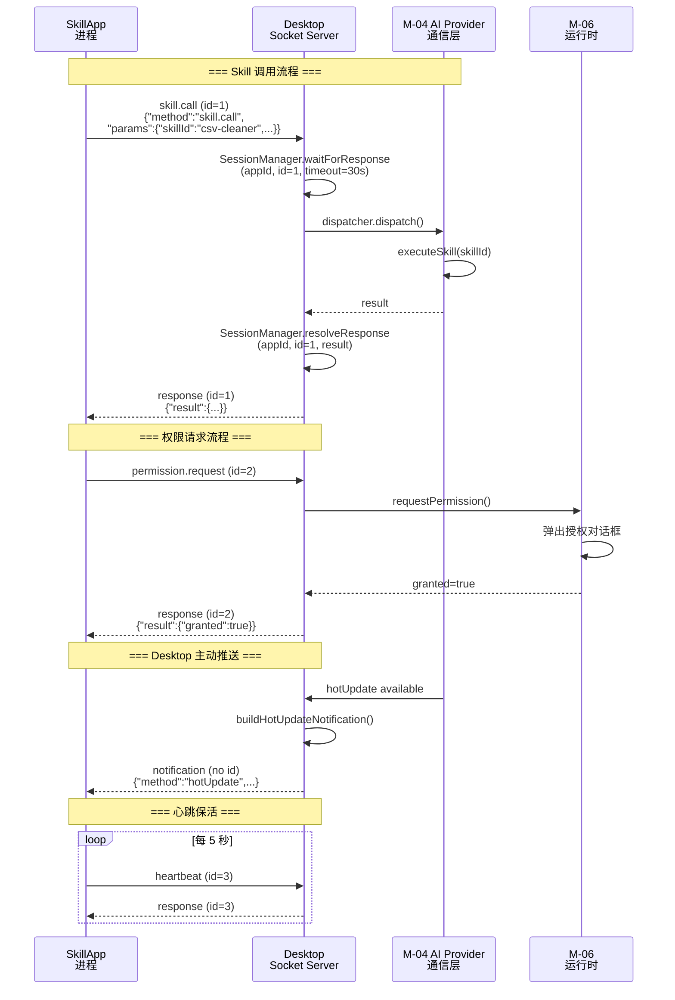
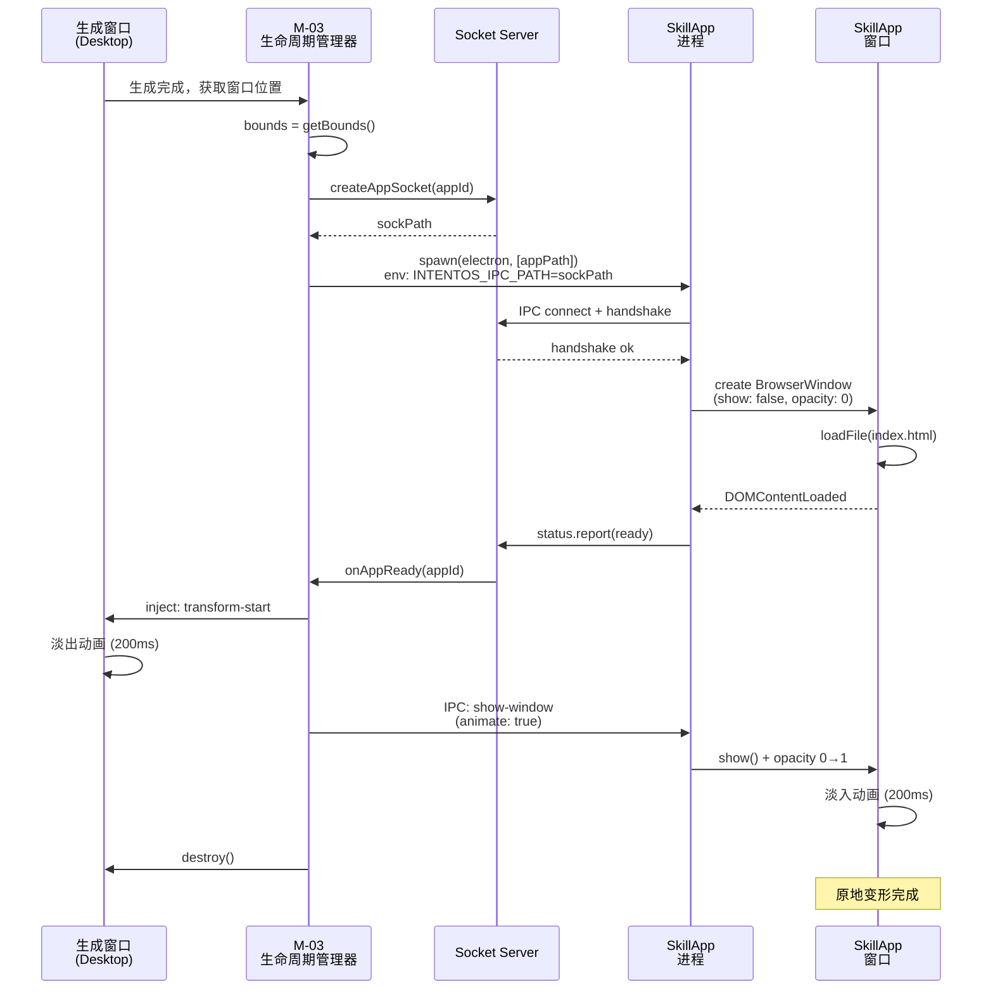

# Desktop Unix Socket IPC Server 完整实现规范

> **文档目的**：为 executor agent 在 Iter 4 中实现 `src/main/modules/socket-server/` 提供完整且可直接使用的技术规范。
>
> **文档版本**：v1.0 | **日期**：2026-03-13 | **状态**：正式文档

---

## 目录
- [1. 概述](#1-概述)
- [2. 文件结构](#2-文件结构)
- [3. 核心接口定义](#3-核心接口定义)
- [4. JSON-RPC 2.0 协议详解](#4-json-rpc-20-协议详解)
- [5. 所有支持的 RPC 方法](#5-所有支持的-rpc-方法)
- [6. SessionManager 规范](#6-sessionmanager-规范)
- [7. RPCDispatcher 规范](#7-rpcdispatcher-规范)
- [8. 消息分帧与粘包处理](#8-消息分帧与粘包处理)
- [9. Socket 文件生命周期](#9-socket-文件生命周期)
- [10. 跨平台处理（Unix Socket / Named Pipe）](#10-跨平台处理unix-socket--named-pipe)
- [11. 并发安全](#11-并发安全)
- [12. 时序图](#12-时序图)
- [13. 测试要点](#13-测试要点)

---

## 1. 概述

Desktop 作为 Unix Domain Socket Server，为每个 SkillApp 提供独立的 IPC 通信端点。

### 架构原理

```
IntentOS Desktop 主进程
    ↓
socket-server（Unix Socket Server）
    ├── Socket 端点 A：{appId-1}.sock
    ├── Socket 端点 B：{appId-2}.sock
    └── Socket 端点 C：{appId-3}.sock
    ↓
SkillApp-1 (独立进程)  SkillApp-2 (独立进程)  SkillApp-3 (独立进程)
```

### 关键设计点

| 项目 | 说明 |
|------|------|
| **Server 角色** | Desktop 主进程内的 socket-server 实例 |
| **Client 角色** | 每个 SkillApp 的独立进程 |
| **Socket 类型** | Unix Domain Socket（macOS/Linux）/ Named Pipe（Windows） |
| **Socket 文件路径** | `userData/sockets/{appId}.sock`（Desktop 创建和管理） |
| **协议** | JSON-RPC 2.0（基于 TCP socket 之上，换行符 `\n` 分隔消息） |
| **生命周期绑定** | SkillApp 进程生命周期与对应的 socket 连接一一对应 |

---

## 2. 文件结构

实现代码位置：`src/main/modules/socket-server/`

```
socket-server/
├── index.ts                 # 导出主接口
├── socket-server.ts         # 核心 SocketServer 实现
├── rpc-dispatcher.ts        # JSON-RPC 2.0 方法分发器
├── session-manager.ts       # 并发会话管理
└── types.ts                 # 共享类型定义（可选，提高可维护性）
```

### 文件职责

| 文件 | 职责 |
|------|------|
| `socket-server.ts` | 创建和管理 Unix Socket 服务器、监听连接、调度 RPC 请求 |
| `rpc-dispatcher.ts` | 注册和分发 JSON-RPC 方法，处理未知方法错误 |
| `session-manager.ts` | 维护并发会话、超时控制、请求-响应匹配 |
| `index.ts` | 导出 SocketServer 类和相关类型 |

---

## 3. 核心接口定义

### SocketServer 接口

```typescript
/**
 * Desktop 端 Unix Socket Server
 * 为每个 SkillApp 创建独立的 socket 端点
 */
interface SocketServer {
  /**
   * 启动服务器：创建 sockets 目录，开始监听 socket 端点
   * @throws Error 如果 sockets 目录创建失败或权限不足
   */
  start(): Promise<void>;

  /**
   * 停止服务器：关闭所有连接，删除 socket 文件
   * @throws Error 如果关闭过程失败
   */
  stop(): Promise<void>;

  /**
   * 为新 SkillApp 创建 socket 文件
   * @param appId 应用 ID（如 'csv-data-cleaner-a1b2c3'）
   * @returns socket 文件路径（macOS/Linux: /path/to/sockets/{appId}.sock）
   * @throws Error 如果文件创建失败
   */
  createAppSocket(appId: string): Promise<string>;

  /**
   * 删除 SkillApp 的 socket 文件
   * @param appId 应用 ID
   * @throws Error 如果文件删除失败
   */
  removeAppSocket(appId: string): Promise<void>;

  /**
   * 为 SkillApp 注册 RPC 方法处理器
   * @param appId 应用 ID
   * @param handler RPC 请求处理函数
   */
  onMessage(appId: string, handler: RPCHandler): void;

  /**
   * 向 SkillApp 发送 JSON-RPC 通知（无 id，对方不需回复）
   * @param appId 应用 ID
   * @param notification JSON-RPC notification 对象
   * @throws Error 如果连接已关闭
   */
  sendToApp(appId: string, notification: RPCNotification): void;
}

/**
 * JSON-RPC 请求处理函数类型
 */
type RPCHandler = (request: RPCRequest) => Promise<any>;

/**
 * JSON-RPC 2.0 请求
 */
interface RPCRequest {
  jsonrpc: '2.0';
  method: string;
  params: Record<string, any>;
  id: string | number;
}

/**
 * JSON-RPC 2.0 通知（无 id）
 */
interface RPCNotification {
  jsonrpc: '2.0';
  method: string;
  params: Record<string, any>;
}
```

### SkillApp 与 Desktop 的通信关系

```typescript
/**
 * SkillApp 侧使用示例（由运行时 SDK 调用）
 */
class SkillAppRuntime {
  private socket: net.Socket;

  async callSkill(skillId: string, method: string, params: unknown): Promise<any> {
    const request: RPCRequest = {
      jsonrpc: '2.0',
      method: 'skill.call',
      params: { skillId, method, params, callId: generateId() },
      id: generateId(),
    };
    return this.sendRequest(request);
  }

  private sendRequest(request: RPCRequest): Promise<any> {
    return new Promise((resolve, reject) => {
      // 发送: JSON 字符串 + '\n'
      const message = JSON.stringify(request) + '\n';
      this.socket.write(message);
      // 等待响应... (超时 30s)
    });
  }
}
```

---

## 4. JSON-RPC 2.0 协议详解

### 4.1 消息格式总览

所有消息为 JSON 格式，以换行符 `\n`（LF, ASCII 10）分隔。

#### 请求（SkillApp → Desktop）

```json
{
  "jsonrpc": "2.0",
  "method": "skill.call",
  "params": {
    "skillId": "data-cleaner",
    "method": "clean",
    "params": { "filePath": "/path/to/data.csv" },
    "callId": "call-uuid-123"
  },
  "id": 1
}
```

**字段说明**：
- `jsonrpc`：版本号，固定值 `"2.0"`
- `method`：RPC 方法名，如 `skill.call`、`resource.access`
- `params`：方法参数对象
- `id`：请求 ID，用于匹配响应。可为数字或字符串，Desktop 返回响应时保持相同 id

#### 响应（Desktop → SkillApp）

成功响应：
```json
{
  "jsonrpc": "2.0",
  "result": { "data": "cleaned csv content" },
  "id": 1
}
```

错误响应：
```json
{
  "jsonrpc": "2.0",
  "error": {
    "code": -32000,
    "message": "Skill not found",
    "data": { "skillId": "unknown-skill" }
  },
  "id": 1
}
```

**字段说明**：
- `result`：成功时的返回值（任意 JSON 值）
- `error`：失败时的错误信息，包含 `code` 和 `message`
- `id`：与请求的 id 相同，用于关联

#### 通知（Desktop → SkillApp，无 id）

```json
{
  "jsonrpc": "2.0",
  "method": "hotUpdate",
  "params": {
    "appId": "csv-data-cleaner-a1b2c3",
    "fromVersion": "1.0.0",
    "toVersion": "1.0.1",
    "changedFiles": [ ... ],
    "addedFiles": [],
    "deletedFiles": []
  }
}
```

**特点**：
- 无 `id` 字段
- SkillApp 接收后无需回复
- 用于 Desktop 主动推送数据（热更新、状态通知）

### 4.2 错误码定义

所有错误响应的 `error.code` 值遵循 JSON-RPC 2.0 规范及自定义扩展：

```typescript
enum RPCErrorCode {
  // JSON-RPC 2.0 标准错误码
  PARSE_ERROR = -32700,           // 无效的 JSON
  INVALID_REQUEST = -32600,       // 缺少必要字段（如 jsonrpc、method）
  METHOD_NOT_FOUND = -32601,      // 方法不存在
  INVALID_PARAMS = -32602,        // 参数类型或数量错误

  // IntentOS 自定义错误码 (-32000 ~ -32099)
  SKILL_NOT_FOUND = -32000,       // 指定的 Skill 未注册
  SKILL_CALL_TIMEOUT = -32003,    // Skill 调用超时（30s）
  PERMISSION_DENIED = -32001,     // 权限被拒绝
  RESOURCE_NOT_FOUND = -32002,    // 资源不存在（如文件路径不存在）
  APP_NOT_CONNECTED = -32004,     // SkillApp 未连接或已断开
}
```

---

## 5. 所有支持的 RPC 方法

### 5.1 skill.call（SkillApp 调用 Skill）

**发起方**：SkillApp
**接收方**：Desktop M-04 AI Provider 通信层
**超时**：30 秒

```typescript
// 请求
{
  "jsonrpc": "2.0",
  "method": "skill.call",
  "params": {
    "skillId": "data-cleaner",      // Skill ID
    "method": "clean",              // Skill 方法名
    "params": {                      // 方法参数
      "filePath": "/path/to/file.csv",
      "options": { "dedup": true }
    },
    "callId": "call-uuid-12345"     // 调用 ID（用于跟踪）
  },
  "id": 1
}

// 成功响应
{
  "jsonrpc": "2.0",
  "result": {
    "data": "cleaned,data,content\n..."
  },
  "id": 1
}

// 错误响应（Skill 不存在）
{
  "jsonrpc": "2.0",
  "error": {
    "code": -32000,
    "message": "Skill not found",
    "data": { "skillId": "data-cleaner" }
  },
  "id": 1
}

// 错误响应（超时）
{
  "jsonrpc": "2.0",
  "error": {
    "code": -32003,
    "message": "Skill call timeout (30s exceeded)"
  },
  "id": 1
}
```

---

### 5.2 resource.access（访问系统资源）

**发起方**：SkillApp
**接收方**：Desktop M-06 运行时模块代理
**超时**：10 秒

```typescript
// 请求（读文件）
{
  "jsonrpc": "2.0",
  "method": "resource.access",
  "params": {
    "type": "fs",
    "action": "read",
    "path": "/Users/user/Documents/data.json",
    "metadata": {}
  },
  "id": 2
}

// 成功响应
{
  "jsonrpc": "2.0",
  "result": {
    "data": "file contents..."
  },
  "id": 2
}

// 错误响应（权限被拒绝）
{
  "jsonrpc": "2.0",
  "error": {
    "code": -32001,
    "message": "Permission denied",
    "data": {
      "resource": "fs",
      "action": "write",
      "path": "/Users/user/Documents/protected/"
    }
  },
  "id": 2
}

// 错误响应（文件不存在）
{
  "jsonrpc": "2.0",
  "error": {
    "code": -32002,
    "message": "Resource not found",
    "data": { "path": "/path/to/nonexistent/file.csv" }
  },
  "id": 2
}
```

**支持的资源类型**：
- `fs` (文件系统)：`read`, `write`, `list`, `delete`, `watch`
- `net` (网络)：`fetch`, `connect`, `listen`
- `process` (进程)：`spawn`, `kill`, `list`

---

### 5.3 permission.request（请求新权限）

**发起方**：SkillApp
**接收方**：Desktop M-03 生命周期管理器（触发权限弹窗）
**超时**：60 秒（等待用户操作）

```typescript
// 请求
{
  "jsonrpc": "2.0",
  "method": "permission.request",
  "params": {
    "resourceType": "fs",
    "resourcePath": "/Users/user/Documents/sensitive-folder",
    "action": "write",
    "reason": "需要保存处理后的数据"
  },
  "id": 3
}

// 用户同意，永久授权
{
  "jsonrpc": "2.0",
  "result": {
    "granted": true,
    "persistUntil": null  // null 表示永久有效
  },
  "id": 3
}

// 用户同意，仅本次
{
  "jsonrpc": "2.0",
  "result": {
    "granted": true,
    "persistUntil": 1741862400000  // Unix 时间戳（ms），此次会话结束
  },
  "id": 3
}

// 用户拒绝
{
  "jsonrpc": "2.0",
  "result": {
    "granted": false
  },
  "id": 3
}
```

---

### 5.4 status.report（SkillApp 汇报状态）

**发起方**：SkillApp
**接收方**：Desktop M-03 生命周期管理器
**回复方式**：收到确认（空 result）

```typescript
// 请求（应用已启动）
{
  "jsonrpc": "2.0",
  "method": "status.report",
  "params": {
    "status": "running",
    "message": "应用已启动，首屏渲染完成"
  },
  "id": 4
}

// 响应
{
  "jsonrpc": "2.0",
  "result": {},
  "id": 4
}

// 请求（应用将关闭）
{
  "jsonrpc": "2.0",
  "method": "status.report",
  "params": {
    "status": "stopping",
    "message": "用户点击关闭，应用正在清理资源"
  },
  "id": 5
}

// 请求（应用异常）
{
  "jsonrpc": "2.0",
  "method": "status.report",
  "params": {
    "status": "error",
    "message": "Skill 执行出现异常：数据校验失败"
  },
  "id": 6
}
```

**状态值**：`ready`, `running`, `stopping`, `error`, `crashed`

**特殊含义**：
- `status: 'ready'`：触发原地变形流程（见后文原地变形章节）

---

### 5.5 heartbeat（心跳保活）

**发起方**：SkillApp（每 5 秒一次）
**接收方**：Desktop M-03 生命周期管理器
**超时**：5 秒

```typescript
// 请求
{
  "jsonrpc": "2.0",
  "method": "heartbeat",
  "params": {
    "appId": "csv-data-cleaner-a1b2c3",
    "timestamp": 1741776000000,
    "metrics": {
      "memoryUsageMB": 120.5,
      "cpuPercent": 2.3,
      "activeSkillCalls": 0
    }
  },
  "id": 7
}

// 响应（返回 Desktop 当前时间戳）
{
  "jsonrpc": "2.0",
  "result": {
    "timestamp": 1741776005000
  },
  "id": 7
}
```

**发送周期**：5 秒
**超时策略**：
- 连续 3 次未收到响应（15s）：Desktop 标记为 `unresponsive`
- 连续 6 次未收到（30s）：Desktop 判定进程挂死，强制终止

---

### 5.6 Desktop → SkillApp 通知：hotUpdate

**发起方**：Desktop M-05 生成器
**接收方**：SkillApp 运行时热更新处理器
**是否需要回复**：否（通知，无 id）

```json
{
  "jsonrpc": "2.0",
  "method": "hotUpdate",
  "params": {
    "appId": "csv-data-cleaner-a1b2c3",
    "fromVersion": "1.0.0",
    "toVersion": "1.0.1",
    "timestamp": 1710404400000,
    "changedFiles": [
      {
        "path": "src/app/pages/SchedulePage.jsx",
        "content": "base64-encoded content...",
        "encoding": "base64",
        "checksum": "a1b2c3d4e5f6..."
      }
    ],
    "addedFiles": [],
    "deletedFiles": [],
    "manifestDelta": {
      "addedSkills": [],
      "removedSkills": [],
      "addedPermissions": [],
      "removedPermissions": []
    },
    "checksum": "sha256-hash-value",
    "description": "更新 SchedulePage 组件"
  }
}
```

---

## 6. SessionManager 规范

### 6.1 职责

维护并发会话、请求-响应匹配、超时控制。

```typescript
/**
 * 会话管理器
 */
interface SessionManager {
  /**
   * 创建或获取一个会话
   * @param appId 应用 ID
   * @returns 会话对象
   */
  getOrCreateSession(appId: string): SocketSession;

  /**
   * 销毁会话（应用断开连接时调用）
   * @param appId 应用 ID
   */
  destroySession(appId: string): void;

  /**
   * 注册待响应的请求
   * @param appId 应用 ID
   * @param id 请求 ID
   * @param timeout 超时时间（ms）
   * @returns Promise，resolve 时获得响应结果
   */
  waitForResponse(appId: string, id: string | number, timeout: number): Promise<any>;

  /**
   * 完成请求（收到响应时调用）
   * @param appId 应用 ID
   * @param id 请求 ID
   * @param result 响应数据
   * @param error 错误信息（如果有）
   */
  resolveResponse(appId: string, id: string | number, result?: any, error?: RPCError): void;

  /**
   * 列出所有活跃会话
   * @returns 会话 ID 列表
   */
  listActiveSessions(): string[];
}

/**
 * 单个会话的数据结构
 */
interface SocketSession {
  appId: string;
  socket: net.Socket;
  connectedAt: number;           // 连接时间戳（ms）
  lastHeartbeat: number;         // 上次心跳时间戳
  pendingRequests: Map<string | number, {
    resolver: (value: any) => void;
    rejecter: (reason?: any) => void;
    timeout: NodeJS.Timeout;
  }>;
}
```

### 6.2 实现要点

#### 并发队列隔离

每个 appId 对应独立的会话。同一 appId 内的多个请求按顺序处理（或支持异步并发，但响应必须按 id 准确返回）。

```typescript
// 示例：两个 SkillApp 并发请求不会串路由
SkillApp-A 发起 skill.call (id=1)  →  Desktop 处理 A 的请求
SkillApp-B 发起 skill.call (id=1)  →  Desktop 处理 B 的请求（id 与 A 的冲突，但隔离在不同 session）
```

#### 超时控制

所有 pending request 必须有超时清理，防止内存泄漏。

```typescript
waitForResponse(appId: string, id: string | number, timeout: number): Promise<any> {
  return new Promise((resolve, reject) => {
    const timeoutHandle = setTimeout(() => {
      this.pendingRequests.delete(id);
      reject(new Error(`Request ${id} timeout after ${timeout}ms`));
    }, timeout);

    this.pendingRequests.set(id, { resolver: resolve, rejecter: reject, timeout: timeoutHandle });
  });
}

resolveResponse(appId: string, id: string | number, result?: any, error?: RPCError): void {
  const entry = this.pendingRequests.get(id);
  if (!entry) return;

  clearTimeout(entry.timeout);
  this.pendingRequests.delete(id);

  if (error) {
    entry.rejecter(new RPCError(error.code, error.message, error.data));
  } else {
    entry.resolver(result);
  }
}
```

---

## 7. RPCDispatcher 规范

### 7.1 职责

注册和分发 JSON-RPC 方法。

```typescript
/**
 * JSON-RPC 方法分发器
 */
interface RPCDispatcher {
  /**
   * 注册 RPC 方法处理器
   * @param method 方法名（如 'skill.call'）
   * @param handler 异步处理函数
   */
  register(method: string, handler: (params: Record<string, any>) => Promise<any>): void;

  /**
   * 分发 RPC 请求
   * @param request JSON-RPC 请求对象
   * @returns 处理结果或错误
   */
  dispatch(request: RPCRequest): Promise<RPCDispatchResult>;

  /**
   * 获取注册的所有方法名
   */
  getRegisteredMethods(): string[];
}

interface RPCDispatchResult {
  result?: any;
  error?: {
    code: number;
    message: string;
    data?: any;
  };
}
```

### 7.2 实现要点

#### 方法注册

在 SocketServer 初始化时，为 Desktop 的各个模块注册 RPC 方法：

```typescript
// 在 socket-server.ts 中
initialize() {
  // 注册 Skill 调用处理器（M-04 AI Provider 通信层）
  this.dispatcher.register('skill.call', async (params) => {
    const { skillId, method, params: skillParams, callId } = params;
    const result = await this.aiProviderComm.executeSkill(skillId, method, skillParams);
    return { data: result };
  });

  // 注册资源访问处理器（M-06 运行时）
  this.dispatcher.register('resource.access', async (params) => {
    const { type, action, path, metadata } = params;
    const result = await this.mcpProxy.access(type, action, path, metadata);
    return { data: result };
  });

  // 注册权限请求处理器（M-03 生命周期管理器）
  this.dispatcher.register('permission.request', async (params) => {
    const { resourceType, resourcePath, action, reason } = params;
    const granted = await this.lifecycleManager.requestPermission(
      resourceType, resourcePath, action, reason
    );
    return { granted };
  });

  // ... 更多方法
}
```

#### 未知方法处理

若请求的方法不存在，返回标准 JSON-RPC 错误：

```typescript
dispatch(request: RPCRequest): Promise<RPCDispatchResult> {
  const method = request.method;
  const handler = this.handlers.get(method);

  if (!handler) {
    return Promise.resolve({
      error: {
        code: -32601,
        message: `Method not found: ${method}`
      }
    });
  }

  // 执行 handler 并返回结果或错误
  try {
    const result = await handler(request.params);
    return { result };
  } catch (err) {
    return {
      error: {
        code: -32000,
        message: err.message,
        data: { originalError: err.toString() }
      }
    };
  }
}
```

---

## 8. 消息分帧与粘包处理

### 8.1 消息格式

每条 JSON-RPC 消息以 `\n`（LF, ASCII 10）结尾。

```
消息 1: {"jsonrpc":"2.0","method":"skill.call",...}\n
消息 2: {"jsonrpc":"2.0","method":"heartbeat",...}\n
消息 3: {"jsonrpc":"2.0","result":{},"id":1}\n
```

### 8.2 粘包处理

同一个 TCP 包内可能包含多条消息，或一条消息可能跨多个 TCP 包。实现必须处理这两种情况。

```typescript
class SocketSession {
  private buffer: string = '';

  handleData(chunk: Buffer): void {
    // 累积数据到缓冲区
    this.buffer += chunk.toString('utf-8');

    // 按 \n 分割消息
    const messages = this.buffer.split('\n');

    // 最后一条不完整的消息保留在缓冲区
    this.buffer = messages.pop() || '';

    // 处理完整消息
    for (const message of messages) {
      if (message.trim() === '') continue;  // 跳过空行

      try {
        const json = JSON.parse(message);
        this.handleMessage(json);
      } catch (err) {
        // Parse error
        this.socket.write(JSON.stringify({
          jsonrpc: '2.0',
          error: {
            code: -32700,
            message: 'Parse error: Invalid JSON',
            data: { raw: message.slice(0, 200) }
          },
          id: null
        }) + '\n');
      }
    }
  }
}
```

### 8.3 最大消息长度限制

为防止恶意大消息占用内存，设置最大消息长度限制为 1MB。

```typescript
const MAX_MESSAGE_SIZE = 1 * 1024 * 1024;  // 1MB

handleData(chunk: Buffer): void {
  this.buffer += chunk.toString('utf-8');

  // 检查缓冲区大小
  if (this.buffer.length > MAX_MESSAGE_SIZE) {
    this.socket.write(JSON.stringify({
      jsonrpc: '2.0',
      error: {
        code: -32700,
        message: 'Message too large (exceeds 1MB)'
      },
      id: null
    }) + '\n');
    this.socket.destroy();  // 关闭连接
    return;
  }

  // ... 继续处理
}
```

---

## 9. Socket 文件生命周期

### 9.1 启动时

```typescript
async start(): Promise<void> {
  // 1. 确保 userData 目录存在
  const userDataPath = app.getPath('userData');

  // 2. 创建 sockets 子目录
  const socketsDir = path.join(userDataPath, 'sockets');
  await fs.mkdir(socketsDir, { recursive: true });

  // 3. 清理旧的 socket 文件（如果 Desktop 上次异常退出）
  const existingSocks = await fs.readdir(socketsDir);
  for (const sock of existingSocks) {
    try {
      await fs.unlink(path.join(socketsDir, sock));
    } catch (err) {
      console.warn(`Failed to remove stale socket: ${sock}`, err);
    }
  }

  // 4. 创建 socket server
  this.server = net.createServer((socket) => {
    this.handleNewConnection(socket);
  });

  // 5. 监听错误
  this.server.on('error', (err) => {
    console.error('Socket server error:', err);
  });

  // 6. 开始监听（使用任意 socket 路径作为服务器端点，或监听 pipe）
  // 注：Unix Socket 不需要监听单一端点，而是为每个 SkillApp 创建独立的 .sock 文件
}
```

### 9.2 创建应用 Socket

当 M-03 生命周期管理器调用 `createAppSocket(appId)` 时：

```typescript
async createAppSocket(appId: string): Promise<string> {
  const sockPath = path.join(app.getPath('userData'), 'sockets', `${appId}.sock`);

  // 创建 Unix Domain Socket 服务器（仅监听此应用的 socket）
  const appServer = net.createServer((socket) => {
    this.handleAppConnection(appId, socket);
  });

  appServer.listen(sockPath, () => {
    console.log(`Socket created for app ${appId}: ${sockPath}`);
  });

  appServer.on('error', (err) => {
    console.error(`Socket server error for ${appId}:`, err);
  });

  // 保存 server 引用（用于后续关闭）
  this.appServers.set(appId, appServer);

  return sockPath;
}
```

### 9.3 移除应用 Socket

当 SkillApp 停止时调用 `removeAppSocket(appId)`：

```typescript
async removeAppSocket(appId: string): Promise<void> {
  const sockPath = path.join(app.getPath('userData'), 'sockets', `${appId}.sock`);

  // 关闭服务器
  const appServer = this.appServers.get(appId);
  if (appServer) {
    appServer.close();
    this.appServers.delete(appId);
  }

  // 销毁会话
  this.sessionManager.destroySession(appId);

  // 删除 socket 文件
  try {
    await fs.unlink(sockPath);
  } catch (err) {
    console.warn(`Failed to remove socket file ${sockPath}:`, err);
  }
}
```

### 9.4 Desktop 异常退出时的清理

通过 `process.on('exit')` 注册清理回调：

```typescript
// 在 SocketServer 初始化时
registerCleanup(): void {
  process.on('exit', async () => {
    await this.cleanup();
  });

  // 优雅退出信号处理
  process.on('SIGTERM', async () => {
    await this.stop();
    process.exit(0);
  });

  process.on('SIGINT', async () => {
    await this.stop();
    process.exit(0);
  });
}

async cleanup(): Promise<void> {
  const socketsDir = path.join(app.getPath('userData'), 'sockets');
  try {
    const files = await fs.readdir(socketsDir);
    for (const file of files) {
      await fs.unlink(path.join(socketsDir, file));
    }
  } catch (err) {
    console.error('Error during cleanup:', err);
  }
}
```

---

## 10. 跨平台处理（Unix Socket / Named Pipe）

### 10.1 平台检测与路径确定

```typescript
function getSockPath(appId: string): string {
  const platform = process.platform;
  const sockName = `${appId}.sock`;

  switch (platform) {
    case 'darwin':      // macOS
    case 'linux':       // Linux
      // Unix Domain Socket
      return path.join(app.getPath('userData'), 'sockets', sockName);

    case 'win32':       // Windows
      // Named Pipe
      return `\\\\.\\pipe\\intentos-ipc-${appId}`;

    default:
      throw new Error(`Unsupported platform: ${platform}`);
  }
}
```

### 10.2 跨平台服务器创建

```typescript
createAppSocket(appId: string): Promise<string> {
  const sockPath = getSockPath(appId);

  if (process.platform === 'win32') {
    // Windows Named Pipe
    return this.createNamedPipeServer(appId, sockPath);
  } else {
    // Unix Domain Socket
    return this.createUnixSocketServer(appId, sockPath);
  }
}

private createUnixSocketServer(appId: string, sockPath: string): Promise<string> {
  return new Promise((resolve, reject) => {
    const appServer = net.createServer((socket) => {
      this.handleAppConnection(appId, socket);
    });

    appServer.listen(sockPath, () => {
      console.log(`Unix socket created: ${sockPath}`);
      resolve(sockPath);
    });

    appServer.on('error', reject);
  });
}

private createNamedPipeServer(appId: string, pipeName: string): Promise<string> {
  return new Promise((resolve, reject) => {
    const appServer = net.createServer((socket) => {
      this.handleAppConnection(appId, socket);
    });

    appServer.listen(pipeName, () => {
      console.log(`Named pipe created: ${pipeName}`);
      resolve(pipeName);
    });

    appServer.on('error', reject);
  });
}
```

### 10.3 Windows Named Pipe 特殊处理

在 Windows 上，Named Pipe 的所有权和权限管理略有不同。使用 `node-named-pipe` 或原生 `net` 模块均可（Node.js v14+ 原生支持）。

---

## 11. 并发安全

### 11.1 同一 SkillApp 的多个并发请求

```typescript
// SkillApp-A 可能同时发起多个请求：
Request 1: skill.call (id=1)
Request 2: resource.access (id=2)
Request 3: permission.request (id=3)

// Desktop 接收到所有请求，SessionManager 为每个请求分配不同的 id，
// 分别处理，响应通过 id 准确路由回 SkillApp
```

每个请求的 `id` 在同一 session（appId）内必须唯一。SessionManager 通过 `id` 匹配请求和响应。

### 11.2 不同 SkillApp 的请求隔离

```typescript
// SkillApp-A (appId=app-a) 的请求与 SkillApp-B (appId=app-b) 的请求完全隔离
// 它们使用不同的 socket 连接和不同的 session

SessionManager 内部：
  sessions: Map<appId, SocketSession> = {
    'app-a': SocketSession { ... },
    'app-b': SocketSession { ... }
  }

// 不存在路由错乱的可能性
```

### 11.3 Promise 和异步安全

所有异步操作（Skill 调用、MCP 资源访问、权限请求）必须返回 Promise，确保响应在请求完成后才发送：

```typescript
// ❌ 错误：同步返回会导致响应顺序错乱
dispatcher.register('skill.call', (params) => {
  const result = synchronousSkillCall(params.skillId);  // 错误：阻塞
  return result;
});

// ✅ 正确：异步等待，保证顺序
dispatcher.register('skill.call', async (params) => {
  const result = await asyncSkillCall(params.skillId);
  return result;
});
```

---

## 12. 时序图

### 12.1 完整通信时序



### 12.2 原地变形时序



---

## 13. 测试要点

### 13.1 基础连接测试

```typescript
// 测试 1：两个 SkillApp 分别创建 socket，互不影响
const app1 = await server.createAppSocket('app-1');
const app2 = await server.createAppSocket('app-2');
assert(app1 !== app2);
assert(fs.existsSync(app1));
assert(fs.existsSync(app2));
```

### 13.2 并发请求测试

```typescript
// 测试 2：同一 SkillApp 发起多个并发请求，响应准确返回
const skillApp = createTestClient('app-concurrent');
const requests = [
  skillApp.callSkill('skill-a', 'method1', {}),  // id=1
  skillApp.callSkill('skill-b', 'method2', {}),  // id=2
  skillApp.callSkill('skill-c', 'method3', {}),  // id=3
];

const results = await Promise.all(requests);
assert(results.length === 3);
assert(results[0].data === expectedResult1);
assert(results[1].data === expectedResult2);
assert(results[2].data === expectedResult3);
```

### 13.3 不同 SkillApp 隔离测试

```typescript
// 测试 3：不同 SkillApp 的请求不会串路由
const appA = createTestClient('app-a');
const appB = createTestClient('app-b');

const promiseA = appA.callSkill('skill-a', 'slow-method', {});  // 耗时 5s
const promiseB = appB.callSkill('skill-b', 'fast-method', {});   // 耗时 100ms

const resultB = await promiseB;
assert(resultB === expectedResultB);  // B 的结果应该先返回

const resultA = await promiseA;
assert(resultA === expectedResultA);  // A 的结果随后返回
```

### 13.4 粘包处理测试

```typescript
// 测试 4：一个 TCP 包包含多条消息，都能正确解析
const socket = net.connect(sockPath);
const msg1 = JSON.stringify({ jsonrpc: '2.0', method: 'skill.call', id: 1 }) + '\n';
const msg2 = JSON.stringify({ jsonrpc: '2.0', method: 'heartbeat', id: 2 }) + '\n';

// 模拟粘包：两条消息一次性发送
socket.write(msg1 + msg2);

// 应该收到两条响应
const responses = [];
socket.on('data', (chunk) => {
  responses.push(chunk.toString().split('\n').filter(s => s.trim()));
});

await sleep(100);
assert(responses.length >= 2);
```

### 13.5 Socket 生命周期测试

```typescript
// 测试 5：创建、删除、清理流程正常
const appId = 'lifecycle-test-app';
const sockPath = await server.createAppSocket(appId);
assert(fs.existsSync(sockPath));

await server.removeAppSocket(appId);
assert(!fs.existsSync(sockPath));

// 销毁会话后，新请求应该被拒绝
const socket = net.connect(sockPath);
socket.on('error', (err) => {
  assert(err.code === 'ECONNREFUSED');
});
```

### 13.6 超时测试

```typescript
// 测试 6：Skill 调用超时（30s）
const skillApp = createTestClient('timeout-test');

const startTime = Date.now();
try {
  await skillApp.callSkill('slow-skill', 'very-slow-method', {});
  assert.fail('Should timeout');
} catch (err) {
  assert(err.code === -32003);  // SKILL_CALL_TIMEOUT
  assert(Date.now() - startTime >= 30000);
}
```

### 13.7 消息大小限制测试

```typescript
// 测试 7：超过 1MB 的消息被拒绝
const socket = net.connect(sockPath);
const hugeMessage = JSON.stringify({
  jsonrpc: '2.0',
  method: 'skill.call',
  params: { data: 'x'.repeat(2 * 1024 * 1024) },
  id: 1
}) + '\n';

socket.write(hugeMessage);

socket.on('data', (chunk) => {
  const response = JSON.parse(chunk.toString());
  assert(response.error.code === -32700);
});
```

---

## 总结

### 关键实现清单

- [ ] `SocketServer` 类：支持 `start()`、`stop()`、`createAppSocket()`、`removeAppSocket()`、`sendToApp()`
- [ ] `RPCDispatcher` 类：支持方法注册、请求分发、错误处理
- [ ] `SessionManager` 类：维护并发会话、超时控制、请求-响应匹配
- [ ] JSON-RPC 2.0 协议解析与生成：请求、响应、通知
- [ ] 粘包处理：按 `\n` 分割，缓冲区管理
- [ ] 跨平台支持：Unix Socket（macOS/Linux）+ Named Pipe（Windows）
- [ ] socket 文件生命周期：创建、删除、清理
- [ ] 错误码定义与处理
- [ ] 并发安全：会话隔离、请求 id 管理

### 文件输出清单

```
src/main/modules/socket-server/
├── index.ts                 # export { SocketServer, ... }
├── socket-server.ts         # 核心实现（700+ 行）
├── rpc-dispatcher.ts        # 方法分发（200+ 行）
├── session-manager.ts       # 会话管理（250+ 行）
└── types.ts                 # 类型定义（150+ 行）
```

executor 在实现时可参考本文档的所有规范、错误码、消息格式、时序流程，确保与 Desktop 其他模块（M-03、M-04、M-06）的协作正确无误。

