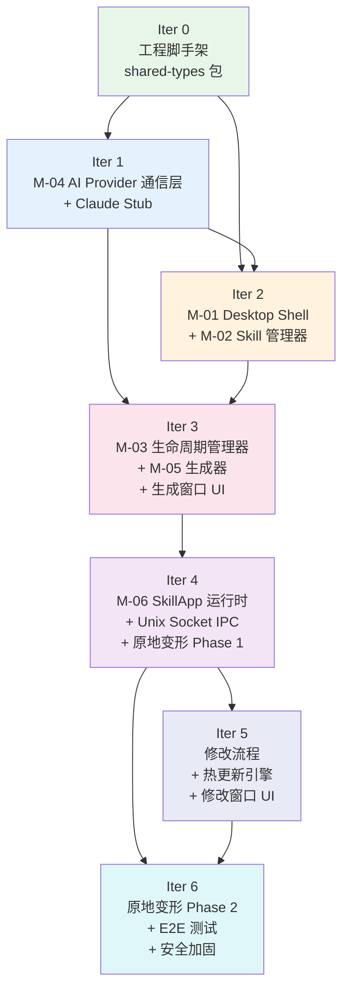

# IntentOS Agent Teams 开发调度计划

> **版本**：v2.0 | **日期**：2026-03-13
> **状态**：Agent 调度规范文档

---

## 1. 总体调度策略

### Orchestrator 职责

主控 claude（orchestrator）负责：
- 读取本文档，按迭代顺序发起 agent 派发
- 每个迭代开始前确认前置迭代的 verifier agent 已输出「验收通过」信号
- 并行组内同时派发，无需等待先后完成
- 收集所有 agent 产出路径，传递给下一批 agent 作为输入

### 迭代推进规则

每个迭代完成后必须通过双重关卡才能进入下一迭代：

```
并行/串行任务全部完成
         ↓
code-reviewer agent 执行 checklist review
         ↓ 若有 issue → 返回对应 executor/designer 修复 → 重新 review
全部通过
         ↓
verifier agent 执行验收条件逐项验证
         ↓ 若有失败 → debugger agent 介入修复 → 重新 verifier
全部通过 → 迭代完成，进入下一迭代
```

### 并行派发规则

- 同一「并行组」内的所有 agent 同时派发，不等待彼此
- 只有串行依赖（下一步需要读取上一步产出文件）才排成串行
- test-engineer agent 与主线并行运行，不阻塞迭代推进，但测试必须在 verifier 关卡前完成

### 任务复杂度标记说明

- **S**：单文件或少量胶水代码，约 1-2 个独立逻辑单元
- **M**：多文件模块实现，含状态管理或 IPC 绑定
- **L**：跨多个子系统、含协议设计或复杂状态机

---

## 2. 开发文档产出清单（Step 7）

以下文档由 **writer agent** 在对应迭代启动前产出，服务于指定迭代的 executor/designer agent 作为唯一输入规范。

| 文档文件名 | 产出 agent | 服务迭代 | 复杂度 |
|-----------|-----------|---------|-------|
| `docs/dev-docs/shared-types.md` | writer agent | Iter 0 前 | M |
| `docs/dev-docs/claude-api-mock.md` | writer agent | Iter 1 前 | M |
| `docs/dev-docs/m04-ai-provider.md` | writer agent | Iter 1 前 | L |
| `docs/dev-docs/ipc-channels.md` | writer agent | Iter 2 前 | M |
| `docs/dev-docs/m02-skill-manager.md` | writer agent | Iter 2 前 | M |
| `docs/dev-docs/m03-lifecycle-manager.md` | writer agent | Iter 3 前 | M |
| `docs/dev-docs/m05-generator.md` | writer agent | Iter 3 前 | L |
| `docs/dev-docs/m06-runtime.md` | writer agent | Iter 4 前 | L |
| `docs/dev-docs/skillapp-template.md` | writer agent | Iter 4 前 | M |
| `docs/dev-docs/unix-socket-ipc.md` | writer agent | Iter 4 前 | M |
| `docs/dev-docs/hot-update-protocol.md` | writer agent | Iter 5 前 | M |
| `docs/dev-docs/e2e-test-plan.md` | writer agent | Iter 6 前 | M |

**writer agent 职责**：读取 `docs/idea.md`、`docs/modules.md`、`docs/requirements.md`、`docs/spec/` 目录下相关规格文件（包括 `ai-provider-spec.md`），产出对应的开发文档。文档必须包含接口签名、数据 schema、状态机图（Mermaid）、错误码定义。产出后由 architect agent 阅读审查，确认内容完整后方可用于对应迭代。

---

## 3. 各迭代调度详情

---

### Iteration 0：工程脚手架与工具链

#### 迭代目标

项目骨架可编译、lint 通过、显示空白窗口，共享类型包在三进程中均可 import。

#### 输入

- 前置依赖：无
- 需读取文档：`docs/idea.md`、`docs/dev-docs/shared-types.md`（writer agent 在本迭代启动前产出）

#### 任务派发

**并行组 A**（同时派发给以下 3 个 agent）：

- executor agent A1：读取 `docs/dev-docs/shared-types.md`，创建 electron-vite 三进程项目骨架（main/preload/renderer 三目标 vite 配置 + electron-builder 打包配置），产出 `electron.vite.config.ts`、`electron-builder.yml`、`package.json`（根及子包）、`src/main/index.ts`（空壳）、`src/preload/index.ts`（空壳）、`src/renderer/main.tsx`（空壳）。复杂度：M。

- executor agent A2：读取 `docs/dev-docs/shared-types.md`，配置 TypeScript strict mode（`tsconfig.json` 覆盖 main/preload/renderer 三目标）+ ESLint 9 flat config（`eslint.config.js`，含 import 排序规则）+ Prettier（`.prettierrc`），产出上述配置文件。复杂度：S。

- executor agent A3：读取 `docs/dev-docs/shared-types.md`，在 A1 骨架基础上配置 Vitest（含 jsdom 环境，`vitest.config.ts`）+ Playwright（`playwright.config.ts`，使用 `_electron.launch` 基础配置），产出配置文件及 `tests/` 目录结构。复杂度：S。

**串行任务 B**（并行组 A 全部完成后执行）：

- executor agent B1：读取 `docs/dev-docs/shared-types.md` 及 A1 产出的项目结构，在 `packages/shared-types/` 下实现 `@intentos/shared-types` 包，定义所有跨模块共享类型：`SkillMeta`、`AppMeta`、`ConnectionStatus`、`PlanChunk`、`GenProgress`、`UpdatePackage` 等，配置 Zod schema 验证。产出 `packages/shared-types/src/index.ts` 及子类型文件、`packages/shared-types/package.json`。复杂度：M。

- executor agent B2：读取 A1~A3 产出的全部配置文件，搭建 GitHub Actions CI（`.github/workflows/ci.yml`）：lint + type-check + unit-test 三个 stage，矩阵覆盖 macOS/Windows/Ubuntu。产出 `.github/workflows/ci.yml`。复杂度：S。

#### Review 关卡

**code-reviewer agent**：检查以下内容：
- `@intentos/shared-types` 在 main/preload/renderer 三个 tsconfig 中均可正确解析（path alias 配置）
- ESLint 规则覆盖所有子目录（`eslint.config.js` 路径匹配无遗漏）
- Vitest 和 Playwright 配置与 electron-vite 三目标不冲突
- CI 矩阵覆盖三平台，三个 stage 依赖关系正确
- 若发现 issue → 返回对应 executor agent 修复 → 重新 review
- 全部通过 → verifier agent 验证

**verifier agent**：执行以下验证：
- `npm run dev` 能启动 Electron 窗口，显示空白 React 页面，无控制台错误
- `npm run lint` 通过，`npm run type-check` 通过
- `npm run test:unit` 输出「no test files found」（框架就绪）
- 在 `src/main/index.ts` 中 `import { SkillMeta } from '@intentos/shared-types'` 无 TS 错误
- 全部通过 → 迭代完成，进入 Iter 1
- 有失败 → debugger agent 介入 → 修复后重新 verifier

#### 测试任务

- test-engineer agent：为 `packages/shared-types/` 编写 Vitest 单元测试，验证所有 Zod schema 对边界输入的校验行为，产出 `packages/shared-types/src/__tests__/types.test.ts`。复杂度：S。

---

### Iteration 1：Claude API Provider 实现

#### 迭代目标

M-04 AI Provider 通信层完整可用：`ClaudeAPIProvider` 实现 `AIProvider` 接口（`planApp()`/`generateCode()`/`executeSkill()`），API Key 安全存储与校验，流式 SSE → IPC 转发正常工作，Claude API Stub 可独立运行驱动后续迭代开发（无需消耗真实 API 配额）。

#### 输入

- 前置依赖：Iter 0 所有产出（共享类型包、项目骨架）
- 需读取文档：`docs/dev-docs/m04-ai-provider.md`、`docs/dev-docs/claude-api-mock.md`、`docs/dev-docs/shared-types.md`、`docs/spec/ai-provider-spec.md`

#### 任务派发

**并行组 A**（同时派发给以下 3 个 agent）：

- executor agent A1：读取 `docs/dev-docs/claude-api-mock.md`，实现 Claude API Stub（测试替身，Node.js HTTP 服务器）。Stub 拦截 `@anthropic-ai/sdk` 的底层 HTTP 请求（通过环境变量 `ANTHROPIC_BASE_URL` 重定向），返回模拟的 SSE 流式响应（规划：每 200ms 一个 `content_block_delta`，共 8 个，最终包含 JSON 规划结果；生成：模拟 `tool_use` 事件序列：write_file × 3 → run_command tsc → run_command bundle）、模拟成功/失败/限速（`429`）场景（通过 `POST /stub/config` 控制），仅在测试/开发环境暴露，生产构建排除。产出 `claude-stub/src/index.ts`、`claude-stub/src/handlers/`、`claude-stub/package.json`。复杂度：M。

- executor agent A2：读取 `docs/dev-docs/m04-ai-provider.md`、`docs/spec/ai-provider-spec.md`，定义 `AIProvider` 接口及所有共享类型（`ProviderStatus`、`ProviderConfig`、`PlanChunk`、`GenProgressChunk`、`SkillCallRequest`、`SkillCallResult`、`ProviderErrorCode`）并发布到 `@intentos/shared-types` 包（追加到 Iter 0 产出的 shared-types 包中）。实现 `AIProviderManager`（`src/main/modules/ai-provider/provider-manager.ts`）：管理激活 Provider 实例、`setProvider()`、`getProviderStatus()`、`onStatusChanged` 事件、请求队列管理器（并发槽位控制默认 1、FIFO 队列、超时处理）。产出 `packages/shared-types/src/provider.ts`（追加类型）、`src/main/modules/ai-provider/provider-manager.ts`、`src/main/modules/ai-provider/request-queue.ts`、`src/main/modules/ai-provider/types.ts`。复杂度：L。

- executor agent A3：读取 `docs/dev-docs/m04-ai-provider.md`、`docs/spec/ai-provider-spec.md`，实现 API Key 安全存储（`src/main/modules/ai-provider/api-key-store.ts`）：`saveApiKey(key: string): Promise<void>`（使用 `electron.safeStorage.encryptString` 加密后写入 userData 目录）、`loadApiKey(): Promise<string | null>`（读取并解密）、`deleteApiKey(): Promise<void>`，跨平台兼容（macOS/Windows/Linux 的 safeStorage 可用性检测与降级）。产出 `src/main/modules/ai-provider/api-key-store.ts`。复杂度：S。

**串行任务 B**（A2、A3 均完成后执行）：

- executor agent B1：读取 A2 产出的 `provider-manager.ts`、A3 产出的 `api-key-store.ts`、`docs/spec/ai-provider-spec.md` 第 2 节，实现 `ClaudeAPIProvider`（`src/main/modules/ai-provider/claude-api-provider.ts`）实现 `AIProvider` 接口：`initialize(config)` 从 api-key-store 读取 Key 后发送测试请求（`messages.create` with `max_tokens: 1`）校验有效性；`planApp(request)` 使用 `@anthropic-ai/sdk` 的 `messages.stream()` 发起 SSE 流式规划请求（系统 prompt 注入 Skill 列表和 IntentOS 代码约束），将 `content_block_delta` 事件映射为 `PlanChunk` 逐块 yield，`message_stop` 后解析 JSON 规划结果 yield `phase: "complete"` chunk；`executeSkill(request)` 通过 `messages.create` + tool_use 执行 Skill 调用；`cancelSession(sessionId)` 调用对应 `AbortController.abort()`。依赖 A1 Stub（通过 `ANTHROPIC_BASE_URL` 环境变量切换）。产出 `src/main/modules/ai-provider/claude-api-provider.ts`。复杂度：L。

- executor agent B2：读取 A2 产出的 `provider-manager.ts` 及 `docs/spec/ai-provider-spec.md` 第 2.3 节，实现 `ClaudeAPIProvider.generateCode()` 方法（独立任务，复杂度高）：使用 `@anthropic-ai/claude-agent-sdk` 的 `query()` API + 内置 MCP Server（提供 `write_file`/`run_command`/`read_file` 工具），构造代码生成系统 prompt（注入 PlanResult + SkillApp 目录结构约束 + React 18 + TypeScript + Electron 代码模板）。监听工具调用事件将其映射为 `GenProgressChunk` yield（`write_file` → codegen 进度；`run_command tsc` → compile 进度；`run_command bundle` → bundle 进度）。最终 yield `GenCompleteChunk`。产出 `src/main/modules/ai-provider/claude-api-provider-generate.ts`（合并进 claude-api-provider.ts 或作为 mixin）、`src/main/modules/ai-provider/build-mcp-server.ts`。复杂度：L。

**串行任务 C**（B1、B2 均完成后执行）：

- executor agent C1：读取 B1/B2 所有产出，实现流式 IPC 转发桥接（`src/main/modules/ai-provider/ai-provider-bridge.ts`）：`ipcMain.handle("ai-provider:plan")` → 调用 provider.planApp → 通过 `event.sender.send("ai-provider:plan-chunk:{sessionId}")` 逐 chunk 转发到渲染进程；`ipcMain.handle("ai-provider:generate")` → 同理转发 GenProgressChunk；`ipcMain.handle("ai-provider:skill-call")` → 直接 invoke 返回；`ipcMain.handle("ai-provider:cancel")` → cancelSession；`ipcMain.handle("ai-provider:status")` → getProviderStatus。产出 `src/main/modules/ai-provider/ai-provider-bridge.ts`。复杂度：M。

- executor agent C2：读取 B1 产出及 `docs/spec/electron-spec.md` preload 部分，实现 Desktop preload 中的 AI Provider API（`src/preload/api/ai-provider.ts`）：`contextBridge.exposeInMainWorld` 暴露 `window.intentOS.aiProvider`（plan/onPlanChunk/onPlanComplete/generate/onGenProgress/cancelSession/getStatus/onStatusChanged），与 ai-provider-bridge.ts 中注册的 IPC channel 完整对应。产出 `src/preload/api/ai-provider.ts`。复杂度：S。

- executor agent C3：汇总导出 M-04 模块入口（`src/main/modules/ai-provider/index.ts`），注册所有 IPC handler（整合进主进程初始化流程）。产出 `src/main/modules/ai-provider/index.ts`。复杂度：S。

#### Review 关卡

**code-reviewer agent**：检查以下内容：
- `AIProvider` 接口定义与 `docs/spec/ai-provider-spec.md` 第 1.2 节完全一致（方法签名、返回类型）
- API Key 不在任何日志中明文输出（`api-key-store.ts` 的读写操作，日志应 mask 为 `sk-ant-***`）
- `planApp()` 的 AbortController 在 `cancelSession()` 调用时正确触发，不产生悬空 Promise
- 流式 IPC 转发的 sessionId 隔离——两个并发规划会话的 chunk 不能互串
- Claude Stub 的 `ANTHROPIC_BASE_URL` 切换逻辑确保不会在生产构建中被意外激活
- 若发现 issue → 返回对应 executor agent 修复 → 重新 review
- 全部通过 → verifier agent 验证

**verifier agent**：执行以下验证：
- 启动 Claude Stub，设置 `ANTHROPIC_BASE_URL=http://localhost:PORT`，调用 `provider.planApp()`，接收到 8 个流式 PlanChunk，最后一个 phase="complete" 含合法 PlanResult JSON
- 调用 `provider.generateCode()`，接收到 write_file → compile → bundle 三阶段 GenProgressChunk，最终 GenCompleteChunk 包含 `entryPoint` 和 `outputDir`
- 调用 `cancelSession(sessionId)` 后，流式输出立即停止，不触发 error 事件
- Claude Stub 返回 HTTP 429 时，provider 状态变为 `rate_limited`，3 次指数退避重试后失败报错
- `api-key-store` 读写测试：`saveApiKey("test-key")` → `loadApiKey()` 返回 `"test-key"` → `deleteApiKey()` → `loadApiKey()` 返回 `null`
- 流式 IPC 转发：两个并发 plan 会话各自 chunk 到达对应的渲染进程 IPC channel，无串流
- `npm run test:unit` 中 M-04 相关测试全部通过
- 全部通过 → 迭代完成，进入 Iter 2
- 有失败 → debugger agent 介入 → 修复后重新 verifier

#### 测试任务

- test-engineer agent：为 M-04 编写 Vitest 单元测试，覆盖：`AIProvider` 接口合规性（`ClaudeAPIProvider` 能正确赋值给 `AIProvider` 类型）、`planApp()` 流式输出 chunk 序列正确（使用 Claude Stub）、`cancelSession()` 中止流式输出、`providerManager` 请求队列并发控制（超过槽位进队列）、API Key safeStorage 读写（使用 Electron 测试工具）。产出 `src/main/modules/ai-provider/__tests__/claude-api-provider.test.ts`、`provider-manager.test.ts`、`api-key-store.test.ts`。复杂度：M。

---

### Iteration 2：Desktop Shell + Skill 管理

#### 迭代目标

Desktop 显示三栏布局，Skill 管理中心可注册/卸载 Skill，状态栏实时反映 AI Provider 连接状态，设置页面支持 API Key 配置与连接测试。

#### 输入

- 前置依赖：Iter 0 产出（骨架 + shared-types），Iter 1 产出（M-04 模块）
- 需读取文档：`docs/dev-docs/ipc-channels.md`、`docs/dev-docs/m02-skill-manager.md`、`docs/dev-docs/shared-types.md`

#### 任务派发

**串行任务 A**（最先执行，其他并行组依赖此产出）：

- executor agent A1：读取 `docs/dev-docs/ipc-channels.md`，实现 Electron 主进程框架（`src/main/app.ts`）：窗口管理器、IPC Hub（`ipcMain.handle` 注册机制）、应用生命周期（单实例锁、自动启动、系统托盘）。产出 `src/main/app.ts`、`src/main/window-manager.ts`、`src/main/ipc-hub.ts`。复杂度：M。

- executor agent A2：读取 A1 产出的 `ipc-hub.ts` 及 `docs/dev-docs/ipc-channels.md`，实现 Desktop preload 脚本（`src/preload/index.ts`）：contextBridge 暴露 skill/app/generation/settings 四个域 API，类型安全封装与 shared-types 对齐。产出 `src/preload/index.ts`、`src/preload/api/skill.ts`、`src/preload/api/app.ts`、`src/preload/api/generation.ts`、`src/preload/api/settings.ts`。复杂度：M。

**并行组 B**（A1、A2 完成后同时派发）：

- executor agent B1：读取 `docs/dev-docs/m02-skill-manager.md`、`docs/dev-docs/shared-types.md`，实现 M-02 Skill 管理器（`src/main/modules/skill-manager/`）：注册/卸载、元数据读取与缓存、依赖关系检查、引用计数维护、版本管理、本地目录扫描，使用 better-sqlite3 存储。产出 `src/main/modules/skill-manager/skill-manager.ts`、`src/main/modules/skill-manager/db.ts`、`src/main/modules/skill-manager/types.ts`、`src/main/modules/skill-manager/index.ts`。复杂度：M。

- designer agent B2：读取 `docs/dev-docs/ipc-channels.md`、`docs/idea.md` 中 Desktop UI 部分，实现渲染进程框架（`src/renderer/`）：React 18 + React Router 7 + Zustand 5 初始化、三栏布局骨架（`AppLayout.tsx`）、侧栏导航组件（`Sidebar.tsx`）、shadcn/ui + Tailwind 4 基础样式配置。产出 `src/renderer/App.tsx`、`src/renderer/layouts/AppLayout.tsx`、`src/renderer/components/Sidebar.tsx`、`src/renderer/router.tsx`、`tailwind.config.ts`。复杂度：M。

**串行任务 C**（B1 完成后执行）：

- executor agent C1：读取 B1 产出的 `skill-manager.ts` 及 A2 产出的 preload API，注册 skill-manager IPC handler（`src/main/ipc-handlers/skill-handlers.ts`）：主进程 `ipcMain.handle` 绑定 M-02 所有方法，完成双向类型约束。产出 `src/main/ipc-handlers/skill-handlers.ts`。复杂度：S。

**并行组 D**（B2 和 C1 均完成后同时派发）：

- designer agent D1：读取 B2 产出的布局骨架及 C1 产出的 IPC handler，实现 Skill 管理中心 UI（`src/renderer/pages/skill-manager/`）：已安装 Skill 列表、Skill 详情卡片、手动注册弹窗（目录路径输入）、卸载确认对话框（含引用计数展示和被引用 App 名称）、依赖检查结果展示。产出 `src/renderer/pages/skill-manager/SkillManagerPage.tsx`、`src/renderer/pages/skill-manager/SkillCard.tsx`、`src/renderer/pages/skill-manager/RegisterDialog.tsx`、`src/renderer/pages/skill-manager/UninstallDialog.tsx`。复杂度：M。

- designer agent D2：读取 B2 产出的布局骨架，实现状态栏组件（`src/renderer/components/StatusBar.tsx`）：AI Provider 连接状态指示灯（就绪/错误/限速三态，对应绿/红/黄）、已安装 Skill 数量、运行中 App 数量，订阅 `window.intentOS.aiProvider.onStatusChanged` 事件实时更新。实现全局设置页面（`src/renderer/pages/settings/SettingsPage.tsx`）：AI Provider 下拉选择（Claude API 可选，OpenClaw 灰显「即将推出」）、API Key 输入框（显示 masked 值）、「测试连接」按钮（触发 API Key 校验并显示结果）、隐私说明横幅、设置持久化。产出 `src/renderer/components/StatusBar.tsx`、`src/renderer/pages/settings/SettingsPage.tsx`、`src/renderer/stores/provider-store.ts`。复杂度：M。

#### Review 关卡

**code-reviewer agent**：检查以下内容：
- preload contextBridge 暴露的所有 API 与 `ipc-channels.md` 定义的 channel 名称一一对应
- IPC handler 类型约束：渲染进程调用 `window.skill.getInstalledSkills()` 的返回类型与 shared-types 完全一致
- M-02 Skill 管理器的 SQLite schema 与 `m02-skill-manager.md` 一致，事务正确性
- 引用计数保护：有 App 引用时 unregisterSkill 必须拒绝并返回引用列表
- Skill 管理中心 UI 的错误状态覆盖（网络错误、权限错误）
- 若发现 issue → 返回对应 executor/designer agent 修复 → 重新 review
- 全部通过 → verifier agent 验证

**verifier agent**：执行以下验证：
- Desktop 启动后显示三栏布局，侧栏导航可切换到「Skill 管理」和「设置」页面
- 手动指定本地 Skill 目录，注册后出现在列表中（含名称、版本、描述、依赖信息）
- 卸载引用计数 > 0 的 Skill 时弹出确认对话框并显示被引用 App 名称
- 状态栏指示灯：Claude Stub 就绪后变绿，Stub 停止后变红
- 设置页面输入 API Key 后点击「测试连接」，连接成功显示绿色勾，无效 Key 显示红色错误提示
- `npm run test:unit` 中 M-02 相关测试全部通过
- 全部通过 → 迭代完成，进入 Iter 3
- 有失败 → debugger agent 介入 → 修复后重新 verifier

#### 测试任务

- test-engineer agent：为 M-02 Skill 管理器编写 Vitest 单元测试，覆盖：registerSkill 幂等性、unregisterSkill 引用计数保护、checkDependencies 各种缺失情况、SQLite 事务（写入失败回滚）、重启后 Skill 列表从 SQLite 完整恢复。产出 `src/main/modules/skill-manager/__tests__/skill-manager.test.ts`。复杂度：M。

---

### Iteration 3：SkillApp 生成流水线

#### 迭代目标

完整生成流程（意图输入 → 规划多轮交互 → 确认生成 → 编译打包）端到端可用（使用 Claude Stub，无需真实 API 配额）；SkillApp 管理中心展示 App 列表。

#### 输入

- 前置依赖：Iter 1 产出（M-04 模块），Iter 2 产出（M-01 框架、IPC 基础设施、渲染进程框架）
- 需读取文档：`docs/dev-docs/m03-lifecycle-manager.md`、`docs/dev-docs/m05-generator.md`、`docs/dev-docs/ipc-channels.md`、`docs/dev-docs/shared-types.md`

#### 任务派发

**并行组 A**（同时派发给以下 2 个 agent）：

- executor agent A1：读取 `docs/dev-docs/m03-lifecycle-manager.md`、`docs/dev-docs/shared-types.md`，实现 M-03 SkillApp 生命周期管理器（`src/main/modules/lifecycle-manager/`）：SQLite 注册表维护、进程启停（`child_process.spawn`）、运行状态监控、崩溃检测与重启（最多 3 次）、窗口调度、App 卸载清理。产出 `src/main/modules/lifecycle-manager/lifecycle-manager.ts`、`src/main/modules/lifecycle-manager/db.ts`、`src/main/modules/lifecycle-manager/process-watcher.ts`、`src/main/modules/lifecycle-manager/index.ts`。复杂度：L。

- executor agent A2：读取 `docs/dev-docs/m05-generator.md`、`docs/dev-docs/shared-types.md`，实现 M-05 生成器规划阶段（`src/main/modules/generator/plan-session.ts`）：startPlanSession（接收 skillIds + intent → 通过 M-04 AI Provider 通信层调用 `provider.planApp()` → 流式返回 PlanUpdate）、refinePlan（多轮交互追加反馈，PlanSession 会话状态管理，上下文历史正确累积）。产出 `src/main/modules/generator/plan-session.ts`、`src/main/modules/generator/types.ts`。复杂度：L。

**串行任务 B**（A1、A2 均完成后执行）：

- executor agent B1：读取 A1 产出的 `lifecycle-manager.ts` 及 `docs/dev-docs/ipc-channels.md`，注册 app-lifecycle IPC handler（`src/main/ipc-handlers/app-handlers.ts`）：绑定 M-03 所有方法（launchApp/stopApp/registerApp/uninstallApp/focusAppWindow）。产出 `src/main/ipc-handlers/app-handlers.ts`。复杂度：S。

- executor agent B2：读取 A2 产出的 `plan-session.ts` 及 `docs/dev-docs/m05-generator.md`，实现 M-05 生成器生成+编译阶段（`src/main/modules/generator/generate-session.ts`）：confirmAndGenerate（调用 M-04 AI Provider 通信层的 `provider.generateCode()` → 消费 GenProgressChunk 流、映射到三段式进度 → 产物写入目标目录）、三段式进度上报（代码生成 40% → 编译打包 80% → 初始化 100%）。产出 `src/main/modules/generator/generate-session.ts`。复杂度：L。

**串行任务 C**（B2 完成后执行）：

- executor agent C1：读取 B2 产出的 `generate-session.ts`，实现编译错误自动修复循环（`src/main/modules/generator/compile-fixer.ts`）：编译失败 → 格式化错误信息 → 通过 M-04 AI Provider 重新调用 Claude 修复代码 → 重新编译，最多重试 3 次，超过次数后返回结构化错误对象。产出 `src/main/modules/generator/compile-fixer.ts`。复杂度：M。

- executor agent C2：读取 B1/B2/C1 所有产出，汇总注册 generation IPC handler（`src/main/ipc-handlers/generation-handlers.ts`）：绑定 M-05 所有方法，含流式响应转发到对应渲染进程。产出 `src/main/ipc-handlers/generation-handlers.ts`、`src/main/modules/generator/index.ts`。复杂度：S。

**并行组 D**（C2 完成后同时派发）：

- designer agent D1：读取 C2 产出的 generation IPC handler 及 `docs/dev-docs/m05-generator.md`，实现应用生成窗口 UI（`src/renderer/pages/generation/`）：三阶段向导（阶段 1：Skill 选择 + 意图输入；阶段 2：规划交互多轮对话实时展示 PlanUpdate；阶段 3：三段式进度条），错误状态展示（含重试和返回修改方案操作）。产出 `src/renderer/pages/generation/GenerationWindow.tsx`、`src/renderer/pages/generation/SkillSelector.tsx`、`src/renderer/pages/generation/PlanDialog.tsx`、`src/renderer/pages/generation/ProgressView.tsx`、`src/renderer/stores/generation-store.ts`。复杂度：L。

- designer agent D2：读取 B1 产出的 app-lifecycle IPC handler，实现 SkillApp 管理中心 UI（`src/renderer/pages/app-manager/`）：App 卡片列表（含运行状态实时指示）、启动/停止/修改/卸载操作、订阅 onAppStatusChanged 事件实时刷新。产出 `src/renderer/pages/app-manager/AppManagerPage.tsx`、`src/renderer/pages/app-manager/AppCard.tsx`、`src/renderer/stores/app-store.ts`。复杂度：M。

#### Review 关卡

**code-reviewer agent**：检查以下内容：
- M-05 规划阶段：refinePlan 调用时 PlanSession 上下文正确累积（Claude API 收到完整对话历史 contextHistory）
- 编译错误修复循环：第 3 次失败后不再重试，返回结构化错误（含所有编译错误详情）
- generation IPC handler 流式响应按 sessionId 路由到正确的渲染进程（不广播给所有窗口）
- M-03 崩溃重启：重启次数超上限后转为 `stopped` 状态，不无限循环
- App 管理中心 UI 的状态订阅：Desktop 重启后 App 状态从 SQLite 恢复并正确展示
- 若发现 issue → 返回对应 executor/designer agent 修复 → 重新 review
- 全部通过 → verifier agent 验证

**verifier agent**：执行以下验证：
- 点击「新建应用」，打开生成窗口，选择 2 个 Skill，输入意图文本
- 阶段 2：Claude Stub 流式返回规划方案，生成窗口实时展示 Plan 内容；输入反馈后方案更新
- 点击「确认生成」，阶段 3 进度条依次推进：40% → 80% → 100%
- Mock Server 返回含 TypeScript 错误代码时，自动重试最多 3 次，第 3 次后界面显示「生成失败」和详细错误
- SkillApp 管理中心展示 App 列表，运行中 App 有绿色状态指示
- 全部通过 → 迭代完成，进入 Iter 4
- 有失败 → debugger agent 介入 → 修复后重新 verifier

#### 测试任务

- test-engineer agent：编写以下测试：
  - M-05 规划阶段：多轮 refinePlan 后 PlanSession 上下文累积正确性（Vitest）
  - 编译错误修复循环：mock 编译失败 3 次，验证第 3 次后不再重试（Vitest）
  - 流式进度上报完整链路：SSE → M-04 → IPC → 渲染进程进度条（集成测试，使用 Mock Server）
  - M-03 状态机：stopped → starting → running → crashed → restarting 转换（Vitest）
  - 产出 `src/main/modules/generator/__tests__/plan-session.test.ts`、`compile-fixer.test.ts`，`src/main/modules/lifecycle-manager/__tests__/lifecycle-manager.test.ts`。复杂度：M。

---

### Iteration 4：SkillApp 运行时 + 原地变形

#### 迭代目标

完整三条主路径端到端可运行：生成 → 原地变形 → SkillApp 运行，SkillApp 内可通过 Unix Socket 调用 Skill，权限弹窗可用。

#### 输入

- 前置依赖：Iter 3 所有产出（M-03/M-05 模块、生成窗口 UI、IPC 基础设施）
- 需读取文档：`docs/dev-docs/m06-runtime.md`、`docs/dev-docs/skillapp-template.md`、`docs/dev-docs/unix-socket-ipc.md`、`docs/dev-docs/shared-types.md`

#### 任务派发

**并行组 A**（同时派发给以下 3 个 agent）：

- executor agent A1：读取 `docs/dev-docs/skillapp-template.md`，实现 SkillApp 代码模板（`src/skillapp-template/`）：`package.json.template`、`main.js.template`（含 Unix Socket 握手初始化桩）、`preload.js.template`（contextBridge 暴露 Runtime API）、页面路由 dynamic import 结构（`src/renderer/router.template.ts`）。产出 `src/skillapp-template/` 目录下所有模板文件。复杂度：M。

- executor agent A2：读取 `docs/dev-docs/m06-runtime.md`、`docs/dev-docs/unix-socket-ipc.md`，实现 M-06 Runtime 主进程模块（`packages/skillapp-runtime/src/main.ts`）：与 Desktop Unix Socket 建链、握手、权限信息缓存、热更新接收器框架（`applyHotUpdate` 接口）。产出 `packages/skillapp-runtime/src/main.ts`、`packages/skillapp-runtime/src/types.ts`、`packages/skillapp-runtime/package.json`。复杂度：L。

- executor agent A3：读取 `docs/dev-docs/unix-socket-ipc.md`，实现 Desktop Unix Socket IPC Server（`src/main/modules/socket-server/`）：监听各 `{appId}.sock` 端点、JSON-RPC 2.0 方法分发（skill.call/resource.access/permission.request/status.report/heartbeat）、多路并发会话管理。产出 `src/main/modules/socket-server/socket-server.ts`、`src/main/modules/socket-server/rpc-dispatcher.ts`、`src/main/modules/socket-server/session-manager.ts`、`src/main/modules/socket-server/index.ts`。复杂度：L。

**串行任务 B**（A2 完成后执行）：

- executor agent B1：读取 A2 产出的 `packages/skillapp-runtime/src/main.ts`，实现 M-06 Runtime 渲染进程 API（`packages/skillapp-runtime/src/renderer.ts`）：callSkill/accessResource/requestPermission 的 IPC 封装，通过 contextBridge 暴露给 SkillApp 业务代码。产出 `packages/skillapp-runtime/src/renderer.ts`。复杂度：M。

**串行任务 C**（A1、A3 均完成后执行）：

- executor agent C1：读取 A1 产出的模板文件及 Iter 3 的 `generate-session.ts`，将 M-05 生成器集成 SkillApp 模板（修改 `src/main/modules/generator/generate-session.ts`）：confirmAndGenerate 完成后将模板复制到 targetDir，填入 appId/skillIds/metadata，生成可直接运行的 SkillApp 目录。产出：修改后的 `src/main/modules/generator/generate-session.ts`。复杂度：M。

**并行组 D**（A3 完成后同时派发）：

- executor agent D1：读取 A3 产出的 `socket-server.ts`，实现权限弹窗（`src/main/ipc-handlers/permission-handlers.ts`）：Desktop 主进程接收 permission.request JSON-RPC → 弹出系统级权限确认对话框（`dialog.showMessageBox`）→ 用户授权后持久化到 `userData/permissions.json` → 返回授权结果。产出 `src/main/ipc-handlers/permission-handlers.ts`、`src/main/modules/permission-store.ts`。复杂度：M。

- executor agent D2：读取 A3 产出的 `socket-server.ts`，实现 MCP 资源代理（`src/main/modules/mcp-proxy/`）：Desktop 主进程接收 resource.access JSON-RPC → 使用 `@modelcontextprotocol/sdk` 执行对应 MCP 工具 → 返回资源数据，支持 fs/net/process 三类。产出 `src/main/modules/mcp-proxy/mcp-proxy.ts`、`src/main/modules/mcp-proxy/index.ts`。复杂度：M。

**串行任务 E**（C1、D1、D2 均完成后执行）：

- executor agent E1：读取 C1、Iter 3 M-03 产出的 `lifecycle-manager.ts`，实现原地变形 Phase 1（`src/main/modules/morphing/morph-phase1.ts`）：方案 B 位置迁移——getBounds 获取生成窗口位置 → spawn SkillApp 独立进程（通过 M-03）→ 隐藏窗口同坐标创建 → 收到 ready 信号（15s 超时）→ show SkillApp 窗口 → close 生成窗口；含变形失败边界处理（超时后直接切换）。产出 `src/main/modules/morphing/morph-phase1.ts`、`src/main/modules/morphing/index.ts`。复杂度：L。

#### Review 关卡

**code-reviewer agent**：检查以下内容：
- Unix Socket IPC Server 的多路并发会话路由：2 个 SkillApp 并发 skill.call 请求各自收到正确响应（不串路由）
- 权限持久化：相同资源相同权限不重复弹窗；权限被拒绝时 `requestPermission()` 返回 `{ granted: false }`
- SkillApp 模板的 `contextIsolation: true`、`nodeIntegration: false`、`sandbox: true` 三项全开
- 原地变形超时处理：15s 未收到 ready 信号时降级直接切换，不卡死
- MCP 代理使用官方 SDK，不自行实现协议解析
- 若发现 issue → 返回对应 executor agent 修复 → 重新 review
- 全部通过 → verifier agent 验证

**verifier agent**：执行以下验证：
- 完整生成流程跑通后，生成窗口执行原地变形：窗口位置不变，内容从生成进度切换为 SkillApp UI
- SkillApp 内调用 `callSkill(skillId, method, params)` 通过 Unix Socket → Desktop → Mock Server 返回值
- SkillApp 调用 `accessResource({ type: 'fs', ... })` 弹出权限确认弹窗，授权后返回文件内容
- 授权结果持久化：重启 SkillApp 后相同资源访问不再弹窗
- 全部通过 → 迭代完成，进入 Iter 5
- 有失败 → debugger agent 介入 → 修复后重新 verifier

#### 测试任务

- test-engineer agent：编写以下测试：
  - Unix Socket IPC Server 并发测试：2 个 SkillApp 同时 skill.call，各自收到正确响应（Vitest + 真实 socket）
  - 原地变形超时处理：mock SkillApp 不发送 ready 信号，15s 后触发降级（Vitest）
  - 权限模型：相同资源不重复弹窗、拒绝权限返回 `{ granted: false }`（Vitest）
  - M-06 Runtime 初始化握手时序正确性（Vitest）
  - 产出 `src/main/modules/socket-server/__tests__/socket-server.test.ts`、`src/main/modules/morphing/__tests__/morph-phase1.test.ts`、`packages/skillapp-runtime/src/__tests__/runtime.test.ts`。复杂度：M。

---

### Iteration 5：修改流程 + 热更新

#### 迭代目标

三条主路径中第二条（修改流程）完整可用：用户可对运行中的 SkillApp 提出修改需求，热更新在不重启进程的情况下生效，并可自动回滚。

#### 输入

- 前置依赖：Iter 4 所有产出（M-06 Runtime、Unix Socket IPC Server、原地变形 Phase 1）
- 需读取文档：`docs/dev-docs/m05-generator.md`（增量修改部分）、`docs/dev-docs/m06-runtime.md`（热更新部分）、`docs/dev-docs/hot-update-protocol.md`、`docs/dev-docs/ipc-channels.md`

#### 任务派发

**并行组 A**（同时派发给以下 3 个 agent）：

- executor agent A1：读取 `docs/dev-docs/m05-generator.md`、`docs/dev-docs/hot-update-protocol.md`，实现 M-05 增量修改规划（`src/main/modules/generator/modify-session.ts`）：startModifySession（读取现有 SkillApp 代码结构分析上下文 → 调用 AI Provider (Claude API) 生成增量方案 → 返回含新增/修改/不变分类的 ModifySession）。产出 `src/main/modules/generator/modify-session.ts`。复杂度：M。

- executor agent A2：读取 `docs/dev-docs/m06-runtime.md`、`docs/dev-docs/hot-update-protocol.md`，实现 M-06 热更新引擎（`src/main/modules/hot-updater/hot-updater.ts`）：applyHotUpdate（backup 现有文件到 `backup/` → 写入新文件 → tsc 增量编译 → dynamic import() 替换模块 → 失败时 `webContents.reloadIgnoringCache()` 兜底）。产出 `src/main/modules/hot-updater/hot-updater.ts`、`src/main/modules/hot-updater/backup-manager.ts`、`src/main/modules/hot-updater/index.ts`。复杂度：L。

- designer agent A3：读取 `docs/dev-docs/ipc-channels.md` 及 Iter 3 产出的渲染进程框架，实现修改窗口 UI（`src/renderer/pages/modification/`）：需求输入框 → 增量方案展示（三分类视图：新增/修改/不变模块）→ 确认更新 → 热更新进度条；可从 SkillApp 管理中心点击「修改」打开。产出 `src/renderer/pages/modification/ModificationWindow.tsx`、`src/renderer/pages/modification/DiffView.tsx`、`src/renderer/pages/modification/UpdateProgress.tsx`、`src/renderer/stores/modification-store.ts`。复杂度：M。

**串行任务 B**（A1 完成后执行）：

- executor agent B1：读取 A1 产出的 `modify-session.ts` 及 Iter 3 的 `generate-session.ts`，实现 M-05 增量生成（`src/main/modules/generator/modify-generate.ts`）：confirmAndApplyModify（仅重新生成受影响模块 → tsc 编译 → 打包为 UpdatePackage → 调用 M-06 applyHotUpdate）。产出 `src/main/modules/generator/modify-generate.ts`。复杂度：M。

**串行任务 C**（A2 完成后执行）：

- executor agent C1：读取 A2 产出的 `hot-updater.ts` 及 Iter 4 M-03 产出的 `lifecycle-manager.ts`，实现热更新回滚机制（`src/main/modules/hot-updater/rollback-handler.ts`）：SkillApp 热更新后崩溃时，M-03 检测到崩溃信号 → 自动还原 backup 文件 → 重启 SkillApp → 通知 Desktop 展示「已回滚」提示。产出 `src/main/modules/hot-updater/rollback-handler.ts`（修改对应 lifecycle-manager 崩溃处理逻辑）。复杂度：M。

#### Review 关卡

**code-reviewer agent**：检查以下内容：
- 增量生成：只有被标记为「修改」或「新增」的模块被重新生成，「不变」模块不触发 AI Provider 调用
- backup 目录在 applyHotUpdate 开始前创建，崩溃后完整还原（无文件遗漏）
- 动态 import() 替换：旧模块的事件监听器和定时器被正确清理（无内存泄漏）
- 热更新失败降级：dynamic import 失败时 webContents 重载兜底路径必须可触发
- 修改窗口 UI 的三分类视图展示正确（未修改模块标灰，不显示 diff）
- 若发现 issue → 返回对应 executor/designer agent 修复 → 重新 review
- 全部通过 → verifier agent 验证

**verifier agent**：执行以下验证：
- 打开运行中 SkillApp 的修改窗口，输入修改需求，收到 Mock Server 返回增量方案（三分类展示）
- 确认修改后热更新推送，SkillApp UI 在不重启进程情况下更新（业务逻辑变更生效）
- mock 热更新后首次渲染崩溃，SkillApp 自动回滚到修改前版本并重启，Desktop 弹出「已回滚」提示
- 热更新前 Zustand store 中的用户状态（如已填写表单数据）更新后仍然保留
- 全部通过 → 迭代完成，进入 Iter 6
- 有失败 → debugger agent 介入 → 修复后重新 verifier

#### 测试任务

- test-engineer agent：编写以下测试：
  - 增量生成：只有「修改」/「新增」模块被重新生成，mock 「不变」模块验证无 AI Provider 调用（Vitest）
  - 动态 import() 替换：旧模块事件监听器和定时器被清理（内存泄漏检测，Vitest）
  - 回滚机制：backup 目录在 applyHotUpdate 前创建，崩溃后完整还原（Vitest）
  - 热更新失败降级：dynamic import 失败时 webContents.reloadIgnoringCache() 触发（Vitest）
  - 产出 `src/main/modules/generator/__tests__/modify-session.test.ts`、`src/main/modules/hot-updater/__tests__/hot-updater.test.ts`、`rollback-handler.test.ts`。复杂度：M。

---

### Iteration 6：集成收尾 + E2E 测试

#### 迭代目标

原地变形升级为方案 C（无白屏淡入淡出），全链路错误处理完善，安全加固通过审查，Playwright E2E 测试套件覆盖三条主路径，首次启动引导可用。

#### 输入

- 前置依赖：所有前序迭代产出
- 需读取文档：`docs/dev-docs/e2e-test-plan.md`，所有已产出的 dev-docs 文档

#### 任务派发

**并行组 A**（同时派发给以下 3 个 agent）：

- executor agent A1：读取 Iter 4 产出的 `morph-phase1.ts` 及 `docs/dev-docs/skillapp-template.md`，实现原地变形 Phase 2（`src/main/modules/morphing/morph-phase2.ts`）：方案 C——编译完成后并行 spawn SkillApp + 预热；收到 ready 后生成窗口淡出 200ms（opacity 0）→ SkillApp opacity 0→1 淡入 200ms → close 生成窗口；Dock/Taskbar skipTaskbar 处理；检测 Linux 合成器，无合成器时 fallback 方案 B；平台差异化策略（macOS/Windows/Linux 分支）。产出 `src/main/modules/morphing/morph-phase2.ts`（替换 Phase 1 调用方）、`src/main/modules/morphing/platform-detector.ts`。复杂度：L。

- designer agent A2：读取所有前序迭代的 UI 产出，实现全链路错误处理 UI 完善（修改对应 UI 文件）：生成失败 UI（含重试 + 返回修改方案操作）、AI Provider 不可用提示（网络断开 / API Key 无效）、SkillApp 崩溃通知与重启操作、权限被拒绝友好提示、热更新失败通知。修改涉及 `src/renderer/pages/generation/`、`src/renderer/pages/modification/`、`src/renderer/components/` 中的错误状态组件。复杂度：M。

- executor agent A3：读取所有前序迭代主进程代码，执行安全加固审查与修复（`src/main/security/`）：webContents 导航拦截（阻止 `will-navigate` 跳转外部 URL）、CSP 头配置最终验证、确认 SkillApp renderer `sandbox: true` + `contextIsolation: true` + `nodeIntegration: false`、生成代码 ESLint 安全规则配置（扫描 `eval()`/`child_process.exec()` 等危险调用）。产出 `src/main/security/navigation-guard.ts`、修改 `src/main/app.ts` 加入 CSP 配置、修改 SkillApp 模板安全配置验证。复杂度：M。

**串行任务 B**（A1 完成后执行）：

- executor agent B1：读取 Iter 2 产出的 `src/main/app.ts`，实现首次启动引导流程（`src/renderer/pages/onboarding/`）：检测 AI Provider 是否已配置（读取 API Key）；未配置时显示四步配置向导（1. 选择 AI Provider — Claude API 可选，OpenClaw 灰显「即将推出」；2. 输入 Anthropic API Key，提供控制台跳转链接；3. 测试连接，实时显示成功/失败状态；4. 完成配置）；已配置时跳过向导直接初始化 Provider。产出 `src/main/modules/onboarding/onboarding.ts`，修改 `src/main/app.ts` 加入启动检测逻辑。复杂度：S。

**串行任务 C**（并行组 A 全部完成 + B1 完成后执行）：

- test-engineer agent C1：读取 `docs/dev-docs/e2e-test-plan.md` 及所有前序迭代产出，编写完整 Playwright E2E 测试套件（`tests/e2e/`）：使用 Mock Server 作为 OpenClaw 替代，覆盖：完整生成流程端到端（意图输入 → 规划 → 确认 → 生成 → 原地变形 → SkillApp 运行）、修改流程端到端（修改 → 增量规划 → 热更新）、Skill 注册/卸载、原地变形窗口切换验证（使用 `expect.poll()` + 截图存档）、AI Provider 离线/网络不可用。产出 `tests/e2e/generation-flow.spec.ts`、`tests/e2e/modification-flow.spec.ts`、`tests/e2e/skill-management.spec.ts`、`tests/e2e/morphing.spec.ts`、`tests/e2e/reconnect.spec.ts`、`tests/e2e/helpers/mock-server.ts`。复杂度：L。

#### Review 关卡

**code-reviewer agent**：检查以下内容：
- 原地变形 Phase 2 的 Linux 合成器检测逻辑及 fallback 分支覆盖
- 安全加固：SkillApp 模板三项安全配置（sandbox/contextIsolation/nodeIntegration）缺一不可
- CSP 头不允许 `unsafe-inline` 或 `unsafe-eval`（白名单必须明确）
- E2E 测试中涉及动画的断言全部使用 `expect.poll()`，无硬编码 `sleep`
- 错误处理 UI 覆盖所有已知错误类型（生成失败/离线/崩溃/权限拒绝/热更新失败）
- 若发现 issue → 返回对应 executor/designer/test-engineer agent 修复 → 重新 review
- 全部通过 → verifier agent 验证

**verifier agent**：执行以下验证：
- macOS 上原地变形视觉流畅：生成窗口内容淡出、SkillApp 在同一位置淡入，无白屏闪烁
- `npm run test:e2e` 中完整生成流程测试通过（Mock Server 驱动，全程无人工干预）
- `npm run test:e2e` 中修改流程测试通过
- 安全审查：在 SkillApp 渲染进程中执行 `process` 变量访问，报错（sandbox 生效）
- 首次启动时 API Key 未配置，Desktop 显示四步配置向导；填入有效 Key 并测试连接成功后，向导关闭进入主界面
- `npm run test:unit` 所有测试通过，核心业务逻辑行覆盖率 ≥ 80%
- 全部通过 → 项目开发完成
- 有失败 → debugger agent 介入 → 修复后重新 verifier

---

## 4. 迭代依赖图



**关键路径**：`I0 → I1 → I3 → I4 → I5 → I6`（Iter 2 是 Iter 3 的前置，但不阻塞 Iter 1 的并行启动）

---

## 5. 测试策略

### 5.1 各迭代 test-engineer 职责汇总

| 迭代 | test-engineer 产出 | 覆盖模块 | 复杂度 |
|-----|-------------------|---------|-------|
| Iter 0 | `packages/shared-types/src/__tests__/types.test.ts` | Zod schema 边界验证 | S |
| Iter 1 | `ai-provider/__tests__/claude-api-provider.test.ts`、`provider-manager.test.ts`、`api-key-store.test.ts` | M-04 Provider 流式输出、队列并发控制、API Key 读写 | M |
| Iter 2 | `skill-manager/__tests__/skill-manager.test.ts` | M-02 幂等性、引用计数、SQLite 事务 | M |
| Iter 3 | `generator/__tests__/plan-session.test.ts`、`compile-fixer.test.ts`；`lifecycle-manager/__tests__/lifecycle-manager.test.ts` | M-05 规划上下文、编译重试；M-03 状态机 | M |
| Iter 4 | `socket-server/__tests__/socket-server.test.ts`；`morphing/__tests__/morph-phase1.test.ts`；`skillapp-runtime/src/__tests__/runtime.test.ts` | Unix Socket 并发、原地变形超时、Runtime 握手 | M |
| Iter 5 | `generator/__tests__/modify-session.test.ts`；`hot-updater/__tests__/hot-updater.test.ts`、`rollback-handler.test.ts` | 增量生成、热更新、回滚 | M |
| Iter 6 | `tests/e2e/` 完整 E2E 套件（5 个 spec 文件） | 三条主路径 E2E、安全沙箱、重连 | L |

### 5.2 Claude Stub 使用规范

所有迭代的集成测试和 E2E 测试必须使用 Claude Stub，不依赖真实 Claude API 服务。

Claude Stub 启动方式（executor agent A1 在 Iter 1 实现，产出 `claude-stub/` 目录）：

```
npm run claude-stub                           # 默认模式，正常响应
MOCK_LATENCY=500 npm run claude-stub          # 高延迟模拟
MOCK_ERROR_RATE=0.2 npm run claude-stub       # 20% 概率随机错误
```

**测试控制接口**（仅测试环境暴露，通过 `ANTHROPIC_BASE_URL` 重定向 SDK 请求）：
- `POST /stub/config`：动态修改 Stub 行为（延迟/错误率/指定场景的返回值）
- `POST /stub/scenario`：切换预设场景（正常/rate-limit 429/network-error/compile-error）

**agent 使用规则**：
- test-engineer agent 在编写需要 Mock Server 的测试时，必须读取 `docs/dev-docs/claude-api-mock.md` 了解可用端点和控制接口
- E2E 测试中 Mock Server 随机注入 20% 概率流式延迟（`MOCK_LATENCY` 随机），验证 UI 不卡死
- 涉及窗口动画的断言使用 `expect.poll()` + 超时 5000ms，禁止硬编码 `await page.waitForTimeout()`

### 5.3 生成质量评估

SkillApp 生成代码的质量门控由 verifier agent 在 Iter 3/4/5/6 验收时执行：

**确定性门控（每次验收必须通过）**：
1. 编译通过：`tsc --noEmit` 零错误（含自动修复重试 3 次后）
2. 安全扫描：ESLint 安全规则无 error 级别（`eval()`、`child_process.exec()` 等无白名单使用）
3. 首屏可渲染：生成的 SkillApp 在隐藏窗口中 `DOMContentLoaded` 成功触发（超时 10s 判定失败）

**质量评估报告**（test-engineer agent 在 Iter 6 产出）：对同一 `(skillIds, intent)` 输入执行 10 次生成，统计一次编译通过率（目标 ≥ 70%）、最终编译通过率（目标 ≥ 95%）、首屏渲染成功率（目标 ≥ 90%）、平均生成耗时（目标 < 60s）。报告存放路径：`test-reports/generation-quality/`。

### 5.4 测试报告存放路径

| 报告类型 | 路径 |
|---------|------|
| Vitest 单元测试报告 | `test-reports/unit/` |
| Playwright E2E 测试报告 | `test-reports/e2e/` |
| SkillApp 生成质量评估 | `test-reports/generation-quality/` |
| 安全扫描报告 | `test-reports/security/` |
| 覆盖率报告 | `test-reports/coverage/` |
| CI 测试 artifacts | GitHub Actions artifacts，保留 30 天 |
