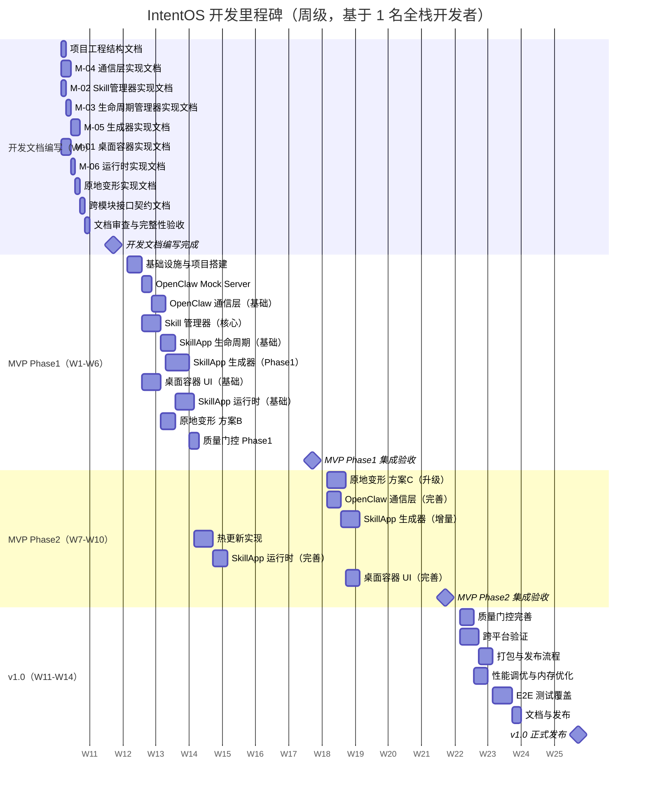
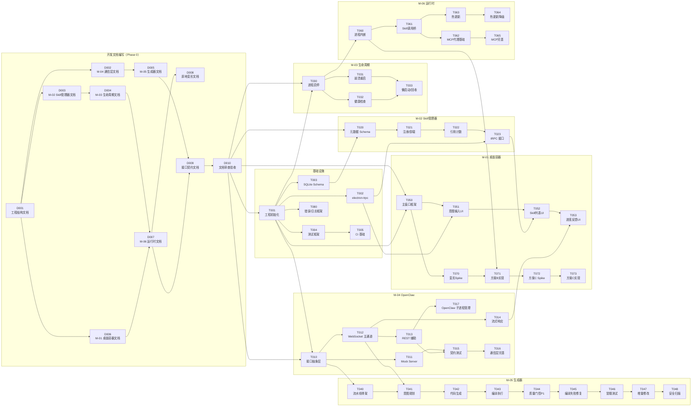
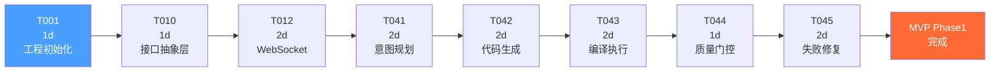
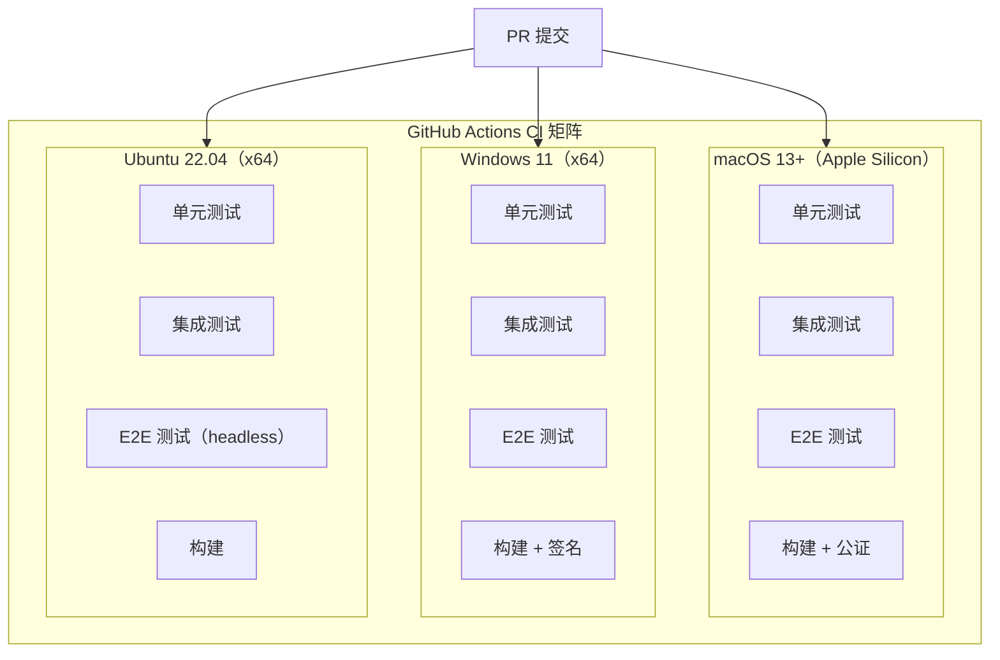

# IntentOS 开发计划

> 版本：v1.0 草稿
> 日期：2026-03-13
> 状态：正式产出（Step 6 · 制定开发计划）

---

## 目录

1. [里程碑划分](#1-里程碑划分)
2. [任务分解](#2-任务分解)
   - [2.0 开发文档编写阶段（Phase 0）](#20-开发文档编写阶段phase-0)
3. [任务依赖关系图](#3-任务依赖关系图)
4. [关键路径分析](#4-关键路径分析)
5. [每阶段验收标准](#5-每阶段验收标准)
   - [5.0 开发文档阶段验收标准](#50-开发文档阶段验收标准)
6. [测试策略](#6-测试策略)

---

## 1. 里程碑划分

### 1.1 里程碑概览（甘特图）



> **资源假设**：以上时间安排基于 **1 名全栈开发者**独立开发。W0 开发文档编写阶段（2 周）为后续编码建立无歧义的实现规范，Phase1 后序开发即可完全按文档执行。若 2 名开发者并行，可并行执行所有无依赖关系的任务，Phase1 实际完成约 3-4 周，整体缩短约 30%。

### 1.1.1 Phase 0 开发文档编写阶段（W0，2026-03-16 ~ 2026-03-27）

**目标**：在任何编码开始之前，产出覆盖全部模块的完整实现文档（`docs/impl/`），使后续开发阶段成为纯粹的「按文档实现」，无需再做架构决策。

**产出物**（9 份文档）：
- 工程结构文档、M-01~M-06 各模块实现文档、原地变形实现文档、跨模块接口契约文档

**Gate 条件**：D010 文档审查通过后，Phase1 才可开始。

---

### 1.2 MVP Phase1 目标与范围

**前置条件**：Phase 0（开发文档编写阶段）完成并通过 D010 验收。

**目标**：核心生成流程端到端可用，用户可通过桌面容器发起请求，经由 OpenClaw 驱动 SkillApp 生成器完成一次完整的"意图→代码生成→运行"闭环。

**范围**：
- M-01 桌面容器（基础 UI，主窗口 + 输入界面）
- M-04 OpenClaw 通信层（WebSocket 主通道 + REST 健康检查）
- M-05 SkillApp 生成器（规划→代码生成→编译，不含增量修改）
- M-06 SkillApp 运行时（进程内嵌、Skill 调用桥基础）
- M-02 Skill 管理器（注册/卸载/元数据查询）
- M-03 SkillApp 生命周期管理器（启动/停止/崩溃恢复）
- 原地变形：**方案B**（窗口位置迁移，接受轻微闪烁）
- OpenClaw Mock Server（开发阶段解除阻塞）

**不含**：
- 方案C 平滑过渡动画
- 热更新（仅降级重启）
- 增量代码修改
- Skill 市场

### 1.3 MVP Phase2 目标与范围

**目标**：用户体验升级，原地变形无闪烁，支持热更新与增量修改，系统稳定性达到日常使用标准。

**范围**：
- 原地变形升级至**方案C**（后台预热 + 淡入淡出，≤400ms 过渡）
- M-05 SkillApp 生成器（增量修改、编译失败自动修复最多3次）
- M-06 SkillApp 运行时（热更新、MCP 代理完善）
- M-04 OpenClaw 通信层（流式输出、契约测试）
- M-01 桌面容器 UI（完善状态反馈、Skill 列表、历史记录）

### 1.4 v1.0 目标与范围

**目标**：生产就绪，三平台验证通过，质量门控完整，打包发布流程完善。

**范围**：
- 质量门控完整流水线（tsc + ESLint + 安全扫描 + 冒烟测试）
- 跨平台 CI 矩阵（macOS / Windows / Linux）
- electron-builder 打包与自动更新
- 性能调优（懒启动 + 空闲内存回收）
- E2E 测试覆盖关键路径
- 用户文档与 README

### 1.5 后续迭代（v1.x）

- M-07 Skill 市场客户端（浏览 / 安装 / 更新 / 评分）
- 多 OpenClaw 实例支持（远程协作）
- Skill 沙箱隔离增强
- 插件生态 API 开放
- 遥测与崩溃上报

---

## 2. 任务分解

### 2.0 开发文档编写阶段（Phase 0）

> **目标**：在动手编码之前，为每个模块产出完整的实现规范文档，覆盖所有关键决策点，使后续开发阶段可以做到「照单抓药」——开发者无需再做架构决策，只需按文档实现。

| 任务ID | 文档名称 | 描述 | 预估(天) | 依赖 | 产出路径 |
|--------|----------|------|----------|------|----------|
| D001 | 项目工程结构文档 | 完整目录树、各层文件职责、配置文件规范（tsconfig/vite/electron-builder）、开发环境搭建步骤、npm scripts 说明 | 1 | — | `docs/impl/project-structure.md` |
| D002 | M-04 OpenClaw 通信层实现文档 | IOpenClawClient 接口全量方法签名、WebSocket 连接状态机（含所有状态转移图）、消息帧格式（plan/generate/skill_call/cancel/error 全类型）、心跳协议细节、断线重连退避算法、Mock Server 完整实现规范（路由/响应格式/延迟注入）、子进程管理 API | 2 | D001 | `docs/impl/m04-openclaw-comm.md` |
| D003 | M-02 Skill 管理器实现文档 | SQLite 表结构（skill_registry/skill_ref_count 完整字段+索引）、SkillMeta TypeScript 类型定义、CRUD 操作实现细节（文件系统同步策略）、引用计数算法（增/减/并发安全）、tRPC router 完整接口定义（入参/出参/错误码）、Skill 验证规则 | 1 | D001 | `docs/impl/m02-skill-manager.md` |
| D004 | M-03 SkillApp 生命周期管理器实现文档 | SkillApp 进程状态机（STOPPED/STARTING/RUNNING/CRASHED/STOPPING 全状态+转移条件）、child_process.spawn 调用参数规范、崩溃检测实现（exit code/signal 分类处理）、指数退避重启算法（1s→2s→4s 上限30s）、健康检查轮询实现（IPC ping/pong 协议）、懒启动策略（LRU 回收算法）| 1 | D003 | `docs/impl/m03-lifecycle.md` |
| D005 | M-05 SkillApp 生成器实现文档 | 生成流水线各阶段详细实现（规划→生成→编译验证→质量门控→失败修复→部署）、与 OpenClaw 交互的完整消息序列图、Plan JSON Schema 定义、代码生成产物目录结构规范、tsc/ESLint 调用方式与结果解析、编译失败自动修复实现（错误提取→回传→重试逻辑）、增量 Diff 算法、冒烟测试触发时机 | 2 | D002 | `docs/impl/m05-generator.md` |
| D006 | M-01 桌面容器 UI 实现文档 | React 组件树（层级结构+每个组件 Props 定义）、Zustand store 分片设计（slices+actions+selectors）、tRPC 客户端调用约定、主窗口 BrowserWindow 配置参数（无边框/透明/尺寸约束）、意图输入交互状态机（IDLE/PENDING/STREAMING/SUCCESS/ERROR）、Skill 列表 UI 数据流、生成进度流式渲染实现 | 2 | D001 | `docs/impl/m01-desktop-ui.md` |
| D007 | M-06 SkillApp 运行时实现文档 | BrowserView/WebContents 进程内嵌详细实现步骤（attach/detach/resize 时机）、Node IPC 控制通道消息格式（start/stop/health/update 指令集）、Unix Socket JSON-RPC 2.0 数据通道实现（socket 路径约定/帧封装/并发处理）、contextBridge 暴露 API 完整定义、MCP 代理实现（@modelcontextprotocol/sdk 集成方式+工具注册流程）、热更新动态 import() 实现与降级触发条件 | 1 | D004, D006 | `docs/impl/m06-runtime.md` |
| D008 | 原地变形实现文档 | 方案B（窗口位置迁移）完整实现步骤（getBounds→SkillApp 启动→setBounds→show 时序）、方案C（后台预热+淡入淡出）实现步骤（offscreen 预热→opacity 动画→前台切换→旧窗口销毁）、`performWindowTransform()` 函数完整签名与内部逻辑、过渡时长测量方案、Spike 验证 checklist | 1 | D006, D007 | `docs/impl/in-place-transform.md` |
| D009 | 跨模块接口契约文档 | 所有模块间接口的完整定义汇总：M-01↔M-02/M-03/M-04/M-05/M-06 的 tRPC 调用契约、M-03↔M-06 的 IPC 消息契约、M-04↔OpenClaw 的 WebSocket 消息契约、M-05↔M-03 的部署接口契约、错误码统一规范表 | 1 | D002, D005, D007 | `docs/impl/interface-contracts.md` |
| D010 | 文档审查与完整性验收 | 逐一检查 D001-D009 文档是否完整覆盖所有任务 T001-T094 所需信息，标注遗漏项，补充缺失细节，确保开发者读完文档后无需再做设计决策 | 1 | D009 | 在各文档补充修订记录 |

**产出物汇总**：
- `docs/impl/project-structure.md`（工程结构）
- `docs/impl/m01-desktop-ui.md`（桌面容器 UI）
- `docs/impl/m02-skill-manager.md`（Skill 管理器）
- `docs/impl/m03-lifecycle.md`（生命周期管理器）
- `docs/impl/m04-openclaw-comm.md`（OpenClaw 通信层）
- `docs/impl/m05-generator.md`（SkillApp 生成器）
- `docs/impl/m06-runtime.md`（SkillApp 运行时）
- `docs/impl/in-place-transform.md`（原地变形）
- `docs/impl/interface-contracts.md`（跨模块接口契约）

---

### 2.1 基础设施与项目搭建

| 任务ID | 任务名称 | 模块 | 预估(天) | 依赖 | 里程碑 |
|--------|----------|------|----------|------|--------|
| T001 | 初始化 Electron + Vite + TypeScript 工程结构 | 基础设施 | 1 | — | Phase1 |
| T002 | 配置 electron-trpc IPC 类型安全层 | 基础设施 | 1 | T001 | Phase1 |
| T003 | 配置 better-sqlite3 数据库 Schema 与 migration | 基础设施 | 1 | T001 | Phase1 |
| T004 | 配置 Vitest + Playwright 测试框架 | 基础设施 | 1 | T001 | Phase1 |
| T005 | 配置 CI 基础流水线（GitHub Actions，单平台） | 基础设施 | 1 | T004 | Phase1 |

**说明**：
- T001 使用 `electron-vite 3` + `shadcn/ui` + `Tailwind CSS 4` 初始化，建立主进程 / 预加载 / 渲染进程三层目录结构。
- T002 建立 tRPC router 骨架，定义 IPC 调用规范。
- T003 定义 SkillApp、Skill、Session 等核心表结构。

### 2.2 M-04 OpenClaw 通信层

| 任务ID | 任务名称 | 模块 | 预估(天) | 依赖 | 里程碑 |
|--------|----------|------|----------|------|--------|
| T010 | 设计 OpenClaw 接口抽象层（IOpenClawClient 接口） | M-04 | 1 | T001 | Phase1 |
| T011 | 实现 OpenClaw Mock Server（本地 WebSocket + REST） | M-04 | 2 | T010 | Phase1 |
| T012 | 实现 WebSocket 主通道（连接管理、心跳、重连） | M-04 | 2 | T010 | Phase1 |
| T013 | 实现 REST 辅助接口（健康检查、能力查询） | M-04 | 1 | T012 | Phase1 |
| T014 | 实现流式响应处理（SSE/WS chunked 解析） | M-04 | 1 | T012 | Phase1 |
| T017 | OpenClaw 子进程管理（spawn/监控/优雅关闭/崩溃重启） | M-04 | 2 | T013 | Phase1 |
| T015 | OpenClaw 契约测试（Mock vs 真实接口一致性） | M-04 | 2 | T011, T013 | Phase2 |
| T016 | OpenClaw 通信层完善（断线重连策略、错误分级） | M-04 | 2 | T015 | Phase2 |

**说明**：
- T011（Mock Server）优先实现，解除前端开发对真实 OpenClaw 的阻塞依赖（对应风险1）。
- T010 抽象层保证后续切换真实 OpenClaw 时零改动业务代码。

### 2.3 M-02 Skill 管理器

| 任务ID | 任务名称 | 模块 | 预估(天) | 依赖 | 里程碑 |
|--------|----------|------|----------|------|--------|
| T020 | Skill 元数据 Schema 设计与 CRUD 接口 | M-02 | 1 | T003 | Phase1 |
| T021 | Skill 注册与卸载逻辑（文件系统 + DB 同步） | M-02 | 2 | T020 | Phase1 |
| T022 | Skill 引用计数与安全卸载（防止运行中卸载） | M-02 | 1 | T021 | Phase1 |
| T023 | Skill 管理器 tRPC 接口暴露（列表/详情/状态） | M-02 | 1 | T022, T002 | Phase1 |

**说明**：
- T022 引用计数需与 M-03 生命周期管理器协作，确保 SkillApp 运行时不可卸载被引用的 Skill。

### 2.4 M-03 SkillApp 生命周期管理器

| 任务ID | 任务名称 | 模块 | 预估(天) | 依赖 | 里程碑 |
|--------|----------|------|----------|------|--------|
| T030 | SkillApp 进程启动/停止封装（child_process） | M-03 | 2 | T001 | Phase1 |
| T031 | 崩溃检测与自动重启（指数退避，最多3次） | M-03 | 1 | T030 | Phase1 |
| T032 | 健康检查轮询与状态上报 | M-03 | 1 | T030 | Phase1 |
| T033 | 懒启动策略（按需启动，空闲回收） | M-03 | 2 | T031, T032 | Phase2 |

**说明**：
- T033 对应风险6（多进程内存占用），Phase2 实现，Phase1 先用按需启动不回收。

### 2.5 M-05 SkillApp 生成器

| 任务ID | 任务名称 | 模块 | 预估(天) | 依赖 | 里程碑 |
|--------|----------|------|----------|------|--------|
| T040 | 生成器流水线骨架（规划→生成→编译→部署） | M-05 | 1 | T010 | Phase1 |
| T041 | 意图规划请求（发送给 OpenClaw，接收 Plan JSON；含多轮交互 refinePlan 支持） | M-05 | 2 | T040, T012 | Phase1 |
| T042 | 代码生成请求（发送 Plan，接收代码文件流） | M-05 | 2 | T041 | Phase1 |
| T043 | 编译验证（tsc --noEmit 类型检查 + 产物目录结构校验） | M-05 | 2 | T042 | Phase1 |
| T044 | 质量门控 Phase1（tsc + ESLint 检查） | M-05 | 1 | T043 | Phase1 |
| T045 | 编译失败自动修复（错误回传 OpenClaw，最多3次重试） | M-05 | 2 | T044 | Phase1 |
| T046 | 生成后冒烟测试（自动执行基础功能验证） | M-05 | 2 | T045 | Phase2 |
| T047 | 增量修改支持（Diff 生成，局部重编译） | M-05 | 2 | T046 | Phase2 |
| T048 | 安全扫描集成（生成代码静态安全检查） | M-05 | 2 | T047 | v1.0 |

**说明**：
- T043 仅做编译验证，SkillApp 采用「共享 Electron runtime」方案，不使用 electron-builder 独立打包。SkillApp 编译后产物部署到共享运行时目录，由 IntentOS 主进程以 `electron --app=/path/to/skillapp` 方式启动，避免每次生成耗时数十秒的独立打包。
- T041 的多轮交互（`refinePlan()`）在 Phase1 即支持，是核心流程的一部分。
- T045 是风险4（生成代码质量）的核心应对措施，Phase1 必须完成。
- T046/T047 属于 Phase2 增强，T048 质量门控在 v1.0 收尾时完整。

### 2.6 M-01 桌面容器 UI

| 任务ID | 任务名称 | 模块 | 预估(天) | 依赖 | 里程碑 |
|--------|----------|------|----------|------|--------|
| T050 | 主窗口框架（无边框、Electron BrowserWindow 配置） | M-01 | 1 | T001 | Phase1 |
| T051 | 意图输入界面（输入框、发送按钮、加载状态） | M-01 | 2 | T050, T002 | Phase1 |
| T052 | Skill 列表与状态展示（运行中/已停止/错误） | M-01 | 2 | T051, T023 | Phase1 |
| T053 | 生成进度反馈 UI（流式进度、错误提示） | M-01 | 2 | T052, T014 | Phase1 |
| T054 | 历史记录界面（Session 列表、快速重用） | M-01 | 2 | T053 | Phase2 |
| T055 | 设置界面（OpenClaw 地址、主题、快捷键） | M-01 | 1 | T054 | Phase2 |
| T056 | 系统托盘与全局快捷键 | M-01 | 1 | T055 | Phase2 |

### 2.7 M-06 SkillApp 运行时

| 任务ID | 任务名称 | 模块 | 预估(天) | 依赖 | 里程碑 |
|--------|----------|------|----------|------|--------|
| T060 | 进程内嵌机制（BrowserView / WebContents 嵌入） | M-06 | 2 | T030 | Phase1 |
| T061 | Skill 调用桥（Node IPC 控制 + Unix Socket JSON-RPC 2.0 数据） | M-06 | 2 | T060 | Phase1 |
| T062 | MCP 代理基础（@modelcontextprotocol/sdk 集成） | M-06 | 2 | T061 | Phase1 |
| T063 | 热更新实现（动态 import() 主路径） | M-06 | 2 | T061 | Phase2 |
| T064 | 热更新降级（webContents 重载兜底） | M-06 | 1 | T063 | Phase2 |
| T065 | MCP 代理完善（跨平台兼容、工具注册） | M-06 | 2 | T062 | Phase2 |

**说明**：
- T063/T064 对应风险3（热更新稳定性），先实现降级策略保证 Phase1 稳定，Phase2 再完善热更新。
- T065 对应风险5（MCP 跨平台兼容性）。

### 2.8 原地变形实现

| 任务ID | 任务名称 | 模块 | 预估(天) | 依赖 | 里程碑 |
|--------|----------|------|----------|------|--------|
| T070 | 原地变形 Spike 验证（方案B可行性，记录闪烁时长） | M-01 | 1 | T050 | Phase1 |
| T071 | 原地变形 方案B 实现（窗口尺寸/位置迁移，接受闪烁） | M-01 | 2 | T070, T060 | Phase1 |
| T072 | 原地变形 方案C Spike（后台预热窗口 + 淡入淡出验证） | M-01 | 1 | T071 | Phase2 |
| T073 | 原地变形 方案C 实现（≤400ms 过渡目标） | M-01 | 2 | T072 | Phase2 |

**说明**：
- T070 是早期风险验证（对应风险2），必须在 Phase1 第2周完成 Spike，若方案B过渡时长超过可接受阈值需立即升级计划。

### 2.9 质量门控与错误处理

| 任务ID | 任务名称 | 模块 | 预估(天) | 依赖 | 里程碑 |
|--------|----------|------|----------|------|--------|
| T080 | 全局错误边界与日志框架（主进程 + 渲染进程） | 质量 | 1 | T001 | Phase1 |
| T081 | 生成器错误分级处理（编译错误/运行时错误/超时） | M-05 | 1 | T045 | Phase1 |
| T082 | OpenClaw 错误重试与熔断器 | M-04 | 1 | T016 | Phase2 |
| T083 | 安全扫描流水线集成（CI + 本地预提交钩子） | 质量 | 2 | T048 | v1.0 |
| T084 | 内存占用监控与自动回收触发 | 质量 | 2 | T033 | v1.0 |

### 2.10 跨平台与打包

| 任务ID | 任务名称 | 模块 | 预估(天) | 依赖 | 里程碑 |
|--------|----------|------|----------|------|--------|
| T090 | electron-builder 配置（macOS / Windows / Linux） | 打包 | 2 | T001 | v1.0 |
| T091 | 跨平台 CI 矩阵（三平台并行构建 + 测试） | 打包 | 2 | T090, T005 | v1.0 |
| T092 | 代码签名与公证（macOS notarization / Windows signing） | 打包 | 2 | T091 | v1.0 |
| T093 | 自动更新流程（electron-updater 集成） | 打包 | 2 | T092 | v1.0 |
| T094 | Unix Socket 跨平台适配（Named Pipe on Windows） | M-06 | 1 | T061 | v1.0 |

---

## 3. 任务依赖关系图



---

## 4. 关键路径分析

### 4.0 开发文档阶段关键路径

文档编写阶段可高度并行，最长依赖链决定最短完成时间：


**关键路径总长**：7 天（约 1.5 周，含并行缩短效果）。

**并行策略**：
- D003（M-02 文档）、D006（M-01 文档）可与 D002 在第 1 天并行启动
- D004（M-03 文档）可与 D002 第 2 天并行
- D007（M-06 文档）、D008（原地变形文档）可在 D004/D006 完成后立即并行

### 4.1 MVP Phase1 关键路径

从 T001 到 MVP Phase1 完成的最长依赖链（决定 Phase1 最短完成时间）：



**关键路径总长**：13天（约2.5周），其余任务可并行执行。

**并行策略**：
- T003（SQLite）、T004（测试框架）、T050（主窗口）可与 T010 并行启动
- T030（进程启停）、T020（Skill元数据）可与 T011（Mock Server）并行
- T070（变形Spike）可与 T041 并行

### 4.2 MVP Phase2 关键路径

Phase2 包含三条独立并行链，最长链决定 Phase2 最短完成时间：

| 链 | 路径 | 总长 |
|----|------|------|
| 生成器增量链 | T045（Phase1 末）→ T046（2d）→ T047（2d） | **4d**（关键路径）|
| 原地变形升级链 | T071（Phase1 末）→ T072（1d）→ T073（2d） | 3d |
| 通信层完善链 | T015（2d）→ T016（2d） | 4d（与生成器链并行）|
| 热更新链 | T061（Phase1 末）→ T063（2d）→ T064（1d） | 3d |

**Phase2 关键路径**：`T045 → T046(2d) → T047(2d)`，约 4 天核心依赖工作，其余链可并行。
并行执行：T033（懒启动）、T054（历史记录 UI）、T015+T016（通信层完善）。

### 4.3 v1.0 关键路径

v1.0 包含两条独立并行链：

| 链 | 路径 | 总长 |
|----|------|------|
| 打包发布链 | T090（2d）→ T091（2d）→ T092（2d）→ T093（2d） | **8d**（关键路径）|
| 安全扫描链 | T048（2d）→ T083（2d） | 4d（与打包链并行）|

**v1.0 关键路径**：`T090(2d) → T091(2d) → T092(2d) → T093(2d)`，共 8 天。
T090 依赖 T001（工程初始化），与 T048 安全扫描链完全独立，可并行执行。
并行执行：T084（内存监控）、E2E 测试全量覆盖。

---

## 5. 每阶段验收标准

### 5.0 开发文档阶段验收标准

> **核心判断标准**：任何一名有 Electron + React 经验的开发者，拿到这批文档后，能够直接开始编码，无需再做架构决策、无需查阅 spec.md/electron-spec.md 等上游文档。

#### 文档完整性检查

| 检查项 | 验收标准 |
|--------|----------|
| 接口定义完整性 | 所有跨模块调用的函数签名、参数类型、返回值类型、错误类型均已明确定义（TypeScript 级别） |
| 状态机完整性 | 每个有状态组件（连接、进程、生成流程、窗口变换）的全部状态和转移条件均有图示说明 |
| 数据模型完整性 | 所有 SQLite 表结构、TypeScript 类型定义已给出完整字段（含类型、约束、索引） |
| 算法细节完整性 | 所有非平凡算法（退避重连、引用计数、增量 Diff、热更新判断）给出伪代码或步骤描述 |
| 文件结构完整性 | 每个模块的目录结构、文件职责、import 关系已明确 |
| 配置完整性 | 所有第三方库的关键配置项（electron-vite/tsconfig/eslint/better-sqlite3 初始化参数）已给出示例值 |
| 消息协议完整性 | 所有 IPC/WebSocket/Unix Socket 消息格式给出完整 JSON Schema 或示例 |
| 边界条件覆盖 | 每个模块的错误路径、超时处理、资源清理逻辑均有说明 |

#### 逐文档验收

| 文档 | 必须包含的核心内容 |
|------|--------------------|
| `project-structure.md` | 完整目录树（到文件级别）、每层职责说明、`package.json` 关键字段、`electron-vite.config.ts` 配置示例 |
| `m04-openclaw-comm.md` | `IOpenClawClient` 完整接口定义、状态机图（至少5个状态）、所有消息类型的 TypeScript 类型、Mock Server 路由表 |
| `m02-skill-manager.md` | SQLite 建表 SQL、`SkillMeta` 完整类型、tRPC procedure 签名（至少4个）、引用计数并发安全实现说明 |
| `m03-lifecycle.md` | 进程状态机图（5状态×N转移）、`spawn()` 调用参数、退避算法伪代码、IPC ping/pong 消息格式 |
| `m05-generator.md` | 流水线每阶段函数签名、Plan JSON Schema、tsc 结果解析正则/逻辑、3次重试状态机 |
| `m01-desktop-ui.md` | React 组件树（至少到二级组件）、Zustand store 类型定义、`BrowserWindow` 完整 options、意图输入状态机 |
| `m06-runtime.md` | BrowserView attach 时序图、IPC 控制通道消息枚举、JSON-RPC 2.0 帧格式、contextBridge API 列表 |
| `in-place-transform.md` | 方案B 完整时序（步骤级）、方案C 完整时序（步骤级）、`performWindowTransform()` 函数签名与实现逻辑 |
| `interface-contracts.md` | 所有跨模块接口汇总表（调用方→被调方→方法名→参数→返回值）、统一错误码表 |

#### 验收方式

- **交叉审查**：文档作者以外的角色（或作者间歇24h后）通读每份文档，尝试在脑中模拟「按文档实现」，记录所有「需要猜测或查其他资料」的点
- **遗漏项归零**：所有交叉审查发现的遗漏必须在 D010 任务内补全，直至归零
- **Gate 条件**：D010 验收通过后，Phase1 T001 方可开始

---

### 5.1 MVP Phase1 验收标准

#### 功能验收

| 验收项 | 验收标准 | 验证方式 |
|--------|----------|----------|
| 端到端基础流程 | 用户输入意图 → OpenClaw Mock → 代码生成 → 编译 → SkillApp 启动，全流程无报错 | 手动演示 + E2E 测试 |
| WebSocket 连接 | 连接建立 ≤2s，断线5s内自动重连，心跳间隔15s | 集成测试 |
| SkillApp 启动 | 冷启动 ≤5s，进程状态可查询 | 集成测试 |
| 崩溃恢复 | kill -9 SkillApp 进程后，3s 内自动重启 | 自动化测试 |
| 编译失败修复 | tsc 报错时自动重试，最多3次，有错误日志 | 单元测试 |
| 原地变形（方案B） | 窗口切换 ≤500ms（含可接受闪烁），位置迁移正确 | 手动验证 |
| Skill 注册/卸载 | 运行中 Skill 不可卸载（报错提示），停止后可正常卸载 | 单元测试 |

#### 质量门控

- 单元测试通过率 100%，覆盖率 ≥60%（核心模块 ≥80%）
- 无 TypeScript 编译错误
- ESLint 无 Error 级别警告
- CI 绿灯（单平台）

#### 性能基线

- 主进程内存 ≤100MB（空载）
- SkillApp 启动内存 ≤50MB

---

### 5.2 MVP Phase2 验收标准

#### 功能验收

| 验收项 | 验收标准 | 验证方式 |
|--------|----------|----------|
| 原地变形（方案C） | 过渡时长 ≤400ms，无明显闪烁（用录屏验证帧率） | 性能测试 + 录屏 |
| 热更新 | 代码更新后 ≤2s 生效，不重启进程（成功率 ≥95%） | 集成测试 |
| 热更新降级 | 热更新失败时自动触发 webContents 重载，用户无感知 | 故障注入测试 |
| 增量修改 | Diff 生成正确，局部重编译时间 ≤原生成50% | 集成测试 |
| MCP 代理 | 3+ MCP 工具注册并可调用，跨平台 macOS/Windows 通过 | 集成测试 |
| 流式输出 | 代码生成进度实时展示，无卡顿 | 手动验证 |
| 契约测试 | OpenClaw Mock vs 真实接口，接口一致性100% | 契约测试 |

#### 质量门控

- 单元测试覆盖率 ≥70%
- E2E 测试覆盖 5 个关键用户路径
- 两平台（macOS + Windows）CI 绿灯

---

### 5.3 v1.0 验收标准

#### 功能验收

| 验收项 | 验收标准 | 验证方式 |
|--------|----------|----------|
| 三平台构建 | macOS / Windows / Linux 构建产物均可安装运行 | CI 矩阵 |
| 代码签名 | macOS 公证通过，Windows Authenticode 签名有效 | 发布前检查 |
| 自动更新 | 有新版本时弹出提示，点击更新可静默下载安装 | 集成测试 |
| 安全扫描 | 生成代码无 HIGH 级别安全漏洞 | 自动扫描报告 |
| 内存控制 | 3 个 SkillApp 同时运行，总内存 ≤500MB | 压力测试 |
| 空闲回收 | SkillApp 空闲 5 分钟后自动停止，内存释放 ≥80% | 自动化测试 |

#### 质量门控

- 单元测试覆盖率 ≥80%
- E2E 测试覆盖全部 P0 用户路径
- 三平台 CI 全部绿灯
- 无已知 CRITICAL / HIGH 安全漏洞
- 性能基线达标

---

## 6. 测试策略

### 6.1 单元测试范围

**框架**：Vitest 3

| 模块 | 测试重点 | 覆盖率目标 |
|------|----------|------------|
| M-02 Skill 管理器 | 注册/卸载逻辑、引用计数、并发安全 | ≥85% |
| M-03 生命周期管理器 | 状态机转换、崩溃重启退避算法 | ≥85% |
| M-04 OpenClaw 通信层 | WebSocket 重连策略、消息序列化/反序列化 | ≥80% |
| M-05 生成器 | 流水线各阶段、错误重试逻辑、编译结果解析 | ≥80% |
| M-06 运行时 | JSON-RPC 2.0 消息解析、热更新判断逻辑 | ≥75% |

**关键单元测试用例**：
- 崩溃重启指数退避：验证 1s → 2s → 4s 间隔
- 引用计数：验证运行中不可卸载，计数为0时允许卸载
- 编译失败重试：注入 tsc 错误，验证最多3次重试后返回 FAIL
- WebSocket 断线重连：模拟网络中断，验证5s内重连
- 热更新降级触发条件：注入热更新失败，验证自动触发 webContents.reload()

### 6.2 集成测试方案（OpenClaw 集成重点）

**框架**：Vitest + 真实 Electron 进程（部分）

#### OpenClaw Mock Server 集成

```
测试场景：
1. 正常流程：Mock Server 返回正确 Plan → 代码 → 验证生成结果
2. 超时场景：Mock Server 延迟 30s 响应 → 验证客户端超时处理
3. 错误场景：Mock Server 返回 error code → 验证错误分级与提示
4. 断流场景：Mock Server 中途断开 WebSocket → 验证重连与状态恢复
5. 流式场景：Mock Server 分块发送代码 → 验证流式渲染正确性
```

#### 契约测试（T015）

使用 Pact 或自定义 schema 验证，确保 Mock Server 与真实 OpenClaw 接口100%一致：
- 请求体 Schema 验证
- 响应体 Schema 验证
- 错误码映射验证
- 流式消息格式验证

#### SkillApp 通信集成

```
Node IPC（控制通道）测试：
- 启动/停止指令往返时延 ≤100ms
- 大量并发指令不丢失

Unix Socket JSON-RPC 2.0（数据通道）测试：
- 10KB 消息无损传输
- 1000 req/s 吞吐量基线
- Windows Named Pipe 兼容性
```

### 6.3 SkillApp 生成质量评估

**评估维度**：

| 维度 | 指标 | 目标 |
|------|------|------|
| 编译成功率 | 首次生成 tsc 通过率 | ≥70%（Phase1），≥85%（v1.0） |
| 自动修复成功率 | 3次重试后最终通过率 | ≥90% |
| 功能正确率 | 生成代码完成意图描述功能 | 人工抽样20%，满意率≥80% |
| 安全合规率 | 无 HIGH 级安全漏洞 | 100% |
| 生成时延 | 从提交到 SkillApp 可用 | ≤30s（P95） |

**评估方法**：
- 准备20个标准意图用例库（覆盖文件操作、网络请求、UI 组件等场景）
- 每次 Release 前跑全量用例，记录通过率趋势
- 失败用例附带错误信息归档，供 OpenClaw 侧调优

### 6.4 E2E 测试方案

**框架**：Playwright（配合 Electron 驱动）

**关键 E2E 路径**：

```
P0 路径（MVP Phase1 必须）：
1. 冷启动 → 输入意图 → 等待生成 → SkillApp 展示 → 调用 Skill
2. SkillApp 崩溃 → 自动重启 → 恢复正常
3. 原地变形：桌面 → SkillApp → 桌面（验证位置、内容）

P1 路径（MVP Phase2）：
4. 热更新：修改 Skill 代码 → 自动热加载 → 功能生效
5. 增量修改：输入修改意图 → Diff 生成 → SkillApp 局部更新
6. 历史记录：查看历史 → 快速重用上次 Session

P2 路径（v1.0）：
7. 安装 → 首次配置 → 完整流程（新用户 OOBE）
8. 自动更新：检测新版本 → 下载 → 安装 → 重启验证
```

**测试数据管理**：
- 使用 Mock Server 保证 E2E 测试环境可复现
- 每次测试前清空 SQLite 数据库（使用 in-memory 模式）
- Playwright fixtures 负责 Electron 进程生命周期管理

### 6.5 跨平台测试矩阵



**各平台特殊关注点**：

| 平台 | 特殊测试点 |
|------|------------|
| macOS | Apple Silicon + Intel 双架构，沙箱权限（Hardened Runtime），公证流程 |
| Windows | Named Pipe 替代 Unix Socket，路径分隔符，Windows Defender 误报 |
| Linux | Wayland/X11 显示服务器，AppImage 格式，无 keychain 时的密钥存储 |

**MCP 跨平台兼容性测试**（对应风险5）：
- 每个 MCP 工具在三平台各执行10次，成功率100%
- 特别验证文件系统类工具的路径处理

---

## 附录：风险追踪表

| 风险ID | 风险描述 | 应对任务 | 里程碑 | 状态 |
|--------|----------|----------|--------|------|
| R1 | OpenClaw 接口稳定性 | T010（抽象层）+ T011（Mock）+ T015（契约测试） | Phase1 | 计划中 |
| R2 | 原地变形跨进程复杂度 | T070（Spike）+ T071（方案B）+ T073（方案C） | Phase1/2 | 计划中 |
| R3 | 热更新稳定性 | T063（热更新）+ T064（降级） | Phase2 | 计划中 |
| R4 | 生成代码质量 | T044（门控）+ T045（自动修复）+ T046（冒烟）+ T048（安全扫描） | Phase1/v1.0 | 计划中 |
| R5 | MCP 跨平台兼容性 | T065（MCP完善）+ T091（跨平台CI矩阵） | Phase2/v1.0 | 计划中 |
| R6 | 多进程内存占用 | T033（懒启动/回收）+ T084（内存监控） | Phase2/v1.0 | 计划中 |

---

*本文档由 IntentOS 开发团队维护，随项目进展持续更新。*
