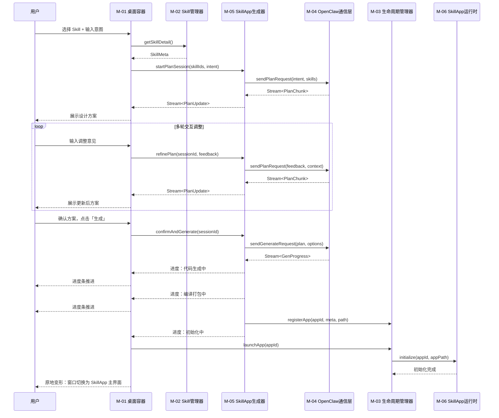
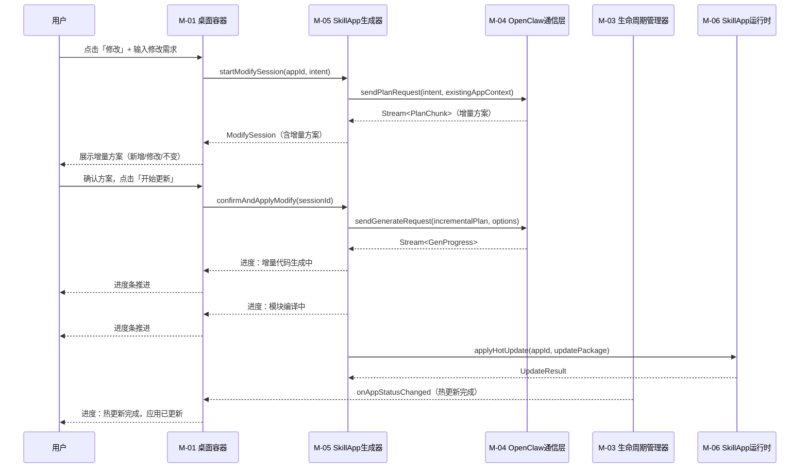
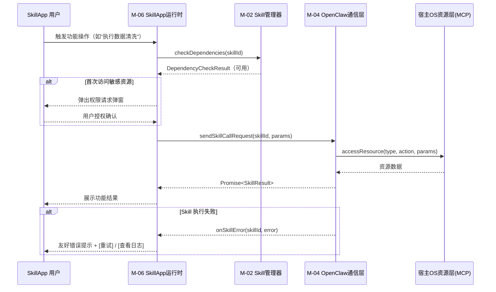

# IntentOS 功能模块拆解文档

---

## 1. 模块清单

### M-01: 桌面容器（Desktop Shell）

| 项目 | 内容 |
|------|------|
| **职责** | 提供 IntentOS Desktop 的 Electron 主进程和管理台 UI 框架。包括：应用主窗口管理、侧栏导航路由、状态栏渲染、首次启动引导流程、全局设置页面 |
| **边界（不做什么）** | 不负责 SkillApp 的代码生成和编译；不负责 Skill 的执行和调度；不直接管理 SkillApp 进程生命周期（委托给生命周期管理器）；不处理 OpenClaw 通信协议细节 |
| **覆盖需求** | M01（Skill 管理中心 UI）、M02（SkillApp 管理中心 UI）、M04（应用生成窗口 UI） |

### M-02: Skill 管理器（Skill Manager）

| 项目 | 内容 |
|------|------|
| **职责** | 管理本地已安装 Skill 的全生命周期。包括：Skill 的注册/卸载、Skill 元数据读取与缓存、Skill 依赖关系管理、Skill 被引用计数维护、Skill 版本管理、本地 Skill 目录扫描与自动识别 |
| **边界（不做什么）** | 不负责 Skill 的运行时执行（由 OpenClaw 内核层负责）；不负责 Skill 市场的网络通信；不负责 SkillApp 的生成逻辑 |
| **覆盖需求** | M01（Skill 管理中心）、M12（Skill 原子化与复用） |

### M-03: SkillApp 生命周期管理器（SkillApp Lifecycle Manager）

| 项目 | 内容 |
|------|------|
| **职责** | 管理所有 SkillApp 的进程生命周期和运行状态。包括：SkillApp 进程的启动/停止/重启、运行状态监控与汇报、窗口调度（聚焦、最小化、排列）、SkillApp 注册表维护（已生成 App 列表、元数据、状态）、崩溃检测与恢复、SkillApp 卸载（清理进程和资源文件） |
| **边界（不做什么）** | 不负责 SkillApp 的代码生成和编译；不负责 SkillApp 内部的业务逻辑；不负责热更新的代码推送（由运行时模块负责） |
| **覆盖需求** | M08（SkillApp 独立运行）、M10（SkillApp 生命周期管理）、S06（窗口调度管理） |

### M-04: OpenClaw 通信层（OpenClaw Communication Layer）

| 项目 | 内容 |
|------|------|
| **职责** | 封装 IntentOS 与 OpenClaw 内核之间的所有通信。包括：连接建立/断开/重连管理、连接状态监控与事件通知、请求-响应协议封装、流式数据传输（规划过程的多轮交互、生成进度推送）、错误处理与超时管理 |
| **边界（不做什么）** | 不负责 OpenClaw 内核本身的规划/生成逻辑；不负责 UI 渲染；不负责 MCP 资源访问（MCP 是 SkillApp 运行时直接使用的协议） |
| **覆盖需求** | M05（OpenClaw 规划引擎集成）、M06（代码生成与编译打包）、M11（生成进度反馈） |

### M-05: SkillApp 生成器（SkillApp Generator）

| 项目 | 内容 |
|------|------|
| **职责** | 承载从用户意图到可运行 SkillApp 的完整生成流水线。包括三个阶段：(1) 规划阶段 — 接收用户自然语言意图，通过 OpenClaw 通信层调用规划引擎，支持多轮交互式方案调整；(2) 生成阶段 — 调用 OpenClaw 代码生成引擎，产出 Electron 应用源码；(3) 打包阶段 — 编译源码、打包为可运行的 SkillApp 产物。同时负责增量修改流程（分析现有代码、生成增量方案、局部重新生成） |
| **边界（不做什么）** | 不负责生成窗口的 UI 渲染（由桌面容器提供）；不负责 SkillApp 的运行时执行；不负责 OpenClaw 内核本身的 AI 推理逻辑；不管理 SkillApp 的进程生命周期 |
| **覆盖需求** | M03（自然语言意图输入）、M04（交互式向导）、M05（OpenClaw 规划引擎集成）、M06（代码生成与编译打包）、M07（原地变形）、M11（生成进度反馈）、M14（增量修改流程）、S03（多 Skill 组合生成）、S04（设计方案预览与调整） |

### M-06: SkillApp 运行时（SkillApp Runtime）

| 项目 | 内容 |
|------|------|
| **职责** | 为运行中的 SkillApp 提供基础运行环境和动态能力。包括：SkillApp 代码的动态加载与初始化、Skill 调用桥接（SkillApp 通过运行时调用 OpenClaw 执行 Skill）、MCP 资源访问代理（文件系统、网络、进程等）、权限控制与用户授权弹窗、热更新接收与应用（接收新代码模块、动态替换运行中组件）、SkillApp 与 IntentOS 管理层的状态同步 |
| **边界（不做什么）** | 不负责 SkillApp 的生成和编译；不负责 SkillApp 的 UI 设计（UI 由生成器产出）；不负责 Skill 的安装和管理 |
| **覆盖需求** | M08（SkillApp 独立运行）、M09（MCP 资源访问）、M12（Skill 原子化与复用 — 运行时调用）、M13（SkillApp 热更新） |

### M-07: Skill 市场客户端（Skill Marketplace Client）

| 项目 | 内容 |
|------|------|
| **职责** | 提供 Skill 在线市场的浏览、搜索、下载功能。包括：市场 UI 页面（搜索、分类筛选、Skill 卡片展示）、Skill 详情页（版本、作者、评分、权限声明、签名验证）、Skill 下载与本地安装集成 |
| **边界（不做什么）** | 不负责本地 Skill 管理（由 Skill 管理器负责）；不负责市场服务端逻辑 |
| **覆盖需求** | S05（Skill 联网市场） |
| **迭代状态** | **后续迭代，当前版本不含** |

---

## 2. 模块依赖关系图

```
┌─────────────────────────────────────────────────────────────────────┐
│                          应用层                                     │
│                                                                     │
│  ┌──────────────────────────────────────┐    ┌───────────────────┐  │
│  │        M-01 桌面容器                  │    │   SkillApp 实例    │  │
│  │  (Electron 主进程 + 管理台 UI)        │    │  (独立 Electron    │  │
│  │                                      │    │   应用进程)        │  │
│  │  ┌────────────┐  ┌────────────────┐  │    │                   │  │
│  │  │Skill 管理  │  │SkillApp 管理   │  │    │  ┌─────────────┐  │  │
│  │  │中心 UI     │  │中心 UI         │  │    │  │ M-06        │  │  │
│  │  └─────┬──────┘  └───────┬────────┘  │    │  │ SkillApp    │  │  │
│  │        │                 │           │    │  │ 运行时       │  │  │
│  │  ┌─────┴─────────────────┴────────┐  │    │  └──────┬──────┘  │  │
│  │  │    应用生成窗口 UI              │  │    │         │         │  │
│  │  └────────────────────────────────┘  │    │         │         │  │
│  └──────────┬───────────────────────────┘    └─────────┼─────────┘  │
│             │                                          │            │
│  ┌──────────┼───────── M-07 ──────────┐               │            │
│  │  Skill 市场客户端 (后续迭代)        │               │            │
│  └─────────────────────────────────────┘               │            │
└─────────────┼──────────────────────────────────────────┼────────────┘
              │                                          │
┌─────────────▼──────────────────────────────────────────▼────────────┐
│                        IntentOS 层                                  │
│                                                                     │
│  ┌──────────────────────────────┐  ┌─────────────────────────────┐  │
│  │     M-02 Skill 管理器        │  │  M-03 SkillApp 生命周期     │  │
│  │  - Skill 注册/卸载           │  │       管理器                │  │
│  │  - 元数据/依赖/引用计数      │  │  - 进程启动/停止/重启       │  │
│  └──────────────┬───────────────┘  │  - 状态监控/窗口调度        │  │
│                 │                  │  - 注册表/崩溃恢复          │  │
│                 │                  └──────────────┬──────────────┘  │
│                 │                                 │                 │
│  ┌──────────────▼─────────────────────────────────▼──────────────┐  │
│  │                 M-04 OpenClaw 通信层                           │  │
│  │  - 连接管理 / 状态监控 / 协议封装 / 流式传输 / 错误处理        │  │
│  └──────────────────────────────┬────────────────────────────────┘  │
│                                 │                                   │
│  ┌──────────────────────────────▼────────────────────────────────┐  │
│  │                 M-05 SkillApp 生成器                           │  │
│  │  - 规划(多轮交互) → 代码生成 → 编译打包                        │  │
│  │  - 增量修改分析与局部重新生成                                   │  │
│  └───────────────────────────────────────────────────────────────┘  │
│                                                                     │
└─────────────────────────────────────┬───────────────────────────────┘
                                      │
┌─────────────────────────────────────▼───────────────────────────────┐
│                      宿主 OS 资源层                                  │
│               MCP / 文件系统 / 网络 / 进程                           │
└─────────────────────────────────────────────────────────────────────┘
```

### 依赖关系矩阵

| 模块 | 依赖的模块 | 被依赖的模块 |
|------|-----------|-------------|
| M-01 桌面容器 | M-02, M-03, M-04, M-05 | M-07 |
| M-02 Skill 管理器 | M-04 | M-01, M-05, M-06, M-07 |
| M-03 SkillApp 生命周期管理器 | M-04 | M-01, M-06 |
| M-04 OpenClaw 通信层 | （无，直接对接 OpenClaw 内核） | M-02, M-03, M-05, M-06 |
| M-05 SkillApp 生成器 | M-02, M-04 | M-01 |
| M-06 SkillApp 运行时 | M-02, M-03, M-04 | （无，被 SkillApp 实例内嵌使用） |
| M-07 Skill 市场客户端 | M-01, M-02 | （无） |

---

## 3. 模块输入/输出接口定义

### M-01: 桌面容器

```
接口名称                    方向    数据类型               说明
─────────────────────────────────────────────────────────────────────
showSkillManagementView()   输入    void                  切换主内容区到 Skill 管理中心视图
showAppManagementView()     输入    void                  切换主内容区到 SkillApp 管理中心视图
openGenerationWindow()      输入    { skillIds: string[], 打开应用生成窗口，可预选 Skill
                                     intent?: string }
openModifyWindow()          输入    { appId: string }     打开已有 SkillApp 的修改窗口
updateStatusBar()           输入    { openclawStatus:     更新底部状态栏信息
                                     ConnectionStatus,
                                     skillCount: number,
                                     appCount: number }
onWindowTransform()         输出    { windowId: string,   通知桌面容器执行原地变形，
                                     appId: string }      将生成窗口移交给 SkillApp 进程
```

### M-02: Skill 管理器

```
接口名称                    方向    数据类型               说明
─────────────────────────────────────────────────────────────────────
registerSkill()             输入    { path: string }      注册本地 Skill（扫描目录或手动指定）
unregisterSkill()           输入    { skillId: string }   卸载 Skill（检查引用后执行）
getInstalledSkills()        输出    SkillMeta[]           返回所有已安装 Skill 的元数据列表
getSkillDetail()            输入    { skillId: string }   获取单个 Skill 的详细信息
                            输出    SkillDetail
getSkillRefCount()          输入    { skillId: string }   获取 Skill 被 SkillApp 引用次数
                            输出    number
checkDependencies()         输入    { skillId: string }   检查 Skill 的依赖是否满足
                            输出    DependencyCheckResult
onSkillChanged              事件    { type: 'added' |     Skill 变更事件（新增/移除/更新）
                                     'removed' |
                                     'updated',
                                     skillId: string }
```

### M-03: SkillApp 生命周期管理器

```
接口名称                    方向    数据类型               说明
─────────────────────────────────────────────────────────────────────
launchApp()                 输入    { appId: string }     启动指定 SkillApp（创建独立进程）
stopApp()                   输入    { appId: string }     停止指定 SkillApp（终止进程）
restartApp()                输入    { appId: string }     重启指定 SkillApp
getAppStatus()              输入    { appId: string }     获取 SkillApp 当前运行状态
                            输出    AppStatus             （running/stopped/starting/crashed）
getAllApps()                 输出    AppRegistryEntry[]    返回所有已注册 SkillApp 的信息列表
registerApp()               输入    { appId: string,      注册新生成的 SkillApp 到注册表
                                     meta: AppMeta,
                                     path: string }
uninstallApp()              输入    { appId: string }     卸载 SkillApp（清理进程+资源文件）
focusAppWindow()            输入    { appId: string }     聚焦到指定 SkillApp 的窗口
onAppStatusChanged          事件    { appId: string,      SkillApp 状态变更事件
                                     oldStatus: AppStatus,
                                     newStatus: AppStatus }
```

### M-04: OpenClaw 通信层

```
接口名称                    方向    数据类型               说明
─────────────────────────────────────────────────────────────────────
connect()                   输入    { config: ClawConfig } 建立与 OpenClaw 内核的连接
disconnect()                输入    void                  断开连接
getConnectionStatus()       输出    ConnectionStatus      获取当前连接状态
sendPlanRequest()           输入    { intent: string,     发送规划请求（支持流式返回）
                                     skills: string[],
                                     context?: AppContext }
                            输出    Stream<PlanChunk>     流式返回规划方案片段
sendGenerateRequest()       输入    { plan: PlanResult,   发送代码生成请求
                                     options: GenOptions }
                            输出    Stream<GenProgress>   流式返回生成进度
sendSkillCallRequest()      输入    { skillId: string,    运行时调用 Skill 执行
                                     params: any }
                            输出    Promise<SkillResult>
onConnectionStatusChanged   事件    ConnectionStatus      连接状态变更事件
onError                     事件    { code: string,       通信错误事件
                                     message: string }
```

### M-05: SkillApp 生成器

```
接口名称                    方向    数据类型               说明
─────────────────────────────────────────────────────────────────────
startPlanSession()          输入    { skillIds: string[], 启动规划会话（阶段 1 → 阶段 2）
                                     intent: string }
                            输出    PlanSession           返回规划会话句柄
refinePlan()                输入    { sessionId: string,  在规划会话中追加用户调整（多轮交互）
                                     feedback: string }
                            输出    Stream<PlanUpdate>    流式返回更新后的方案
confirmAndGenerate()        输入    { sessionId: string } 确认方案，开始代码生成与打包（阶段 3）
                            输出    Stream<BuildProgress> 流式返回三段式进度
                                                         （代码生成/编译打包/初始化应用）
startModifySession()        输入    { appId: string,      启动增量修改会话
                                     intent: string,
                                     newSkillIds?: string[] }
                            输出    ModifySession         返回修改会话句柄（含增量方案）
confirmAndApplyModify()     输入    { sessionId: string } 确认增量方案，开始增量生成与热更新推送
                            输出    Stream<BuildProgress>
cancelSession()             输入    { sessionId: string } 取消当前生成/修改会话
```

### M-06: SkillApp 运行时

```
接口名称                    方向    数据类型               说明
─────────────────────────────────────────────────────────────────────
initialize()                输入    { appId: string,      初始化运行时环境，加载 SkillApp 代码
                                     appPath: string }
callSkill()                 输入    { skillId: string,    通过运行时桥接调用 Skill
                                     method: string,
                                     params: any }
                            输出    Promise<any>
accessResource()            输入    { type: 'fs' | 'net'  通过 MCP 代理访问宿主 OS 资源
                                     | 'process',
                                     action: string,
                                     params: any }
                            输出    Promise<any>
requestPermission()         输入    { resource: string,   请求用户授权访问特定资源
                                     action: string }
                            输出    Promise<PermissionResult>
applyHotUpdate()            输入    { appId: string,      接收并应用热更新代码包
                                     updatePackage: UpdatePkg }
                            输出    Promise<UpdateResult>
reportStatus()              输出    { appId: string,      向生命周期管理器汇报运行状态
                                     status: RuntimeStatus }
onSkillError                事件    { skillId: string,    Skill 执行错误事件
                                     error: ErrorInfo }
```

### M-07: Skill 市场客户端（后续迭代）

```
接口名称                    方向    数据类型               说明
─────────────────────────────────────────────────────────────────────
searchSkills()              输入    { keyword: string,    搜索市场中的 Skill
                                     category?: string }
                            输出    MarketSkillItem[]
getSkillMarketDetail()      输入    { marketSkillId: string }  获取市场 Skill 详情
                            输出    MarketSkillDetail
downloadAndInstall()        输入    { marketSkillId: string }  下载并安装到本地
                            输出    Stream<DownloadProgress>   （内部调用 Skill 管理器注册）
```

---

## 4. 模块优先级

### MVP 必须实现（第一阶段）

| 优先级 | 模块 | 理由 |
|--------|------|------|
| P0 | **M-04 OpenClaw 通信层** | 所有核心流程的基础通道，其他模块均依赖此层与 OpenClaw 交互 |
| P0 | **M-05 SkillApp 生成器** | IntentOS 最核心的价值主张 — 从意图到应用的完整生成流水线 |
| P0 | **M-06 SkillApp 运行时** | 生成的 SkillApp 必须能运行，否则生成无意义 |
| P0 | **M-01 桌面容器** | 用户交互的唯一入口，承载所有管理和生成界面 |
| P1 | **M-02 Skill 管理器** | Skill 是生成的基础素材，必须能管理和查询 |
| P1 | **M-03 SkillApp 生命周期管理器** | SkillApp 需要可管理的启动/停止/状态监控能力 |

### 后续迭代（第二阶段及以后）

| 优先级 | 模块 | 理由 |
|--------|------|------|
| P3 | **M-07 Skill 市场客户端** | 当前版本仅支持本地手动安装 Skill，市场功能后续迭代 |

---

## 5. 跨模块协作说明

### 流程一：生成 SkillApp（核心流程）



**关键协作要点**：
- 桌面容器是用户交互的唯一通道，所有用户输入通过桌面容器流转到生成器
- 生成器通过 OpenClaw 通信层与内核交互，通信层负责流式传输规划方案和生成进度
- 生成完成后，生成器通知生命周期管理器注册并启动新 SkillApp
- 桌面容器执行「原地变形」，将窗口所有权从 Desktop 主进程移交给新 SkillApp 进程
- 运行时在新进程中初始化，加载生成的代码并渲染应用界面

### 流程二：修改 SkillApp（增量修改 + 热更新）



**关键协作要点**：
- 修改流程复用生成器的规划和生成能力，但以增量方式工作
- 生成器分析现有 SkillApp 代码后，仅重新生成受影响的模块
- 热更新包通过运行时模块直接推送到运行中的 SkillApp 进程
- 若 SkillApp 未运行，更新包保存到本地，下次启动时由运行时自动加载
- 生命周期管理器在整个过程中监控目标 SkillApp 的状态，确保热更新不会导致崩溃

### 流程三：SkillApp 运行时调用 Skill



**关键协作要点**：
- 运行时是 SkillApp 与外部系统交互的唯一桥梁
- Skill 调用通过 OpenClaw 通信层转发到 OpenClaw 内核执行
- MCP 资源访问受权限控制，首次访问敏感资源需弹窗请求用户授权
- Skill 管理器提供 Skill 可用性校验，确保被调用的 Skill 仍然已安装且版本兼容
- 运行时负责错误处理和用户友好提示，避免 Skill 执行异常直接暴露给用户
