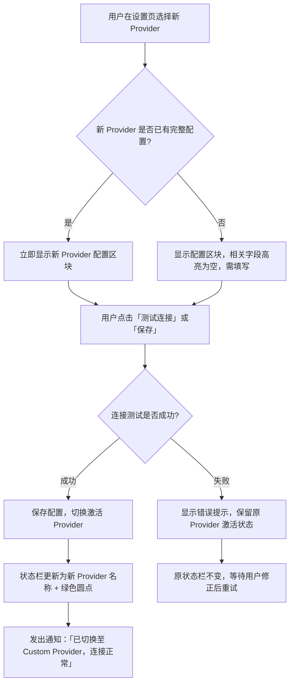

# IntentOS 产品结构与用户流程文档

---

## 1. 产品整体结构（信息架构图）

IntentOS 由以下界面/模块组成，分为用户可见的应用层界面和系统内部的 OS 核心层：

```
┌─────────────────────────────────────────────────────────────────────┐
│                        应用层（用户可见）                             │
│                                                                     │
│  ┌─────────────────────────────┐   ┌─────────────────────────────┐  │
│  │     IntentOS Desktop        │   │       SkillApp 实例群        │  │
│  │                             │   │                             │  │
│  │  ┌───────────────────────┐  │   │  ┌─────────┐ ┌─────────┐   │  │
│  │  │  A. Skill 管理中心     │  │   │  │ App #1  │ │ App #2  │   │  │
│  │  │  - 已安装 Skill 列表   │  │   │  │(独立窗口)│ │(独立窗口)│   │  │
│  │  │  - Skill 市场入口      │  │   │  └─────────┘ └─────────┘   │  │
│  │  └───────────────────────┘  │   │  ┌─────────┐               │  │
│  │  ┌───────────────────────┐  │   │  │ App #N  │  ...          │  │
│  │  │  B. SkillApp 管理中心  │  │   │  └─────────┘               │  │
│  │  │  - 已生成 App 列表     │  │   │                             │  │
│  │  │  - 启动/卸载/修改操作  │  │   │                             │  │
│  │  └───────────────────────┘  │   └─────────────────────────────┘  │
│  │  ┌───────────────────────┐  │                                    │
│  │  │  C. 应用生成窗口       │  │                                    │
│  │  │  - 意图输入区          │  │                                    │
│  │  │  - 规划交互区          │  │                                    │
│  │  │  - 生成进度区          │  │                                    │
│  │  │  → 原地变形为 SkillApp │  │                                    │
│  │  └───────────────────────┘  │                                    │
│  │  ┌───────────────────────┐  │                                    │
│  │  │  D. Skill 市场 ⚠️      │  │                                    │
│  │  │  （当前版本不含）       │  │                                    │
│  │  │  - 在线浏览/搜索       │  │                                    │
│  │  │  - 下载安装            │  │                                    │
│  │  └───────────────────────┘  │                                    │
│  └─────────────────────────────┘                                    │
└─────────────────────────────────────────────────────────────────────┘
                              │
┌─────────────────────────────▼───────────────────────────────────────┐
│                     IntentOS 层（OS 核心层）                         │
│  ┌──────────────────────┐    ┌────────────────────────────────────┐ │
│  │      管理层            │    │      内核层（AI Provider 抽象层）   │ │
│  │  - 窗口调度            │    │  - 规划引擎                        │ │
│  │  - SkillApp 生命周期   │    │  - 代码生成引擎                    │ │
│  │  - 进程管理            │    │  - Skill 执行环境                  │ │
│  └──────────────────────┘    └────────────────────────────────────┘ │
└─────────────────────────────────────────────────────────────────────┘
                              │
┌─────────────────────────────▼───────────────────────────────────────┐
│                       宿主 OS 资源层                                 │
│              MCP / 文件系统 / 网络 / 进程                            │
└─────────────────────────────────────────────────────────────────────┘
```

### 模块清单

| 模块 | 所属层 | 职责 | 覆盖需求 |
|------|--------|------|----------|
| A. Skill 管理中心 | 应用层 - Desktop | 展示已安装 Skill，支持本地管理 | M01, M12 |
| B. SkillApp 管理中心 | 应用层 - Desktop | 管理所有已生成 App，启动/卸载/修改入口 | M02, M10, M14 |
| C. 应用生成窗口 | 应用层 - Desktop | 承载完整的 Skill-to-App 生成交互流程 | M03, M04, M05, M06, M07, M11 |
| D. Skill 市场 ⚠️ 当前版本不含 | 应用层 - Desktop | 在线浏览、搜索、下载 Skill | S05 |
| SkillApp 实例 | 应用层 | 独立运行的生成应用 | M08, M09, M13 |
| 管理层 | IntentOS 层 | 窗口调度、生命周期管理 | M10 |
| 内核层（AI Provider 抽象层） | IntentOS 层 | 规划、代码生成、Skill 执行；MVP 使用 Claude API | M05, M05a–M05e, M06 |

---

## 2. 核心用户流程

### 流程一：首次启动 IntentOS

**前置条件**：用户已安装 IntentOS Desktop

```
用户双击 IntentOS Desktop 图标
       │
       ▼
┌─────────────────────────────────┐
│  启动画面（品牌 Logo + 加载条）  │
│  系统初始化：                    │
│  - 检测 AI Provider 配置状态     │
│  - 加载已安装 Skill              │
│  - 加载已生成 SkillApp           │
└───────────────┬─────────────────┘
                │
                ▼
        ┌───────┴────────┐
        │ 是否已配置      │
        │ AI Provider？  │
        └───────┬────────┘
       未配置 ↙       ↘ 已配置
              │              │
              ▼              ▼
┌──────────────────────┐  ┌──────────────────────┐
│  「配置 AI Provider」 │  │  验证 API Key 有效性  │
│  向导弹窗             │  │  （发起轻量连通性检查）│
│                      │  └──────────┬───────────┘
│  Step 1: 选择        │             │
│    Provider          │      ↙ 无效  │ 有效 ↘
│    （MVP 仅「Claude   │             │
│    API」可选）        │  ┌──────────▼───────────┐
│  Step 2: 输入        │  │  提示：API Key 无效    │
│    API Key           │  │  [前往设置重新配置]    │
│  Step 3: 验证        │  └──────────────────────┘
│    连通性            │
│  Step 4: 完成        │
└──────────┬───────────┘
           │ 配置完成
           ▼
┌─────────────────────────────────┐
│  首次使用引导（仅首次展示）       │
│  Step 1: 欢迎页 — 介绍核心理念   │
│  Step 2: 安装第一个 Skill        │
│  Step 3: 生成第一个 SkillApp     │
└───────────────┬─────────────────┘
                │ 用户完成引导 / 跳过
                ▼
┌─────────────────────────────────┐
│  IntentOS Desktop 主界面         │
│  默认展示 SkillApp 管理中心      │
│  （首次为空，提示「开始生成」）    │
└─────────────────────────────────┘
```

**覆盖需求**：M01（Skill 管理中心初始化）、M02（SkillApp 管理中心初始化）、M05a（AI Provider 可用性检查）、M05b（API Key 管理）、M10（生命周期管理启动）

**关键细节**：
- 启动画面不超过 5 秒（性能要求）
- 首次引导以非阻塞方式呈现，用户可随时跳过
- 「配置 AI Provider」向导为阻塞式弹窗：未完成配置前无法进入主界面
- 已配置且 API Key 有效：直接进入引导/主界面，无需用户干预
- 已配置但 API Key 无效：弹出非阻塞提示，引导用户前往设置更新 Key；可以进入主界面浏览，但生成功能不可用
- MVP 阶段「选择 Provider」步骤仅「Claude API (Anthropic)」可选；「OpenClaw（即将推出）」灰色显示
- **（CR-001 新增）** Step 1 新增「Custom（OpenAI-compatible）」可选项，详见下方「配置 AI Provider」向导变更说明

#### （CR-001 新增）「配置 AI Provider」向导变更说明

**Step 1 — 选择 Provider（新增 Custom 选项）**：

```
┌─────────────────────────────────────────────────────────┐
│  「配置 AI Provider」向导                                │
│                                                         │
│  Step 1: 选择 Provider                                  │
│                                                         │
│  ┌───────────────────────────────────────────────────┐  │
│  │  ● Claude API (Anthropic)                         │  │
│  │    使用 Anthropic Claude API，需要 API Key         │  │
│  ├───────────────────────────────────────────────────┤  │
│  │  ○ Custom（OpenAI-compatible）                    │  │
│  │    支持任意兼容 OpenAI Chat Completions API 的端点 │  │
│  │    （OpenAI、Azure OpenAI、Ollama、LM Studio 等） │  │
│  ├───────────────────────────────────────────────────┤  │
│  │  ○ OpenClaw [灰色，不可选，即将推出]               │  │
│  └───────────────────────────────────────────────────┘  │
│                                                         │
│                                      [下一步 →]         │
└─────────────────────────────────────────────────────────┘
```

**Step 2 — 输入凭据（根据选择分支）**：

分支 A：用户选择「Claude API」时，Step 2 与原流程一致（输入 Claude API Key）。

分支 B：用户选择「Custom（OpenAI-compatible）」时，Step 2 展示自定义 Provider 配置表单：

```
┌─────────────────────────────────────────────────────────┐
│  「配置 AI Provider」向导                                │
│                                                         │
│  Step 2: 配置自定义 Provider                            │
│                                                         │
│  Base URL                                               │
│  ┌───────────────────────────────────────────────────┐  │
│  │ https://api.openai.com/v1                          │  │
│  └───────────────────────────────────────────────────┘  │
│  示例：http://localhost:11434/v1（Ollama）              │
│         https://api.openai.com/v1（OpenAI）             │
│                                                         │
│  API Key（可选，部分本地服务无需 Key）                   │
│  ┌─────────────────────────────────────────────── [👁] ┐  │
│  │ ••••••••••••••••••••••••••••                      │  │
│  └───────────────────────────────────────────────────┘  │
│                                                         │
│  规划模型（Plan Model）                                 │
│  ┌───────────────────────────────────────────────────┐  │
│  │ gpt-4o                                            │  │
│  └───────────────────────────────────────────────────┘  │
│  用于应用规划阶段（多轮交互），推荐使用能力较强的模型     │
│                                                         │
│  代码生成模型（Codegen Model）                          │
│  ┌───────────────────────────────────────────────────┐  │
│  │ gpt-4o                                            │  │
│  └───────────────────────────────────────────────────┘  │
│  用于代码生成阶段，可与规划模型相同或不同               │
│                                                         │
│  [← 上一步]                           [下一步 →]        │
└─────────────────────────────────────────────────────────┘
```

**Step 3 — 验证连通性（两分支相同）**：触发一次轻量级请求（向配置的端点发送最小化 completion 请求），验证 Base URL 和 API Key 有效性：

```
┌─────────────────────────────────────────────────────────┐
│  「配置 AI Provider」向导                                │
│                                                         │
│  Step 3: 验证连接                                       │
│                                                         │
│  正在连接 https://api.openai.com/v1 ...                 │
│  ┌───────────────────────────────────────────────────┐  │
│  │  ✓ 连接成功                                        │  │
│  │  延迟: 450ms   模型: gpt-4o                        │  │
│  └───────────────────────────────────────────────────┘  │
│                                                         │
│  [← 上一步]                           [完成配置 ✓]      │
└─────────────────────────────────────────────────────────┘
```

验证失败时展示具体错误说明（见第 4.5 节边界情况）。

---

### 流程二：浏览市场并安装 Skill ⚠️ 当前版本不含

> **注**：Skill 市场功能在当前版本暂不实现。本流程作为未来规划保留，当前版本仅支持本地手动安装 Skill（将 Skill 文件放入指定目录后，管理中心自动识别）。

**前置条件**：IntentOS Desktop 已启动，网络可用

```
用户点击 Desktop 侧栏「Skill 管理中心」
       │
       ▼
┌─────────────────────────────────┐
│  Skill 管理中心主界面             │
│  - 上方 Tab: [已安装] [市场]     │
│  - 用户切换到 [市场] Tab         │
└───────────────┬─────────────────┘
                │
                ▼
┌─────────────────────────────────────────────┐
│  Skill 市场                                  │
│                                             │
│  ┌──── 搜索 ──────────────────────────────┐ │
│  │ 🔍 搜索 Skill...                       │ │
│  └────────────────────────────────────────┘ │
│                                             │
│  分类: [全部] [数据处理] [内容生成]          │
│        [文件管理] [网络工具] [自动化]        │
│                                             │
│  ┌─────────┐ ┌─────────┐ ┌─────────┐       │
│  │ data-   │ │ text-   │ │ file-   │       │
│  │ cleaner │ │ writer  │ │ renamer │       │
│  │ 数据清洗│ │ 文本生成│ │ 批量重命│       │
│  │ v1.2.0  │ │ v2.0.1  │ │ 名      │       │
│  │ ★ 4.8   │ │ ★ 4.5   │ │ v1.0.3  │       │
│  │ [安装]  │ │ [安装]  │ │ ★ 4.2   │       │
│  └─────────┘ └─────────┘ │ [安装]  │       │
│                           └─────────┘       │
└───────────────────────┬─────────────────────┘
                        │ 用户点击 Skill 卡片
                        ▼
┌─────────────────────────────────────────────┐
│  Skill 详情页                                │
│                                             │
│  data-cleaner                    v1.2.0     │
│  作者: official-team                        │
│  签名: ✓ 已验证                             │
│                                             │
│  ─── 功能说明 ───                           │
│  提供 CSV/JSON 数据清洗能力，包括：          │
│  去重、空值填充、格式标准化、类型转换         │
│                                             │
│  ─── 输入/输出 ───                          │
│  输入: CSV 或 JSON 文件路径                  │
│  输出: 清洗后的文件                          │
│                                             │
│  ─── 权限声明 ───                           │
│  - 文件系统: 读写                            │
│                                             │
│  ─── 被引用情况 ───                         │
│  已有 1,203 个 SkillApp 使用此 Skill        │
│                                             │
│  [安装]   [返回市场]                        │
└───────────────────────┬─────────────────────┘
                        │ 用户点击 [安装]
                        ▼
┌─────────────────────────────────┐
│  权限确认弹窗                    │
│  「该 Skill 需要以下权限：       │
│    - 读取本地文件系统             │
│    - 访问网络」                  │
│  [同意安装]  [取消]              │
└───────────────┬─────────────────┘
                │ 用户同意
                ▼
┌─────────────────────────────────┐
│  下载安装进度                    │
│  [████████░░░░░░] 60%           │
│  正在下载 skill-data-cleaner... │
└───────────────┬─────────────────┘
                │ 安装完成
                ▼
┌─────────────────────────────────┐
│  安装成功提示                    │
│  「skill-data-cleaner 已安装」   │
│  [立即生成 App]  [返回市场]      │
└─────────────────────────────────┘
```

**覆盖需求**：M01（Skill 管理中心）、M12（Skill 原子化与复用）、S05（Skill 联网市场，⚠️ 当前版本不含）

**关键细节**：
- ⚠️ 以下细节为未来版本规划，当前版本不实现：
  - Skill 卡片展示关键信息：名称、版本、评分、简要描述
  - 详情页展示完整信息，特别是权限声明和来源签名（安全要求）
  - 搜索支持关键词和分类过滤
  - 已安装的 Skill 在市场中显示「已安装」标记，不重复安装
- 安装前明确告知所需权限（当前版本适用：本地安装时也需展示权限声明）
- 安装完成后提供快捷入口直接进入生成流程

---

### 流程三：从 Skill 生成 SkillApp（完整流程）

**前置条件**：至少已安装一个 Skill

这是 IntentOS 的核心流程，体现「Intent-First」「窗口即过程」「原地变形」三大设计理念。

```
入口一：Skill 管理中心 → 选中 Skill → 点击「生成 App」
入口二：SkillApp 管理中心 → 点击「+ 新建应用」
入口三：安装 Skill 完成后 → 点击「立即生成 App」
       │
       ▼
╔═════════════════════════════════════════════╗
║          应用生成窗口 - 阶段 1：意图输入      ║
║                                             ║
║  已选 Skill: [data-cleaner] [+添加更多]     ║
║                                             ║
║  ┌─────────────────────────────────────┐    ║
║  │  请描述你想要的应用：                 │    ║
║  │                                     │    ║
║  │  "我想要一个能批量清洗 CSV 文件的    │    ║
║  │   工具，支持去重、空值填充、         │    ║
║  │   格式标准化，处理完自动导出"       │    ║
║  │                                     │    ║
║  └─────────────────────────────────────┘    ║
║                                             ║
║  [开始规划 →]                               ║
╚═════════════════════════════════════════════╝
       │ 用户输入意图后点击「开始规划」
       │ AI Provider 后台分析 Skill 能力与用户意图
       │ （进度提示：「正在通过 [Provider 名称] 规划...」，CR-001 新增：Provider 名称动态显示）
       ▼
╔═════════════════════════════════════════════╗
║          应用生成窗口 - 阶段 2：规划交互      ║
║                                             ║
║  ┌── 设计方案 ─────────────────────────┐    ║
║  │                                     │    ║
║  │  应用名称: CSV 数据清洗工具          │    ║
║  │                                     │    ║
║  │  页面结构:                          │    ║
║  │  ┌─────────────────────────┐       │    ║
║  │  │ 页面1: 文件导入          │       │    ║
║  │  │  - 拖拽上传区            │       │    ║
║  │  │  - 文件列表              │       │    ║
║  │  ├─────────────────────────┤       │    ║
║  │  │ 页面2: 清洗配置          │       │    ║
║  │  │  - 去重规则开关          │       │    ║
║  │  │  - 空值填充策略选择      │       │    ║
║  │  │  - 格式标准化选项        │       │    ║
║  │  ├─────────────────────────┤       │    ║
║  │  │ 页面3: 结果预览与导出    │       │    ║
║  │  │  - 数据预览表格          │       │    ║
║  │  │  - 导出按钮              │       │    ║
║  │  └─────────────────────────┘       │    ║
║  │                                     │    ║
║  │  调用 Skill: data-cleaner           │    ║
║  │  资源权限: 文件系统（读写）          │    ║
║  └─────────────────────────────────────┘    ║
║                                             ║
║  ┌── 多轮交互区 ──────────────────────┐     ║
║  │ 用户: "再加一个数据统计汇总页面"    │     ║
║  │ AI:   "好的，已添加页面4:           │     ║
║  │        数据统计仪表盘..."           │     ║
║  └─────────────────────────────────────┘    ║
║                                             ║
║  [← 返回修改]  [确认方案，开始生成 →]       ║
╚═════════════════════════════════════════════╝
       │ 用户确认方案
       ▼
╔═════════════════════════════════════════════╗
║          应用生成窗口 - 阶段 3：生成进度      ║
║                                             ║
║  正在生成「CSV 数据清洗工具」                ║
║                                             ║
║  ✓ 代码生成         ████████████ 完成       ║
║  ► 编译打包         ████████░░░░ 68%        ║
║  ○ 初始化应用       ░░░░░░░░░░░░ 等待中     ║
║                                             ║
║  预计剩余时间: 45 秒                        ║
║                                             ║
║  [取消生成]                                 ║
╚═════════════════════════════════════════════╝
       │ 生成完成
       ▼
╔═════════════════════════════════════════════╗
║  ★ 原地变形 — 窗口身份转变                   ║
║                                             ║
║  生成完成后，当前窗口经历一次「身份转变」：   ║
║  1. 系统在后台启动 SkillApp 独立进程         ║
║  2. 窗口内容从「生成界面」无缝切换为         ║
║     SkillApp 的应用主界面（伴随短暂的        ║
║     过渡动画，如淡入淡出或缩放切换）          ║
║  3. 切换完成后，该窗口完全归属于 SkillApp    ║
║     独立进程，不再属于 IntentOS Desktop      ║
║                                             ║
║  变形后的窗口行为：                          ║
║  - 关闭该窗口 = 退出该 SkillApp（进程终止） ║
║  - 窗口标题栏变为 SkillApp 名称              ║
║  - 该窗口与 IntentOS Desktop 窗口独立并行    ║
║                                             ║
║  ┌─────────────────────────────────────┐    ║
║  │          CSV 数据清洗工具             │    ║
║  │  ┌──────────┐                       │    ║
║  │  │ 📂 拖拽   │                       │    ║
║  │  │ CSV 文件  │                       │    ║
║  │  │ 到此处    │                       │    ║
║  │  └──────────┘                       │    ║
║  │  [选择文件]                          │    ║
║  │                                     │    ║
║  │  导航: [导入] [配置] [预览] [统计]   │    ║
║  └─────────────────────────────────────┘    ║
║                                             ║
║  用户可立即开始使用，无需打开新窗口          ║
╚═════════════════════════════════════════════╝
```

**覆盖需求**：M03（自然语言意图输入）、M04（交互式向导）、M05（AI Provider 规划引擎）、M05a（AI Provider 可用性检查）、M06（代码生成与编译打包）、M07（原地变形）、M08（SkillApp 独立运行）、M09（MCP 资源访问）、M11（生成进度反馈）、S03（多 Skill 组合）、S04（设计方案预览与调整）

**关键细节**：
- 阶段 2 支持多轮交互，用户可反复调整方案直到满意
- 阶段 3 的进度反馈分为三个子步骤：代码生成、编译打包、初始化应用，每步有明确状态
- 原地变形时窗口大小可自适应调整为 SkillApp 的最佳尺寸
- 原地变形的本质是窗口身份转变：生成窗口（属于 Desktop 进程）在生成完成后将所有权移交给新启动的 SkillApp 独立进程，用户视角下窗口是连续的同一个，但变形完成后已属于 SkillApp 进程管理
- 生成完成后，该 SkillApp 自动注册到管理层，出现在 SkillApp 管理中心列表中
- 多 Skill 组合：意图输入阶段可通过「+添加更多」选择多个 Skill

---

### 流程四：修改/扩展已有 SkillApp

**前置条件**：已有至少一个生成完毕的 SkillApp

```
用户进入 SkillApp 管理中心
       │
       ▼
┌─────────────────────────────────┐
│  SkillApp 管理中心               │
│                                 │
│  ┌───────────────────────┐      │
│  │ CSV 数据清洗工具       │      │
│  │ 状态: 运行中           │      │
│  │ [打开] [修改] [卸载]   │      │
│  └───────────────────────┘      │
│  ┌───────────────────────┐      │
│  │ 日报生成助手           │      │
│  │ 状态: 已停止           │      │
│  │ [启动] [修改] [卸载]   │      │
│  └───────────────────────┘      │
└───────────────┬─────────────────┘
                │ 用户点击「修改」
                ▼
╔═════════════════════════════════════════════╗
║          修改窗口 - 阶段 1：需求输入         ║
║                                             ║
║  当前应用: CSV 数据清洗工具                  ║
║  当前 Skill: [data-cleaner]                 ║
║                                             ║
║  ┌── 当前功能概览 ────────────────────┐     ║
║  │ ✓ 文件导入  ✓ 清洗配置             │     ║
║  │ ✓ 结果预览  ✓ 数据统计             │     ║
║  └────────────────────────────────────┘     ║
║                                             ║
║  ┌─────────────────────────────────────┐    ║
║  │  描述你想要的修改：                   │    ║
║  │                                     │    ║
║  │  "增加一个定时任务功能，每天自动     │    ║
║  │   清洗指定文件夹下的新 CSV 文件，   │    ║
║  │   另外需要加入 scheduler Skill"     │    ║
║  └─────────────────────────────────────┘    ║
║                                             ║
║  新增 Skill: [+scheduler]                   ║
║                                             ║
║  [分析变更 →]                               ║
╚═════════════════════════════════════════════╝
       │ AI Provider 分析现有代码 + 新需求
       │ （进度提示：「正在通过 [Provider 名称] 规划...」，CR-001 新增：Provider 名称动态显示）
       ▼
╔═════════════════════════════════════════════╗
║          修改窗口 - 阶段 2：增量方案         ║
║                                             ║
║  ┌── 变更方案 ────────────────────────┐     ║
║  │                                     │    ║
║  │  ● 新增模块:                        │    ║
║  │    - 页面5: 定时任务管理             │    ║
║  │      · 任务列表                     │    ║
║  │      · 新建定时规则                 │    ║
║  │      · 执行历史记录                 │    ║
║  │                                     │    ║
║  │  ● 修改模块:                        │    ║
║  │    - 导航栏: 增加「定时」入口        │    ║
║  │                                     │    ║
║  │  ● 不变模块:                        │    ║
║  │    - 文件导入、清洗配置、            │    ║
║  │      结果预览、数据统计              │    ║
║  │                                     │    ║
║  │  新增 Skill: scheduler              │    ║
║  │  影响范围: 局部（不影响已有功能）     │    ║
║  └─────────────────────────────────────┘    ║
║                                             ║
║  [← 返回修改]  [确认，开始更新 →]           ║
╚═════════════════════════════════════════════╝
       │ 用户确认
       ▼
╔═════════════════════════════════════════════╗
║          修改窗口 - 阶段 3：增量生成+热更新  ║
║                                             ║
║  正在更新「CSV 数据清洗工具」                ║
║                                             ║
║  ✓ 增量代码生成     ████████████ 完成       ║
║  ► 模块编译         ████████░░░░ 72%        ║
║  ○ 热更新推送       ░░░░░░░░░░░░ 等待中     ║
║                                             ║
║  注意：应用运行中将自动热更新，无需重启       ║
╚═════════════════════════════════════════════╝
       │ 热更新完成
       ▼
┌─────────────────────────────────────────────┐
│  更新完成提示                                │
│                                             │
│  「CSV 数据清洗工具」已更新！                │
│  新增功能: 定时任务管理                      │
│                                             │
│  应用已通过热更新生效，无需重启。             │
│                                             │
│  [打开应用]  [返回管理中心]                  │
└─────────────────────────────────────────────┘
```

**覆盖需求**：M13（SkillApp 热更新）、M14（增量修改流程）、M05（AI Provider 规划引擎）、M05a（AI Provider 可用性检查）、M06（代码生成与编译打包）、M12（Skill 原子化与复用 — 新增 Skill 引用）

**关键细节**：
- **修改入口**：MVP 阶段提供两个修改入口：(1) 从 SkillApp 管理中心点击「修改」按钮发起；(2) 在 SkillApp 运行时，窗口标题栏提供「修改此应用」快捷按钮，点击后跳转到管理中心的修改流程（预填当前应用信息）。两个入口最终进入同一修改窗口。
- 增量方案明确展示「新增 / 修改 / 不变」三类模块，让用户清楚变更范围
- 仅重新生成受影响的模块代码，非全量重建
- 热更新在 10 秒内生效（性能要求），用户无需重启 SkillApp
- 若 SkillApp 当前正在运行，热更新直接推送；若已停止，下次启动时自动加载新版本

---

### 流程五：启动并使用 SkillApp

**前置条件**：已有至少一个生成完毕的 SkillApp

```
用户进入 SkillApp 管理中心
       │
       ▼
┌─────────────────────────────────────────────┐
│  SkillApp 管理中心                           │
│                                             │
│  ┌───────────────────────────────────┐      │
│  │ CSV 数据清洗工具                   │      │
│  │ 状态: ○ 已停止                    │      │
│  │ [启动]  [修改]  [卸载]            │      │
│  └───────────────────────────────────┘      │
└───────────────────────┬─────────────────────┘
                        │ 用户点击 [启动]
                        ▼
┌─────────────────────────────────────────────┐
│  启动加载状态                                │
│                                             │
│  管理中心卡片状态变为「● 启动中...」          │
│  （加载时间不超过 3 秒，符合性能要求）        │
└───────────────────────┬─────────────────────┘
                        │ 启动完成
                        ▼
┌─────────────────────────────────────────────┐
│  SkillApp 独立窗口弹出                       │
│                                             │
│  ┌──────────────────────────────────────┐   │
│  │ CSV 数据清洗工具            [—][□][×] │   │
│  │                                      │   │
│  │ [导入] [配置] [预览] [统计] [定时]   │   │
│  │                                      │   │
│  │        （应用主界面内容）              │   │
│  │                                      │   │
│  │ 状态栏: Skill: data-cleaner ● 就绪   │   │
│  └──────────────────────────────────────┘   │
│                                             │
│  SkillApp 以独立进程运行，拥有独立窗口       │
│  可与 IntentOS Desktop 并行操作             │
└───────────────────────┬─────────────────────┘
                        │ 用户使用应用功能
                        │ （如拖入 CSV 文件、配置清洗规则、
                        │   执行清洗、预览结果、导出文件）
                        ▼
┌─────────────────────────────────────────────┐
│  用户关闭 SkillApp 窗口（点击 [×]）          │
│                                             │
│  SkillApp 进程终止                           │
│  管理中心状态自动更新为「○ 已停止」          │
│  用户下次可从管理中心再次启动                 │
└─────────────────────────────────────────────┘
```

**覆盖需求**：M08（SkillApp 独立运行）、M09（MCP 资源访问）、M10（SkillApp 生命周期管理）

**关键细节**：
- 启动已停止的 SkillApp 应在 3 秒内完成（性能要求）
- SkillApp 以独立进程运行，与 IntentOS Desktop 窗口互不干扰
- 关闭 SkillApp 窗口即退出应用进程，管理中心实时反映状态变更
- SkillApp 运行期间通过 MCP 接口访问宿主 OS 资源（文件系统、网络等）
- 用户可同时启动多个 SkillApp，每个独立运行互不影响
- 从管理中心点击运行中 App 的「打开」按钮将聚焦到其已有窗口，而非创建新窗口

---

## 3. 界面草图与交互说明

### 3.1 IntentOS Desktop 主界面

```
┌──────────────────────────────────────────────────────┐
│  IntentOS Desktop                          [—][□][×] │
├────────┬─────────────────────────────────────────────┤
│        │                                             │
│  侧栏  │              主内容区                        │
│        │                                             │
│ ┌────┐ │  （根据侧栏选择切换内容）                    │
│ │ 🏠 │ │                                             │
│ │主页 │ │  默认显示: SkillApp 管理中心                │
│ ├────┤ │                                             │
│ │ 📱 │ │                                             │
│ │应用 │ │                                             │
│ │管理 │ │                                             │
│ ├────┤ │                                             │
│ │ 🧩 │ │                                             │
│ │技能 │ │                                             │
│ │管理 │ │                                             │
│ ├────┤ │                                             │
│ │ 🛒 │ │                                             │
│ │市场⚠│ │  （当前版本不含）                            │
│ ├────┤ │                                             │
│ │ ⚙️ │ │                                             │
│ │设置 │ │                                             │
│ └────┘ │                                             │
│        │                                             │
├────────┴─────────────────────────────────────────────┤
│  状态栏: Claude API ● 已连接  |  Skill: 12  |  App: 5 │
└──────────────────────────────────────────────────────┘
```

**布局说明**：
- **侧栏**（左侧，固定宽度 60px）：图标导航，包含主页、应用管理、技能管理、设置四个入口；市场入口预留但当前版本不含
- **主内容区**（右侧，自适应宽度）：根据侧栏选择动态切换内容
- **状态栏**（底部，固定高度 28px）：显示 AI Provider 状态（Provider 名称 + 连接状态）、已安装 Skill 数量、已生成 App 数量

**交互说明**：
- 侧栏选中项高亮显示
- 主内容区切换采用淡入淡出过渡动画
- 状态栏 AI Provider 状态实时更新：显示当前 Provider 名称（如「Claude API」或「Custom (api.openai.com)」，CR-001 新增：名称动态反映当前激活 Provider）及连接状态——绿色圆点 = 已连接，黄色圆点 = 验证中，红色圆点 = 不可用

---

### 3.2 SkillApp 管理中心（应用管理页）

```
┌─────────────────────────────────────────────────────┐
│  我的应用                          [+ 新建应用]      │
├─────────────────────────────────────────────────────┤
│                                                     │
│  ┌─────────────────────────────────────────────┐    │
│  │  [图标]  CSV 数据清洗工具                    │    │
│  │          基于: data-cleaner                  │    │
│  │          状态: ● 运行中    创建: 2026-03-10  │    │
│  │                                             │    │
│  │          [打开]  [修改]  [停止]  [卸载]      │    │
│  └─────────────────────────────────────────────┘    │
│                                                     │
│  ┌─────────────────────────────────────────────┐    │
│  │  [图标]  日报生成助手                        │    │
│  │          基于: text-writer, scheduler        │    │
│  │          状态: ○ 已停止    创建: 2026-03-08  │    │
│  │                                             │    │
│  │          [启动]  [修改]  [卸载]              │    │
│  └─────────────────────────────────────────────┘    │
│                                                     │
│  ┌ ─ ─ ─ ─ ─ ─ ─ ─ ─ ─ ─ ─ ─ ─ ─ ─ ─ ─ ─ ─ ┐    │
│  │                                             │    │
│  │  还没有更多应用                              │    │
│  │  从 Skill 管理中心选择一个 Skill 开始生成     │    │
│  │                                             │    │
│  └ ─ ─ ─ ─ ─ ─ ─ ─ ─ ─ ─ ─ ─ ─ ─ ─ ─ ─ ─ ─ ┘    │
└─────────────────────────────────────────────────────┘
```

**布局说明**：
- **标题区**：页面标题 + 「新建应用」按钮（右上角）
- **列表区**：卡片式列表，每张卡片展示一个 SkillApp 的关键信息
- **卡片内容**：应用图标、名称、所基于的 Skill、运行状态、创建时间、操作按钮

**交互说明**：
- 「打开」：切换到该 SkillApp 窗口（若未运行则先启动）
- 「修改」：打开修改窗口，进入流程四
- 「停止/启动」：控制 SkillApp 进程生命周期
- 「卸载」：弹出确认对话框，确认后移除 SkillApp 及其相关资源
- 「+ 新建应用」：打开 Skill 选择器，选择 Skill 后进入流程三

---

### 3.3 Skill 管理中心（技能管理页）

```
┌─────────────────────────────────────────────────────┐
│  Skill 管理             [已安装]  [市场⚠️]            │
├─────────────────────────────────────────────────────┤
│                                                     │
│  已安装 Skill (3)                                   │
│                                                     │
│  ┌──────────┐  ┌──────────┐  ┌──────────┐          │
│  │  data-   │  │  text-   │  │  sched-  │          │
│  │  cleaner │  │  writer  │  │  uler    │          │
│  │  v1.2.0  │  │  v2.0.1  │  │  v1.0.3  │          │
│  │          │  │          │  │          │          │
│  │ 被引用:1 │  │ 被引用:1 │  │ 被引用:1 │          │
│  │          │  │          │  │          │          │
│  │ [生成App]│  │ [生成App]│  │ [生成App]│          │
│  │ [详情]   │  │ [详情]   │  │ [详情]   │          │
│  │ [卸载]   │  │ [卸载]   │  │ [卸载]   │          │
│  └──────────┘  └──────────┘  └──────────┘          │
│                                                     │
└─────────────────────────────────────────────────────┘
```

**布局说明**：
- **Tab 切换**：「已安装」和「市场⚠️」两个 Tab；市场 Tab 当前版本不含，预留入口
- **已安装视图**：网格式卡片布局，展示所有本地已安装 Skill

**交互说明**：
- 「生成 App」：以该 Skill 为基础进入生成流程（流程三）
- 「详情」：展开 Skill 详细信息（版本、作者、能力描述、权限声明）
- 「卸载」：若有 SkillApp 引用该 Skill，弹出警告提示，需用户确认
- 「被引用」数字：显示多少个 SkillApp 正在使用此 Skill（体现 M12 Skill 复用）

---

### 3.4 应用生成窗口

```
┌──────────────────────────────────────────────────────┐
│  生成新应用                                    [×]   │
├──────────────────────────────────────────────────────┤
│                                                      │
│  ┌── 步骤指示器 ─────────────────────────────────┐   │
│  │  ① 意图输入  ──▶  ② 规划交互  ──▶  ③ 生成中  │   │
│  │     (当前)                                    │   │
│  └───────────────────────────────────────────────┘   │
│                                                      │
│  ┌── 内容区（根据阶段动态切换）─────────────────┐    │
│  │                                               │    │
│  │  阶段1: Skill 选择 + 自然语言输入框           │    │
│  │  阶段2: 设计方案展示 + 多轮对话区             │    │
│  │  阶段3: 三段式进度条 + 取消按钮              │    │
│  │                                               │    │
│  └───────────────────────────────────────────────┘   │
│                                                      │
│  ┌── 操作区 ─────────────────────────────────────┐   │
│  │            [← 上一步]        [下一步 →]        │   │
│  └───────────────────────────────────────────────┘   │
│                                                      │
└──────────────────────────────────────────────────────┘
```

**布局说明**：
- **步骤指示器**（顶部）：三步流程指示，当前步骤高亮
- **内容区**（中部，占据主要空间）：根据当前阶段动态渲染不同内容
- **操作区**（底部）：上一步/下一步按钮，阶段 3 变为取消按钮

**交互说明**：
- 步骤指示器仅展示进度，不可点击跳转（防止跳过必要步骤）
- 阶段 2 的多轮对话区采用聊天式交互，支持滚动浏览历史
- 阶段 3 进入后不可回退（已开始代码生成），仅可取消
- 生成完成后，整个窗口内容替换为 SkillApp 主界面（原地变形）

---

### 3.5 SkillApp 独立窗口（生成后）

```
┌──────────────────────────────────────────────────────┐
│  CSV 数据清洗工具                          [—][□][×] │
├──────────────────────────────────────────────────────┤
│                                                      │
│  ┌── 应用导航栏 ─────────────────────────────────┐   │
│  │  [导入]  [配置]  [预览]  [统计]  [定时]       │   │
│  └───────────────────────────────────────────────┘   │
│                                                      │
│  ┌── 应用内容区（由 AI Provider 生成）────────────┐   │
│  │                                               │    │
│  │  （根据 AI Provider 生成的设计方案渲染）        │    │
│  │                                               │    │
│  │  每个 SkillApp 的内容区布局各不相同，          │    │
│  │  完全由 Skill 能力和用户意图决定。            │    │
│  │                                               │    │
│  └───────────────────────────────────────────────┘   │
│                                                      │
├──────────────────────────────────────────────────────┤
│  状态栏: Skill: data-cleaner ● 就绪                  │
└──────────────────────────────────────────────────────┘
```

**布局说明**：
- 标准 Electron 窗口，标题栏显示应用名称
- 应用导航栏和内容区由 AI Provider 根据设计方案自动生成
- 底部状态栏显示当前调用的 Skill 状态

**交互说明**：
- 独立窗口、独立进程，可与 IntentOS Desktop 并行运行
- 窗口关闭 = 退出该 SkillApp（进程终止），通过管理中心可重新启动
- 标题栏提供「修改此应用」快捷按钮，点击后跳转到管理中心的修改流程（见流程四）
- SkillApp 通过 MCP 接口访问宿主 OS 资源

---

### 3.6 全局设置页面

```
┌──────────────────────────────────────────────────────┐
│  设置                                      [—][□][×] │
├──────────────────────────────────────────────────────┤
│                                                      │
│  ┌── AI Provider 设置 ────────────────────────────┐  │
│  │                                               │  │
│  │  当前 Provider                                │  │
│  │  ┌─────────────────────────────────────────┐  │  │
│  │  │ ● Claude API (Anthropic)            ▼  │  │  │
│  │  │   OpenClaw（即将推出）[灰色，不可选]     │  │  │
│  │  └─────────────────────────────────────────┘  │  │
│  │                                               │  │
│  │  Claude API Key                               │  │
│  │  ┌───────────────────────────────────┐ [👁]  │  │
│  │  │ ••••••••••••••••••••••••••••••••  │       │  │
│  │  └───────────────────────────────────┘       │  │
│  │                                               │  │
│  │  [测试连接]                                   │  │
│  │  ✓ 已连接  延迟: 320ms  模型: claude-3-5-...  │  │
│  │                                               │  │
│  │  ⚠ 隐私提示：使用 Claude API 时，您的意图描述  │  │
│  │    和 Skill 信息将发送至 Anthropic 服务器。    │  │
│  │                                               │  │
│  └───────────────────────────────────────────────┘  │
│                                                      │
│  ┌── 通用设置 ─────────────────────────────────────┐  │
│  │  （语言、主题、启动行为等，此处略）              │  │
│  └─────────────────────────────────────────────────┘  │
│                                                      │
└──────────────────────────────────────────────────────┘
```

**布局说明**：
- **AI Provider 设置区块**：位于设置页顶部，包含 Provider 选择、API Key 输入、连接测试和隐私提示
- **Provider 下拉**：可选「Claude API (Anthropic)」和「Custom（OpenAI-compatible）」（CR-001 新增）；「OpenClaw（即将推出）」灰色展示，不可点击
- **API Key 输入框**：密码类型（默认隐藏），右侧眼睛图标可切换显示/隐藏
- **测试连接**：点击后发起实际 API 调用，展示连接延迟和当前可用模型版本信息

**交互说明**：
- 修改 API Key 后需点击「测试连接」验证，验证通过后自动保存（使用 OS Keychain / electron-safeStorage 加密存储）
- 「测试连接」按钮点击后显示加载状态，完成后显示「✓ 已连接 延迟: XXXms 模型: XXX」或「✗ 连接失败：[错误原因]」
- Provider 切换将触发连通性重新验证；切换在连接测试**通过后**才生效（CR-001 新增）
- 隐私提示常驻显示，不可关闭，确保用户知情

**覆盖需求**：M05b（API Key 管理）、M05c（AI Provider 选择）、M05f（自定义 AI Provider 支持，CR-001 新增）

#### （CR-001 新增）全局设置页 — 自定义 Provider 配置

选择 Custom（OpenAI-compatible）时的设置页（新增）：

```
┌──────────────────────────────────────────────────────────┐
│  AI Provider 设置                                        │
│                                                          │
│  当前 Provider                                           │
│  ┌──────────────────────────────────────────────────┐    │
│  │ ● Custom（OpenAI-compatible）               ▼   │    │
│  └──────────────────────────────────────────────────┘    │
│                                                          │
│  ── 自定义 Provider 配置 ──────────────────────────────  │
│                                                          │
│  Base URL                                                │
│  ┌──────────────────────────────────────────────────┐    │
│  │ https://api.openai.com/v1                        │    │
│  └──────────────────────────────────────────────────┘    │
│                                                          │
│  API Key（可选）                                         │
│  ┌────────────────────────────────────────────── [👁] ┐  │
│  │ ••••••••••••••••••••••••••••••••             │      │  │
│  └───────────────────────────────────────────────────┘   │
│                                                          │
│  规划模型（Plan Model）                                  │
│  ┌──────────────────────────────────────────────────┐    │
│  │ gpt-4o                                           │    │
│  └──────────────────────────────────────────────────┘    │
│                                                          │
│  代码生成模型（Codegen Model）                           │
│  ┌──────────────────────────────────────────────────┐    │
│  │ gpt-4o                                           │    │
│  └──────────────────────────────────────────────────┘    │
│                                                          │
│  [测试连接]   [保存]                                     │
│  ✓ 已连接  延迟: 230ms  端点: api.openai.com            │
│                                                          │
│  ⚠ 隐私提示：使用自定义 Provider 时，您的意图描述和      │
│    Skill 信息将发送至您配置的端点（api.openai.com）。    │
│    请确认您信任该服务商并了解其数据处理政策。             │
│                                                          │
└──────────────────────────────────────────────────────────┘
```

**交互说明（自定义 Provider）**：
- Provider 下拉切换为「Custom」时，页面动态展开自定义配置表单（Base URL、API Key、规划模型、代码生成模型）
- Base URL 输入框支持粘贴，输入时实时校验 URL 格式（不合法时显示红色边框 + 提示「请输入有效的 URL，例如 http://localhost:11434/v1」）
- API Key 字段为可选项，允许留空（适用于无需认证的本地服务如 Ollama）
- 规划模型和代码生成模型均为纯文本输入框，用户手动填写模型名称，不做预设枚举限制
- 修改任意配置字段后，「保存」按钮变为可点击状态；点击「保存」保存配置，保存时自动触发连接测试
- 隐私提示中的端点域名从 Base URL 动态提取并显示；若 Base URL 为 `localhost` 或 `127.0.0.1`，提示变为「数据将发送至您的本地服务，不经过外部网络」

#### （CR-001 新增）Provider 切换交互流程



**关键规则**：
- Provider 切换在连接测试**通过后**才实际生效；测试失败时，系统继续使用原有 Provider，不中断已有功能
- 切换过程中若有正在进行的生成/修改会话，弹出提示：「切换 Provider 将中断当前会话，是否继续？」，用户确认后才执行切换

---

## 4. 边界情况处理

### 4.1 生成失败

| 场景 | 触发条件 | 用户感知 | 处理方式 |
|------|----------|----------|----------|
| 规划失败 | AI Provider 无法理解用户意图或 Skill 能力不匹配 | 阶段 2 无法生成方案 | 在规划交互区显示友好提示：「暂时无法生成方案，请尝试更详细地描述需求，或选择其他 Skill」，保留用户输入，允许重新描述 |
| 代码生成失败 | AI Provider 代码生成引擎异常 | 阶段 3 进度条中断 | 进度条停在失败步骤，显示：「代码生成遇到问题，正在自动重试...」，自动重试一次；若仍失败显示：「生成失败，建议简化需求后重试」，提供 [重试] 和 [返回修改方案] 按钮 |
| 编译失败 | 生成的代码存在编译错误 | 阶段 3 进度条中断 | 显示：「编译过程出现问题」，自动触发 AI Provider 修复编译错误并重试；若多次失败，提示用户联系支持并提供日志导出按钮 |
| 打包失败 | 系统磁盘空间不足或权限问题 | 阶段 3 进度条中断 | 检测具体原因，给出针对性提示：「磁盘空间不足，请清理后重试」或「请检查文件夹写入权限」 |
| 超时 | 生成流程超过 3 分钟未完成 | 进度条长时间未推进 | 显示：「生成耗时较长，仍在处理中...」，同时提供 [取消] 按钮；若超过 5 分钟自动中断并提示 |

### 4.2 AI Provider 不可用

| 场景 | 触发条件 | 用户感知 | 处理方式 |
|------|----------|----------|----------|
| 启动时未配置 | IntentOS Desktop 启动时检测到未配置 AI Provider | 弹出「配置 AI Provider」向导 | 阻塞式向导引导用户完成 Provider 选择、API Key 输入和连通性验证（见流程一） |
| 启动时 API Key 无效 | 已配置但 API Key 验证失败 | 状态栏显示红色圆点 + 提示横幅 | 弹出非阻塞提示：「API Key 无效，生成功能暂不可用」，提供 [前往设置更新 Key] 按钮；用户可进入主界面浏览，但点击生成时再次提示 |
| 网络不可用（运行时） | 使用过程中网络断开，无法访问 Claude API | 状态栏变红 + 通知气泡 | 底部状态栏实时变为「Claude API ● 不可用」，弹出非阻塞通知：「网络连接已断开，生成和修改功能暂不可用」；已运行的 SkillApp 不受影响（已编译的独立应用），但无法新建/修改 |
| 生成过程中网络断开 | 正在生成 SkillApp 时网络断开 | 进度条中断 | 显示：「与 Claude API 的连接已断开（网络问题），生成流程已暂停」，提供 [重试] 按钮；恢复网络后可重新触发生成 |
| Claude API 额度不足 / Rate Limit | 调用 Claude API 时返回 429 或额度耗尽错误 | 阶段 2 或阶段 3 中断 | 显示：「Claude API 调用受限（额度不足或请求过频），请稍后重试或检查账户额度」，提供 [查看 Anthropic 控制台] 文档链接和 [稍后重试] 按钮 |
| API Key 无效（生成时） | 调用 Claude API 时返回 401 认证失败 | 阶段 2 或阶段 3 中断 | 显示：「API Key 无效或已过期，无法完成生成」，提供 [前往设置更新 Key] 按钮，点击后跳转至设置页 AI Provider 配置区块 |

### 4.3 自定义 Provider 错误场景（CR-001 新增）

| 场景 | 触发条件 | 用户感知 | 处理方式 |
|------|---------|---------|---------|
| Base URL 格式无效 | 输入的 URL 不合法（缺少协议头、非法字符等） | 设置页输入框红色边框 | 输入时实时校验，显示：「请输入有效的 URL，例如 http://localhost:11434/v1」；禁止保存和测试 |
| API Key 错误（401） | 测试连接返回 HTTP 401 | 测试结果区显示错误 | 显示：「✗ API Key 无效，请检查 Key 是否正确」；若 API Key 字段为空则提示「该端点要求提供 API Key」 |
| 模型不存在（404） | 测试连接或生成阶段返回 HTTP 404 | 测试结果区或生成窗口显示错误 | 显示：「✗ 模型 [模型名] 不存在，请检查模型名称是否与端点支持的模型一致」 |
| 端点不可达（连接拒绝/超时） | 服务未启动或 URL 指向无效地址 | 测试结果区显示错误 | 显示：「✗ 无法连接至 [URL]，请确认服务已启动且端点地址正确」 |
| 生成阶段端点不可达 | 规划/生成过程中自定义 Provider 断开 | 生成窗口进度中断 | 与原有「生成过程中网络断开」处理一致：显示中断提示，提供 [重试] 按钮 |
| 模型不支持工具调用 | 代码生成阶段模型不支持 function calling | 生成窗口阶段 3 中断 | 显示：「所配置的代码生成模型不支持工具调用功能，代码生成无法完成。请更换支持 function calling 的模型后重试」 |
| 切换时有活跃生成会话 | 用户在生成进行中切换 Provider | 弹出确认对话框 | 显示：「当前有应用正在生成，切换 Provider 将中断此次生成。是否继续？」，[继续切换（中断生成）] / [取消] |
| 启动时 Custom Provider 不可用 | 已配置 Custom Provider，启动时连接测试失败 | 状态栏显示红色圆点 | 与原有「启动时 API Key 无效」处理一致：弹出非阻塞提示「自定义 Provider 连接失败，生成功能暂不可用」，提供 [前往设置] 按钮；用户仍可进入主界面浏览已有 SkillApp |

### 4.5 Skill 冲突（原 4.3）

| 场景 | 触发条件 | 用户感知 | 处理方式 |
|------|----------|----------|----------|
| 版本冲突 | 安装的 Skill 新版本与已有 SkillApp 依赖的旧版本不兼容 | 安装时弹出警告 | 显示：「该 Skill 的新版本可能与以下应用不兼容：[应用列表]」，提供 [仍然更新]（更新 Skill 并标记受影响 App 需重新生成）和 [保留当前版本] 选项 |
| 能力冲突 | 多个 Skill 提供相同能力，生成 App 时出现冲突 | 规划阶段提示 | 在规划交互区提示：「检测到以下 Skill 能力重叠：[skill-a] 和 [skill-b] 都提供数据清洗功能，请选择使用哪一个」，用户选择后继续 |
| 依赖缺失 | Skill 依赖的其他 Skill 未安装 | 安装/生成时提示 | 显示：「该 Skill 需要以下依赖：[依赖列表]」，提供 [一键安装全部依赖] 按钮 |
| 卸载冲突 | 尝试卸载被其他 SkillApp 引用的 Skill | 卸载时弹出警告 | 显示：「以下应用正在使用该 Skill：[应用列表]，卸载后这些应用可能无法正常运行」，提供 [强制卸载] 和 [取消] 选项 |

### 4.6 其他用户可感知的异常（原 4.4）

| 场景 | 触发条件 | 用户感知 | 处理方式 |
|------|----------|----------|----------|
| Skill 执行失败 | SkillApp 运行中调用 Skill 时发生错误（Skill 返回错误、MCP 调用超时、Skill 进程崩溃、权限不足等） | SkillApp 内某功能操作失败，但应用本身仍在运行 | SkillApp 内显示友好错误提示（如「数据清洗失败：文件格式不支持，请检查输入文件」或「操作超时，请稍后重试」），提供 [重试] 按钮；若为权限不足则弹出权限请求对话框；若 Skill 进程崩溃则提示「该功能暂时不可用」并提供 [重新加载 Skill] 选项；错误详情可通过状态栏查看 |
| SkillApp 崩溃 | 运行中的 SkillApp 进程异常退出 | 应用窗口突然关闭 | IntentOS Desktop 弹出通知：「[应用名] 已停止运行」，提供 [重新启动] 和 [查看日志] 按钮；管理中心状态更新为「异常退出」 |
| 网络不可用 ⚠️ 当前版本不含 | 访问 Skill 市场时无网络连接 | 市场页面加载失败 | 显示占位页面：「无法连接到 Skill 市场，请检查网络连接」，提供 [重试] 按钮；已安装的 Skill 和已生成的 SkillApp 不受影响 |
| 磁盘空间不足 | 生成/安装时磁盘空间不够 | 操作失败 | 在失败步骤显示具体提示：「磁盘空间不足（需要 XXX MB，当前可用 XXX MB），请清理磁盘后重试」 |
| 权限被拒绝 | SkillApp 运行时访问了用户未授权的资源 | 功能无法正常执行 | SkillApp 内弹出权限请求：「[应用名] 请求访问 [资源类型]，是否允许？」，提供 [允许] [仅本次允许] [拒绝] 三个选项 |
| 热更新失败 | 修改 SkillApp 后热更新推送失败 | 修改窗口提示失败 | 显示：「热更新失败，已保存修改内容。」，提供 [重启应用并应用更新]（降级为重启更新）和 [重试热更新] 选项 |
| 并发生成限制 | 同时发起多个 SkillApp 生成请求 | 第二个生成请求排队 | 显示：「当前有一个应用正在生成中，您的请求已加入队列，将在完成后自动开始」，队列中显示等待状态 |

---

## 5. 需求覆盖矩阵

以下矩阵确认所有 Must Have 需求（M01-M14）在产品流程中的覆盖位置：

| 需求编号 | 需求名称 | 覆盖流程 | 覆盖界面 |
|----------|----------|----------|----------|
| M01 | Skill 管理中心 | 流程二 | Skill 管理中心 |
| M02 | SkillApp 管理中心 | 流程一、流程四、流程五 | SkillApp 管理中心 |
| M03 | 自然语言意图输入 | 流程三（阶段 1） | 应用生成窗口 - 意图输入区 |
| M04 | 应用生成窗口（交互式向导） | 流程三（阶段 1-3） | 应用生成窗口 |
| M05 | AI Provider 规划引擎集成 | 流程三（阶段 2）、流程四（阶段 2） | 规划交互区 |
| M05a | AI Provider 可用性检查 | 流程一、流程三、流程四 | 首次启动引导、生成进度区 |
| M05b | API Key 管理 | 流程一 | 「配置 AI Provider」向导、设置页 3.6 |
| M05c | AI Provider 选择 | — | 设置页 3.6（Provider 下拉） |
| M05d | 网络状态感知 | 流程三、流程四 | 状态栏、边界情况 4.2 |
| M05e | AI Provider 切换 | — | 设置页 3.6（架构层面，MVP 单选） |
| M06 | 代码生成与编译打包 | 流程三（阶段 3）、流程四（阶段 3） | 生成进度区 |
| M07 | 原地变形 | 流程三（阶段 3 完成后） | 应用生成窗口 → SkillApp 窗口 |
| M08 | SkillApp 独立运行 | 流程三（生成完成后）、流程五 | SkillApp 独立窗口 |
| M09 | MCP 资源访问 | 流程三（运行时）、流程五 | SkillApp 运行时 |
| M10 | SkillApp 生命周期管理 | 流程一、流程四、流程五 | SkillApp 管理中心 + 管理层 |
| M11 | 生成进度反馈 | 流程三（阶段 3） | 生成进度区（三段式进度条） |
| M12 | Skill 原子化与复用 | 流程二、流程三 | Skill 管理中心（被引用计数） |
| M13 | SkillApp 热更新 | 流程四（阶段 3） | 修改窗口 - 热更新推送 |
| M14 | 增量修改流程 | 流程四 | 修改窗口（新增/修改/不变模块展示） |
