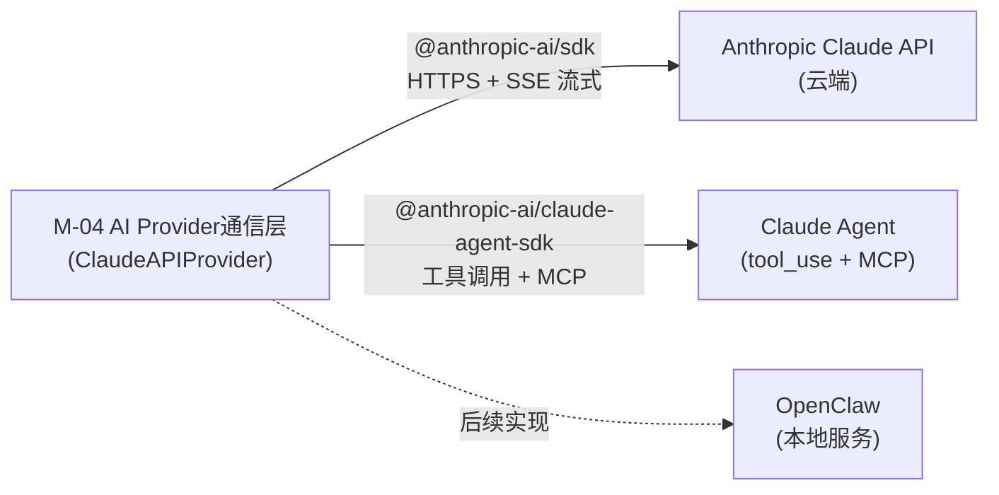
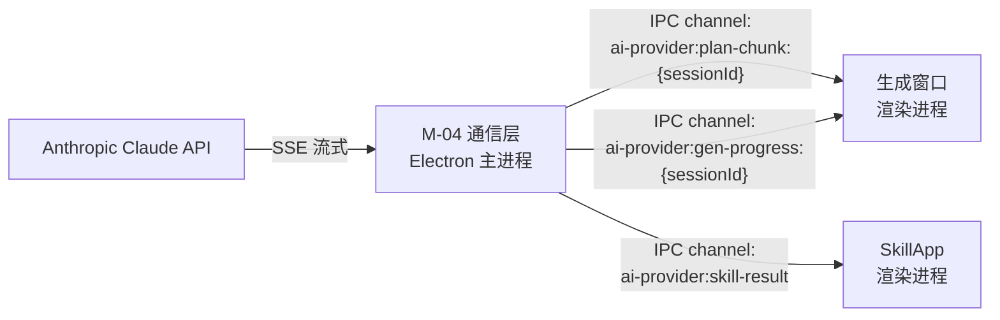
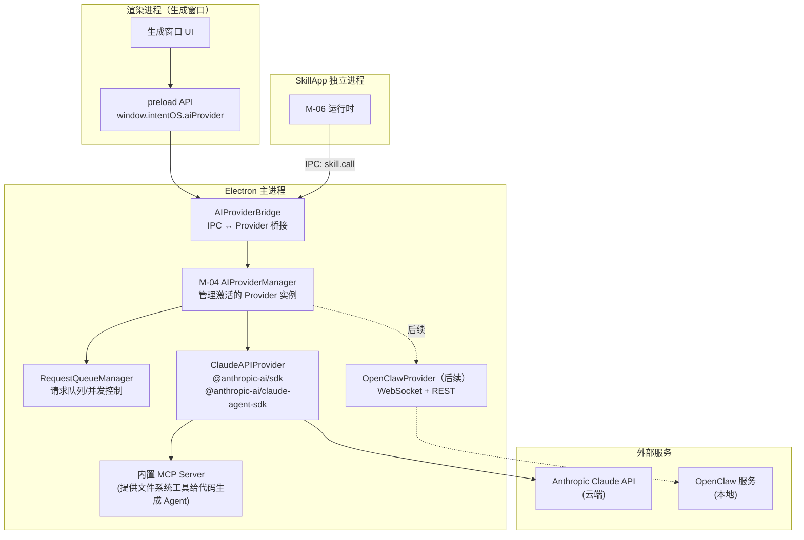
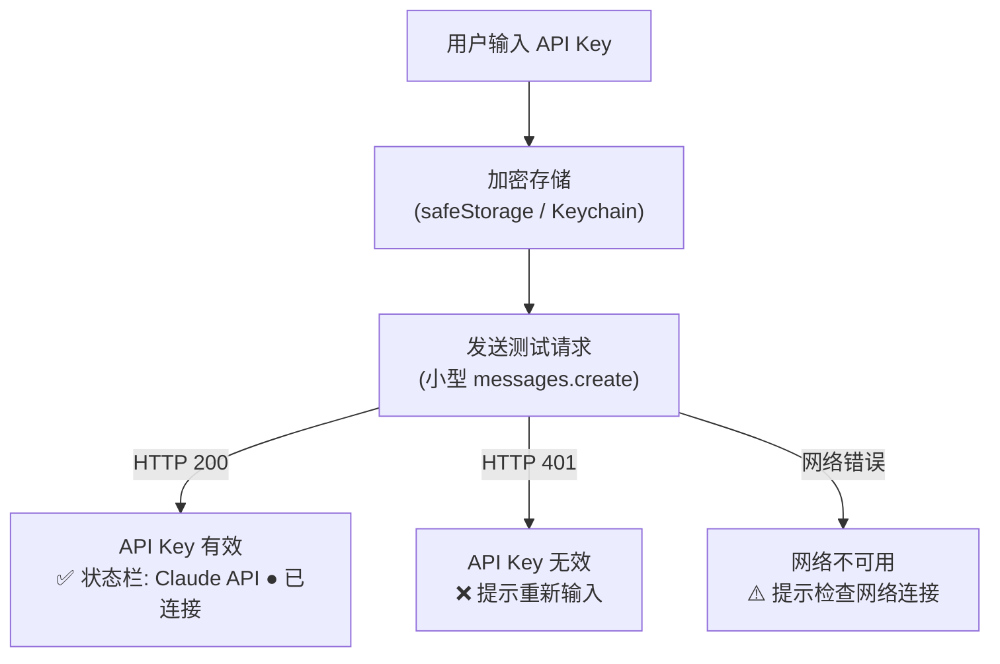

# IntentOS AI Provider 集成技术规格

> **版本**：v1.0 | **日期**：2026-03-13
> **状态**：正式文档
> **对应模块**：M-04 AI Provider 通信层

---

## 1. AIProvider 抽象接口设计

### 1.1 设计目标

1. **统一抽象**：不同 AI 后端（云端 Claude API、本地 OpenClaw 等）通过同一 `AIProvider` 接口对接，上层模块（M-05 SkillApp 生成器、M-06 SkillApp 运行时）无需关心底层实现细节，切换 Provider 不影响调用方代码。

2. **MVP 优先**：Claude API 作为第一实现，快速交付核心生成流程，无需本地部署任何服务。接口设计同时兼顾未来 OpenClaw Provider 的接入需求，确保扩展时无需修改接口定义。

3. **流式统一**：所有需要流式返回的能力（规划、代码生成进度）均通过 `AsyncIterable<Chunk>` 返回，消费方（渲染进程）代码处理逻辑一致，无需针对不同 Provider 编写不同的流处理逻辑。

4. **热切换**：不重启应用即可在 Provider 间切换。用户在设置页更改 Provider 后，M-04 管理器调用旧 Provider 的 `dispose()` 并以新配置重新初始化新 Provider，上层模块无感知，状态栏实时更新连接状态。

### 1.2 AIProvider 接口定义

```typescript
/**
 * AIProvider 抽象接口
 * 所有 AI 后端（Claude API、OpenClaw 等）必须实现此接口
 */
interface AIProvider {
  readonly id: string;           // Provider 唯一标识，如 "claude-api" | "openclaw"
  readonly name: string;         // 显示名称，如 "Claude API" | "OpenClaw（本地）"
  readonly status: ProviderStatus;

  /** 初始化 Provider（连接、校验凭证等） */
  initialize(config: ProviderConfig): Promise<void>;

  /** 释放资源，断开连接 */
  dispose(): Promise<void>;

  /**
   * 意图规划：将用户自然语言意图 + 可用 Skill 列表 → 生成 SkillApp 设计方案
   * @returns AsyncIterable 逐块返回规划流（思考过程 + 方案草稿 + 最终结果）
   */
  planApp(request: PlanRequest): AsyncIterable<PlanChunk>;

  /**
   * 代码生成：将规划结果 → 生成 SkillApp 源码并编译打包
   * @returns AsyncIterable 逐块返回生成进度（代码生成 → 编译 → 打包）
   */
  generateCode(request: GenerateRequest): AsyncIterable<GenProgressChunk>;

  /**
   * Skill 执行：由 SkillApp 通过 M-06 触发，调用指定 Skill 的指定方法
   * @returns Promise（Skill 执行为非流式，等待执行结果）
   */
  executeSkill(request: SkillCallRequest): Promise<SkillCallResult>;

  /**
   * 取消正在进行的会话
   */
  cancelSession(sessionId: string): Promise<void>;

  /** Provider 状态变化回调 */
  onStatusChanged?: (status: ProviderStatus) => void;
}
```

### 1.3 Chunk 类型定义（流式响应）

```typescript
// 规划流 Chunk
interface PlanChunk {
  sessionId: string;
  phase: "thinking" | "drafting" | "complete";
  content: string;
  planDraft?: PlanResult;  // phase="complete" 时携带完整规划结果
}

// 生成进度 Chunk
interface GenProgressChunk {
  sessionId: string;
  phase: "codegen" | "compile" | "bundle";  // GenCompleteChunk 通过 extends 覆盖此字段为 "done"
  percent: number;      // 0-100
  message: string;
  filesGenerated?: string[];
}

// 最终完成时追加的结果（通过 AsyncIterable 最后一个 chunk 或单独 done 信号）
interface GenCompleteChunk extends GenProgressChunk {
  phase: "done";
  appId: string;
  entryPoint: string;
  outputDir: string;
}
```

### 1.4 Provider 状态类型

```typescript
type ProviderStatus =
  | "uninitialized"   // 未初始化
  | "initializing"    // 初始化中（连接/校验中）
  | "ready"           // 就绪，可正常使用
  | "error"           // 错误状态（API Key 无效、网络不可用等）
  | "rate_limited"    // API 速率受限（HTTP 429）
  | "disposing";      // 正在释放资源

interface ProviderConfig {
  providerId: "claude-api" | "openclaw";
  // Claude API Provider 配置
  claudeApiKey?: string;          // 从 OS Keychain 解密后传入
  claudeModel?: string;           // 默认 "claude-opus-4-6"
  claudeCodegenModel?: string;    // 代码生成用模型，默认 "claude-sonnet-4-6"
  // OpenClaw Provider 配置（后续）
  openclawHost?: string;          // 默认 "127.0.0.1"
  openclawPort?: number;          // 默认 7890
}
```

---

## 2. Claude API Provider（MVP 实现）

### 2.1 技术选型与依赖

- 依赖 `@anthropic-ai/sdk` (>=0.50) — 规划和基础代码生成，提供 HTTPS + SSE 流式调用
- 依赖 `@anthropic-ai/claude-agent-sdk` (latest) — 带 MCP 工具调用的 Agent 执行，用于代码生成阶段的 tool_use 循环
- 不依赖 WebSocket（Claude API 通过 HTTPS/SSE，SDK 内置流式处理）
- 不需要本地安装任何 AI 服务，零本地依赖部署



### 2.2 规划能力实现（planApp）

使用 `@anthropic-ai/sdk` 的 `messages.stream()` API（SSE 流式）实现规划能力：

- **系统提示**：注入可用 Skill 列表（skillId、name、description、methods、permissions）以及 IntentOS SkillApp 代码约束（目录结构、React 18 + TypeScript + Electron 约束）
- **用户消息**：自然语言意图 + 多轮历史（`refinePlan` 时携带 `contextHistory`）
- **流式消费**：将 `text_delta` 事件映射为 `PlanChunk { phase: "thinking" | "drafting" }` 逐块 yield
- **最终消息**：在 `message_stop` 后，解析累积文本中的 JSON 规划结果，yield `PlanChunk { phase: "complete", planDraft }`

```typescript
async *planApp(request: PlanRequest): AsyncIterable<PlanChunk> {
  const stream = await this.anthropic.messages.stream({
    model: this.config.claudeModel ?? "claude-opus-4-6",
    max_tokens: 4096,
    system: buildPlanSystemPrompt(request.skills),
    messages: buildMessages(request.intent, request.contextHistory),
  });

  for await (const chunk of stream) {
    if (chunk.type === "content_block_delta" && chunk.delta.type === "text_delta") {
      yield {
        sessionId: request.sessionId,
        phase: detectPhase(chunk.delta.text), // 简单状态机：thinking → drafting
        content: chunk.delta.text,
      };
    }
  }

  const finalMessage = await stream.finalMessage();
  const planDraft = parsePlanResult(finalMessage.content[0].text);
  yield { sessionId: request.sessionId, phase: "complete", content: "", planDraft };
}
```

### 2.3 代码生成能力实现（generateCode）

使用 `@anthropic-ai/claude-agent-sdk` 的 `query()` API（支持工具调用循环）实现代码生成：

- **代码生成工具集**：`write_file(path, content)`、`run_command(cmd)`、`read_file(path)` — 由 IntentOS 主进程实现的内置 MCP Server 提供
- **模型**：`claude-sonnet-4-6`（代码生成使用较快模型，降低延迟和成本）
- **生成流程**：Agent 自主完成"生成源码 → 编译验证 → 修复错误 → 打包"循环，无需外部干预
- **进度上报**：监听工具调用事件（`write_file` → codegen 进度，`run_command build` → compile 进度，`run_command bundle` → bundle 进度）

```typescript
async *generateCode(request: GenerateRequest): AsyncIterable<GenProgressChunk> {
  // M-04 内部启动一个 MCP Server，提供文件系统工具给 Agent
  const mcpServer = await this.createBuildMCPServer(request.targetDir);

  const agentQuery = buildGeneratePrompt(request.plan, request.appId);

  for await (const event of query({
    model: this.config.claudeCodegenModel ?? "claude-sonnet-4-6",
    prompt: agentQuery,
    tools: mcpServer.tools,
  })) {
    if (event.type === "tool_use") {
      yield mapToolUseToProgress(event, request.sessionId);
    }
  }

  yield {
    sessionId: request.sessionId,
    phase: "done",
    percent: 100,
    message: "应用生成完成",
    appId: request.appId,
    entryPoint: "main.js",
    outputDir: request.targetDir,
  };
}
```

### 2.4 Skill 执行能力实现（executeSkill）

Skill 执行通过 Claude Agent SDK 的 tool_use 调用 Skill 对应方法：

- SkillApp 的 M-06 运行时发来请求 → M-04 构造 tool_use 请求 → Claude API 执行 → 返回结果
- 执行结果为非流式（`Promise<SkillCallResult>`），等待单次完整执行结果后返回
- 对于本地纯逻辑 Skill，可后续优化为绕过 Claude 直接调用本地模块（P2 优化项）

### 2.5 Claude Agent SDK 集成

- `@anthropic-ai/claude-agent-sdk` 的 `query()` 函数接受 `{ model, prompt, tools }` 参数
- 工具通过 MCP Server 协议注册：IntentOS Desktop 在主进程内运行一个内置 MCP Server，向 Agent 暴露文件系统工具
- Agent 自主执行工具调用循环（生成代码 → 调用 `write_file` → 调用 `run_command tsc` → 分析编译错误 → 修复），无需外部干预
- 中止支持：通过 `AbortController` 传入 `signal` 参数，用户取消时调用 `controller.abort()` 终止执行

### 2.6 连接状态管理与 API Key 校验

- **`initialize()` 流程**：从 OS Keychain 读取 API Key → 创建 `Anthropic` 客户端实例 → 发送轻量测试请求（`models.list()` 或小的 `messages.create()`）→ 校验成功则 `status = "ready"`
- **API Key 无效**（HTTP 401）：`status = "error"`，`errorCode = "API_KEY_INVALID"`
- **网络不可用**（连接超时/拒绝）：`status = "error"`，`errorCode = "NETWORK_UNAVAILABLE"`
- **状态变更通知**：`onStatusChanged` 回调通知 Desktop UI 更新底部状态栏指示器（绿/黄/红圆点）

### 2.7 错误处理策略（含 Rate Limit 处理）

| HTTP 状态码 | 错误码 | 处理策略 |
|------------|--------|---------|
| 401 | `API_KEY_INVALID` | 立即中止，`status = "error"`，UI 提示重新输入 Key |
| 429 | `RATE_LIMITED` | `status = "rate_limited"`，指数退避重试（3次，间隔 1s/2s/4s），期间状态栏显示"API 配额受限，正在重试..." |
| 5xx | `PROVIDER_ERROR` | 提示服务暂时不可用，建议稍后重试 |
| 网络超时 | `NETWORK_TIMEOUT` | 检测本地网络状态，提示检查连接 |
| AbortError | `SESSION_CANCELLED` | 静默处理，不显示错误，UI 回退到上一阶段 |

完整错误类型定义：

```typescript
type ProviderErrorCode =
  | "API_KEY_INVALID"       // HTTP 401
  | "API_KEY_MISSING"       // 未配置 API Key
  | "RATE_LIMITED"          // HTTP 429
  | "NETWORK_UNAVAILABLE"   // 无网络连接
  | "NETWORK_TIMEOUT"       // 请求超时
  | "PROVIDER_ERROR"        // AI 服务内部错误（5xx）
  | "PLAN_FAILED"           // 规划失败（意图不清晰等）
  | "CODEGEN_FAILED"        // 代码生成失败
  | "COMPILE_FAILED"        // 编译失败
  | "SESSION_CANCELLED";    // 会话被取消
```

---

## 3. M-04 通信层实现设计

### 3.1 运行位置：Electron 主进程

M-04 AI Provider 通信层运行在 **Electron 主进程**中，理由如下：

1. **安全性**：API Key 存储和使用完全在主进程中，不暴露给渲染进程（Context Isolation 边界），防止通过 XSS 等攻击泄露 Key
2. **生命周期**：主进程贯穿应用整个生命周期，Provider 连接实例与应用同生共死，无需在窗口切换时重新初始化
3. **共享连接**：多个渲染窗口（管理台主窗口、生成窗口）共享同一 Provider 实例，避免重复建立连接和重复消耗 API 配额

### 3.2 请求队列管理

```typescript
interface RequestQueueManager {
  maxConcurrent: number;      // 默认 1（AI 推理资源有限）
  activeRequests: Map<string, ActiveRequest>;  // sessionId → 活跃请求
  pendingQueue: PendingRequest[];              // 等待队列（FIFO）

  enqueue(request: PendingRequest): void;
  dequeue(): PendingRequest | null;
  complete(sessionId: string): void;
  cancel(sessionId: string): void;
}
```

队列策略：

| 规则 | 说明 |
|------|------|
| 并发限制 | 规划/生成最多 1 个并发会话（AI 推理资源有限，避免并发生成导致 Rate Limit） |
| Skill 调用独立计数 | `executeSkill` 不占用生成并发槽位，拥有独立并发限制（上限 5） |
| 队列顺序 | FIFO，先到先服务 |
| 队列上限 | 最多 10 个排队请求，超出返回 `RATE_LIMITED` 错误 |
| 排队 UI | M-05 收到"已排队"回调后，在生成窗口显示"当前有一个应用正在生成中，您的请求已加入队列" |

### 3.3 流式数据转发机制（SSE → IPC → 渲染进程）

Claude API 通过 HTTPS SSE 向主进程推送流式数据，主进程通过 Electron IPC 将 chunk 转发给对应的渲染进程，通过 `sessionId` 隔离不同会话的数据通道。



主进程 IPC 处理器（伪代码）：

```typescript
class AIProviderBridge {
  registerHandlers() {
    ipcMain.handle("ai-provider:plan", async (event, payload) => {
      const { sessionId } = payload;
      const stream = this.provider.planApp(payload);

      (async () => {
        for await (const chunk of stream) {
          event.sender.send(`ai-provider:plan-chunk:${sessionId}`, chunk);
        }
        event.sender.send(`ai-provider:plan-complete:${sessionId}`);
      })().catch(err => {
        event.sender.send(`ai-provider:plan-error:${sessionId}`, {
          code: err.code,
          message: err.message,
        });
      });

      return { sessionId, status: "streaming" };
    });

    ipcMain.handle("ai-provider:generate", async (event, payload) => {
      /* 同理，转发 GenProgressChunk 流 */
    });

    ipcMain.handle("ai-provider:skill-call", async (event, payload) => {
      return await this.provider.executeSkill(payload);  // 非流式，直接 invoke 返回
    });

    ipcMain.handle("ai-provider:cancel", async (_event, { sessionId }) => {
      await this.provider.cancelSession(sessionId);
    });
  }
}
```

渲染进程 preload 暴露的 API：

```typescript
contextBridge.exposeInMainWorld("intentOS", {
  aiProvider: {
    plan: (payload: PlanRequest) =>
      ipcRenderer.invoke("ai-provider:plan", payload),
    onPlanChunk: (sessionId: string, cb: (chunk: PlanChunk) => void) =>
      ipcRenderer.on(`ai-provider:plan-chunk:${sessionId}`, (_e, chunk) => cb(chunk)),
    onPlanComplete: (sessionId: string, cb: () => void) =>
      ipcRenderer.on(`ai-provider:plan-complete:${sessionId}`, cb),
    generate: (payload: GenerateRequest) =>
      ipcRenderer.invoke("ai-provider:generate", payload),
    onGenProgress: (sessionId: string, cb: (chunk: GenProgressChunk) => void) =>
      ipcRenderer.on(`ai-provider:gen-progress:${sessionId}`, (_e, chunk) => cb(chunk)),
    cancelSession: (sessionId: string) =>
      ipcRenderer.invoke("ai-provider:cancel", { sessionId }),
    getStatus: () =>
      ipcRenderer.invoke("ai-provider:status"),
    onStatusChanged: (cb: (status: ProviderStatus) => void) =>
      ipcRenderer.on("ai-provider:status-changed", (_e, status) => cb(status)),
  }
});
```

### 3.4 模块整体架构图



---

## 4. API Key 管理

### 4.1 存储方案

- **macOS**：优先使用 `keytar` npm 包直接集成 OS Keychain（Keychain Services），回退方案为 Electron 的 `safeStorage.encryptString()` + `app.getPath('userData')` 加密存储文件
- **Windows**：`safeStorage.encryptString()` 使用 DPAPI（Windows Data Protection API），密文写入 `userData` 目录下的加密文件
- **Linux**：`safeStorage.encryptString()` 使用 libsecret（GNOME Keyring）或基于用户密钥派生的加密
- **明文禁止**：API Key 不能写入 `~/.intentos/config.json` 等任何明文文件，违反此规则视为安全漏洞
- **运行时传递**：`ClaudeAPIProvider.initialize(config)` 接收解密后的明文 Key，仅在内存中持有，不序列化到磁盘

### 4.2 校验流程



校验超时：10 秒内未收到响应则判定为网络不可用，`errorCode = "NETWORK_TIMEOUT"`。

### 4.3 首次启动引导

对应 `product.md` 流程一（首次启动 IntentOS）设计的「配置 AI Provider」向导，分四步完成：

1. **选择 AI Provider**：下拉列表仅「Claude API (Anthropic)」可选；「OpenClaw（即将推出）」灰显不可点击（符合 MVP 约束）
2. **输入 Anthropic API Key**：密码输入框，附带跳转至 `console.anthropic.com` 的外链，引导用户获取 Key
3. **测试连接**：自动触发校验流程（见 4.2），展示连接延迟和可用模型版本；失败时展示具体错误原因和操作建议
4. **完成配置**：向导关闭，进入首次使用引导或主界面

**非首次启动**：每次启动时从 Keychain 读取已存储的 Key，自动执行 `initialize()`。若 Key 有效则直接进入主界面；若无效则弹出非阻塞提示，允许进入主界面浏览，但生成功能不可用直至 Key 更新。

**隐私告知**：向导和设置页均常驻显示隐私提示："使用 Claude API 时，您的意图描述和 Skill 信息将发送至 Anthropic 服务器。"用户首次配置时需显式确认（符合 `requirements.md` 安全要求）。

---

## 5. 异常处理策略

### 5.1 超时处理

| 操作类型 | 超时时间 | 超时后行为 |
|----------|---------|-----------|
| 规划请求 | 30 秒 | 取消流，向用户提示"规划超时，请简化描述后重试" |
| 代码生成 + 编译 + 打包 | 5 分钟 | 3 分钟时提示"耗时较长，仍在处理中..."；5 分钟时自动中断，提示用户重试或简化需求 |
| Skill 执行 | 30 秒 | 返回 `SKILL_TIMEOUT` 错误，SkillApp 内提示"操作超时，请稍后重试" |
| API Key 校验 | 10 秒 | 判定网络不可用，`errorCode = "NETWORK_TIMEOUT"`，提示检查网络 |

**超时实现**：每个 `planApp` / `generateCode` 调用创建独立的 `AbortController`，并绑定 `setTimeout` 触发器。超时触发时调用 `controller.abort()`，SDK 捕获 `AbortError` 后停止 SSE 流式输出，M-04 将其映射为 `SESSION_CANCELLED` 错误类型（超时触发的取消区别于用户主动取消，前者需向用户展示超时提示）。

### 5.2 生成失败的错误分类

| 错误类型 | 触发条件 | recoverable | 处理策略 |
|---------|---------|-------------|---------|
| 规划失败 | Claude 无法理解意图（返回歉意文本而非规划结果，JSON 解析失败） | true | 自动重试 1 次；仍失败则提示用户简化或重新描述意图 |
| 代码生成失败 | Claude Agent 无法完成文件写入（工具调用连续失败） | true | Agent 自动重试（最多 3 次工具调用循环）；超过上限则返回 `CODEGEN_FAILED` |
| 编译失败 | `run_command tsc` 返回非 0 退出码 | true | Agent 分析编译错误，自动修复代码，最多 3 轮修复循环；仍失败则提示用户联系支持并提供日志导出 |
| API Key 无效 | HTTP 401 | false | 中止生成，引导用户前往设置重新输入 Key |
| Rate Limited | HTTP 429 | true | 指数退避重试，间隔 1s/2s/4s，最多 3 次；期间状态栏显示"API 配额受限，正在重试..." |
| 网络不可用 | 连接超时/拒绝 | false | 提示检查网络，生成功能暂不可用；已运行的 SkillApp 不受影响 |

### 5.3 网络不可用与离线状态

- **检测机制**：`navigator.onLine` 监听（渲染进程）+ 实际 API 请求失败（主进程），双重检测确保准确性
- **离线时行为**：已运行的 SkillApp 不受影响（SkillApp 为独立进程，已编译的应用不依赖 M-04）；仅新建/修改 SkillApp 的生成功能不可用
- **状态栏展示**：底部状态栏实时变为"Claude API ✗ 网络不可用"，点击可手动触发重新连接检测
- **断网后自动恢复**：M-04 监听 `online` 网络恢复事件，自动触发 `provider.initialize()` 重新验证连接，成功后状态栏恢复绿色圆点

### 5.4 取消进行中的请求

完整取消流程：

1. 用户在生成阶段点击"取消"按钮
2. 渲染进程调用 `window.intentOS.aiProvider.cancelSession(sessionId)`
3. 主进程 `AIProviderBridge` 转发至 `ClaudeAPIProvider.cancelSession(sessionId)`
4. `ClaudeAPIProvider` 查找对应的 `AbortController`，调用 `controller.abort()`
5. `@anthropic-ai/sdk` 收到 abort 信号，停止 SSE 流，抛出 `AbortError`
6. M-04 捕获 `AbortError`，静默处理（不显示错误提示），从队列移除该请求
7. 若为 `generateCode` 过程被取消：删除临时生成目录（`request.targetDir`），清理不完整的构建产物
8. UI 回退到方案调整界面（阶段 2），保留已生成的设计方案，允许用户重新发起生成

---

## 6. OpenClaw Provider（后续实现，P2）

### 6.1 存档：为何 OpenClaw 适合作为第二 Provider

OpenClaw 作为第二 AI Provider 的技术优势：

- **本地推理**：无需网络连接，无 API Key，用户数据不离开本地，保护隐私（对应 `requirements.md` 数据保护要求）
- **低延迟**：本地服务连接延迟 < 1ms，规划和代码生成响应速度受本地硬件决定，无网络往返开销
- **零成本**：无 API 调用费用，用户本地算力自给自足
- **离线可用**：断网环境下（如企业内网限制）仍可完整运行 IntentOS 全部功能

适合的用户画像：重视数据隐私的企业内部工具用户（画像三）和配置高端本地硬件的个人开发者（画像二）。

### 6.2 OpenClaw Provider 接口实现预设计

```typescript
class OpenClawProvider implements AIProvider {
  readonly id = "openclaw";
  readonly name = "OpenClaw（本地）";

  // WebSocket 主通道（双向全双工，满足流式推理需求）
  private ws: WebSocket;
  // REST 端点（无状态健康检查）
  private baseUrl: string;  // http://127.0.0.1:7890

  async *planApp(request: PlanRequest): AsyncIterable<PlanChunk> {
    // 发送 WebSocket "plan" 消息
    // 将 "plan_chunk" 事件映射为 PlanChunk yield
  }

  async *generateCode(request: GenerateRequest): AsyncIterable<GenProgressChunk> {
    // 发送 WebSocket "generate" 消息
    // 将 "gen_progress" 事件映射为 GenProgressChunk yield
  }

  async executeSkill(request: SkillCallRequest): Promise<SkillCallResult> {
    // 发送 WebSocket "skill_call" 消息
    // 等待 "skill_result" 响应（request-response 模式）
  }
}
```

接口实现要点：
- `planApp()` → 发送 WebSocket `plan` 消息，将 `plan_chunk` 事件映射为 `PlanChunk` yield，保证与 Claude API Provider 输出格式一致
- `generateCode()` → 发送 WebSocket `generate` 消息，将 `gen_progress` 事件映射为 `GenProgressChunk` yield
- `executeSkill()` → 发送 WebSocket `skill_call` 消息，等待 `skill_result` 响应（基于 `requestId` 的 request-response 模式）
- `initialize()` / `dispose()` 负责 WebSocket 连接的建立和优雅关闭

### 6.3 通信协议选型（WebSocket + REST）

OpenClaw 本地服务采用双协议设计：

- **WebSocket**（主通道，`ws://127.0.0.1:7890/ws`）：双向全双工协议，天然支持服务端推流，满足规划/代码生成的流式输出需求；同时支持双向消息，适合 Skill 调用的 request-response 模式
- **REST HTTP**（`http://127.0.0.1:7890`）：用于无状态操作（健康检查 `GET /health`、版本查询 `GET /version`），简单可靠，兼容性好

详细消息结构、事件类型和错误码已存档于 `openclaw-spec.md`（OpenClaw 通信协议详细设计文档）。

---

## 附录 A：完整消息类型清单

| 来源 | 目标 | 消息类型 | 说明 |
|------|------|---------|------|
| M-04 主进程 | Anthropic Claude API | `messages.stream()` | SSE 流式消息创建（规划用） |
| M-04 主进程 | Anthropic Claude API | `query()` (Agent SDK) | 带工具调用的 Agent 查询（代码生成用） |
| Anthropic Claude API | M-04 主进程 | `content_block_delta` | 流式文本 chunk（规划阶段） |
| Anthropic Claude API | M-04 主进程 | `tool_use` event | Agent 工具调用事件（代码生成阶段） |
| M-04 主进程 | 渲染进程 | `ai-provider:plan-chunk:{sid}` | 规划流式 chunk（PlanChunk） |
| M-04 主进程 | 渲染进程 | `ai-provider:plan-complete:{sid}` | 规划完成信号 |
| M-04 主进程 | 渲染进程 | `ai-provider:plan-error:{sid}` | 规划失败错误信息 |
| M-04 主进程 | 渲染进程 | `ai-provider:gen-progress:{sid}` | 生成进度 chunk（GenProgressChunk） |
| M-04 主进程 | 渲染进程 | `ai-provider:gen-complete:{sid}` | 生成完成信号（GenCompleteChunk） |
| M-04 主进程 | 渲染进程 | `ai-provider:gen-error:{sid}` | 生成失败错误信息 |
| M-04 主进程 | 渲染进程（广播） | `ai-provider:status-changed` | Provider 状态变化通知（ProviderStatus） |
| 渲染进程 | M-04 主进程 | `ai-provider:plan` (invoke) | 发起规划请求（返回 sessionId） |
| 渲染进程 | M-04 主进程 | `ai-provider:generate` (invoke) | 发起代码生成请求 |
| 渲染进程 | M-04 主进程 | `ai-provider:cancel` (invoke) | 取消指定 sessionId 的会话 |
| 渲染进程 | M-04 主进程 | `ai-provider:status` (invoke) | 查询当前 Provider 状态 |
| SkillApp 进程 | M-04 主进程 | `skill.call` (IPC) | Skill 执行请求（经 Desktop 主进程中转） |
| M-04 主进程 | SkillApp 进程 | `skill.result` (IPC) | Skill 执行结果返回 |

---

## 附录 B：设计决策追溯表

| 决策 | 选择 | 理由 | 相关文档 |
|------|------|------|---------|
| MVP AI 后端 | Claude API（云端） | 快速交付、无本地部署依赖、官方 SDK 完善、无需用户配置本地服务 | `idea.md`（可插拔 AI 后端）, `requirements.md`（1.4 使用前提） |
| 抽象接口设计 | `AIProvider` interface | 隔离 Provider 实现细节，上层模块不感知底层差异，支持未来 OpenClaw 无缝切换 | `modules.md` M-04 定义 |
| MVP 主通道协议 | HTTPS + SSE | `@anthropic-ai/sdk` 内置，无需自实现流式处理；HTTPS 安全可靠 | 本文档 2.1 |
| 代码生成 Agent 能力 | `@anthropic-ai/claude-agent-sdk` | 原生 MCP Server 支持，tool_use 标准化，支持 Agent 自主完成编译修复循环 | 本文档 2.3, 2.5 |
| 通信层运行位置 | Electron 主进程 | API Key 安全隔离、生命周期管理、多窗口共享连接 | 本文档 3.1 |
| 流式转发机制 | IPC channel + sessionId 隔离 | Electron 标准 IPC 模式，sessionId 防止跨会话数据污染 | 本文档 3.3 |
| API Key 存储 | `safeStorage` / OS Keychain（`keytar`） | 安全存储，不写明文配置文件，符合安全需求 | `requirements.md`（安全 - API Key 本地加密存储） |
| 并发控制 | 规划/生成串行（最多 1 并发），Skill 调用独立限制（最多 5） | 避免 Rate Limit，AI 推理资源有限，保证生成质量 | 本文档 3.2 |
| 后续 AI 后端 | OpenClaw Provider（P2） | 本地推理备选，离线可用，保护隐私；WebSocket 协议详细设计存档于 `openclaw-spec.md` | 本文档第 6 节 |
