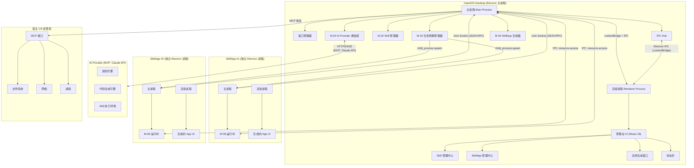
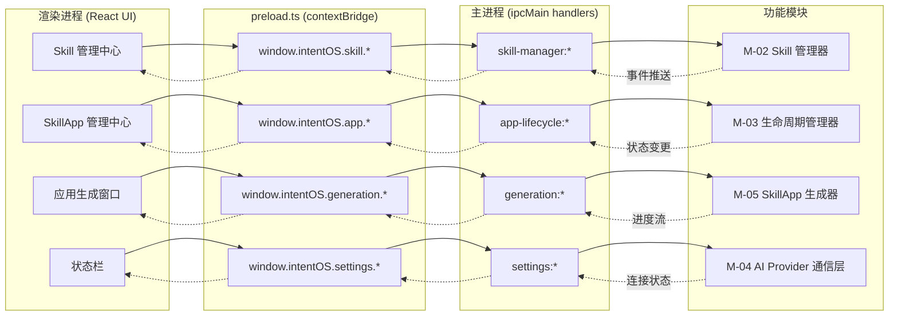
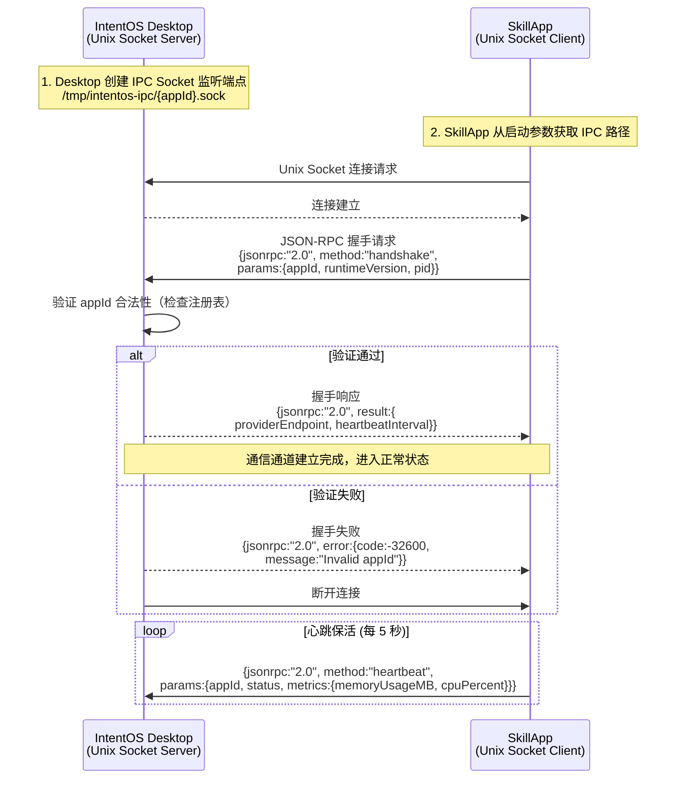
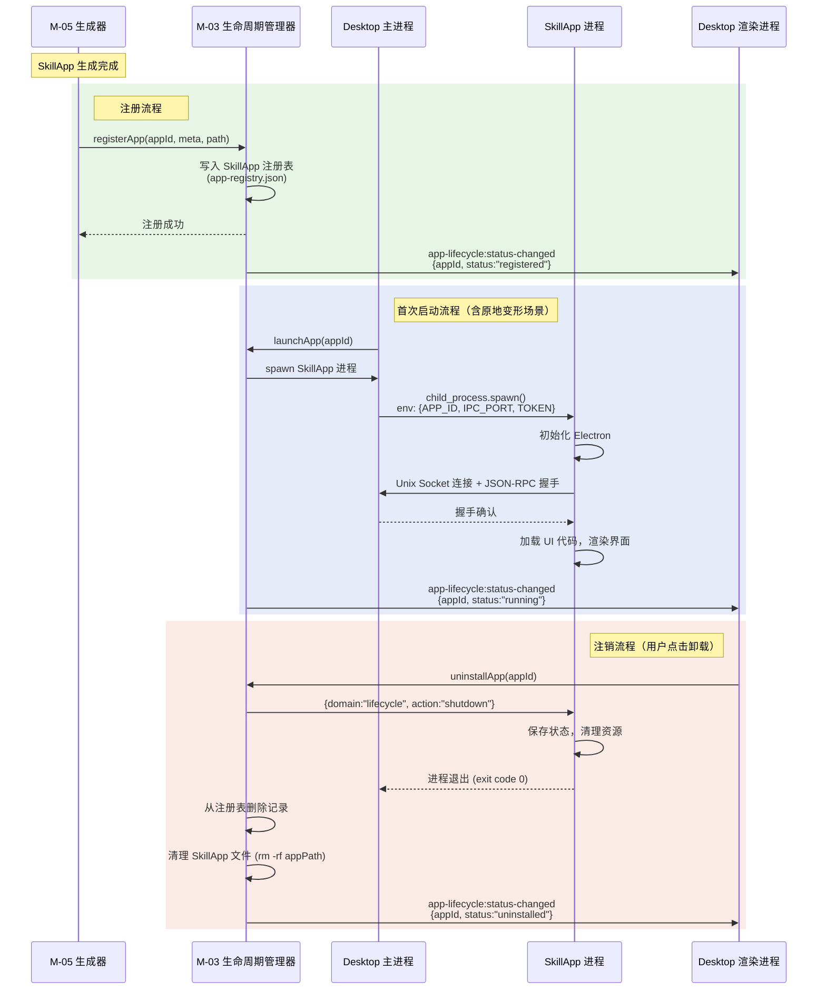
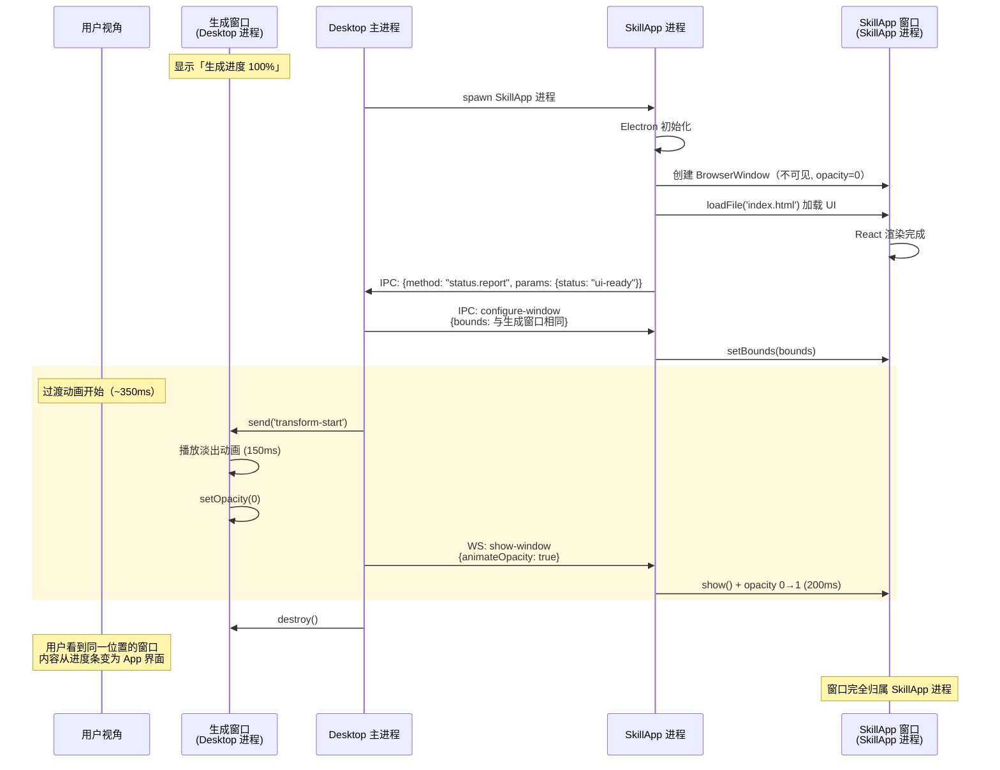
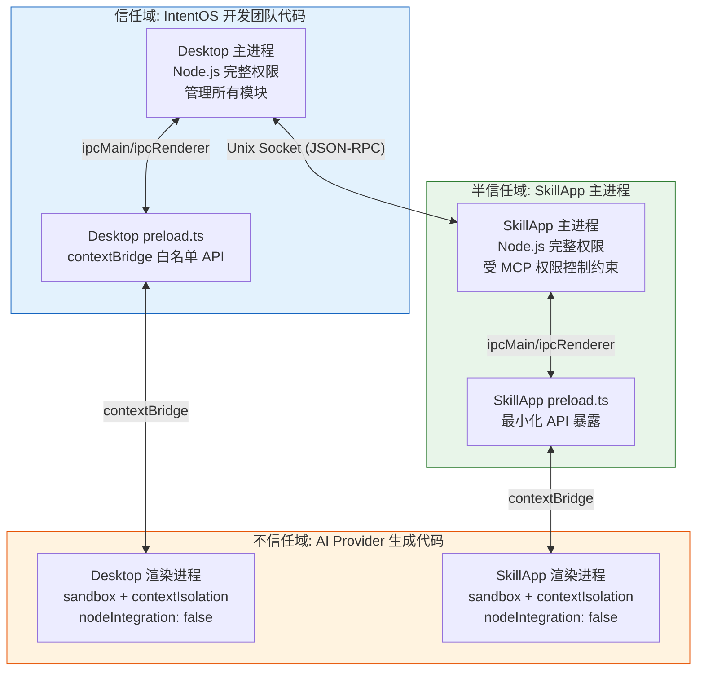

# IntentOS Electron 架构技术规格

> **版本**：v1.0 | **日期**：2026-03-13
> **状态**：正式文档
> **对应草稿**：Electron 架构规格草稿

## 1. 进程模型设计

### 1.1 IntentOS Desktop 主进程职责

IntentOS Desktop 的 Electron 主进程（Main Process）是整个桌面管理台的核心调度中枢，承担以下职责：

| 职责域 | 具体内容 |
|--------|----------|
| **窗口管理** | 创建和管理 Desktop 主窗口（BrowserWindow）、应用生成窗口、修改窗口；控制窗口生命周期（创建、显示、隐藏、销毁）；执行「原地变形」时的窗口所有权转移 |
| **IPC Hub** | 作为渲染进程与系统服务之间的通信中枢，通过 ipcMain 注册所有 channel handler，转发渲染进程的请求到对应的功能模块 |
| **SkillApp 进程调度** | 通过 `child_process` 或 `utilityProcess` 启动独立的 SkillApp Electron 进程；维护进程注册表（PID、状态、窗口句柄映射）；监听进程退出事件，更新状态 |
| **AI Provider 通信层宿主** | 承载 M-04 AI Provider 通信层实例，管理与 AI Provider 的连接；连接状态变更通过 IPC 同步给渲染进程 |
| **Skill 管理器宿主** | 承载 M-02 Skill 管理器实例，执行本地 Skill 目录扫描、注册、卸载、依赖检查等 Node.js 级操作 |
| **应用数据持久化** | 管理 SkillApp 注册表、Skill 元数据缓存、用户配置等本地数据的读写（使用 electron-store 或直接 fs 操作） |
| **系统托盘与菜单** | 注册全局快捷键、系统托盘图标、原生菜单栏 |

### 1.2 IntentOS Desktop 渲染进程职责

Desktop 的渲染进程（Renderer Process）专注于管理台 UI 的呈现与交互：

| 职责域 | 具体内容 |
|--------|----------|
| **管理台 UI 框架** | 基于 React 18 + TypeScript 构建的 SPA，包含侧栏导航、主内容区、状态栏三大布局区域 |
| **Skill 管理中心视图** | 已安装 Skill 网格展示、Skill 详情、被引用计数、卸载确认等交互组件 |
| **SkillApp 管理中心视图** | 已生成 App 卡片列表、启动/停止/修改/卸载操作按钮、运行状态实时指示器 |
| **应用生成窗口视图** | 三阶段生成向导（意图输入 -> 规划交互 -> 生成进度）、多轮对话交互区、三段式进度条 |
| **修改窗口视图** | 需求输入 -> 增量方案展示（新增/修改/不变分类）-> 热更新进度 |
| **状态栏** | AI Provider 连接状态实时指示（绿/红圆点）、Skill 数量、App 数量 |
| **全局状态管理** | 使用 Zustand 管理应用状态，通过 IPC 与主进程同步数据 |

### 1.3 SkillApp 进程模型

每个 SkillApp 是一个**独立的 Electron 进程**，拥有完整的进程架构：

```
SkillApp 独立进程
├── SkillApp 主进程 (Main Process)
│   ├── SkillApp Runtime（M-06 运行时模块）
│   │   ├── Skill 调用桥接（通过 AI Provider 通信层）
│   │   ├── MCP 资源访问代理
│   │   ├── 权限控制引擎
│   │   └── 热更新接收器
│   ├── 与 IntentOS Desktop 的 IPC 通道（状态同步、生命周期指令）
│   └── BrowserWindow 管理
└── SkillApp 渲染进程 (Renderer Process)
    ├── AI Provider 生成的 UI 代码（React 组件）
    ├── 应用导航栏
    ├── 应用内容区
    └── 状态栏（Skill 调用状态指示）
```

**关键设计决策**：SkillApp 不是以 BrowserView 或 webview 标签嵌入 Desktop，而是作为独立 Electron 进程运行。

**选型理由**：
- **进程隔离（安全性）**：SkillApp 崩溃不会拖垮 Desktop 或其他 SkillApp，满足需求 `M08`（独立运行）和非功能需求中的沙箱隔离要求
- **资源独占性**：每个 SkillApp 拥有独立的 V8 堆、GPU 进程、Node.js 运行时，避免内存泄漏交叉影响
- **生命周期独立性**：关闭 SkillApp 窗口即退出其进程，符合产品文档中「关闭该窗口 = 退出该 SkillApp（进程终止）」的设计
- **架构约束一致性**：满足 `requirements.md` 中「每个 SkillApp 必须运行在独立 Electron 进程中，不允许共享渲染进程」的硬性约束

**SkillApp 启动方式**：IntentOS Desktop 主进程通过 Node.js `child_process.spawn()` 启动 SkillApp 的 Electron 入口文件，传入 appId 和通信参数：

```typescript
// IntentOS Desktop 主进程中
import { spawn } from 'child_process';
import { app } from 'electron';

function launchSkillApp(appId: string, appPath: string, ipcPort: number): ChildProcess {
  const electronPath = process.execPath; // 当前 Electron 可执行路径
  const child = spawn(electronPath, [appPath], {
    env: {
      ...process.env,
      INTENTOS_APP_ID: appId,
      INTENTOS_IPC_PORT: String(ipcPort),
      INTENTOS_DESKTOP_PID: String(process.pid),
    },
    stdio: ['pipe', 'pipe', 'pipe', 'ipc'], // 启用 Node.js IPC channel
  });
  return child;
}
```

### 1.4 进程间关系图



---

## 2. IPC 通信架构（IntentOS Desktop 内部）

### 2.1 通信机制：contextBridge + ipcRenderer/ipcMain

IntentOS Desktop 内部（主进程 <-> 渲染进程）采用 Electron 官方推荐的 **contextBridge 暴露安全 API** 模式。

**架构原理**：

```
渲染进程 (React UI)
    │
    │ 调用 window.intentOS.xxx()
    ▼
preload.ts (contextBridge 暴露的安全 API)
    │
    │ ipcRenderer.invoke() / ipcRenderer.send()
    ▼
主进程 (ipcMain.handle() / ipcMain.on())
    │
    │ 调用内部模块
    ▼
Skill 管理器 / 生命周期管理器 / AI Provider 通信层 / 生成器
```

### 2.2 为什么选择 contextBridge 而不是直接暴露 remote

| 对比维度 | contextBridge（选用） | remote 模块（弃用） |
|----------|----------------------|---------------------|
| **安全性** | 渲染进程只能调用 preload 中显式暴露的函数，攻击面极小 | 渲染进程可直接调用主进程任意 Node.js API，XSS 漏洞可导致任意代码执行 |
| **性能** | `invoke` 基于异步消息传递，不阻塞主进程 | remote 使用同步 IPC，每次调用阻塞渲染进程直到主进程返回 |
| **Electron 官方立场** | 推荐方案，Electron 12+ 默认启用 contextIsolation | Electron 14+ 已从核心移除 remote 模块，需额外安装 `@electron/remote` |
| **可审计性** | 所有暴露的 API 集中在 preload.ts，便于安全审计 | API 暴露面不可控，难以审计 |
| **SkillApp 安全尤为关键** | SkillApp 的 UI 代码由 AI Provider 生成，必须严格限制其能力范围，防止生成的代码访问不应访问的系统资源 | 如果 SkillApp 使用 remote，生成的 UI 代码可以直接操控主进程，构成重大安全隐患 |

**结论**：鉴于 SkillApp 的代码由 AI Provider 自动生成、安全审计难以覆盖所有生成代码的特殊场景，必须选择 contextBridge 作为唯一的跨进程通信通道。

### 2.3 Channel 设计

所有 IPC channel 采用 `domain:action` 命名规范，便于路由和权限管理。

#### Channel 1: `skill-manager` — Skill 管理域

```typescript
// preload.ts 暴露的 API
contextBridge.exposeInMainWorld('intentOS', {
  skill: {
    // 获取所有已安装 Skill 列表
    getInstalled: (): Promise<SkillMeta[]> =>
      ipcRenderer.invoke('skill-manager:get-installed'),

    // 获取单个 Skill 详情
    getDetail: (skillId: string): Promise<SkillDetail> =>
      ipcRenderer.invoke('skill-manager:get-detail', skillId),

    // 注册本地 Skill（扫描路径）
    register: (path: string): Promise<void> =>
      ipcRenderer.invoke('skill-manager:register', path),

    // 卸载 Skill
    unregister: (skillId: string): Promise<void> =>
      ipcRenderer.invoke('skill-manager:unregister', skillId),

    // 获取 Skill 被引用次数
    getRefCount: (skillId: string): Promise<number> =>
      ipcRenderer.invoke('skill-manager:get-ref-count', skillId),

    // 检查 Skill 依赖
    checkDependencies: (skillId: string): Promise<DependencyCheckResult> =>
      ipcRenderer.invoke('skill-manager:check-dependencies', skillId),

    // 监听 Skill 变更事件
    onChanged: (callback: (event: SkillChangedEvent) => void): () => void => {
      const handler = (_: IpcRendererEvent, event: SkillChangedEvent) => callback(event);
      ipcRenderer.on('skill-manager:changed', handler);
      return () => ipcRenderer.removeListener('skill-manager:changed', handler);
    },
  },
  // ...其他域
});
```

```typescript
// 主进程 handler 注册
ipcMain.handle('skill-manager:get-installed', async () => {
  return skillManager.getInstalledSkills();
});

ipcMain.handle('skill-manager:get-detail', async (_, skillId: string) => {
  return skillManager.getSkillDetail(skillId);
});

ipcMain.handle('skill-manager:register', async (_, path: string) => {
  return skillManager.registerSkill({ path });
});

ipcMain.handle('skill-manager:unregister', async (_, skillId: string) => {
  return skillManager.unregisterSkill(skillId);
});

// Skill 变更时主动推送给渲染进程
skillManager.onSkillChanged((event) => {
  mainWindow.webContents.send('skill-manager:changed', event);
});
```

#### Channel 2: `app-lifecycle` — SkillApp 生命周期域

```typescript
// preload.ts
contextBridge.exposeInMainWorld('intentOS', {
  app: {
    // 获取所有 SkillApp 列表
    getAll: (): Promise<AppRegistryEntry[]> =>
      ipcRenderer.invoke('app-lifecycle:get-all'),

    // 获取单个 SkillApp 状态
    getStatus: (appId: string): Promise<AppStatus> =>
      ipcRenderer.invoke('app-lifecycle:get-status', appId),

    // 启动 SkillApp
    launch: (appId: string): Promise<void> =>
      ipcRenderer.invoke('app-lifecycle:launch', appId),

    // 停止 SkillApp
    stop: (appId: string): Promise<void> =>
      ipcRenderer.invoke('app-lifecycle:stop', appId),

    // 重启 SkillApp
    restart: (appId: string): Promise<void> =>
      ipcRenderer.invoke('app-lifecycle:restart', appId),

    // 聚焦 SkillApp 窗口
    focus: (appId: string): Promise<void> =>
      ipcRenderer.invoke('app-lifecycle:focus', appId),

    // 卸载 SkillApp
    uninstall: (appId: string): Promise<void> =>
      ipcRenderer.invoke('app-lifecycle:uninstall', appId),

    // 监听 SkillApp 状态变更
    onStatusChanged: (callback: (event: AppStatusChangedEvent) => void): () => void => {
      const handler = (_: IpcRendererEvent, event: AppStatusChangedEvent) => callback(event);
      ipcRenderer.on('app-lifecycle:status-changed', handler);
      return () => ipcRenderer.removeListener('app-lifecycle:status-changed', handler);
    },
  },
});
```

#### Channel 3: `generation` — 应用生成域

```typescript
// preload.ts
contextBridge.exposeInMainWorld('intentOS', {
  generation: {
    // 启动规划会话
    startPlan: (skillIds: string[], intent: string): Promise<PlanSession> =>
      ipcRenderer.invoke('generation:start-plan', skillIds, intent),

    // 多轮交互调整
    refinePlan: (sessionId: string, feedback: string): Promise<void> =>
      ipcRenderer.invoke('generation:refine-plan', sessionId, feedback),

    // 确认方案并开始生成
    confirmAndGenerate: (sessionId: string): Promise<void> =>
      ipcRenderer.invoke('generation:confirm-and-generate', sessionId),

    // 启动增量修改会话
    startModify: (appId: string, intent: string, newSkillIds?: string[]): Promise<ModifySession> =>
      ipcRenderer.invoke('generation:start-modify', appId, intent, newSkillIds),

    // 确认增量修改
    confirmAndApplyModify: (sessionId: string): Promise<void> =>
      ipcRenderer.invoke('generation:confirm-and-apply-modify', sessionId),

    // 取消会话
    cancel: (sessionId: string): Promise<void> =>
      ipcRenderer.invoke('generation:cancel', sessionId),

    // 监听规划方案流式更新
    onPlanUpdate: (callback: (update: PlanUpdate) => void): () => void => {
      const handler = (_: IpcRendererEvent, update: PlanUpdate) => callback(update);
      ipcRenderer.on('generation:plan-update', handler);
      return () => ipcRenderer.removeListener('generation:plan-update', handler);
    },

    // 监听生成进度
    onBuildProgress: (callback: (progress: BuildProgress) => void): () => void => {
      const handler = (_: IpcRendererEvent, progress: BuildProgress) => callback(progress);
      ipcRenderer.on('generation:build-progress', handler);
      return () => ipcRenderer.removeListener('generation:build-progress', handler);
    },

    // 监听原地变形触发
    onTransformReady: (callback: (event: TransformReadyEvent) => void): () => void => {
      const handler = (_: IpcRendererEvent, event: TransformReadyEvent) => callback(event);
      ipcRenderer.on('generation:transform-ready', handler);
      return () => ipcRenderer.removeListener('generation:transform-ready', handler);
    },
  },
});
```

> **与 modules.md M-01 接口的映射说明**：`modules.md` 中 M-01 桌面容器定义了 `onWindowTransform({ windowId, appId })` 输出接口，该接口在技术实现中对应 `generation:transform-ready` IPC 事件。当 M-05 生成器完成打包并注册 SkillApp 后，通过触发此 IPC 事件通知桌面容器执行原地变形流程（见本文档第 4.2 节 `performWindowTransform()` 函数）。`windowId` 对应当前生成窗口的 BrowserWindow ID，`appId` 对应新生成的 SkillApp ID。后续开发时，`modules.md` 中 `onWindowTransform` 的接口定义应更新为 `onTransformReady({ appId: string, appPath: string, windowBounds: Rectangle })` 以与技术实现对齐。

#### Channel 4: `settings` — 全局设置域

```typescript
// preload.ts
contextBridge.exposeInMainWorld('intentOS', {
  settings: {
    // 获取设置项
    get: (key: string): Promise<any> =>
      ipcRenderer.invoke('settings:get', key),

    // 更新设置项
    set: (key: string, value: any): Promise<void> =>
      ipcRenderer.invoke('settings:set', key, value),

    // 获取 AI Provider 连接配置
    getProviderConfig: (): Promise<ProviderConfig> =>
      ipcRenderer.invoke('settings:get-provider-config'),

    // 更新 AI Provider 连接配置
    setProviderConfig: (config: ProviderConfig): Promise<void> =>
      ipcRenderer.invoke('settings:set-provider-config', config),

    // 监听 AI Provider 连接状态
    onConnectionStatusChanged: (callback: (status: ConnectionStatus) => void): () => void => {
      const handler = (_: IpcRendererEvent, status: ConnectionStatus) => callback(status);
      ipcRenderer.on('settings:connection-status-changed', handler);
      return () => ipcRenderer.removeListener('settings:connection-status-changed', handler);
    },
  },
});
```

### 2.4 IPC 数据流总览



---

## 3. IntentOS Desktop <-> SkillApp 进程间通信

### 3.1 方案对比

| 方案 | 原理 | 延迟 | 复杂度 | 安全性 | 跨平台 | 适用场景 |
|------|------|------|--------|--------|--------|----------|
| **Electron IPC (stdio IPC channel)** | 通过 `child_process.spawn` 的 `stdio: 'ipc'` 建立 Node.js 原生 IPC 管道 | 极低（<1ms） | 低 | 高（仅限父子进程） | 好（Node.js 跨平台抽象） | 轻量控制指令、生命周期管理 |
| **本地 HTTP (REST)** | SkillApp 启动本地 HTTP Server，Desktop 通过 localhost 请求 | 中（5-10ms） | 中 | 中（需 token 认证） | 好 | 请求-响应模式的低频操作 |
| **本地 WebSocket** | Desktop 启动 WebSocket Server，SkillApp 连接 | 低（1-3ms） | 中 | 中（需 token 认证） | 好 | 双向实时通信、流式数据 |

### 3.2 推荐方案：双层通信架构（Node IPC + Unix Socket / Named Pipe）

采用 **Node.js IPC channel 作为控制通道** + **JSON-RPC 2.0 over Unix Socket / Named Pipe 作为数据通道** 的双层架构（详细协议设计见 `skillapp-spec.md` 第 3.2 节）：

**层级 1 -- Node.js IPC Channel（控制层）**

- **用途**：生命周期控制指令（启动确认、关闭请求、健康检查）、进程级信号
- **选择理由**：Desktop 通过 `child_process.spawn` 启动 SkillApp 时天然可用 `stdio: 'ipc'`，零配置、零端口占用、仅限父子进程通信（安全性最高）
- **局限**：仅支持 JSON 序列化消息，不适合大量流式数据；仅限父子进程关系

**层级 2 -- JSON-RPC 2.0 over Unix Socket / Named Pipe（数据层）**

- **用途**：热更新代码包推送、Skill 调用转发、MCP 资源访问代理、状态同步、事件流
- **通道标识**：每个 SkillApp 连接独立的 socket 路径（macOS/Linux：`/tmp/intentos-ipc/{appId}.sock`；Windows：`\\.\pipe\intentos-ipc-{appId}`）
- **选择理由**：
  - 无需端口管理，避免端口冲突问题（相比 WebSocket 方案更可靠）
  - JSON-RPC 2.0 是标准协议，支持请求-响应和单向通知两种模式
  - Unix Socket / Named Pipe 是本机进程间通信的高性能方案，延迟在亚毫秒级
  - 支持任意 Node.js 进程（不限于 Electron 窗口），扩展性好

**不选择本地 WebSocket 的理由**：WebSocket 需要占用 TCP 端口，多个 SkillApp 同时运行时需要端口分配和管理，增加复杂度。Unix Socket 通过文件路径标识，天然避免冲突且无需网络栈开销。

### 3.3 通信协议设计

#### 消息格式

所有 Unix Socket / Named Pipe 数据层消息采用 JSON 格式。数据层使用 JSON-RPC 2.0 协议（详见 `skillapp-spec.md` 第 3.2 节），同时支持以下扩展信封结构用于非 RPC 场景（事件推送、流式传输）：

```typescript
// 基础消息信封
interface IPCMessage {
  /** 消息唯一 ID，用于请求-响应配对 */
  id: string;
  /** 消息类型 */
  type: 'request' | 'response' | 'event' | 'stream';
  /** 消息域（对应功能模块） */
  domain: 'lifecycle' | 'runtime' | 'hotupdate' | 'skill-call' | 'status';
  /** 具体动作 */
  action: string;
  /** 负载数据 */
  payload: unknown;
  /** 时间戳 (ISO 8601) */
  timestamp: string;
}

// 请求消息
interface IPCRequest extends IPCMessage {
  type: 'request';
}

// 响应消息
interface IPCResponse extends IPCMessage {
  type: 'response';
  /** 关联的请求 ID */
  requestId: string;
  /** 是否成功 */
  success: boolean;
  /** 错误信息（失败时） */
  error?: { code: string; message: string };
}

// 事件消息（单向推送）
interface IPCEvent extends IPCMessage {
  type: 'event';
}

// 流式消息（用于热更新包分片传输等）
interface IPCStream extends IPCMessage {
  type: 'stream';
  /** 流 ID */
  streamId: string;
  /** 分片序号 */
  sequence: number;
  /** 是否为最后一个分片 */
  final: boolean;
}
```

#### 握手机制

SkillApp 启动后必须完成握手才能进入正常通信状态：



**安全机制**：
- Unix Socket 文件权限限制为当前用户可访问，外部进程无法连接
- 握手时 SkillApp 必须提供合法的 `appId`（在注册表中存在）
- 心跳间隔 5 秒（与 `skillapp-spec.md` 第 6.2 节一致），连续 3 次心跳未收到（15 秒）标记为 `unresponsive`

### 3.4 SkillApp 注册/注销流程



---

## 4. 窗口管理架构

### 4.1 BrowserWindow 生命周期与 SkillApp 进程生命周期绑定

IntentOS Desktop 和 SkillApp 的窗口-进程关系遵循以下规则：

| 场景 | 窗口行为 | 进程行为 |
|------|----------|----------|
| Desktop 主窗口关闭 | 窗口关闭 | Desktop 主进程退出；所有由 Desktop 启动的 SkillApp 子进程收到 SIGTERM 信号优雅退出 |
| SkillApp 窗口关闭 | 窗口销毁 | SkillApp 进程退出（`app.quit()`）；Desktop 生命周期管理器通过 `child.on('exit')` 检测到退出，更新注册表状态为 `stopped` |
| SkillApp 进程崩溃 | 窗口被系统强制关闭 | Desktop 检测到非零 exit code，更新状态为 `crashed`，推送通知给渲染进程 |
| SkillApp 从管理中心启动 | 新建 BrowserWindow（在 SkillApp 进程内） | Desktop spawn 新的 SkillApp 进程 |
| SkillApp 从管理中心聚焦 | 已有窗口置顶 + 获取焦点 | 进程不变，通过 Unix Socket 发送 `{method: "lifecycle.focus"}` 指令 |

### 4.2 「原地变形」技术实现

「原地变形」是 IntentOS 最核心的交互特性之一。其本质是：**用户视角下同一个窗口从「生成界面」无缝过渡为「SkillApp 主界面」，但窗口的进程归属从 Desktop 转移到了新的 SkillApp 独立进程。**

#### 推荐方案：视觉连续 + 进程切换

由于 Electron 的 BrowserWindow 无法在进程间转移（一个 BrowserWindow 实例绑定在创建它的 Electron 进程中），因此「原地变形」采用**视觉层面的连续性模拟**：

```
阶段 1: 生成窗口（属于 Desktop 进程）显示生成进度
阶段 2: 生成完成，在后台启动 SkillApp 进程并创建新窗口（不可见）
阶段 3: 新窗口定位到与生成窗口完全相同的位置和尺寸
阶段 4: 执行过渡动画（淡出生成窗口 + 淡入 SkillApp 窗口）
阶段 5: 销毁生成窗口，SkillApp 窗口完全就位
```

#### 技术实现细节

```typescript
// IntentOS Desktop 主进程中的原地变形逻辑
async function performWindowTransform(
  generationWindow: BrowserWindow,
  appId: string,
  appPath: string,
): Promise<void> {
  // 1. 记录生成窗口的位置和尺寸
  const bounds = generationWindow.getBounds();
  const isMaximized = generationWindow.isMaximized();

  // 2. 在后台启动 SkillApp 进程
  const appProcess = launchSkillApp(appId, appPath, ipcPath);

  // 3. 等待 SkillApp 完成 IPC 握手 + UI 渲染就绪
  await waitForAppReady(appId); // 通过 Unix Socket 接收 "ui-ready" 状态报告

  // 4. 通过 IPC 指令让 SkillApp 设置窗口属性
  sendToApp(appId, {
    domain: 'lifecycle',
    action: 'configure-window',
    payload: {
      bounds,           // 与生成窗口相同位置和尺寸
      show: false,      // 先不显示
      opacity: 0,       // 初始透明
    },
  });

  // 5. 执行过渡动画
  // 5a. 通知生成窗口渲染进程播放淡出动画
  generationWindow.webContents.send('generation:transform-start', { appId });
  await sleep(150); // 等待淡出动画

  // 5b. 将生成窗口透明度逐步降低
  generationWindow.setOpacity(0);

  // 5c. 显示 SkillApp 窗口并逐步提高透明度
  sendToApp(appId, {
    domain: 'lifecycle',
    action: 'show-window',
    payload: { animateOpacity: true, duration: 200 },
  });

  // 6. 销毁生成窗口
  await sleep(200); // 等待淡入完成
  generationWindow.destroy();

  // 7. 更新状态
  lifecycleManager.updateAppStatus(appId, 'running');
}
```

#### 原地变形时序图



#### 为什么不用同一 BrowserWindow 的 loadURL/loadFile 切换

虽然在同一 BrowserWindow 中通过 `webContents.loadURL()` 切换内容看似更简单（无需创建新窗口），但存在根本性的架构冲突：

| 问题 | 说明 |
|------|------|
| **进程归属无法转移** | BrowserWindow 绑定在创建它的 Electron 主进程中。如果生成窗口属于 Desktop 进程，loadURL 后仍然属于 Desktop 进程，无法实现「SkillApp 独立进程运行」的硬性架构约束 |
| **SkillApp Runtime 无法内嵌** | SkillApp 需要自己的主进程承载 M-06 运行时（Skill 调用桥接、MCP 代理、热更新接收器），这些只能在独立进程中运行 |
| **关闭语义错误** | 如果窗口仍属于 Desktop，关闭它不会退出 SkillApp 进程（因为没有独立进程可退），违反「关闭窗口 = 退出 SkillApp」的产品设计 |
| **崩溃隔离失效** | SkillApp 渲染进程崩溃可能拖垮 Desktop 主进程 |

**结论**：必须采用「视觉连续 + 进程切换」方案，牺牲约 350ms 的过渡动画时间，换取架构的正确性和安全性。

### 4.3 多 SkillApp 窗口管理

Desktop 的生命周期管理器维护一个全局的窗口注册表，提供以下管理能力：

```typescript
interface WindowRegistry {
  /** 所有活跃 SkillApp 窗口信息 */
  entries: Map<string, {
    appId: string;
    pid: number;
    windowTitle: string;
    bounds: Electron.Rectangle;
    isMinimized: boolean;
    isFocused: boolean;
    zOrder: number;     // 相对层级
    lastActiveAt: number; // 最后活跃时间戳
  }>;
}
```

**聚焦（Focus）**：从管理中心点击「打开」已运行的 SkillApp 时，Desktop 通过 Unix Socket 发送 `{method: "lifecycle.focus"}` JSON-RPC 通知，SkillApp 进程调用 `win.focus()` + `win.restore()`（如果最小化）。

**最小化（Minimize）**：SkillApp 窗口的最小化/还原由用户直接操作原生窗口控件，状态变更通过心跳消息中的 `metrics` 字段同步给 Desktop（参见 `skillapp-spec.md` 第 6.2 节心跳消息格式）。

**Z-Order 管理**：不主动干预操作系统的窗口层级，但在管理中心的 SkillApp 列表中按 `lastActiveAt` 降序排列，让最近使用的 App 排在前面，方便用户快速切换。

**窗口排列（S06 需求，Should Have）**：后续可实现「平铺」「层叠」等窗口排列功能，通过批量发送 `configure-window` 指令调整各 SkillApp 窗口的 bounds。

---

## 5. 安全架构

### 5.1 contextIsolation: true 的作用

`contextIsolation` 是 Electron 的核心安全特性，**必须在所有 BrowserWindow 中启用**（Desktop 和 SkillApp 均是）。

```typescript
// 所有 BrowserWindow 创建时
new BrowserWindow({
  webPreferences: {
    contextIsolation: true,  // 必须启用
    preload: path.join(__dirname, 'preload.js'),
  },
});
```

**作用机制**：
- 渲染进程的 JavaScript 运行在一个**隔离的上下文**中，与 preload 脚本的执行上下文完全分开
- 渲染进程无法直接访问 preload 脚本中的 Node.js API（`require`、`process`、`Buffer` 等）
- 只能通过 `contextBridge.exposeInMainWorld()` 显式暴露的 API 与主进程交互
- 即使渲染进程中出现 XSS 漏洞，攻击者也无法获得 Node.js 权限

**对 IntentOS 的特殊意义**：SkillApp 的 UI 代码由 AI Provider 自动生成，可能存在未预见的安全问题。contextIsolation 确保即使生成的代码有缺陷，也无法突破渲染进程沙箱访问系统资源。

### 5.2 Sandbox 模式与 SkillApp 的关系

Electron 的 sandbox 模式进一步限制渲染进程的能力：

```typescript
// SkillApp 的 BrowserWindow 配置
new BrowserWindow({
  webPreferences: {
    contextIsolation: true,
    sandbox: true,           // SkillApp 渲染进程必须启用
    preload: path.join(__dirname, 'skillapp-preload.js'),
    nodeIntegration: false,  // 必须关闭
  },
});
```

**sandbox: true 的效果**：
- 渲染进程运行在 Chromium 沙箱中，无法直接访问 OS 级资源（文件系统、网络原始套接字、进程等）
- preload 脚本中也无法使用完整的 Node.js API（仅保留有限的 `electron`、`ipcRenderer` 等）
- 所有系统资源访问必须通过 IPC 请求主进程代为执行

**分级策略**：

| 进程类型 | sandbox | 理由 |
|----------|---------|------|
| Desktop 渲染进程 | `true` | Desktop UI 代码虽由开发团队编写，但应遵循最小权限原则 |
| SkillApp 渲染进程 | `true`（强制） | AI Provider 生成的代码安全性无法保证，必须严格沙箱化 |
| Desktop 主进程 | N/A（主进程不受 sandbox 限制） | 需要完整的 Node.js 能力来管理窗口、进程、文件系统 |
| SkillApp 主进程 | N/A（主进程不受 sandbox 限制） | 需要 Node.js 能力来运行 M-06 运行时（MCP 代理、Skill 调用等） |

### 5.3 nodeIntegration 设置策略

```typescript
// 策略总结
const securityMatrix = {
  'Desktop 主进程':    { node: '完整 Node.js（天然可用）', purpose: '窗口管理、IPC Hub、模块宿主' },
  'Desktop 渲染进程':  { nodeIntegration: false, purpose: '防止 UI 层直接调用 Node API' },
  'SkillApp 主进程':   { node: '完整 Node.js（天然可用）', purpose: 'M-06 运行时需要 fs/net/child_process' },
  'SkillApp 渲染进程': { nodeIntegration: false, purpose: 'AI Provider 生成代码绝不允许直接访问 Node API' },
};
```

**额外安全措施**：

```typescript
// SkillApp BrowserWindow 的完整安全配置
const skillAppWindowConfig: Electron.BrowserWindowConstructorOptions = {
  webPreferences: {
    contextIsolation: true,
    sandbox: true,
    nodeIntegration: false,
    nodeIntegrationInWorker: false,
    nodeIntegrationInSubFrames: false,
    enableRemoteModule: false,        // 禁用 remote
    allowRunningInsecureContent: false,
    webSecurity: true,                // 启用同源策略
    // 限制导航到非预期的 URL
    // （在主进程中通过 webContents.on('will-navigate') 进一步控制）
  },
};
```

**webContents 导航控制**（在 SkillApp 主进程中）：

```typescript
win.webContents.on('will-navigate', (event, url) => {
  // 仅允许加载本地 SkillApp 文件
  const allowedProtocols = ['file:'];
  const parsed = new URL(url);
  if (!allowedProtocols.includes(parsed.protocol)) {
    event.preventDefault();
    console.warn(`[Security] Blocked navigation to: ${url}`);
  }
});

win.webContents.setWindowOpenHandler(({ url }) => {
  // SkillApp 不允许打开新窗口（防止弹窗攻击）
  // 外部链接用系统浏览器打开
  if (url.startsWith('http')) {
    shell.openExternal(url);
  }
  return { action: 'deny' };
});
```

### 5.4 安全架构总览



---

## 6. 技术栈确认（Electron 相关部分）

### 6.1 Electron 版本选择

| 项目 | 推荐 | 理由 |
|------|------|------|
| **Electron 版本** | **v33.x**（最新稳定版） | 基于 Chromium 130+ 和 Node.js 20.x LTS；ESM 支持完善；`utilityProcess` API 稳定可用；WebGPU 支持（为未来 AI 推理预留）；安全补丁最新 |
| **最低兼容版本** | v32.0 | 确保 `contextIsolation` 默认启用、`sandbox` 行为稳定、macOS Universal Binary 支持良好 |

**版本锁定策略**：IntentOS Desktop 和 SkillApp 可以使用不同的 Electron 版本（因为它们是独立进程），但建议保持一致以减少维护成本。在 `package.json` 中使用精确版本号（非范围），重大版本升级需回归测试。

### 6.2 渲染层框架：React 18 + TypeScript

| 决策项 | 选择 | 理由 |
|--------|------|------|
| **UI 框架** | React 18 | (1) 生态系统最成熟，组件库丰富（Ant Design、Radix UI 等），适合快速开发管理台界面；(2) Concurrent Mode 支持大列表渲染（Skill/App 列表）不阻塞 UI；(3) AI Provider 生成 SkillApp UI 代码时，React 的声明式组件模型更适合 AI 代码生成（结构化、可预测）；(4) 社区规模最大，长期维护有保障 |
| **类型系统** | TypeScript 5.x | (1) IPC 通信涉及大量消息类型定义，TypeScript 的类型系统可确保主进程与渲染进程的消息契约一致；(2) 对 `contextBridge` 暴露的 API 提供编译时类型检查，减少运行时错误；(3) AI Provider 生成的 SkillApp 代码也使用 TypeScript，保持技术栈一致 |
| **状态管理** | Zustand | (1) 轻量（<2KB），API 简洁，学习成本低；(2) 天然支持 TypeScript；(3) 不依赖 Context Provider，避免不必要的重渲染；(4) 适合中等复杂度的状态管理（IntentOS Desktop 的状态并不算很复杂） |
| **UI 组件库** | shadcn/ui + Tailwind CSS 4 | (1) shadcn/ui 是基于 Radix UI 的上层封装，提供高质量可复制组件，满足无障碍访问要求且便于深度定制；(2) Tailwind CSS 4 原生 CSS 层叠层支持，性能更优；(3) 可作为 AI Provider 生成 SkillApp UI 的标准组件库，保证生成代码的一致性和质量 |

### 6.3 构建工具：electron-vite

| 决策项 | 选择 | 理由 |
|--------|------|------|
| **构建工具** | **electron-vite** | (1) 基于 Vite 构建，开发环境 HMR（热模块替换）速度极快（<100ms），极大提升开发体验；(2) 原生支持 Electron 的三目标构建（main + preload + renderer），无需手动配置多个 bundler；(3) renderer 层使用 Vite 开发服务器，main 和 preload 使用 esbuild 构建，速度远超 webpack 方案；(4) 内置对 Node.js 内置模块的 externals 处理，减少配置工作量 |

**项目目录结构**：

```
intentos-desktop/
├── electron.vite.config.ts       # electron-vite 配置
├── package.json
├── tsconfig.json
├── src/
│   ├── main/                     # Electron 主进程代码
│   │   ├── index.ts              # 入口
│   │   ├── ipc/                  # IPC handler 注册
│   │   │   ├── skill-manager.handler.ts
│   │   │   ├── app-lifecycle.handler.ts
│   │   │   ├── generation.handler.ts
│   │   │   └── settings.handler.ts
│   │   ├── modules/              # 功能模块
│   │   │   ├── skill-manager/    # M-02
│   │   │   ├── lifecycle-manager/ # M-03
│   │   │   ├── ai-provider/      # M-04
│   │   │   └── generator/        # M-05
│   │   ├── window/               # 窗口管理
│   │   │   ├── main-window.ts
│   │   │   ├── generation-window.ts
│   │   │   └── transform.ts      # 原地变形逻辑
│   │   └── ipc-server/            # Unix Socket Server（Desktop↔SkillApp 通信）
│   ├── preload/                  # preload 脚本
│   │   ├── index.ts              # Desktop preload
│   │   └── types.ts              # 暴露 API 的类型定义
│   └── renderer/                 # 渲染进程代码 (React)
│       ├── index.html
│       ├── src/
│       │   ├── App.tsx
│       │   ├── components/       # 通用组件
│       │   ├── views/            # 页面视图
│       │   │   ├── SkillCenter/
│       │   │   ├── AppCenter/
│       │   │   ├── Generation/
│       │   │   └── Settings/
│       │   ├── stores/           # Zustand 状态
│       │   ├── hooks/            # 自定义 hooks（含 IPC 调用封装）
│       │   └── types/            # 共享类型定义
│       └── assets/
├── skillapp-template/            # SkillApp 项目模板
│   ├── src/
│   │   ├── main/                 # SkillApp 主进程
│   │   │   ├── index.ts
│   │   │   └── runtime/          # M-06 运行时
│   │   ├── preload/
│   │   │   └── index.ts          # SkillApp preload（最小化 API）
│   │   └── renderer/             # AI 生成的 UI 代码放置处
│   │       ├── index.html
│   │       └── src/
│   └── electron.vite.config.ts
└── resources/                    # 图标、打包资源
```

### 6.4 打包工具：electron-builder

| 决策项 | 选择 | 理由 |
|--------|------|------|
| **打包工具** | **electron-builder** | (1) 跨平台打包最成熟的方案，支持 macOS (dmg/pkg)、Windows (nsis/msi)、Linux (deb/AppImage)；(2) 支持自动代码签名（macOS notarization + Windows Authenticode），满足发布要求；(3) 支持 auto-update 集成（electron-updater），满足「IntentOS Desktop 本身支持自动检测和安装更新」的需求；(4) 支持 macOS Universal Binary（x64 + arm64），满足架构兼容性要求 |
| **SkillApp 打包** | **不使用 electron-builder** | SkillApp 不需要打包为安装包分发（在本机运行即可），直接使用源码 + electron-vite 构建输出即可。SkillApp 由 Desktop 本地启动，无需安装器。未来若需要 N02（导出分享），再引入打包流程 |

**打包配置要点**：

```yaml
# electron-builder.yml
appId: com.intentos.desktop
productName: IntentOS Desktop
directories:
  output: dist
mac:
  target:
    - target: dmg
      arch: [x64, arm64]    # Universal Binary
  notarize: true
  hardenedRuntime: true
win:
  target:
    - target: nsis
      arch: [x64]
linux:
  target:
    - target: AppImage
      arch: [x64]
publish:
  provider: generic
  url: https://update.intentos.app  # 自动更新服务器
```

### 6.5 技术栈版本总览

| 技术 | 版本 | 用途 |
|------|------|------|
| Electron | v33.x | 应用框架 |
| Node.js | v20.x LTS（Electron 内置） | 主进程运行时 |
| React | 18.x | UI 框架 |
| TypeScript | 5.x | 类型系统 |
| Vite | 6.x | 底层构建引擎 |
| electron-vite | 3.x | Electron 构建集成 |
| electron-builder | 25.x | 桌面端打包与分发 |
| Zustand | 5.x | 状态管理 |
| shadcn/ui | latest | 无障碍 UI 组件库（基于 Radix UI） |
| Tailwind CSS | 4.x | 样式方案 |
| node:net | Node.js 内置 | Unix Socket / Named Pipe（Desktop↔SkillApp 通信） |

---

## 附录 A: 关键类型定义

以下类型定义在 Desktop 和 SkillApp 之间共享，建议放在独立的 `@intentos/shared-types` 包中：

```typescript
// === Skill 相关类型 ===
interface SkillMeta {
  id: string;
  name: string;
  version: string;
  description: string;
  author: string;
  permissions: Permission[];
  inputSchema: JSONSchema;
  outputSchema: JSONSchema;
}

interface SkillDetail extends SkillMeta {
  readme: string;
  signature?: string;
  dependencies: string[];
}

type SkillChangedEvent = {
  type: 'added' | 'removed' | 'updated';
  skillId: string;
  meta: SkillMeta;
};

// === SkillApp 相关类型 ===
type AppStatus = 'registered' | 'starting' | 'running' | 'stopped' | 'crashed' | 'uninstalled';

interface AppRegistryEntry {
  appId: string;
  name: string;
  skillIds: string[];
  status: AppStatus;
  createdAt: string;   // ISO 8601
  updatedAt: string;
  appPath: string;     // SkillApp 文件存放路径
  version: number;     // 修改次数
}

interface AppStatusChangedEvent {
  appId: string;
  oldStatus: AppStatus;
  newStatus: AppStatus;
  timestamp: string;
}

// === 生成相关类型 ===
interface PlanSession {
  sessionId: string;
  skillIds: string[];
  intent: string;
  plan?: PlanResult;
}

interface PlanResult {
  appName: string;
  pages: PageDesign[];
  skillMapping: Record<string, string>;
  permissions: Permission[];
}

interface BuildProgress {
  stage: 'code-generation' | 'compile' | 'initialize';
  progress: number;      // 0-100
  message: string;
  error?: { code: string; message: string };
}

interface TransformReadyEvent {
  appId: string;
  appPath: string;
  windowBounds: Electron.Rectangle;
}

// === 连接相关类型 ===
type ConnectionStatus = 'connected' | 'disconnected' | 'connecting' | 'error';
```

---

## 附录 B: 技术决策追溯表

| 编号 | 决策 | 选择 | 备选方案 | 选择理由 | 关联需求 |
|------|------|------|----------|----------|----------|
| TD-01 | SkillApp 进程模型 | 独立 Electron 进程 | BrowserView / webview 嵌入 | 进程隔离（安全性+稳定性）、架构约束要求 | M08, 安全需求 |
| TD-02 | Desktop 内部 IPC | contextBridge | remote 模块 | 安全性、性能、官方推荐 | 安全需求 |
| TD-03 | Desktop↔SkillApp 通信 | Node IPC + Unix Socket（JSON-RPC 2.0）双层 | 纯 HTTP / WebSocket / 纯 IPC | 控制指令用 IPC（零配置）、数据流用 Unix Socket（无端口冲突、高性能） | M10, M13 |
| TD-04 | 原地变形实现 | 视觉连续 + 进程切换 | 同一 BrowserWindow loadURL | BrowserWindow 无法跨进程转移 | M07 |
| TD-05 | UI 框架 | React 18 | Vue 3, Svelte | 生态成熟、AI 代码生成适配性好 | M04 |
| TD-06 | 构建工具 | electron-vite | electron-forge + webpack | HMR 速度、配置简洁度 | 开发效率 |
| TD-07 | 打包工具 | electron-builder | electron-forge | 跨平台成熟度、auto-update 集成 | 跨平台兼容性 |
| TD-08 | SkillApp 渲染进程安全 | sandbox + contextIsolation + nodeIntegration:false | 仅 contextIsolation | AI Provider 生成代码需最严格沙箱限制 | 安全需求 |