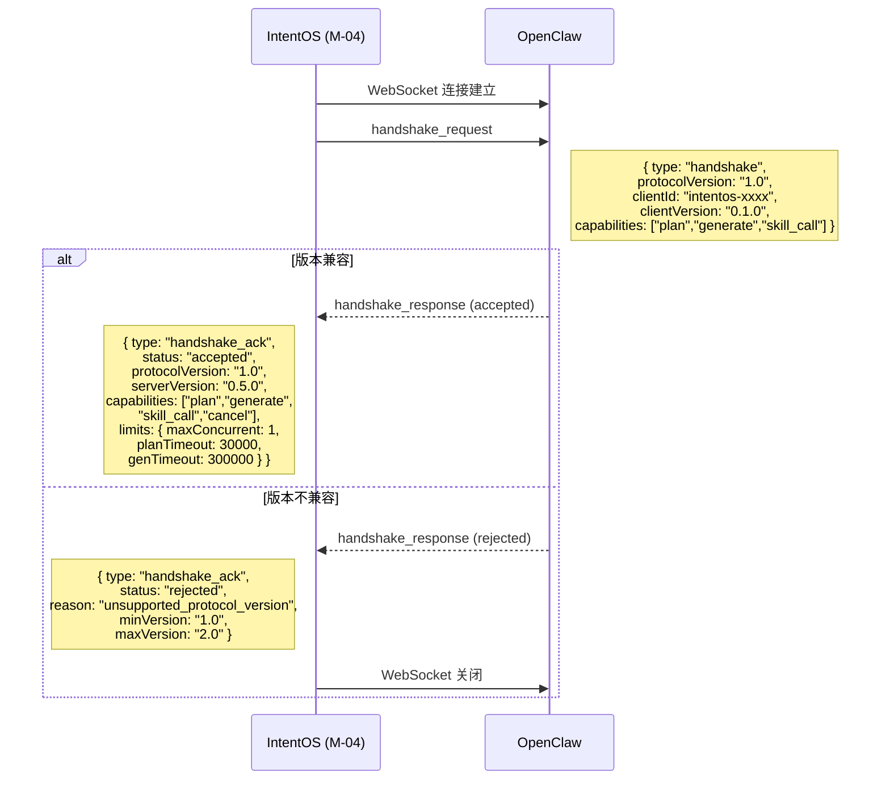
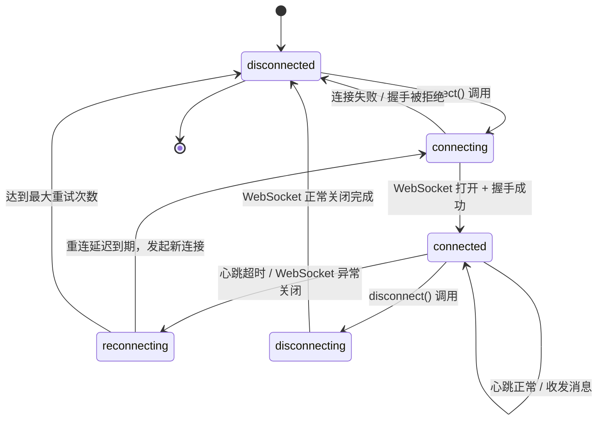
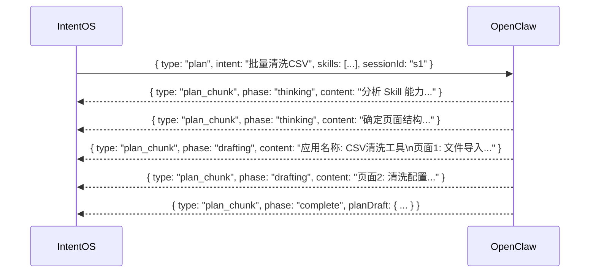
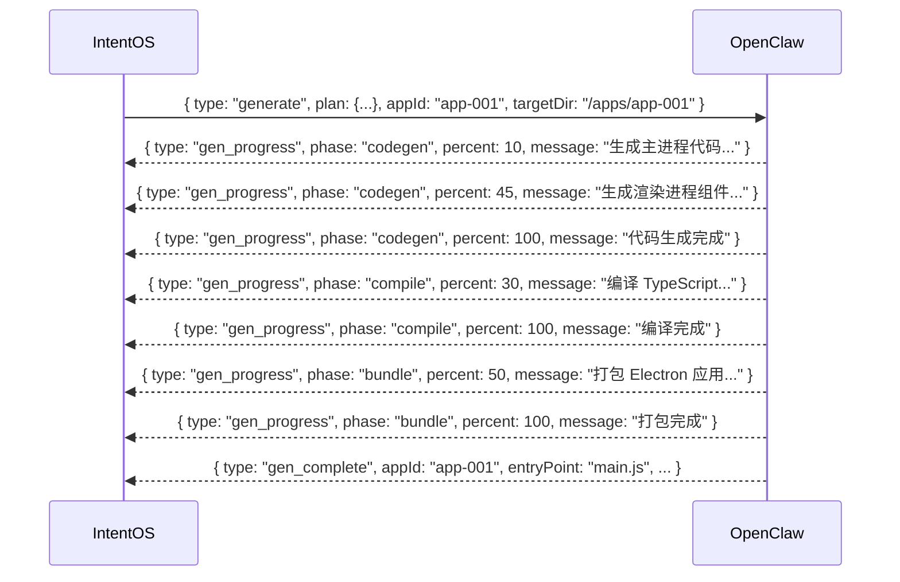
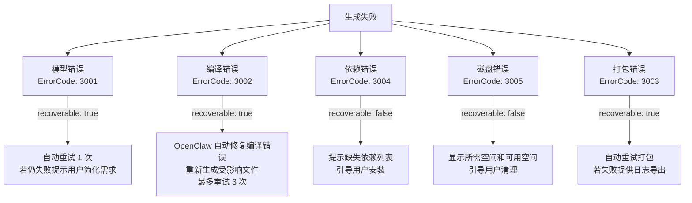
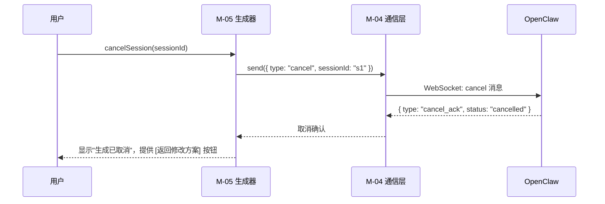
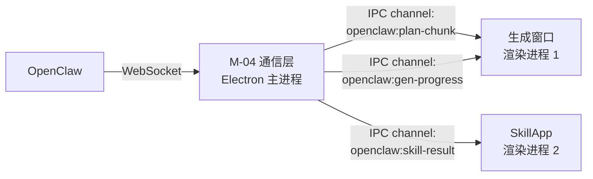
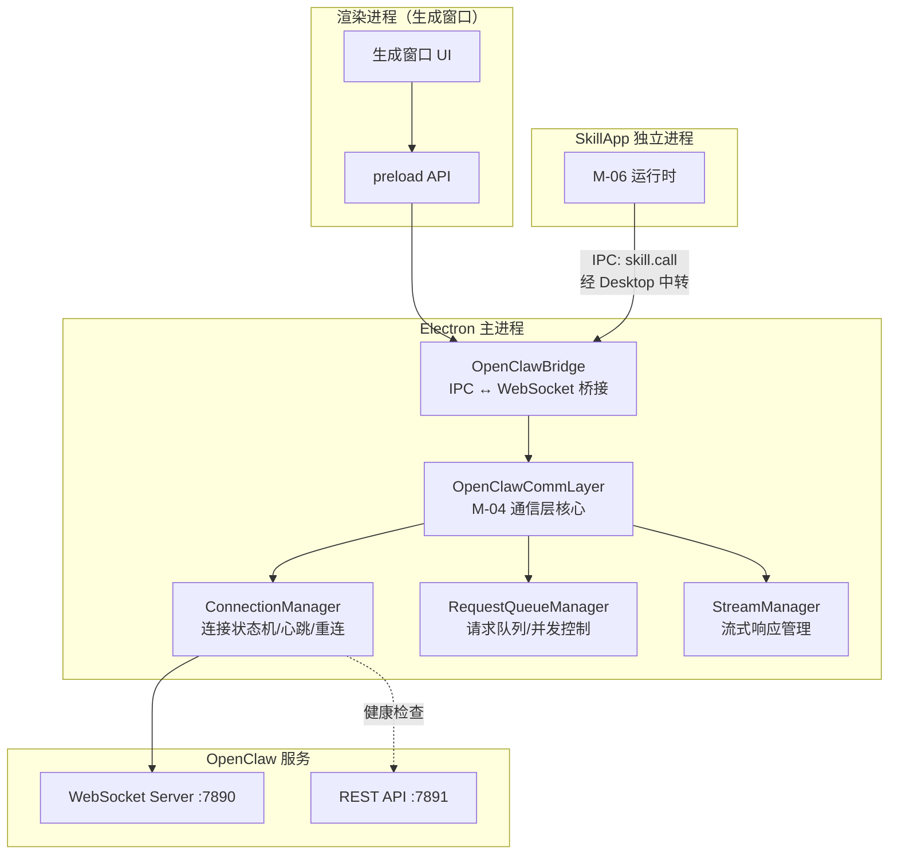
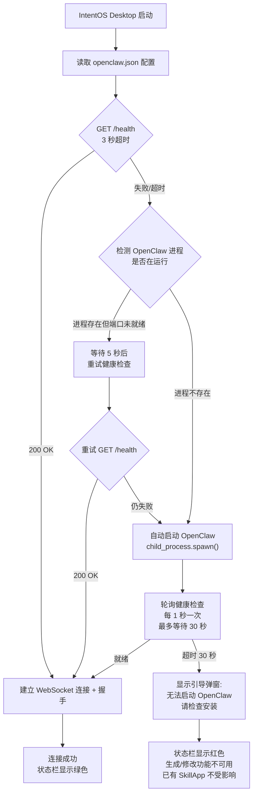

# IntentOS OpenClaw 集成技术规格

> **版本**：v1.0 | **日期**：2026-03-12
> **状态**：正式文档
> **对应模块**：M-04 OpenClaw 通信层

---

## 1. 通信协议选型

### 1.1 候选方案对比

| 维度 | REST API | WebSocket | gRPC | Server-Sent Events (SSE) |
|------|----------|-----------|------|--------------------------|
| **流式支持** | 不支持（需轮询） | 双向全双工流式 | 双向流式 | 仅服务端→客户端单向流 |
| **连接模型** | 短连接，每次请求独立 | 长连接，连接复用 | 长连接，HTTP/2 多路复用 | 长连接，基于 HTTP/1.1 |
| **Electron 兼容性** | 原生支持 | 原生支持（ws 库成熟） | 需要 @grpc/grpc-js，Electron 打包需额外配置 native modules | 原生支持（EventSource API） |
| **双向通信** | 否 | 是 | 是 | 否（客户端→服务端需额外 HTTP 请求） |
| **心跳/保活** | 不适用 | 内置 ping/pong 机制 | HTTP/2 PING 帧 | 依赖 HTTP keep-alive，无原生心跳 |
| **错误恢复** | 每次请求独立，天然隔离 | 需手动实现重连逻辑 | 自动重连（channel 级别） | 浏览器 EventSource 有自动重连，Node 端需手动实现 |
| **取消进行中请求** | 需额外机制 | 发送 cancel 消息即可 | 原生支持（CancellationToken） | 关闭连接或发送 HTTP 请求取消 |
| **类型安全** | 依赖 OpenAPI/JSON Schema | 依赖自定义协议 | 原生 Protobuf 强类型 | 依赖自定义协议 |
| **调试友好度** | 高（curl/Postman） | 中（需 WebSocket 调试工具） | 低（需 grpcurl 等专用工具） | 高（浏览器原生支持） |
| **实现复杂度** | 低 | 中 | 高 | 低 |

### 1.2 推荐选型：WebSocket（主通道）+ REST（辅助通道）

**主通道 — WebSocket**：承载所有需要流式返回的核心交互，包括规划请求（`sendPlanRequest`）、代码生成请求（`sendGenerateRequest`）、Skill 执行请求（`sendSkillCallRequest`）以及连接状态管理。

**辅助通道 — REST API**：承载无需流式的轻量操作，包括 OpenClaw 健康检查（`GET /health`）、版本与能力查询（`GET /info`）、配置参数设置（`POST /config`）、会话状态查询（`GET /sessions/:id`）。

### 1.3 选型理由

**选择 WebSocket 作为主通道的核心理由**：

1. **流式传输是刚需**。IntentOS 的三大核心 API（规划、生成、Skill 调用）中，规划和生成均要求流式返回（`Stream<PlanChunk>`、`Stream<GenProgress>`），这是 `modules.md` 中 M-04 接口定义的明确要求。WebSocket 原生支持双向全双工流式通信，无需额外协议适配。

2. **双向通信必要性**。规划阶段支持多轮交互（用户输入调整 → AI 返回更新方案），需要客户端和服务端双向实时通信。SSE 仅支持服务端→客户端单向流，客户端发送调整需要额外 HTTP 请求，增加延迟和复杂度。WebSocket 在同一连接上双向传输，延迟更低。

3. **Electron 环境原生兼容**。Electron 主进程（Node.js 环境）对 WebSocket 支持成熟，`ws` 库是 Node.js 生态中最稳定的 WebSocket 实现之一，无需处理 native module 编译问题。相比之下，gRPC 在 Electron 环境中需要 `@grpc/grpc-js` 且涉及 Protobuf 编译工具链，打包和跨平台兼容性（macOS Intel/Apple Silicon、Windows x64）增加了显著的工程复杂度。

4. **请求取消能力**。`product.md` 边界情况处理中明确要求支持取消进行中的生成请求。WebSocket 长连接上可随时发送 `cancel` 消息，OpenClaw 收到后立即停止当前任务。REST 实现取消需要额外的 cancel endpoint 配合轮询，不够即时。

**选择 REST 作为辅助通道的理由**：

健康检查、版本查询等操作是无状态的一次性请求，使用 REST 更简单、更易调试（curl 直接测试），且不依赖 WebSocket 连接是否已建立。这些接口在连接建立前就可能被调用（如启动时检测 OpenClaw 是否运行），REST 的独立性恰好满足此需求。

**排除 gRPC 的理由**：

虽然 gRPC 在类型安全和性能上有优势，但 IntentOS 与 OpenClaw 之间是本地进程间通信（localhost），网络性能不是瓶颈。gRPC 带来的 Protobuf 编译工具链、Electron 打包 native modules、跨 3 个目标平台（macOS Intel/ARM、Windows x64）的兼容性测试成本远高于收益。类型安全可以通过 TypeScript 接口定义 + JSON Schema 验证来补偿。

**排除纯 SSE 方案的理由**：

SSE 仅支持服务端→客户端单向流，无法满足规划阶段多轮交互的双向通信需求。若使用 SSE + REST 混合方案，客户端发送消息需走独立 HTTP 请求，消息顺序保证和会话关联的复杂度高于 WebSocket 单连接方案。

---

## 2. 连接管理

### 2.1 OpenClaw 服务发现机制

OpenClaw 作为本地服务运行，采用**约定端口 + 配置可覆盖**的发现策略：

| 配置项 | 默认值 | 说明 |
|--------|--------|------|
| `openclaw.host` | `127.0.0.1` | OpenClaw 监听地址，固定为本地回环 |
| `openclaw.port` | `7890` | WebSocket 主通道端口 |
| `openclaw.restPort` | `7891` | REST 辅助通道端口 |
| `openclaw.configPath` | `~/.intentos/openclaw.json` | 配置文件路径，支持用户自定义端口 |

**发现流程**：

1. IntentOS 启动时，读取 `openclaw.configPath` 获取端口配置（若文件不存在则使用默认值）
2. 向 `http://{host}:{restPort}/health` 发送 GET 请求检测 OpenClaw 是否存活
3. 若健康检查通过，建立 WebSocket 连接到 `ws://{host}:{port}/ws`
4. 若健康检查失败，进入自动启动流程（见第 7 节）

### 2.2 连接建立握手协议

WebSocket 连接建立后，双方通过握手消息进行版本协商和能力交换：



**握手消息数据结构**：

```typescript
// IntentOS → OpenClaw
interface HandshakeRequest {
  type: "handshake";
  protocolVersion: string;       // 语义化版本号，如 "1.0"
  clientId: string;              // IntentOS 实例唯一标识
  clientVersion: string;         // IntentOS 版本号
  capabilities: ClientCapability[]; // 客户端支持的能力列表
}

type ClientCapability = "plan" | "generate" | "skill_call";

// OpenClaw → IntentOS
interface HandshakeResponse {
  type: "handshake_ack";
  status: "accepted" | "rejected";
  protocolVersion: string;       // 协商后的协议版本
  serverVersion: string;         // OpenClaw 版本号
  capabilities: ServerCapability[]; // 服务端支持的能力列表
  limits: ServerLimits;          // 服务端资源限制
  reason?: string;               // rejected 时的原因
  minVersion?: string;           // rejected 时可接受的最低版本
  maxVersion?: string;           // rejected 时可接受的最高版本
}

type ServerCapability = "plan" | "generate" | "skill_call" | "cancel" | "hot_reload";

interface ServerLimits {
  maxConcurrentSessions: number; // 最大并发会话数
  planTimeoutMs: number;         // 规划超时（毫秒）
  genTimeoutMs: number;          // 生成超时（毫秒）
  skillCallTimeoutMs: number;    // Skill 调用超时（毫秒）
}
```

**版本协商规则**：

- 协议版本采用 `MAJOR.MINOR` 格式
- MAJOR 不同则不兼容，直接拒绝连接
- MINOR 向后兼容，取双方共同支持的最高 MINOR 版本
- 握手必须在 WebSocket 连接建立后 5 秒内完成，否则超时断开

### 2.3 心跳机制

采用 WebSocket 协议内置的 ping/pong 帧实现心跳保活：

| 参数 | 值 | 说明 |
|------|---|------|
| 心跳间隔 | 15 秒 | IntentOS 每 15 秒发送一次 ping |
| 超时阈值 | 10 秒 | 发送 ping 后 10 秒内未收到 pong，判定连接断开 |
| 连续失败阈值 | 2 次 | 连续 2 次 ping 无响应，触发重连流程 |

**心跳逻辑**：

```
每 15 秒:
  发送 WebSocket ping 帧
  启动 10 秒超时计时器
  
收到 pong:
  重置超时计时器
  重置连续失败计数 = 0
  
超时未收到 pong:
  连续失败计数 += 1
  if 连续失败计数 >= 2:
    判定连接断开 → 进入重连流程
    触发 onConnectionStatusChanged("reconnecting")
```

### 2.4 断线重连策略

采用**指数退避 + 抖动（jitter）**算法，避免重连风暴：

| 参数 | 值 |
|------|---|
| 初始重连延迟 | 1 秒 |
| 退避乘数 | 2 |
| 最大重连延迟 | 30 秒 |
| 最大重试次数 | 10 次 |
| 抖动范围 | 0 ~ 当前延迟的 30% |

**重连延迟计算公式**：

```
delay = min(initialDelay * (backoffMultiplier ^ retryCount), maxDelay)
actualDelay = delay + random(0, delay * 0.3)
```

**重连过程中的行为**：

- 所有排队中的请求保留在队列中，不丢弃
- 进行中的流式请求标记为"中断"，重连成功后不自动恢复（需上层模块 M-05 重新发起）
- 重连成功后重新执行握手协议
- 达到最大重试次数后，停止自动重连，状态变为 `disconnected`，通知用户手动干预

### 2.5 连接状态机



**状态定义**：

```typescript
type ConnectionStatus =
  | "disconnected"    // 未连接（初始状态 / 主动断开 / 重连耗尽）
  | "connecting"      // 正在建立连接（WebSocket 握手中）
  | "connected"       // 已连接（握手完成，可正常通信）
  | "reconnecting"    // 重连中（连接异常断开，等待重连延迟）
  | "disconnecting";  // 正在断开（主动调用 disconnect，等待清理完成）
```

**各状态下的行为约束**：

| 状态 | 可发送请求 | 心跳 | 队列行为 |
|------|-----------|------|---------|
| `disconnected` | 否，立即拒绝并返回错误 | 停止 | 清空 |
| `connecting` | 否，加入等待队列 | 停止 | 接受入队 |
| `connected` | 是 | 运行 | 正常发送 |
| `reconnecting` | 否，加入等待队列 | 停止 | 接受入队，重连成功后按序发送 |
| `disconnecting` | 否，立即拒绝 | 停止 | 不接受新请求 |

---

## 3. API 接口规格

### 3.1 通用消息信封

所有 WebSocket 消息均采用 JSON 格式，共享以下信封结构：

```typescript
interface WsMessage {
  type: string;         // 消息类型，路由标识
  requestId?: string;   // 请求唯一 ID（请求类消息必填，用于关联响应）
  sessionId?: string;   // 会话 ID（规划/生成会话内的消息必填）
  timestamp: number;    // 消息产生时的 Unix 毫秒时间戳
}
```

### 3.2 规划 API（Plan）

**请求消息**（IntentOS → OpenClaw）：

```typescript
interface PlanRequest extends WsMessage {
  type: "plan";
  requestId: string;
  sessionId: string;          // 规划会话 ID，由 IntentOS 生成
  intent: string;             // 用户自然语言意图描述
  skills: SkillMeta[];        // 可用 Skill 元数据列表（见第 4 节）
  contextHistory?: Message[]; // 多轮交互历史（refinePlan 时携带）
  isRefinement: boolean;      // 是否为方案调整请求（区分首次规划和多轮调整）
}

interface Message {
  role: "user" | "assistant";
  content: string;
  timestamp: number;
}
```

**响应流消息**（OpenClaw → IntentOS，多条）：

```typescript
interface PlanChunk extends WsMessage {
  type: "plan_chunk";
  requestId: string;          // 关联原始请求
  sessionId: string;
  phase: "thinking" | "drafting" | "complete";
  content: string;            // 当前 chunk 的文本内容（thinking 阶段为思考过程，drafting 阶段为方案片段）
  planDraft?: PlanResult;     // 仅 phase="complete" 时携带完整规划结果
}

interface PlanResult {
  appName: string;                  // 建议的应用名称
  appDescription: string;           // 应用描述
  pages: PageDesign[];              // 页面设计列表
  skillBindings: SkillBinding[];    // Skill 与功能的绑定关系
  permissions: PermissionDecl[];    // 所需权限声明
  estimatedGenTime: number;         // 预估生成时间（秒）
}

interface PageDesign {
  pageId: string;
  pageName: string;
  description: string;
  components: ComponentSpec[];      // 页面组件规格
  navigation: NavigationSpec;       // 导航方式
}

interface SkillBinding {
  skillId: string;
  boundTo: string[];                // 绑定到哪些页面/功能
  methods: string[];                // 使用的 Skill 方法列表
}

interface PermissionDecl {
  resource: "filesystem" | "network" | "process";
  actions: string[];                // 如 ["read", "write"]
  reason: string;                   // 需要该权限的原因说明
}
```

**流式时序**：



### 3.3 代码生成 API（Generate）

**请求消息**（IntentOS → OpenClaw）：

```typescript
interface GenerateRequest extends WsMessage {
  type: "generate";
  requestId: string;
  sessionId: string;
  plan: PlanResult;           // 经用户确认的规划结果
  appId: string;              // 应用唯一 ID，由 IntentOS 生成
  targetDir: string;          // 代码输出目标目录（绝对路径）
  options: GenerateOptions;
}

interface GenerateOptions {
  mode: "full" | "incremental";       // 全量生成 / 增量生成
  existingAppPath?: string;            // 增量模式下，现有应用代码路径
  hotReloadEnabled?: boolean;          // 是否启用热更新打包格式
  electronVersion?: string;            // 目标 Electron 版本（默认跟随 IntentOS）
}
```

**响应流消息**（OpenClaw → IntentOS，多条）：

```typescript
interface GenProgress extends WsMessage {
  type: "gen_progress";
  requestId: string;
  sessionId: string;
  phase: "codegen" | "compile" | "bundle";
  percent: number;            // 0-100，当前阶段内的进度百分比
  message: string;            // 人类可读的进度说明
  filesGenerated?: string[];  // codegen 阶段可选：已生成的文件列表
}

interface GenComplete extends WsMessage {
  type: "gen_complete";
  requestId: string;
  sessionId: string;
  appId: string;
  entryPoint: string;         // 应用入口文件路径（如 main.js）
  outputDir: string;          // 最终产物目录
  buildArtifacts: BuildArtifact[];
}

interface BuildArtifact {
  path: string;               // 产物文件路径
  type: "source" | "compiled" | "asset";
  size: number;               // 文件大小（字节）
}
```

**流式时序**：



### 3.4 Skill 执行 API（Skill Call）

**请求消息**（IntentOS → OpenClaw）：

```typescript
interface SkillCallRequest extends WsMessage {
  type: "skill_call";
  requestId: string;          // 请求唯一 ID，用于关联响应
  skillId: string;            // 目标 Skill ID
  method: string;             // 调用的 Skill 方法名
  params: Record<string, unknown>; // 方法参数
  callerAppId: string;        // 发起调用的 SkillApp ID（权限校验用）
}
```

**响应消息**（OpenClaw → IntentOS，单条）：

```typescript
interface SkillCallResult extends WsMessage {
  type: "skill_result";
  requestId: string;          // 关联原始请求
  result: unknown;            // Skill 方法返回值
  error?: ErrorInfo;          // 执行出错时的错误信息
  executionTimeMs: number;    // 实际执行耗时（毫秒）
}
```

### 3.5 会话取消 API

**请求消息**（IntentOS → OpenClaw）：

```typescript
interface CancelRequest extends WsMessage {
  type: "cancel";
  requestId: string;
  sessionId: string;          // 要取消的会话 ID
  reason?: string;            // 取消原因（调试用）
}
```

**响应消息**（OpenClaw → IntentOS）：

```typescript
interface CancelAck extends WsMessage {
  type: "cancel_ack";
  requestId: string;
  sessionId: string;
  status: "cancelled" | "not_found" | "already_complete";
}
```

### 3.6 错误响应格式

所有 API 共享统一的错误消息格式：

```typescript
interface ErrorResponse extends WsMessage {
  type: "error";
  requestId?: string;         // 可关联到具体请求（全局错误时为空）
  sessionId?: string;
  code: ErrorCode;
  message: string;            // 人类可读的错误描述
  details?: Record<string, unknown>; // 额外的错误上下文信息
  recoverable: boolean;       // 是否可恢复（提示上层是否应重试）
}

enum ErrorCode {
  // 连接层错误 1xxx
  HANDSHAKE_FAILED = 1001,
  PROTOCOL_MISMATCH = 1002,
  CONNECTION_TIMEOUT = 1003,

  // 规划错误 2xxx
  PLAN_INTENT_UNCLEAR = 2001,    // 意图不清晰，无法规划
  PLAN_SKILL_INCOMPATIBLE = 2002, // Skill 能力与意图不匹配
  PLAN_TIMEOUT = 2003,

  // 生成错误 3xxx
  GEN_CODEGEN_FAILED = 3001,     // 代码生成失败（模型错误）
  GEN_COMPILE_FAILED = 3002,     // 编译失败
  GEN_BUNDLE_FAILED = 3003,      // 打包失败
  GEN_DEPENDENCY_MISSING = 3004, // 依赖缺失
  GEN_DISK_FULL = 3005,          // 磁盘空间不足
  GEN_TIMEOUT = 3006,

  // Skill 调用错误 4xxx
  SKILL_NOT_FOUND = 4001,
  SKILL_METHOD_NOT_FOUND = 4002,
  SKILL_EXECUTION_FAILED = 4003,
  SKILL_PERMISSION_DENIED = 4004,
  SKILL_TIMEOUT = 4005,

  // 会话错误 5xxx
  SESSION_NOT_FOUND = 5001,
  SESSION_EXPIRED = 5002,
  SESSION_CANCELLED = 5003,

  // 通用错误 9xxx
  INTERNAL_ERROR = 9001,
  RATE_LIMITED = 9002,
  INVALID_REQUEST = 9003,
}
```

---

## 4. Skill 描述格式（SkillMeta）

IntentOS 将已安装 Skill 的元数据传递给 OpenClaw，供规划引擎理解 Skill 的能力边界，生成合理的 SkillApp 设计方案。

### 4.1 SkillMeta 完整数据结构

```typescript
interface SkillMeta {
  // === 基础标识（必须） ===
  skillId: string;               // Skill 唯一标识符，如 "data-cleaner"
  name: string;                  // Skill 显示名称，如 "数据清洗"
  version: string;               // 语义化版本号，如 "1.2.0"
  description: string;           // Skill 功能描述（自然语言，供规划引擎理解）

  // === 能力声明（必须） ===
  capabilities: CapabilityDecl[];// Skill 提供的能力列表
  methods: MethodDecl[];         // Skill 暴露的可调用方法列表

  // === 资源需求（必须） ===
  permissions: PermissionDecl[]; // Skill 运行所需的系统资源权限

  // === 元信息（可选） ===
  author?: string;               // 作者
  license?: string;              // 许可证
  tags?: string[];               // 分类标签，如 ["data", "csv", "etl"]
  icon?: string;                 // 图标路径或 base64
  homepage?: string;             // 主页 URL

  // === 依赖声明（可选） ===
  dependencies?: SkillDependency[]; // 依赖的其他 Skill
}

interface CapabilityDecl {
  name: string;                  // 能力名称，如 "data_cleaning"
  description: string;           // 能力描述（供规划引擎理解该 Skill "能做什么"）
  inputTypes: DataType[];        // 可接受的输入数据类型
  outputTypes: DataType[];       // 产出的输出数据类型
}

interface MethodDecl {
  name: string;                  // 方法名，如 "cleanCsv"
  description: string;           // 方法功能描述
  params: ParamDecl[];           // 参数列表
  returnType: DataType;          // 返回值类型
  isAsync: boolean;              // 是否异步执行
  estimatedDurationMs?: number;  // 预估执行耗时
}

interface ParamDecl {
  name: string;
  type: DataType;
  required: boolean;
  description: string;
  defaultValue?: unknown;
  constraints?: ParamConstraint; // 取值约束（枚举值、范围等）
}

interface ParamConstraint {
  enum?: unknown[];              // 可选值列表
  min?: number;
  max?: number;
  pattern?: string;              // 正则表达式约束
}

type DataType = "string" | "number" | "boolean" | "file_path"
  | "json" | "csv" | "binary" | "array" | "object" | "any";

interface SkillDependency {
  skillId: string;
  versionRange: string;          // semver range，如 "^1.0.0"
}
```

### 4.2 OpenClaw 规划引擎必需字段

以下字段是 OpenClaw 规划引擎在生成 SkillApp 设计方案时**必须读取**的字段，缺失将导致规划失败或方案不合理：

| 字段 | 用途 |
|------|------|
| `skillId` | 唯一标识，用于在生成代码中绑定 Skill 调用 |
| `name` | 用于生成应用界面中的 Skill 标签和提示文案 |
| `description` | 规划引擎理解 Skill 功能边界的核心依据 |
| `capabilities` | 规划引擎据此判断 Skill 能做什么、能处理什么数据类型 |
| `capabilities[].inputTypes` / `outputTypes` | 规划引擎据此设计数据流（如页面 A 的输出是否匹配 Skill B 的输入） |
| `methods` | 规划引擎据此生成具体的 Skill 调用代码（方法名、参数签名） |
| `methods[].params` | 规划引擎据此设计 UI 表单（表单字段类型、校验规则、默认值） |
| `permissions` | 规划引擎据此生成权限请求逻辑和安全声明 |

以下字段为**可选但推荐**的：

| 字段 | 用途 |
|------|------|
| `tags` | 辅助规划引擎进行 Skill 分类和能力消歧 |
| `methods[].estimatedDurationMs` | 规划引擎据此决定是否添加加载指示器或异步处理 UI |
| `dependencies` | 规划引擎据此检查所需 Skill 是否全部可用 |

---

## 5. 异常处理策略

### 5.1 超时处理

| 操作类型 | 超时时间 | 来源 | 超时后行为 |
|----------|---------|------|-----------|
| 规划请求 | 30 秒 | 需求文档非功能需求：规划 P90 < 30 秒 | 发送 cancel 消息终止会话，向用户提示"规划超时，请简化描述后重试" |
| 代码生成+编译+打包 | 5 分钟 | 需求文档非功能需求：完整流程 < 3 分钟，留 2 分钟裕量 | 3 分钟时显示"生成耗时较长，仍在处理中"；5 分钟时自动中断并提示超时 |
| Skill 调用 | 30 秒（默认） | 可由 OpenClaw 握手时的 limits.skillCallTimeoutMs 覆盖 | 返回 SKILL_TIMEOUT 错误，SkillApp 显示重试按钮 |
| WebSocket 握手 | 5 秒 | 本规格约定 | 关闭连接，进入重连流程 |
| 健康检查 | 3 秒 | 本规格约定 | 判定 OpenClaw 不可用，尝试自动启动 |

**超时实现方式**：

M-04 通信层为每个发出的请求维护一个 timer。超时触发时：
1. 向 OpenClaw 发送 `cancel` 消息（尽力通知，不等待 ack）
2. 将该 requestId 对应的 Promise/Stream 标记为 rejected（错误码为对应的 TIMEOUT）
3. 清理内部请求追踪表

### 5.2 生成失败的错误分类



**错误分类详情**：

| 错误类型 | ErrorCode | 触发条件 | recoverable | 处理策略 |
|---------|-----------|---------|-------------|---------|
| 模型错误 | 3001 | OpenClaw AI 模型推理失败（token 超限、模型异常等） | true | 自动重试 1 次；仍失败则提示"建议简化需求后重试" |
| 编译错误 | 3002 | 生成的代码存在 TypeScript/语法错误 | true | OpenClaw 内部自动修复（分析编译错误 → 修正代码 → 重新编译），最多 3 轮 |
| 打包错误 | 3003 | Electron 打包工具链失败 | true | 自动重试 1 次；仍失败则提示并提供日志导出 |
| 依赖缺失 | 3004 | 生成代码引用了未安装的 npm 包或 Skill | false | 展示缺失依赖列表，引导用户操作 |
| 磁盘空间不足 | 3005 | 代码输出目录空间不足 | false | 展示所需空间 vs 可用空间，引导清理 |

### 5.3 版本不兼容检测

版本兼容性在握手阶段强制验证，是连接建立的前提条件：

1. IntentOS 在 `HandshakeRequest` 中声明自己支持的 `protocolVersion`
2. OpenClaw 检查该版本是否在自己支持的 `[minVersion, maxVersion]` 范围内
3. 若不兼容，OpenClaw 返回 `status: "rejected"` 并附带可接受的版本范围
4. IntentOS 收到 rejected 后：
   - 向用户展示："OpenClaw 版本不兼容。当前 IntentOS 协议版本 {x.y}，OpenClaw 要求 {min} ~ {max}。请升级 {需要升级的一方}。"
   - 不进入重连流程（版本不兼容无法通过重试解决）

### 5.4 取消进行中的请求

取消操作通过 `cancel` 消息实现，覆盖两种场景：

**场景 1：用户主动取消**（如生成阶段 3 点击"取消生成"按钮）



**场景 2：超时自动取消**

由 M-04 通信层的超时 timer 触发，流程与用户主动取消相同，但 reason 标记为 "timeout"。

---

## 6. M-04 OpenClaw 通信层实现设计

### 6.1 运行位置：Electron 主进程

M-04 OpenClaw 通信层运行在 **Electron 主进程**（Main Process）中，原因：

1. **安全性**：WebSocket 连接运行在主进程中，渲染进程无法直接访问 OpenClaw，所有请求必须经过 IPC 中转，便于权限控制和审计。
2. **进程生命周期**：主进程贯穿 IntentOS Desktop 整个生命周期，WebSocket 连接不受单个渲染窗口的打开/关闭影响。
3. **资源共享**：多个渲染窗口（管理台、多个生成窗口）共享同一个 WebSocket 连接，避免重复连接。

### 6.2 请求队列管理

由于 OpenClaw 的 AI 推理资源有限（握手时通过 `limits.maxConcurrentSessions` 告知），M-04 需要实现请求队列管理：

```typescript
// 队列管理器核心结构
interface RequestQueueManager {
  maxConcurrent: number;      // 由 OpenClaw 握手响应的 limits.maxConcurrentSessions 决定
  activeRequests: Map<string, ActiveRequest>;  // requestId → 活跃请求
  pendingQueue: PendingRequest[];              // 等待队列（FIFO）

  enqueue(request: PendingRequest): void;
  dequeue(): PendingRequest | null;
  complete(requestId: string): void;
  cancel(requestId: string): void;
}
```

**队列策略**：

| 规则 | 说明 |
|------|------|
| 并发限制 | 同一时刻最多 `maxConcurrentSessions` 个活跃的规划/生成会话（默认 1） |
| Skill 调用独立计数 | Skill 调用（`skill_call`）不占用生成并发槽位，但有独立的并发限制（默认 5） |
| 队列顺序 | FIFO，先到先服务 |
| 队列上限 | 最多 10 个排队请求，超出后拒绝并返回 RATE_LIMITED 错误 |
| 取消排队请求 | 支持取消队列中尚未发送的请求 |
| 优先级 | 当前版本不实现优先级（所有请求平等），后续可按需扩展 |

**并发控制与产品需求的对应关系**：

`product.md` 边界情况 4.4 明确要求：*"同时发起多个 SkillApp 生成请求时，第二个生成请求排队，显示'当前有一个应用正在生成中，您的请求已加入队列'"*。此行为由队列管理器自动处理——当 activeRequests 达到 maxConcurrent 时，新请求入队，M-05 生成器收到"已排队"的状态回调后，在 UI 上展示排队提示。

### 6.3 流式数据转发机制（WebSocket → IPC → 渲染进程）



**转发机制设计**：

```typescript
// 主进程端：注册 IPC 处理器（伪代码）
class OpenClawBridge {
  // 渲染进程通过 ipcRenderer.invoke 发起请求
  // 主进程转发到 WebSocket，并将流式响应通过 webContents.send 推回

  registerHandlers() {
    // 规划请求
    ipcMain.handle("openclaw:plan", async (event, payload) => {
      const { sessionId, intent, skills, contextHistory } = payload;
      const stream = this.commLayer.sendPlanRequest(intent, skills, contextHistory);

      // 流式 chunk 通过 event.sender 逐条推送回渲染进程
      stream.on("chunk", (chunk: PlanChunk) => {
        event.sender.send(`openclaw:plan-chunk:${sessionId}`, chunk);
      });

      stream.on("complete", (result: PlanResult) => {
        event.sender.send(`openclaw:plan-complete:${sessionId}`, result);
      });

      stream.on("error", (error: ErrorResponse) => {
        event.sender.send(`openclaw:plan-error:${sessionId}`, error);
      });

      return { sessionId, status: "streaming" };
    });

    // 代码生成请求（类似模式）
    ipcMain.handle("openclaw:generate", async (event, payload) => {
      // ... 同理，将 gen_progress/gen_complete 通过 IPC 推送
    });

    // Skill 调用请求（非流式，直接返回）
    ipcMain.handle("openclaw:skill-call", async (event, payload) => {
      const result = await this.commLayer.sendSkillCallRequest(
        payload.skillId, payload.params
      );
      return result; // 直接通过 invoke 返回值回传
    });
  }
}
```

**渲染进程端（preload 脚本暴露的 API）**：

```typescript
// preload.ts — 通过 contextBridge 暴露安全 API
contextBridge.exposeInMainWorld("intentOS", {
  openclaw: {
    // 发起规划请求，返回 sessionId
    plan: (payload: PlanPayload) => ipcRenderer.invoke("openclaw:plan", payload),

    // 监听规划 chunk（流式）
    onPlanChunk: (sessionId: string, callback: (chunk: PlanChunk) => void) => {
      ipcRenderer.on(`openclaw:plan-chunk:${sessionId}`, (_event, chunk) => callback(chunk));
    },

    // 监听规划完成
    onPlanComplete: (sessionId: string, callback: (result: PlanResult) => void) => {
      ipcRenderer.on(`openclaw:plan-complete:${sessionId}`, (_event, result) => callback(result));
    },

    // 取消会话
    cancelSession: (sessionId: string) => ipcRenderer.invoke("openclaw:cancel", { sessionId }),

    // 连接状态
    getConnectionStatus: () => ipcRenderer.invoke("openclaw:status"),
    onConnectionStatusChanged: (callback: (status: ConnectionStatus) => void) => {
      ipcRenderer.on("openclaw:connection-status", (_event, status) => callback(status));
    },
  },
});
```

**关键设计决策**：

1. **按 sessionId 隔离 IPC channel**：每个规划/生成会话使用独立的 IPC channel（如 `openclaw:plan-chunk:${sessionId}`），避免多个并发会话的消息混淆。

2. **Skill 调用使用 invoke 同步返回**：`sendSkillCallRequest` 返回 `Promise<SkillResult>`（非流式），使用 `ipcRenderer.invoke` 直接等待结果，无需流式 channel。

3. **SkillApp 独立进程的 Skill 调用路径**：SkillApp 的 Skill 调用**经过 IntentOS Desktop 主进程中转**。M-06 运行时通过 Unix Socket / Named Pipe（JSON-RPC 2.0）向 Desktop 主进程发送 `skill.call` 请求，Desktop 主进程再通过 M-04 OpenClaw 通信层转发到 OpenClaw 执行。这一设计确保所有 OpenClaw 连接由 Desktop 统一管理，复用并发控制队列和 Skill 依赖校验逻辑，避免多个 SkillApp 各自持有 OpenClaw 连接导致资源竞争。此方案与 `skillapp-spec.md` 第 3 节的 IPC 调用链路设计一致。

### 6.4 模块整体架构



---

## 7. OpenClaw 本地安装与启动

### 7.1 启动时检测流程

IntentOS Desktop 启动时，按以下流程检测并建立与 OpenClaw 的连接：



### 7.2 自动启动 OpenClaw 进程

当检测到 OpenClaw 未运行时，IntentOS 通过 `child_process.spawn` 启动 OpenClaw：

```typescript
interface OpenClawLauncherConfig {
  executablePath: string;    // OpenClaw 可执行文件路径
                             // 默认: macOS — /usr/local/bin/openclaw
                             //       Windows — C:\Program Files\OpenClaw\openclaw.exe
  args: string[];            // 启动参数，如 ["--port", "7890", "--rest-port", "7891"]
  env: Record<string, string>; // 环境变量
  startupTimeoutMs: number;  // 启动超时，默认 30000ms
  healthCheckIntervalMs: number; // 健康检查轮询间隔，默认 1000ms
}
```

**启动行为**：

| 行为 | 说明 |
|------|------|
| 启动方式 | `child_process.spawn(executablePath, args, { detached: false, stdio: "pipe" })` |
| 进程关系 | `detached: false` — OpenClaw 作为 IntentOS 子进程运行 |
| 标准输出 | stdout/stderr 通过 pipe 捕获，写入 IntentOS 日志文件 |
| 启动确认 | 启动后轮询 `GET /health`，收到 200 响应后视为就绪 |
| 启动失败 | 若进程退出码非 0 或 30 秒内未就绪，报告启动失败 |

### 7.3 进程生命周期绑定

| 事件 | 行为 |
|------|------|
| IntentOS 正常退出 | 向 OpenClaw 子进程发送 SIGTERM，等待 5 秒后若仍未退出则 SIGKILL |
| IntentOS 崩溃退出 | 由于 `detached: false`，操作系统会自动清理子进程 |
| OpenClaw 意外退出 | M-04 通过 `child.on('exit')` 检测到退出，状态变为 `reconnecting`，自动尝试重新启动 OpenClaw（最多 3 次） |
| OpenClaw 自动重启失败 | 3 次重启均失败后，状态变为 `disconnected`，通知用户手动干预 |
| 用户手动启动 OpenClaw | IntentOS 检测到进程已由外部启动（健康检查通过），直接建立连接，不再管理进程生命周期（`detached` 模式） |

**进程管理策略选择理由**：

采用子进程绑定（`detached: false`）而非独立守护进程模式，原因是：

1. **简化部署**：用户无需单独安装和管理 OpenClaw 服务，IntentOS 安装包内嵌 OpenClaw 二进制文件，开箱即用。
2. **生命周期一致性**：OpenClaw 仅在 IntentOS 运行时需要工作，没有必要作为系统常驻服务消耗资源。
3. **调试便利**：子进程的 stdout/stderr 直接捕获到 IntentOS 日志中，排查问题时无需跨进程查日志。

**但保留"外部启动"兼容路径**：对于开发者用户（画像二），可能需要独立启动 OpenClaw 以连接调试工具。IntentOS 检测到 OpenClaw 已在运行时，不尝试自行启动，直接连接已有实例。此时 IntentOS 退出不会终止外部启动的 OpenClaw 进程。

---

## 附录 A：REST 辅助接口规格

### GET /health

```
响应 200:
{
  "status": "ok",
  "uptime": 3600,
  "version": "0.5.0"
}
```

### GET /info

```
响应 200:
{
  "serverVersion": "0.5.0",
  "protocolVersionRange": { "min": "1.0", "max": "1.2" },
  "capabilities": ["plan", "generate", "skill_call", "cancel"],
  "limits": {
    "maxConcurrentSessions": 1,
    "planTimeoutMs": 30000,
    "genTimeoutMs": 300000,
    "skillCallTimeoutMs": 30000
  },
  "modelInfo": {
    "provider": "local",
    "modelName": "openclaw-v1"
  }
}
```

### GET /sessions/:sessionId

```
响应 200:
{
  "sessionId": "s1",
  "status": "active" | "complete" | "cancelled" | "error",
  "type": "plan" | "generate",
  "createdAt": 1741766400000,
  "lastActivityAt": 1741766450000
}
```

### POST /config

```
请求体:
{
  "planTimeoutMs": 60000,
  "logLevel": "debug"
}

响应 200:
{
  "status": "updated",
  "appliedConfig": { ... }
}
```

---

## 附录 B：完整消息类型清单

| type 值 | 方向 | 说明 |
|---------|------|------|
| `handshake` | IntentOS → OpenClaw | 握手请求 |
| `handshake_ack` | OpenClaw → IntentOS | 握手响应 |
| `plan` | IntentOS → OpenClaw | 规划请求 |
| `plan_chunk` | OpenClaw → IntentOS | 规划流式响应 |
| `generate` | IntentOS → OpenClaw | 代码生成请求 |
| `gen_progress` | OpenClaw → IntentOS | 生成进度流式响应 |
| `gen_complete` | OpenClaw → IntentOS | 生成完成通知 |
| `skill_call` | IntentOS → OpenClaw | Skill 调用请求 |
| `skill_result` | OpenClaw → IntentOS | Skill 调用结果 |
| `cancel` | IntentOS → OpenClaw | 取消会话请求 |
| `cancel_ack` | OpenClaw → IntentOS | 取消确认 |
| `error` | OpenClaw → IntentOS | 错误通知 |

---

## 附录 C：设计决策追溯表

| 决策 | 选择 | 理由 | 相关文档 |
|------|------|------|---------|
| 主通道协议 | WebSocket | 流式传输刚需 + 双向通信 + Electron 兼容 | 本文档 1.3 |
| 辅助通道协议 | REST | 健康检查等无状态操作，连接建立前可用 | 本文档 1.3 |
| 通信层运行位置 | Electron 主进程 | 安全性 + 生命周期 + 连接共享 | 本文档 6.1 |
| OpenClaw 进程管理 | 子进程绑定（兼容外部启动） | 简化部署 + 生命周期一致 + 开发者兼容 | 本文档 7.3 |
| 并发控制 | 队列 + 槽位限制 | 产品需求明确要求排队提示 | product.md 4.4 |
| 心跳机制 | WebSocket ping/pong | 协议原生支持，无需额外消息格式 | 本文档 2.3 |
| 版本兼容 | 握手阶段强制校验 | 不兼容无法通过重试修复，需提前拦截 | 本文档 5.3 |
| 流式转发 | IPC channel + sessionId 隔离 | 多窗口共享连接，按会话隔离消息 | 本文档 6.3 |

---

## Summary

以上是 OpenClaw 集成技术规格的完整草稿。文档覆盖了任务要求的全部 7 个方面，所有技术决策均追溯到 `docs/idea.md`（架构分层、OpenClaw 定位）、`docs/modules.md`（M-04 接口定义、跨模块协作流程）、`docs/requirements.md`（性能指标、安全约束）和 `docs/product.md`（边界情况处理、并发生成排队）中的具体内容。

**关键架构决策总结**：

1. **WebSocket + REST 双通道**：WebSocket 承载流式核心交互，REST 承载无状态查询，理由见 `idea.md:43-44` 对 OpenClaw 作为 AI 执行内核的定位要求实时流式通信，以及 `modules.md:204-217` 中 M-04 接口定义的 `Stream<PlanChunk>` 和 `Stream<GenProgress>` 返回类型。

2. **主进程运行 + IPC 转发**：M-04 在 Electron 主进程中运行，通过 IPC channel 将流式数据转发至渲染进程，理由见 `idea.md:198` 中 IntentOS 管理层定位为 Electron 主进程，以及安全性考虑（渲染进程不直接持有 WebSocket 连接）。

3. **子进程绑定 + 外部启动兼容**：默认将 OpenClaw 作为子进程管理，同时兼容开发者独立启动的场景，理由见 `requirements.md:7-10` 中画像一用户（非技术用户）需要开箱即用，以及画像二用户（开发者）需要灵活调试。

## References

- `/Users/jimmyshi/code/intent-os/docs/idea.md:43-44` -- OpenClaw 内核层定位为 AI 执行内核，规划与生成大脑
- `/Users/jimmyshi/code/intent-os/docs/idea.md:96-105` -- OpenClaw 边界与职责定义（规划引擎、代码生成引擎、Skill 执行环境）
- `/Users/jimmyshi/code/intent-os/docs/idea.md:194-200` -- 技术选型表（Electron + OpenClaw 框架）
- `/Users/jimmyshi/code/intent-os/docs/modules.md:31-37` -- M-04 OpenClaw 通信层职责与边界
- `/Users/jimmyshi/code/intent-os/docs/modules.md:196-217` -- M-04 接口定义（connect/sendPlanRequest/sendGenerateRequest 等）
- `/Users/jimmyshi/code/intent-os/docs/modules.md:286-297` -- M-04 为 P0 优先级，所有核心流程的基础通道
- `/Users/jimmyshi/code/intent-os/docs/requirements.md:140-143` -- 性能要求（规划 30 秒、完整流程 3 分钟、热更新 10 秒）
- `/Users/jimmyshi/code/intent-os/docs/requirements.md:147-152` -- 安全要求（进程隔离、资源访问权限控制）
- `/Users/jimmyshi/code/intent-os/docs/requirements.md:200-202` -- 架构约束（进程隔离、MCP 唯一路径、Skill 原子性）
- `/Users/jimmyshi/code/intent-os/docs/product.md:740-746` -- OpenClaw 离线边界情况处理
- `/Users/jimmyshi/code/intent-os/docs/product.md:767` -- 并发生成限制（排队机制）