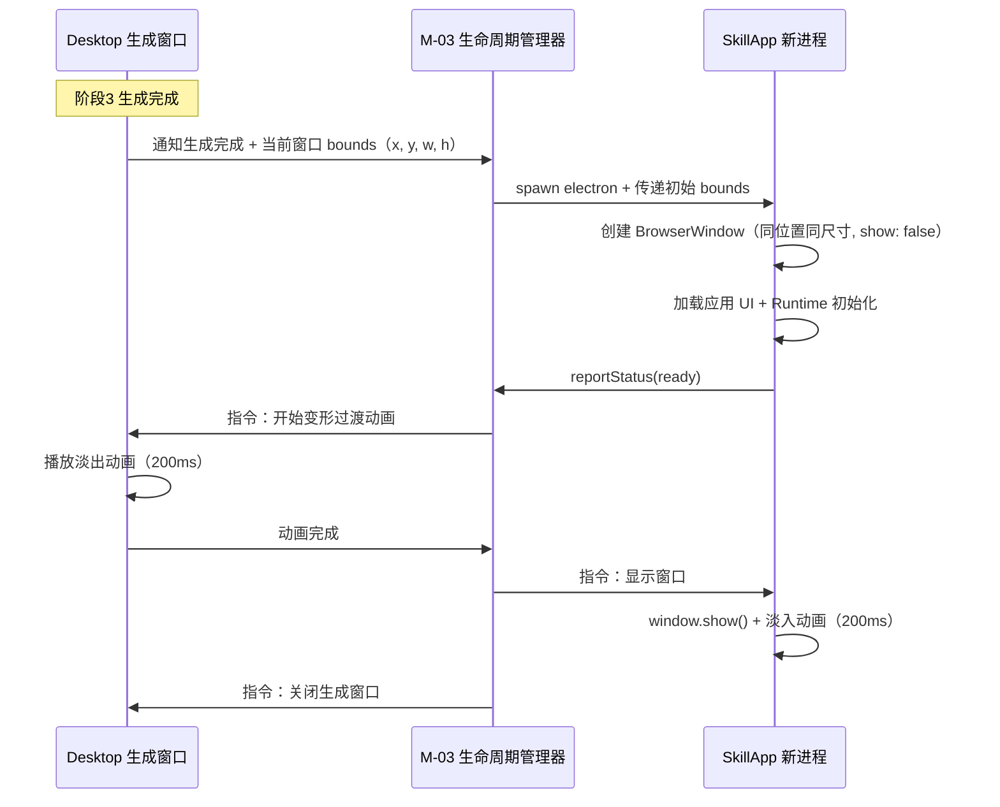
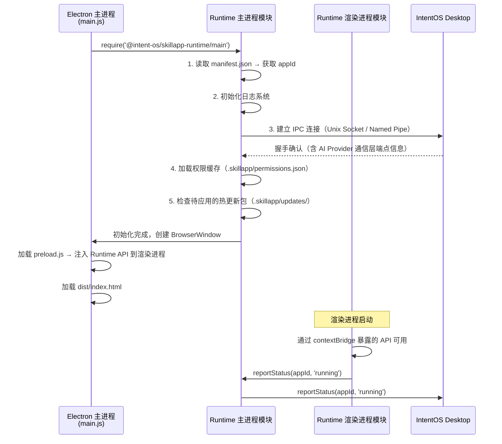
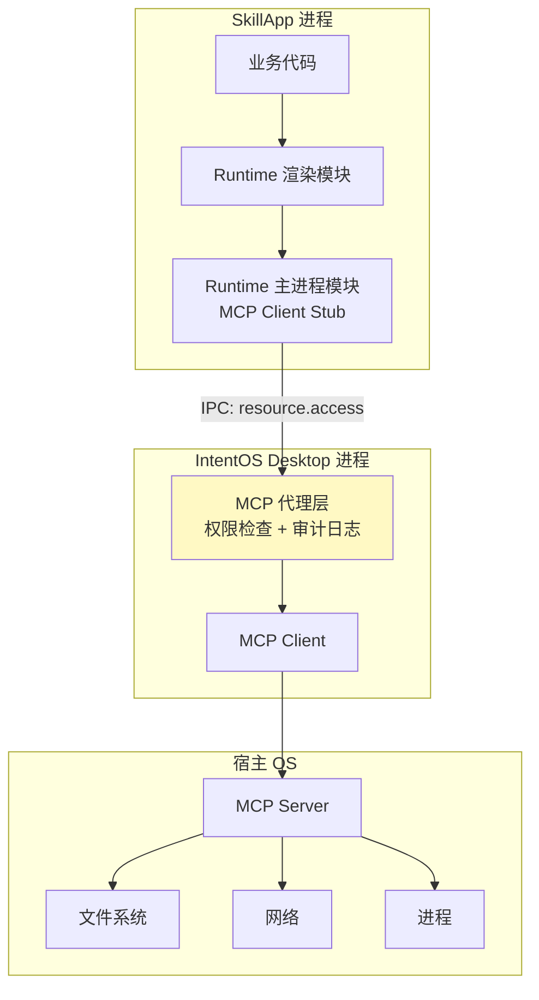
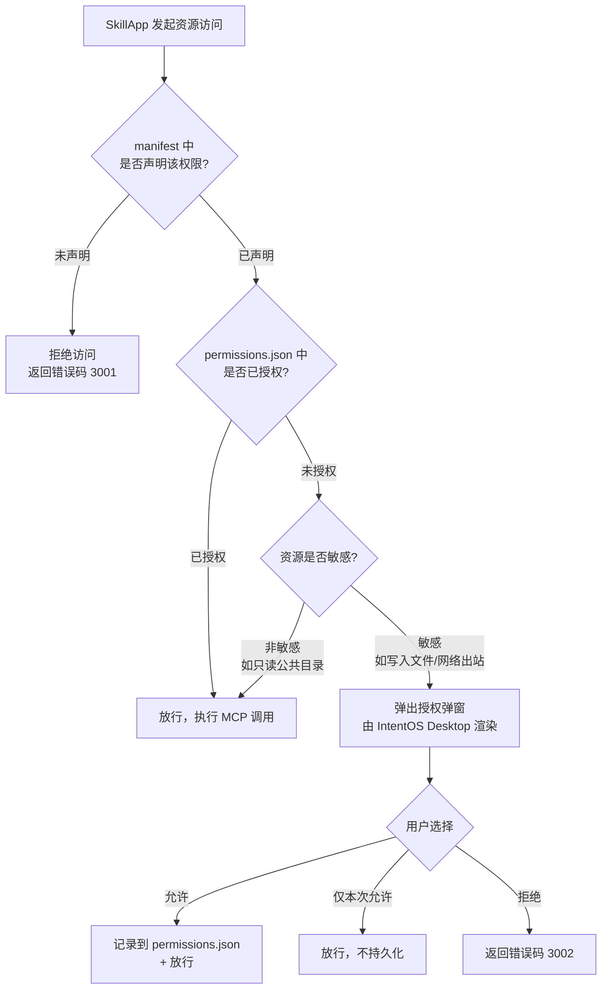
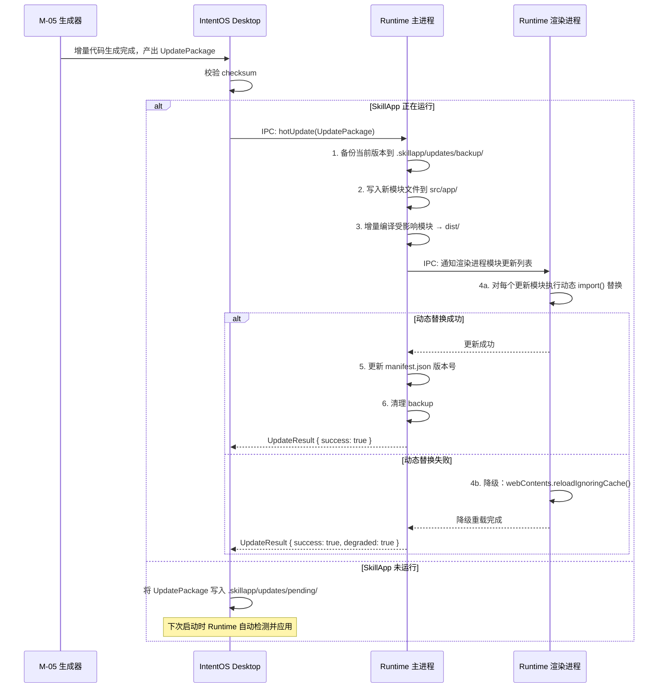
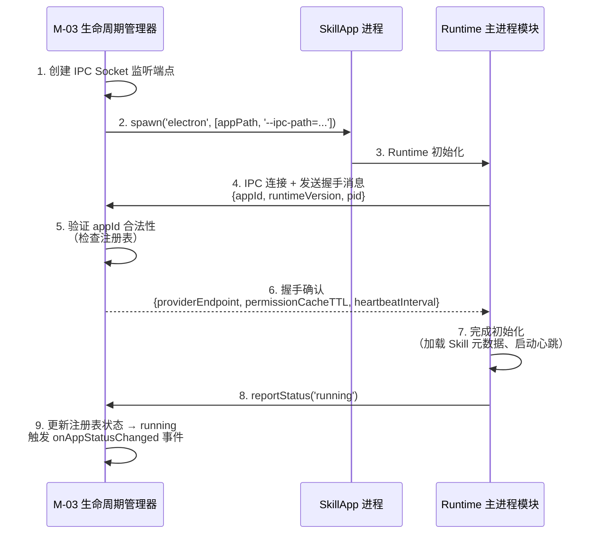
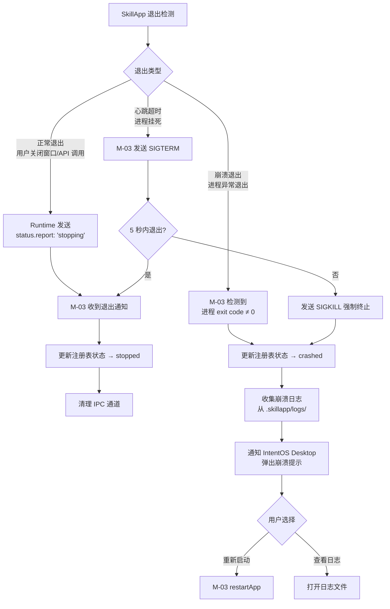

# IntentOS SkillApp 运行时与隔离技术规格

> **版本**：v1.0 | **日期**：2026-03-13
> **状态**：正式文档
> **对应模块**：M-06 SkillApp 运行时

---

## 1. SkillApp 进程隔离方案

### 1.1 方案对比

#### 方案 A：独立 Electron 进程（推荐）

每个 SkillApp 作为完整的 Electron 应用，由 IntentOS 管理层通过 `child_process.spawn()` 或 `electron` CLI 启动独立进程。SkillApp 目录内包含完整的 Electron 应用结构（`main.js` + `package.json` + 渲染层代码）。

**实现方式**：
- M-03 生命周期管理器调用 `child_process.spawn('electron', [appPath])` 启动 SkillApp
- 每个 SkillApp 拥有独立的 Electron 主进程和渲染进程
- SkillApp 与 IntentOS Desktop 之间通过 IPC over Unix Socket / Named Pipe 通信（详见第 3 节）

#### 方案 B：BrowserWindow 子窗口模式

IntentOS Desktop 主进程作为 Runtime Host，为每个 SkillApp 创建 `BrowserWindow` 实例加载其渲染代码。所有 SkillApp 共享 IntentOS Desktop 的主进程。

**实现方式**：
- M-03 调用 `new BrowserWindow({ webPreferences: { nodeIntegration: false, contextIsolation: true } })` 加载 SkillApp 页面
- SkillApp 仅有渲染进程，主进程逻辑由 IntentOS Desktop 代理

#### 方案选型决策

| 评估维度 | 方案 A：独立进程 | 方案 B：BrowserWindow |
|----------|-----------------|----------------------|
| **进程隔离** | 完全隔离，SkillApp 崩溃不影响 Desktop | 共享主进程，渲染进程崩溃不致命但主进程异常影响全局 |
| **安全边界** | 独立内存空间，无法跨进程访问 | `contextIsolation` 可隔离渲染层，但主进程资源共享 |
| **资源开销** | 每个 SkillApp 约 80-150MB 内存（Electron 基线） | 增量约 30-60MB/窗口，总体更轻 |
| **启动速度** | 冷启动 2-3 秒（需加载 Electron 运行时） | 亚秒级（复用已有主进程） |
| **实现复杂度** | 需要 IPC 通道管理，复杂度中等 | 较简单，直接使用 Electron IPC |
| **原地变形** | 需要窗口所有权跨进程转移，复杂度较高 | 窗口已在 Desktop 进程内，切换简单 |
| **符合架构约束** | 完全符合 `requirements.md` 进程隔离约束 | 不完全符合「独立 Electron 进程」要求 |

**推荐：方案 A（独立 Electron 进程）**

**理由**：
1. **架构约束强制要求**：`requirements.md` 明确规定「每个 SkillApp 必须运行在独立 Electron 进程中，不允许共享渲染进程」，方案 B 违反此约束。
2. **安全隔离**：SkillApp 由 AI 自动生成代码，代码质量不可完全保证。独立进程确保 SkillApp 崩溃、内存泄漏或恶意行为不影响 IntentOS Desktop 和其他 SkillApp。符合 `requirements.md` 中的「Skill 沙箱隔离」安全要求。
3. **生命周期独立性**：`idea.md` 定义 SkillApp 与 Desktop 是「平行关系」，独立进程在架构上忠实表达了这一设计理念。
4. **并发支持**：系统需支持同时运行 5+ 个 SkillApp（非功能需求），独立进程天然支持多核并行，避免单进程瓶颈。

**代价**：
- 内存开销较高（5 个 SkillApp 约额外 400-750MB）
- 原地变形需要跨进程窗口转移（详见 1.3）
- 需要设计和维护进程间 IPC 通道

### 1.2 SkillApp 目录结构

M-05 生成器产出的 SkillApp 遵循以下目录结构：

```
skillapps/
└── {appId}/                          # 如 csv-data-cleaner-a1b2c3
    ├── package.json                  # Electron 应用元数据 + 依赖声明
    ├── main.js                       # Electron 主进程入口
    ├── preload.js                    # 渲染进程预加载脚本（暴露运行时 API）
    ├── manifest.json                 # SkillApp 元数据（appId, 版本, 依赖 Skill 列表, 权限声明）
    ├── src/
    │   ├── app/                      # AI Provider 生成的业务代码
    │   │   ├── pages/                # 页面组件
    │   │   │   ├── ImportPage.jsx
    │   │   │   ├── ConfigPage.jsx
    │   │   │   └── PreviewPage.jsx
    │   │   ├── components/           # 通用 UI 组件
    │   │   ├── services/             # 业务逻辑层（调用 Runtime API）
    │   │   └── App.jsx               # 应用根组件
    │   └── index.html                # 渲染进程入口 HTML
    ├── dist/                         # 编译产物（webpack/vite 构建输出）
    │   ├── index.html
    │   ├── bundle.js
    │   └── assets/
    ├── node_modules/                 # 依赖（含 @intent-os/skillapp-runtime）
    └── .skillapp/                    # 运行时内部目录
        ├── state.json                # 运行时状态持久化
        ├── permissions.json          # 已授权权限记录
        ├── updates/                  # 热更新包暂存目录
        └── logs/                     # 运行日志
```

### 1.3 原地变形的跨进程窗口转移

原地变形是 IntentOS 的核心设计理念（参见 `idea.md` 第 4 节「原地变形」和 `product.md` 流程三）。在方案 A 下，实现需要跨进程窗口位置/尺寸同步：



**关键实现细节**：
- 生成窗口记录当前 `bounds`，传递给新启动的 SkillApp 进程
- SkillApp 以 `show: false` 创建窗口，完成加载后在相同位置显示
- 淡出/淡入动画控制在 200ms 以内，确保视觉连续性
- 若 SkillApp 启动超时（10 秒，与 spec.md 第 6 节边界情况 4.2 一致），降级为直接弹出新窗口并关闭生成窗口

---

## 2. SkillApp 运行时（M-06）的嵌入方式

### 2.1 运行时分发形式

运行时以 npm 包 `@intent-os/skillapp-runtime` 的形式分发，在 M-05 生成器产出代码时自动写入 `package.json` 依赖：

```json
{
  "name": "csv-data-cleaner-a1b2c3",
  "version": "1.0.0",
  "main": "main.js",
  "dependencies": {
    "@intent-os/skillapp-runtime": "^1.0.0"
  }
}
```

运行时包由两部分组成：
- **主进程模块**（`@intent-os/skillapp-runtime/main`）：负责 IPC 通道建立、进程管理、热更新引擎
- **渲染进程模块**（`@intent-os/skillapp-runtime/renderer`）：暴露给业务代码的 API 接口

### 2.2 运行时初始化流程



### 2.3 API 暴露方式：contextBridge（推荐）

**方案选型**：

| 方式 | 安全性 | 使用体验 | 选型 |
|------|--------|----------|------|
| 全局变量 `window.intentOS` via `contextBridge` | 高（Electron 安全最佳实践） | `window.intentOS.callSkill(...)` | **推荐** |
| ES Module `import` | 中（需 nodeIntegration） | `import { callSkill } from '@intent-os/...'` | 不推荐 |
| 全局变量 via nodeIntegration | 低（安全风险高） | 简单但危险 | 禁止 |

**推荐方案：`contextBridge` + `preload.js`**

**理由**：
1. Electron 官方推荐的安全模式，`contextIsolation: true` + `nodeIntegration: false` 是 Electron 安全基线
2. SkillApp 代码由 AI 生成，必须限制渲染进程对 Node.js API 的直接访问，防止生成代码中的潜在安全问题
3. 符合 `requirements.md` 中「资源访问路径唯一性：所有底层资源访问必须经过 MCP 接口」的约束

**preload.js 模板**：

```javascript
// preload.js — 由 M-05 生成器自动生成
const { contextBridge, ipcRenderer } = require('electron');

contextBridge.exposeInMainWorld('intentOS', {
  // Skill 调用
  callSkill: (skillId, method, params) =>
    ipcRenderer.invoke('runtime:callSkill', { skillId, method, params }),

  // MCP 资源访问
  accessResource: (type, action, params) =>
    ipcRenderer.invoke('runtime:accessResource', { type, action, params }),

  // 权限请求
  requestPermission: (resource, action) =>
    ipcRenderer.invoke('runtime:requestPermission', { resource, action }),

  // 应用信息
  getAppInfo: () => ipcRenderer.invoke('runtime:getAppInfo'),

  // 事件监听
  onSkillError: (callback) =>
    ipcRenderer.on('runtime:skillError', (_event, data) => callback(data)),

  onHotUpdate: (callback) =>
    ipcRenderer.on('runtime:hotUpdate', (_event, data) => callback(data)),
});
```

**业务代码调用方式**：

```javascript
// SkillApp 业务代码（由 AI Provider 生成）
async function cleanData(filePath) {
  const result = await window.intentOS.callSkill(
    'data-cleaner',
    'clean',
    { filePath, options: { dedup: true, fillNull: 'mean' } }
  );
  return result;
}
```

---

## 3. Skill 调用机制

### 3.1 完整调用链路


**调用链路详解**：

| 步骤 | 发起方 | 接收方 | 通信方式 | 说明 |
|------|--------|--------|----------|------|
| 1 | 渲染进程业务代码 | preload.js | `window.intentOS.callSkill()` | 受 contextBridge 保护的安全通道 |
| 2 | preload.js | SkillApp Electron 主进程 | `ipcRenderer.invoke` → `ipcMain.handle` | Electron 内置 IPC，进程内通信 |
| 3 | Runtime 主进程模块 | IntentOS Desktop 主进程 | Unix Socket (macOS/Linux) / Named Pipe (Windows) | 跨进程通信，JSON-RPC 2.0 协议 |
| 4 | IntentOS Desktop | M-04 AI Provider 通信层 | 进程内函数调用 | `executeSkill()` |
| 5 | M-04 AI Provider 通信层 | AI 后端 | AI Provider 内部协议 | Skill 执行并返回结果 |

> **前置依赖校验**：Desktop 主进程在处理 `skill.call` 时，会先调用 M-02 的 `checkDependencies()` 校验目标 Skill 依赖可用（对应 IPC 方法 `skill.checkDependency`），确认依赖满足后再转发到 M-04 通信层执行。

### 3.2 跨进程 IPC 协议设计

SkillApp 独立进程与 IntentOS Desktop 之间采用 **JSON-RPC 2.0 over Unix Socket / Named Pipe** 协议：

**选型理由**：
- JSON-RPC 2.0 是轻量级、语言无关的 RPC 标准，易于调试和扩展
- Unix Socket / Named Pipe 是本机进程间通信的高性能方案，延迟在亚毫秒级
- 相比 HTTP/WebSocket 无需端口管理，避免端口冲突问题
- 相比 Electron 的 `MessagePort`，支持任意 Node.js 进程（不限于 Electron 窗口）

**通道标识**：每个 SkillApp 连接独立的 socket 路径：
- macOS/Linux：`/tmp/intentos-ipc/{appId}.sock`
- Windows：`\\.\pipe\intentos-ipc-{appId}`

**消息格式**：

```typescript
// 请求（SkillApp → IntentOS）
interface IPCRequest {
  jsonrpc: '2.0';
  id: string;           // UUID，用于匹配响应
  method: string;       // 如 'skill.call', 'resource.access', 'permission.request'
  params: Record<string, any>;
}

// 响应（IntentOS → SkillApp）
interface IPCResponse {
  jsonrpc: '2.0';
  id: string;
  result?: any;
  error?: { code: number; message: string; data?: any };
}

// 通知（双向，无需响应）
interface IPCNotification {
  jsonrpc: '2.0';
  method: string;       // 如 'status.report', 'hotupdate.available'
  params: Record<string, any>;
}
```

**方法注册表**：

| method | 方向 | 说明 | 对应 M-06 接口 |
|--------|------|------|----------------|
| `skill.checkDependency` | SkillApp → IntentOS | 校验 Skill 依赖可用性（调用前置检查） | M-02 `checkDependencies()` |
| `skill.call` | SkillApp → IntentOS | 调用 Skill | `callSkill()` |
| `resource.access` | SkillApp → IntentOS | 访问 MCP 资源 | `accessResource()` |
| `permission.request` | SkillApp → IntentOS | 请求用户授权 | `requestPermission()` |
| `status.report` | SkillApp → IntentOS | 汇报运行状态 | `reportStatus()` |
| `hotUpdate` | IntentOS → SkillApp | 推送热更新包 | `applyHotUpdate()` |
| `lifecycle.stop` | IntentOS → SkillApp | 请求优雅退出 | - |
| `skill.error` | IntentOS → SkillApp | Skill 执行错误通知 | `onSkillError` |

### 3.3 异步调用策略

**所有 Skill 调用均为异步（Promise-based）**。

**理由**：
1. Skill 调用链路跨越 4 个通信边界（渲染→主进程→Desktop→AI Provider（M-04 通信层）），任何环节都可能有延迟
2. Skill 执行本身可能涉及 I/O 操作（文件读写、网络请求），天然是异步操作
3. 同步调用会阻塞渲染进程 UI 线程，导致 SkillApp 界面卡死

**不提供同步 API**。如果业务代码需要顺序执行多个 Skill 调用，使用 `async/await` 链式调用。

### 3.4 超时与错误处理

```typescript
// 超时配置（可通过 manifest.json 自定义）
interface TimeoutConfig {
  ipcConnect: 5000;       // IPC 连接建立超时：5 秒
  skillCall: 30000;       // Skill 调用默认超时：30 秒
  resourceAccess: 10000;  // 资源访问默认超时：10 秒
  permissionPrompt: 60000; // 权限弹窗等待用户操作：60 秒
}
```

**错误分级与处理策略**：

| 错误类型 | 错误码范围 | 处理策略 | 用户感知 |
|----------|-----------|----------|----------|
| IPC 连接失败 | 1000-1099 | 自动重连 3 次（间隔 1s, 2s, 4s），失败后通知用户 | 「与系统连接断开，正在重连...」 |
| Skill 调用超时 | 2000-2099 | 返回超时错误给业务代码，由业务代码决定是否重试 | 由 SkillApp UI 展示「操作超时，请重试」 |
| Skill 执行错误 | 2100-2199 | 透传 AI Provider（ClaudeAPIProvider / future: OpenClawProvider）返回的错误信息 | 由 SkillApp UI 展示友好错误提示 |
| 权限被拒绝 | 3000-3099 | 返回权限拒绝错误 | 功能不可用提示 |
| MCP 资源错误 | 4000-4099 | 透传 MCP 层错误 | 「文件访问失败」等具体提示 |

---

## 4. MCP 资源访问策略

### 4.1 MCP 协议简述

Model Context Protocol (MCP) 是 IntentOS 宿主 OS 资源层的统一访问协议。SkillApp 通过 MCP 访问文件系统、网络、进程等宿主 OS 能力，而非直接调用 Node.js 原生 API。这确保了所有资源访问都可被审计、控制和隔离。

### 4.2 访问架构：代理模式（推荐）



**推荐代理模式（MCP 请求经 IntentOS Desktop 主进程中转），不推荐 SkillApp 直连 MCP Server。**

**理由**：
1. **权限集中控制**：所有 MCP 请求在 Desktop 主进程的代理层统一做权限检查，避免每个 SkillApp 各自实现权限逻辑。符合 `requirements.md` 中「资源访问路径唯一性：所有底层资源访问必须经过 MCP 接口，不允许 SkillApp 直接绕过 IntentOS 层调用系统 API」的架构约束。
2. **审计可追溯**：代理层记录所有资源访问日志，便于安全审计和问题诊断。
3. **MCP Server 连接收敛**：多个 SkillApp 共享 Desktop 维护的 MCP Client 连接池，避免每个 SkillApp 独立建连导致的资源浪费。

**代价**：
- 增加一跳网络延迟（约 0.1-0.5ms，本机 IPC 开销可忽略）
- Desktop 主进程成为 MCP 访问的单点，需做好错误隔离

### 4.3 权限控制模型

#### 权限声明（静态）

SkillApp 在生成时，M-05 生成器根据 Skill 能力分析，在 `manifest.json` 中声明所需权限：

```json
{
  "appId": "csv-data-cleaner-a1b2c3",
  "permissions": [
    { "resource": "fs", "actions": ["read", "write"], "scope": "user-selected" },
    { "resource": "net", "actions": ["fetch"], "scope": "*.example.com" },
    { "resource": "process", "actions": ["spawn"], "scope": "restricted" }
  ]
}
```

#### 运行时授权（动态）



#### 权限持久化

授权结果存储在 SkillApp 本地目录 `.skillapp/permissions.json`：

```json
{
  "grants": [
    {
      "resource": "fs",
      "action": "write",
      "scope": "/Users/jimmy/Documents/csv-output",
      "grantedAt": "2026-03-12T10:30:00Z",
      "persistent": true
    }
  ]
}
```

### 4.4 支持的资源类型

| 资源类型 | type 值 | 支持的 actions | 说明 |
|----------|---------|---------------|------|
| 文件系统 | `fs` | `read`, `write`, `list`, `delete`, `watch` | 读写文件、列目录、监听变更 |
| 网络 | `net` | `fetch`, `connect`, `listen` | HTTP 请求、TCP 连接、本地服务监听 |
| 进程 | `process` | `spawn`, `kill`, `list` | 启动子进程、终止进程、查询进程列表 |

---

## 5. 热更新方案

### 5.1 热更新包格式

```typescript
interface UpdatePackage {
  appId: string;
  fromVersion: string;         // 当前版本（用于校验）
  toVersion: string;           // 目标版本
  timestamp: number;
  changedFiles: FileUpdate[];
  addedFiles: FileUpdate[];
  deletedFiles: string[];
  manifestDelta?: ManifestDelta;
  checksum: string;            // 整包 SHA-256 校验
  description: string;
}

interface ModuleUpdate {
  path: string;                // 相对路径，如 'src/app/pages/SchedulePage.jsx'
  action: 'add' | 'modify' | 'delete';
  content?: string;            // add/modify 时的文件内容（base64 编码）
  compiledContent?: string;    // 预编译产物（如适用）
}

interface ManifestDelta {
  addedSkills?: string[];      // 新增的 Skill 依赖
  removedSkills?: string[];
  addedPermissions?: PermissionDecl[];
  removedPermissions?: PermissionDecl[];
}
```

### 5.2 方案对比

| 维度 | 选项 A：webpack/vite HMR | 选项 B：动态 import() + 模块替换 | 选项 C：webContents 局部重载 |
|------|--------------------------|--------------------------------|---------------------------|
| **粒度** | 模块级（组件/文件） | 模块级 | 页面/渲染进程级 |
| **状态保持** | 好（React Fast Refresh 保持组件状态） | 中等（需手动管理状态迁移） | 差（重载丢失渲染进程状态） |
| **实现复杂度** | 高（需内嵌 dev server 或 HMR runtime） | 中（标准 ES 动态导入） | 低（`webContents.reloadIgnoringCache()`） |
| **生产环境适用性** | HMR 主要用于开发环境，生产环境使用有安全和稳定性风险 | 适合生产环境 | 适合生产环境 |
| **更新速度** | 亚秒级 | 1-3 秒 | 2-5 秒 |
| **符合 10 秒要求** | 是 | 是 | 是 |

**推荐：选项 B（动态 import() + 模块替换）为主，选项 C（webContents 局部重载）为兜底。**

**理由**：
1. **生产环境稳定性**：选项 A 的 HMR 机制设计初衷是开发环境，在生产环境中 HMR WebSocket 连接管理、模块图维护增加了不必要的复杂度和攻击面。选项 B 利用浏览器原生的动态 `import()` 机制，无额外运行时依赖。
2. **粒度合适**：M-05 生成器的增量修改已经是模块级别（参见 `modules.md` 流程二），动态 import 的替换粒度与生成粒度一致。
3. **兜底安全**：当动态替换失败（如模块间依赖链过长），降级为选项 C 的局部重载，确保更新一定能生效。

**代价**：
- 动态 import 替换无法保持组件内部状态（如表单输入），需要状态持久化层配合
- 需要 M-05 生成器在生成代码时遵循模块化约定（每个可热替换单元是独立的动态 import 入口）

### 5.3 热更新实现机制



### 5.4 回滚机制

| 触发条件 | 回滚策略 | 实现方式 |
|----------|----------|----------|
| 动态 import 替换失败 | 降级为 webContents 重载 | 不回滚文件，但用完整重载保证可用 |
| 增量编译失败 | 还原备份文件 | 从 `.skillapp/updates/backup/` 还原并重载 |
| 更新后 SkillApp 崩溃 | 自动回滚到上一版本 | M-03 检测到崩溃后，通知 Runtime 还原备份并重启 |
| 用户主动回滚 | 从管理中心触发 | 保留最近 N 个版本备份（默认 3 个） |

---

## 6. SkillApp 生命周期与状态同步

### 6.1 启动握手流程



**握手超时**：如果步骤 4 在 5 秒内未完成，M-03 判定启动失败，终止进程并报告错误。

### 6.2 心跳与状态同步

Runtime 主进程模块定期向 M-03 发送心跳（IPC 通知）：

```typescript
// 心跳消息（每 5 秒一次）
{
  jsonrpc: '2.0',
  method: 'heartbeat',
  params: {
    appId: 'csv-data-cleaner-a1b2c3',
    timestamp: 1741776000000,
    status: 'running',
    metrics: {
      memoryUsageMB: 120,
      cpuPercent: 2.5,
      activeSkillCalls: 0
    }
  }
}
```

**心跳超时策略**：
- 连续 3 次心跳未收到（15 秒）：M-03 标记 SkillApp 状态为 `unresponsive`
- 连续 6 次未收到（30 秒）：M-03 判定 SkillApp 挂死，触发强制终止 + 崩溃处理流程

### 6.3 退出与崩溃处理



**崩溃后热更新回滚**：如果 SkillApp 在热更新后 30 秒内崩溃，M-03 自动触发版本回滚（参见 5.4 回滚机制），然后尝试重启。

---

## 7. 生成的 SkillApp 代码结构

### 7.1 目录结构（完整）

```
{appId}/
├── package.json
├── main.js                     # Electron 主进程入口
├── preload.js                  # contextBridge API 注入
├── manifest.json               # SkillApp 元数据
├── src/
│   ├── index.html              # 渲染进程入口
│   ├── app/
│   │   ├── App.jsx             # 应用根组件
│   │   ├── pages/              # 页面组件（每个可独立热替换）
│   │   │   ├── index.js        # 页面路由注册（动态 import 入口）
│   │   │   ├── ImportPage.jsx
│   │   │   ├── ConfigPage.jsx
│   │   │   └── PreviewPage.jsx
│   │   ├── components/         # 共享 UI 组件
│   │   └── services/           # 业务逻辑（调用 window.intentOS API）
│   │       └── dataService.js
│   └── styles/
│       └── global.css
├── dist/                       # 构建产物
├── node_modules/
├── vite.config.js              # 构建配置
└── .skillapp/                  # 运行时内部目录
    ├── state.json
    ├── permissions.json
    ├── updates/
    │   ├── pending/            # 待应用的更新包
    │   └── backup/             # 版本备份（最近 3 个）
    └── logs/
        └── runtime.log
```

### 7.2 package.json 模板

```json
{
  "name": "skillapp-csv-data-cleaner-a1b2c3",
  "version": "1.0.0",
  "main": "main.js",
  "description": "CSV 数据清洗工具 — Generated by IntentOS",
  "private": true,
  "dependencies": {
    "@intent-os/skillapp-runtime": "^1.0.0",
    "react": "^18.3.0",
    "react-dom": "^18.3.0"
  },
  "devDependencies": {
    "vite": "^6.0.0",
    "@vitejs/plugin-react": "^4.0.0"
  },
  "scripts": {
    "build": "vite build",
    "start": "electron ."
  }
}
```

### 7.3 main.js 初始化代码模板

```javascript
// main.js — SkillApp Electron 主进程入口（由 M-05 自动生成）
const { app, BrowserWindow } = require('electron');
const path = require('path');
const runtime = require('@intent-os/skillapp-runtime/main');

// 从启动参数获取 IPC 路径和初始窗口 bounds
const ipcPath = process.argv.find(a => a.startsWith('--ipc-path='))?.split('=')[1];
const boundsArg = process.argv.find(a => a.startsWith('--bounds='))?.split('=')[1];

let mainWindow;

app.whenReady().then(async () => {
  // 1. 初始化运行时（建立 IPC 连接、握手、加载权限缓存）
  await runtime.initialize({
    appId: require('./manifest.json').appId,
    appPath: __dirname,
    ipcPath: ipcPath,
  });

  // 2. 检查并应用待处理的热更新
  await runtime.applyPendingUpdates();

  // 3. 创建主窗口
  const bounds = boundsArg ? JSON.parse(boundsArg) : { width: 1024, height: 768 };
  mainWindow = new BrowserWindow({
    ...bounds,
    show: !boundsArg,  // 原地变形模式下先隐藏
    webPreferences: {
      preload: path.join(__dirname, 'preload.js'),
      contextIsolation: true,
      nodeIntegration: false,
      sandbox: true,
    },
  });

  // 4. 加载应用页面
  mainWindow.loadFile(path.join(__dirname, 'dist', 'index.html'));

  // 5. 注册热更新处理器
  runtime.onHotUpdate(async (updatePackage) => {
    await runtime.applyHotUpdate(updatePackage, mainWindow.webContents);
  });

  // 6. 报告就绪状态
  runtime.reportStatus('running');
});

app.on('window-all-closed', () => {
  runtime.reportStatus('stopping');
  runtime.cleanup();
  app.quit();
});
```

### 7.4 页面路由动态加载模板（支持热替换）

```javascript
// src/app/pages/index.js — 页面路由注册（动态 import 入口）
const pageRegistry = {
  import: () => import('./ImportPage.jsx'),
  config: () => import('./ConfigPage.jsx'),
  preview: () => import('./PreviewPage.jsx'),
};

// 热更新时替换指定页面模块
export function replacePageModule(pageName, newModuleLoader) {
  pageRegistry[pageName] = newModuleLoader;
  // 触发 React 重新渲染受影响的路由
  window.dispatchEvent(new CustomEvent('skillapp:module-updated', {
    detail: { page: pageName }
  }));
}

export default pageRegistry;
```

---

## 附录 A：关键技术决策汇总

| 决策项 | 选定方案 | 核心理由 | 参考约束 |
|--------|----------|----------|----------|
| 进程隔离 | 方案 A：独立 Electron 进程 | 架构约束强制要求 + 安全隔离 | `requirements.md` 进程隔离约束 |
| API 暴露方式 | contextBridge + preload.js | Electron 安全最佳实践 | `requirements.md` 资源访问路径唯一性 |
| IPC 协议 | JSON-RPC 2.0 over Unix Socket | 高性能 + 无端口冲突 + 标准协议 | - |
| MCP 访问模式 | 代理模式（经 Desktop 中转） | 权限集中控制 + 审计 | `requirements.md` 资源访问路径唯一性 |
| 热更新方案 | 动态 import() 为主 + webContents 重载兜底 | 生产环境稳定 + 模块粒度匹配 | `requirements.md` 热更新 10 秒要求 |

## 附录 B：References

- `/Users/jimmyshi/code/intent-os/docs/idea.md` -- 核心架构分层、SkillApp 定义、原地变形设计理念
- `/Users/jimmyshi/code/intent-os/docs/modules.md` -- M-06 接口定义（第 242-268 行）、模块依赖矩阵（第 121-131 行）、跨模块协作流程（第 309-437 行）
- `/Users/jimmyshi/code/intent-os/docs/requirements.md` -- 进程隔离约束（第 200 行）、资源访问路径唯一性约束（第 201 行）、非功能需求（第 136-176 行）
- `/Users/jimmyshi/code/intent-os/docs/product.md` -- 原地变形交互详细流程（第 298-327 行）、热更新用户流程（第 417-439 行）