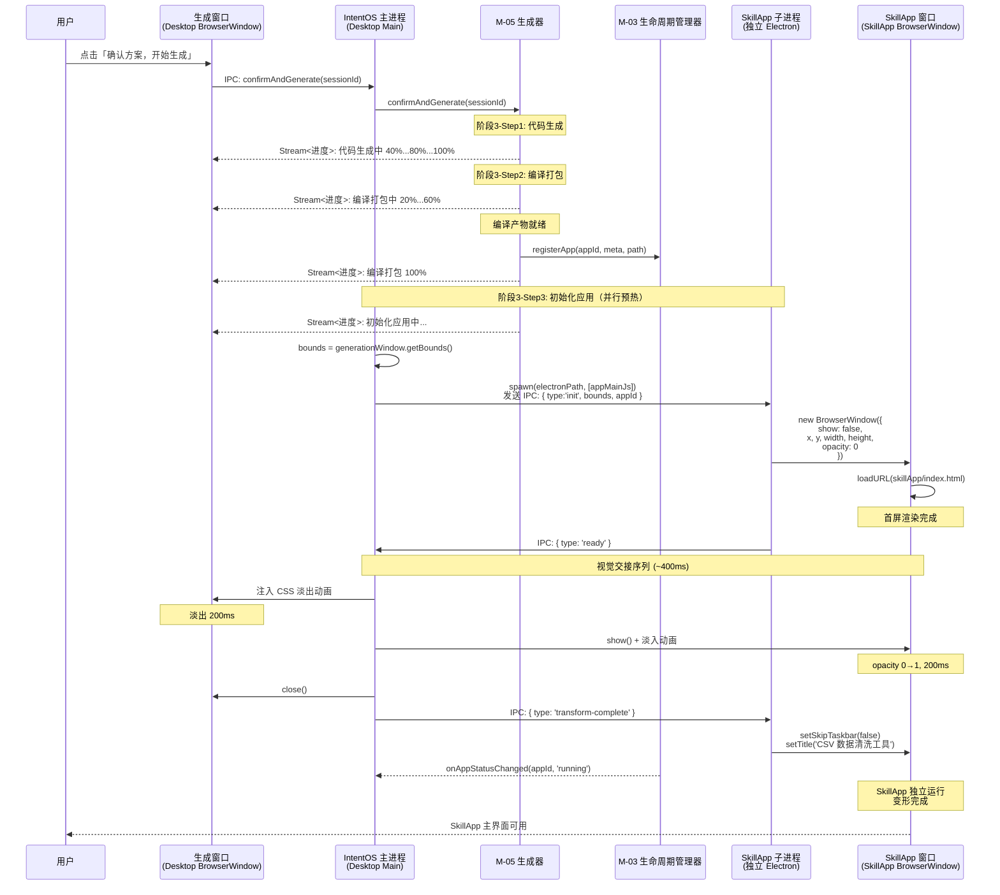

# IntentOS 技术实现方案总设计

> **版本**：v1.0 | **日期**：2026-03-13
> **状态**：正式文档

---

## 1. 整体技术架构概述

IntentOS 是一个「Skill 生成 SkillApp」的智能操作系统。用户通过自然语言意图驱动 AI 规划，AI Provider（可插拔 AI 后端，MVP 为 Claude API）自动生成独立运行的 SkillApp。IntentOS 基于 Electron 构建，分为三个核心层：

- **IntentOS Desktop（管理层）**：Electron 桌面应用，提供 Skill 管理、SkillApp 生命周期管理、生成流程 UI
- **AI Provider 层（可插拔 AI 后端）**：可插拔 AI 后端（MVP: Claude API 云端服务；后续: OpenClaw 本地服务），负责意图规划、代码生成、Skill 执行调度
- **SkillApp 运行层**：由 AI Provider 自动生成的独立 Electron 应用，内嵌 SkillApp Runtime（M-06）

**核心体验「原地变形」**：用户在生成窗口中确认方案后，窗口原地变形为可用的 SkillApp，无需打开新窗口。这是 IntentOS 最关键的 UX 创新点。

```mermaid
graph TB
    subgraph Desktop["IntentOS Desktop（Electron）"]
        UI["管理台 UI
React 18 + TypeScript"]
        Main["主进程
IPC Hub + 进程调度"]
        M02["M-02 Skill 管理器"]
        M03["M-03 SkillApp 生命周期"]
        M04["M-04 AI Provider通信层"]
        UI <-->|contextBridge IPC| Main
        Main --- M02
        Main --- M03
        Main --- M04
    end

    subgraph AIProvider["AI Provider（MVP: Claude API）"]
        Planner["规划引擎\n(Claude Opus 4.6)"]
        Generator["代码生成引擎\n(Claude Sonnet 4.6)"]
        SkillExec["Skill 执行引擎\n(Claude Agent SDK)"]
    end

    subgraph SkillApps["SkillApp（独立 Electron 进程）"]
        SA1["SkillApp A
+ Runtime M-06"]
        SA2["SkillApp B
+ Runtime M-06"]
    end

    M04 <-->|HTTPS/SSE 流式\n(MVP: Claude API)| AIProvider
    Main <-->|Node IPC + Unix Socket| SA1
    Main <-->|Node IPC + Unix Socket| SA2
    SA1 -->|Skill 调用代理| M04
    SA2 -->|Skill 调用代理| M04
```

---

## 2. 子规格文档索引

| 文档 | 路径 | 说明 |
|------|------|------|
| Electron 架构规格 | [electron-spec.md](./electron-spec.md) | 进程模型、IPC 通信架构、窗口管理、安全架构、技术栈（Electron 相关） |
| AI Provider 集成规格 | [ai-provider-spec.md](./ai-provider-spec.md) | AIProvider 抽象接口规格、Claude API Provider（MVP）实现、OpenClaw Provider（后续）实现、请求/响应格式、流式数据转发 |
| SkillApp 运行时规格 | [skillapp-spec.md](./skillapp-spec.md) | 进程隔离方案、Runtime 嵌入方式、Skill 调用机制、MCP 资源访问、热更新方案 |

---

## 3. 整体模块依赖关系

```mermaid
graph LR
    M01["M-01
桌面容器"] --> M02["M-02
Skill 管理器"]
    M01 --> M03["M-03
SkillApp 生命周期"]
    M01 --> M05["M-05
代码生成器"]
    M03 --> M06["M-06
SkillApp Runtime"]
    M05 --> M04["M-04
AI Provider通信层"]
    M06 --> M04
    M02 --> M04
    M04 -->|HTTPS/SSE\n(MVP: Claude API)| AP["AI Provider\n(可插拔后端)"]
```

---

## 4. 子规格文档简述

### 4.1 Electron 架构规格（electron-spec.md）
覆盖 IntentOS Desktop 的进程模型（主进程职责、渲染进程职责）、SkillApp 独立进程模型、Desktop 内部 IPC 通信（contextBridge + channel 设计）、Desktop↔SkillApp 进程间通信（Node IPC + Unix Socket 双层架构）、窗口管理与「原地变形」技术实现、安全架构（contextIsolation、sandbox、nodeIntegration 策略），以及完整技术栈确认。

### 4.2 AI Provider 集成规格（ai-provider-spec.md）
覆盖 **AIProvider 抽象接口定义**（`planApp()`、`generateCode()`、`executeSkill()`）、**Claude API Provider MVP 实现**（`@anthropic-ai/sdk` SSE 流式、工具调用、Opus 4.6 代码生成）、Claude Agent SDK 集成（`@anthropic-ai/claude-agent-sdk` 的 `query()` API + MCP 工具调用）、连接状态管理与 API Key 校验、请求队列管理（并发控制、超时处理）、流式数据在主进程→渲染进程的 IPC 转发（sessionId 隔离）、错误处理策略，以及 **OpenClaw Provider（后续实现）** 的设计预留（WebSocket + REST 双通道方案存档）。

### 4.3 SkillApp 运行时规格（skillapp-spec.md）
覆盖进程隔离方案选型（独立 Electron 进程）、SkillApp 目录结构、Runtime（M-06）嵌入方式与初始化流程、Skill 调用完整链路（业务代码→Runtime→IPC→Desktop→M-04 AI Provider）、MCP 资源访问代理模式与权限控制模型、热更新方案（动态 import() + webContents 重载兜底）。

---

## 5. 关键技术决策汇总

以下汇总来自所有子规格文档的关键技术决策：

### 5.1 Electron 架构决策（详见 electron-spec.md）

| 编号 | 决策 | 选择 | 备选方案 | 选择理由 |
|------|------|------|----------|----------|
| TD-01 | SkillApp 进程模型 | 独立 Electron 进程 | BrowserView / webview 嵌入 | 进程隔离（安全性+稳定性）、架构约束要求 |
| TD-02 | Desktop 内部 IPC | contextBridge | remote 模块 | 安全性、性能、官方推荐 |
| TD-03 | Desktop↔SkillApp 通信 | Node IPC + Unix Socket（JSON-RPC 2.0）双层 | 纯 HTTP / WebSocket / 纯 IPC | 控制指令用 IPC（零配置）、数据流用 Unix Socket（无端口冲突、高性能） |
| TD-04 | 原地变形实现 | 方案 C 混合（视觉连续+进程切换） | 方案 A 同一 BrowserWindow loadURL | BrowserWindow 无法跨进程转移；方案 A 违反进程隔离约束 |
| TD-05 | UI 框架 | React 18 | Vue 3, Svelte | 生态成熟、AI 代码生成适配性好 |
| TD-06 | 构建工具 | electron-vite | electron-forge + webpack | HMR 速度快 10x+、配置简洁 |
| TD-07 | 打包工具 | electron-builder | electron-forge | 跨平台成熟度、auto-update 集成 |
| TD-08 | SkillApp 渲染进程安全 | sandbox + contextIsolation + nodeIntegration:false | 仅 contextIsolation | AI 生成代码需最严格沙箱限制 |

### 5.2 AI Provider 集成决策（详见 ai-provider-spec.md）

| 决策 | 选择 | 理由 |
|------|------|------|
| MVP AI 后端 | Claude API（云端） | 快速验证、无本地部署依赖、Anthropic 官方 SDK 完善 |
| 主通道协议（MVP） | HTTPS + SSE（Claude API 原生） | Claude API `@anthropic-ai/sdk` 内置 SSE 流式，无需自实现 WebSocket |
| Agent 能力（MVP） | `@anthropic-ai/claude-agent-sdk` | 原生 MCP Server 支持，tool_use 格式标准化 |
| 通信层运行位置 | Electron 主进程 | 安全性 + 生命周期 + API Key 不暴露渲染进程 |
| 后续 AI 后端 | OpenClaw Provider | 本地推理、无网络依赖，作为 P2 功能实现 |
| 后续通信协议 | WebSocket + REST | OpenClaw 服务流式传输刚需（详见 openclaw-spec.md 存档方案） |
| 并发控制 | 队列 + 槽位限制 | 产品需求明确要求排队提示 |
| API Key 存储 | OS Keychain / electron-safeStorage | 安全存储，不写入明文配置文件 |
| 流式转发 | IPC channel + sessionId 隔离 | 多窗口共享连接，按会话隔离消息 |

### 5.3 SkillApp 运行时决策（详见 skillapp-spec.md）

| 决策项 | 选定方案 | 核心理由 |
|--------|----------|----------|
| 进程隔离 | 方案 A：独立 Electron 进程 | 架构约束强制要求 + 安全隔离 |
| API 暴露方式 | contextBridge + preload.js | Electron 安全最佳实践 |
| IPC 协议 | JSON-RPC 2.0 over Unix Socket | 高性能 + 无端口冲突 + 标准协议 |
| MCP 访问模式 | 代理模式（经 Desktop 中转） | 权限集中控制 + 审计 |
| 热更新方案 | 动态 import() 为主 + webContents 重载兜底 | 生产环境稳定 + 模块粒度匹配 |

### 5.4 「原地变形」与跨领域决策（详见本文档第 6 节）

| 决策 | 选择 | 否决的替代方案 | 理由 |
|------|------|---------------|------|
| 变形方案 | 方案 C（混合预热+淡入淡出） | 方案 A（同窗口切换）| 进程隔离是架构硬约束 |
| SkillApp 分发方式 | 共享 Electron runtime | 每个 SkillApp 独立打包 | 磁盘和内存效率差异巨大（150MB * N vs 150MB + N * 几MB） |
| 数据存储 | better-sqlite3 | lowdb / JSON 文件 | JSON 文件在 50+ Skill 场景下性能退化 |
| 状态管理 | Zustand | Redux / Jotai | 代码量最少，最适合 AI 生成场景 |

---

## 6. 「原地变形」技术实现方案

## Part 1：「原地变形」技术实现方案

### 1. 方案分析

#### 方案 A：同一窗口内容切换（Single-Window Content Swap）

**技术原理**：
生成窗口是 IntentOS Desktop 主进程管理的一个 `BrowserWindow`。生成完成后，通过 `webContents.loadURL(skillAppEntryUrl)` 或利用 Electron v33 的 `WebContentsView` API 将窗口内容切换为 SkillApp 的入口页面。窗口标题、图标通过 `BrowserWindow.setTitle()` / `BrowserWindow.setIcon()` 更新。

**具体实现路径**：
1. 生成窗口 `BrowserWindow` 在生成阶段 3 完成后，调用 `win.webContents.loadURL('file:///path/to/generated-app/index.html')`
2. SkillApp 的运行时 SDK（M-06）以 preload script 形式注入，提供 `callSkill()`、`accessResource()` 等桥接 API
3. 窗口元信息更新：`win.setTitle('CSV 数据清洗工具')`、`win.setIcon(appIcon)`
4. SkillApp 的所有 Skill 调用、MCP 资源访问通过 IPC 回传到 IntentOS Desktop 主进程，再由主进程转发到 AI Provider 通信层（M-04）

**优点**：
- 真正零闪烁的「原地」变形，窗口对象始终是同一个，用户感知完全连续
- 实现复杂度最低，无需跨进程协调
- 窗口位置、大小、最大化/最小化状态天然保持

**缺点**：
- **违反架构约束**：`requirements.md:200` 明确要求「每个 SkillApp 必须运行在独立 Electron 进程中」；此方案下 SkillApp 运行在 Desktop 的渲染进程内，无法满足进程隔离要求
- SkillApp 崩溃会拖垮 Desktop 主进程
- 多个 SkillApp 共享 Desktop 的 V8 堆，内存隔离无保障
- SkillApp 与 Desktop 耦合，后续「关闭窗口 = 退出 SkillApp」的语义不清晰

#### 方案 B：窗口位置迁移（Position-Matched Window Swap）

**技术原理**：
IntentOS 主进程获取生成窗口的 `getBounds()`（x, y, width, height），以完全相同的坐标和尺寸创建一个新的 `BrowserWindow`（属于 SkillApp 独立进程），然后「同时」关闭旧窗口、显示新窗口。

**具体实现路径**：
1. 生成完成后，IntentOS 主进程通过 `child_process.fork()` 或 `utilityProcess.fork()` 启动 SkillApp 的 Electron 主进程
2. SkillApp 进程创建 `BrowserWindow`，参数为 `{ x, y, width, height, show: false }`（先隐藏）
3. SkillApp 窗口 `loadURL` 完成后，通过 IPC 通知 IntentOS 主进程「就绪」
4. IntentOS 主进程在一个事件循环 tick 内执行：新窗口 `win.show()` + 旧窗口 `win.close()`

**优点**：
- 完全满足进程隔离要求，每个 SkillApp 是真正独立的 Electron 进程
- SkillApp 崩溃不影响 Desktop
- 架构干净，SkillApp 生命周期管理与 Desktop 完全解耦

**缺点**：
- 窗口切换存在 1-2 帧的闪烁（旧窗口消失与新窗口出现之间的时间差）
- macOS、Windows、Linux 的窗口管理器行为差异导致闪烁程度不同：macOS 的 WindowServer 调度可能引入额外延迟；Windows 的 DWM 合成器在窗口创建时可能出现短暂白屏
- 窗口切换时 taskbar/dock 图标可能闪烁
- 如果 SkillApp 首屏渲染慢，新窗口可能短暂显示白屏

#### 方案 C：混合方案 — Shell + 后台预热（推荐）

**技术原理**：
生成窗口在阶段 3 进度推进期间，同时在后台 spawn SkillApp 独立进程并隐藏启动。SkillApp 窗口预加载完毕后，通过精心编排的「视觉交接」完成变形：生成窗口播放过渡动画（如淡出），SkillApp 窗口在完全相同的位置淡入，最后关闭生成窗口。

**具体实现路径**：

```
阶段 3 时序分解：

T0: 用户点击「生成」，进入阶段 3
T1: AI Provider（Claude API）开始代码生成（进度条：代码生成中）
T2: 代码生成完成，开始编译打包（进度条：编译打包中）
T3: 编译完成，产物就绪
T4: [并行启动] IntentOS 主进程 fork SkillApp 子进程
    SkillApp 进程创建 BrowserWindow({ show: false, ...sameBounds })
    SkillApp 加载入口 HTML 并完成首屏渲染
T5: SkillApp 通过 IPC 报告「首屏就绪」
T6: [视觉交接序列]
    6a. 生成窗口内容区播放 CSS 淡出动画（200ms）
    6b. 动画结束时，SkillApp 窗口设置 opacity=0 并 show()
    6c. SkillApp 窗口播放 opacity 0→1 动画（200ms）
    6d. 动画结束后，生成窗口 close()
T7: SkillApp 独立运行，变形完成
```

**关键技术细节**：

1. **SkillApp 进程启动方式**：IntentOS 主进程使用 `child_process.spawn(electronPath, [skillAppMainJs], { stdio: ['pipe', 'pipe', 'pipe', 'ipc'] })` 启动 SkillApp 的 Electron 主进程。SkillApp 拥有独立的 `app` 实例和 `BrowserWindow`。

2. **窗口位置同步**：IntentOS 主进程在 T4 获取生成窗口的 `getBounds()`，通过 IPC 消息 `{ type: 'init', bounds: { x, y, width, height } }` 发送给 SkillApp 子进程。SkillApp 用此坐标创建隐藏窗口。

3. **首屏就绪信号**：SkillApp 的入口 HTML 在 `DOMContentLoaded` 后通过 `process.send({ type: 'ready' })` 通知父进程。IntentOS 主进程监听此消息触发视觉交接。

4. **opacity 过渡**：macOS 和 Windows 均支持 `BrowserWindow.setOpacity()`。交接序列中，SkillApp 窗口先 `setOpacity(0)` 再 `show()`，然后通过定时器逐步设置 opacity 从 0 到 1（或使用 CSS animation 在页面内实现淡入）。

5. **Dock/Taskbar 处理**：SkillApp 窗口 `show()` 时必然出现在 Dock/Taskbar 中。可通过设置 `skipTaskbar: true` 在过渡期间隐藏，交接完成后再 `setSkipTaskbar(false)`。

**优点**：
- 满足进程隔离要求（独立 Electron 进程）
- 视觉体验接近无缝：预热 + 淡入淡出过渡覆盖了窗口切换瞬间
- 可控的降级路径：如果 SkillApp 预热失败，可 fallback 到方案 B 的直接切换
- 后台预热与编译打包阶段并行，不增加用户等待时间

**缺点**：
- 实现复杂度最高，需要精心编排跨进程时序
- opacity 动画在 Linux（X11/Wayland）上的支持可能不一致
- 预热期间消耗额外内存（两个窗口同时存在 ~400ms）

### 2. 推荐方案及理由

**推荐方案 C（混合方案）**，理由如下：

| 评估维度 | 方案 A | 方案 B | 方案 C |
|----------|--------|--------|--------|
| 进程隔离（架构硬约束） | 不满足 | 满足 | 满足 |
| 视觉连续性 | 最优 | 有闪烁 | 接近无缝 |
| MVP 可行性 | 高 | 高 | 中高 |
| 后续扩展性 | 差（耦合） | 优 | 优 |

- `requirements.md:200` 的进程隔离约束直接排除方案 A 作为最终方案
- 方案 B 的闪烁问题与 `product.md:336`「用户视角下窗口是连续的同一个」的体验目标冲突
- 方案 C 在满足架构约束的前提下，通过预热+过渡动画最大化视觉连续性

**MVP 分阶段策略**：
- **MVP Phase 1**：先实现方案 B（位置迁移），验证核心流程端到端可行，接受轻微闪烁
- **MVP Phase 2**：在方案 B 基础上增加后台预热和过渡动画，升级为方案 C
- 这样的渐进策略降低了首版交付风险，同时保留了体验优化空间

### 3. 原地变形完整时序



### 4. 边界情况处理

#### 4.1 生成过程中用户关闭窗口

```
触发：用户在阶段 3 进度条推进时点击窗口关闭按钮
处理序列：
1. 生成窗口拦截 'close' 事件（win.on('close', e => e.preventDefault())）
2. 弹出确认对话框：「正在生成应用，关闭将取消生成。确认关闭？」
3. 用户确认后：
   a. 调用 M-05 cancelSession(sessionId) 终止 AI Provider 生成任务
   b. 如果 SkillApp 子进程已 spawn，发送 SIGTERM 终止
   c. 清理临时编译产物目录（rm -rf tempBuildDir）
   d. 如果已执行 registerApp()，调用 M-03 uninstallApp(appId) 回滚注册
   e. 关闭生成窗口
```

#### 4.2 变形过程失败（SkillApp 启动失败）

```
触发：SkillApp 子进程 spawn 失败、超时未报告 ready、或 ready 后立即崩溃
处理序列：
1. 设置超时阈值 T=10s（从 spawn 到收到 ready 信号）
2. 超时或进程异常退出时：
   a. 生成窗口保持显示（不执行视觉交接）
   b. 进度区域替换为错误状态：
      「应用初始化失败。[查看日志] [重试] [返回修改方案]」
   c. [重试] → 重新 spawn SkillApp 进程（最多重试 2 次）
   d. [返回修改方案] → 窗口回退到阶段 2 规划交互界面
   e. 清理失败的 SkillApp 子进程
3. 生成窗口始终保持在生成器状态，不会因变形失败而消失
```

#### 4.3 SkillApp 首屏渲染超时

```
触发：SkillApp 进程启动成功但首屏渲染超过 5s 未完成
处理序列：
1. 进度条持续显示「初始化应用中...」
2. 5s 后补充提示：「应用初始化耗时较长，请稍候...」
3. 15s 后判定超时，降级为方案 B 的直接切换：
   a. 强制执行窗口位置迁移（即使 SkillApp 未报告 ready）
   b. SkillApp 窗口可能显示加载中状态，但用户可以等待
   c. 这比永远卡在进度条好
```

#### 4.4 视觉交接期间 SkillApp 崩溃

```
触发：在 400ms 过渡动画期间 SkillApp 进程异常退出
处理序列：
1. IntentOS 主进程监听 SkillApp 子进程的 'exit' 事件
2. 如果生成窗口尚未 close()（淡出动画未完成）：
   a. 取消淡出动画，恢复生成窗口显示
   b. 显示错误：「应用启动后立即崩溃」
3. 如果生成窗口已 close()：
   a. IntentOS Desktop 弹出系统通知：「[应用名] 启动失败」
   b. SkillApp 管理中心标记该应用状态为「异常」
   c. 提供 [重新启动] 和 [查看日志] 选项
```

---

---

## 7. 技术风险与应对

## Part 2：技术风险评估

### 风险 1：AI Provider 接口稳定性（Claude API）

| 项目 | 内容 |
|------|------|
| **风险描述** | Claude API 作为 IntentOS MVP 的唯一 AI 后端，M-04 通信层（`modules.md:34-37`）通过 `ClaudeAPIProvider` 直接对接 Anthropic API。风险包括：(1) Anthropic API 发生 breaking change 或模型版本 deprecation；(2) 网络不可用或 API Key 失效导致所有 AI 功能中断；(3) Rate Limit / Quota 超限影响用户体验；(4) API 响应时间不稳定影响用户感知的性能指标。 |
| **影响等级** | **高** -- Claude API 是 MVP 单点依赖，影响全部核心 AI 流程 |
| **应对策略** | 1. **AIProvider 抽象层隔离**：M-04 通信层定义 `AIProvider` 接口（`planApp()`、`generateCode()`、`executeSkill()`），`ClaudeAPIProvider` 是当前唯一实现。当 Claude API 发生变更时，仅需更新 Provider 实现，不影响上层模块调用逻辑。<br/>2. **模型版本锁定**：在配置中锁定使用的 Claude 模型 ID（如 `claude-opus-4-6`、`claude-sonnet-4-6`），不使用 `claude-3-opus-latest` 等浮动别名，避免模型升级引发行为变化。<br/>3. **网络/可用性降级**：M-04 实现网络状态检测和 API Key 有效性预检。离线或 Key 失效时，已运行的 SkillApp 不受影响（`idea.md:168` 架构隔离设计），仅新增生成/修改功能不可用，向用户明确提示原因。<br/>4. **Rate Limit 处理**：捕获 HTTP 429 响应，实现指数退避重试（最多 3 次），并在 UI 状态栏展示"API 配额受限，正在重试"提示。<br/>5. **OpenClaw Provider 作为后续本地备选**：OpenClaw Provider（P2）实现后，用户可切换到本地推理，消除对网络和 API Key 的依赖。 |

### 风险 2：「原地变形」跨进程窗口交换的技术难度

| 项目 | 内容 |
|------|------|
| **风险描述** | Electron 没有原生的「窗口所有权转移」API。方案 C 依赖的 `BrowserWindow.setOpacity()` 在 Linux X11 上需要窗口管理器支持合成（compositing），部分轻量级 WM（如 i3、dwm）不支持窗口透明度。macOS 的 WindowServer 和 Windows 的 DWM 行为差异可能导致过渡动画时序不一致。此外，Electron v33 中 `WebContentsView` 不支持在已创建的 view 上附加另一个进程的 webContents（参见 electron/electron#47247），排除了在单窗口内嵌入跨进程内容的可能性。 |
| **影响等级** | **高** -- 这是核心 UX 创新点，失败将导致产品差异化消失 |
| **应对策略** | 1. **渐进式实现**：MVP Phase 1 先用方案 B（位置迁移 + 无过渡动画），确保核心流程可用；Phase 2 再叠加方案 C 的预热和过渡动画。<br/>2. **平台差异化降级**：macOS/Windows 使用 opacity 过渡动画；Linux 检测合成器支持，不支持时 fallback 为方案 B 的直接切换。运行时通过 `process.platform` + 检测 `$XDG_SESSION_TYPE` 决定策略。<br/>3. **过渡动画备选方案**：如果 `setOpacity()` 不可靠，备选方案为在生成窗口内用 CSS 覆盖层（全屏白色 div 淡入）遮盖切换瞬间，SkillApp 窗口以 `opacity: 1` 直接显示。<br/>4. **早期 Spike**：在 MVP 开发初期投入 2-3 天做技术 spike，在三个平台上验证窗口切换时序，确定最终可用的过渡策略。 |

### 风险 3：SkillApp 热更新的稳定性

| 项目 | 内容 |
|------|------|
| **风险描述** | `requirements.md:111` 要求「修改 SkillApp 后，无需重启即可生效」，M-06 的 `applyHotUpdate()` 接口（`modules.md:261-262`）需要在运行中的 SkillApp 进程内动态替换模块代码。风险包括：(1) 旧模块持有的事件监听器/定时器未清理导致内存泄漏；(2) 新旧模块的状态模型不兼容导致运行时异常；(3) React 组件树的 HMR 在生产模式下不可用，需自建热替换机制。 |
| **影响等级** | **中** -- 热更新失败可降级为重启更新，不阻塞核心使用（`product.md:766` 已定义降级路径） |
| **应对策略** | 1. **模块级替换而非函数级**：热更新粒度为整个页面/路由模块，而非单个组件。SkillApp 运行时接收到 `updatePackage` 后，卸载旧路由模块（disconnect 事件监听、清理定时器），加载新模块。<br/>2. **状态持久化层**：SkillApp 的用户状态（如表单输入、选中项）存储在独立于 UI 模块的 store 层（如 Zustand），热更新时 store 保持不变，仅 UI 层重新渲染。<br/>3. **降级重启**：`product.md:766` 已设计「热更新失败 → 提供重启应用并应用更新」的降级路径。实现时若 `applyHotUpdate()` 返回失败，自动提示用户选择重启。<br/>4. **内存泄漏检测**：SkillApp 运行时定期上报 `process.memoryUsage()` 到 M-03 生命周期管理器，如果热更新后内存持续增长超过阈值，主动建议用户重启。 |

### 风险 4：生成代码质量的不确定性

| 项目 | 内容 |
|------|------|
| **风险描述** | AI Provider 生成的 Electron 应用代码质量不可预测。可能出现：(1) TypeScript 类型错误导致编译失败；(2) 运行时 null reference、import 路径错误等 bug；(3) 生成的 UI 布局与用户在规划阶段看到的方案不一致；(4) 生成代码包含不安全操作（`requirements.md:149` 要求编译前安全扫描）。 |
| **影响等级** | **高** -- 生成失败直接影响核心价值主张（`idea.md:5`「从意图到应用」） |
| **应对策略** | 1. **编译错误自动修复循环**：`product.md:815` 已定义「编译失败 → 自动触发 AI Provider 修复编译错误并重试」。实现为：编译器错误输出 → 格式化为结构化错误信息 → 通过 M-04 AI Provider 通信层重新调用 Claude → Claude 返回修复后的代码 → 重新编译。最多重试 3 次。<br/>2. **代码验证管线**：在编译前增加静态检查阶段：`tsc --noEmit`（类型检查）→ ESLint（基础代码质量）→ 自定义安全规则扫描（检测 `eval()`、`child_process.exec()` 等危险调用）。<br/>3. **模板约束生成**：为 Claude API 代码生成提供 SkillApp 的代码模板和约束规范（目录结构、入口文件格式、运行时 SDK 使用方式），减少自由生成导致的错误。<br/>4. **生成后冒烟测试**：编译成功后，在隐藏窗口中启动 SkillApp 并等待 `DOMContentLoaded`，验证首屏可渲染，作为基本的可用性门控。 |

### 风险 5：MCP 跨平台兼容性

| 项目 | 内容 |
|------|------|
| **风险描述** | `requirements.md:188` 要求通过 MCP 协议访问宿主 OS 资源。MCP（Model Context Protocol）在不同操作系统上的 stdio/SSE transport 实现可能有差异：(1) Windows 上的 stdio pipe 与 Unix 的行为不同（换行符、缓冲策略）；(2) 文件路径分隔符差异（`/` vs `\`）影响 MCP 的文件系统工具；(3) 进程管理在 Windows 上缺少 POSIX 信号机制。 |
| **影响等级** | **中** -- MCP 是成熟协议，社区已有跨平台实现，但细节差异需要验证 |
| **应对策略** | 1. **使用官方 MCP SDK**：使用 `@modelcontextprotocol/sdk`（TypeScript），其内部已处理跨平台 transport 差异，而非自行实现协议。<br/>2. **路径标准化层**：M-06 运行时的 `accessResource()` 内部统一使用 Node.js `path.resolve()` / `path.join()` 处理路径，确保跨平台一致。<br/>3. **平台 CI 矩阵**：CI/CD 中设置 macOS + Windows + Ubuntu 三平台测试矩阵，MCP 相关的集成测试在三个平台上都运行。<br/>4. **权限模型适配**：macOS 的沙盒限制（App Sandbox）和 Windows 的 UAC 可能阻塞 MCP 的文件访问。M-06 的 `requestPermission()` 需要在不同平台上调用对应的权限请求机制。 |

### 风险 6：Electron 多进程内存占用

| 项目 | 内容 |
|------|------|
| **风险描述** | `requirements.md:143` 要求「同时运行至少 5 个独立 SkillApp」。每个 Electron 进程（主进程 + 渲染进程）的基础内存开销约 80-150MB。5 个 SkillApp + 1 个 Desktop = 6 个 Electron 实例，峰值内存可达 600MB-1GB，对 8GB 内存的入门级笔记本构成压力。 |
| **影响等级** | **中** -- 影响低配设备用户体验，但不阻塞核心功能 |
| **应对策略** | 1. **懒启动策略**：SkillApp 仅在用户主动启动时创建进程（`modules.md:180` 的 `launchApp()` 已是按需调用），不自动启动已注册的 SkillApp。<br/>2. **空闲回收**：M-03 生命周期管理器监控 SkillApp 窗口的 focus/blur 事件。SkillApp 失焦超过 30 分钟后，提示用户是否关闭以释放内存，或自动保存状态并挂起进程。<br/>3. **共享 Electron 发行版**：所有 SkillApp 不各自打包独立 Electron，而是共享 IntentOS 安装目录下的 Electron runtime。每个 SkillApp 仅包含 app 代码，启动时指定 `electron --app=/path/to/skillapp`。这将磁盘占用从 N * 150MB 降低到 150MB + N * 几MB。<br/>4. **内存预算监控**：M-03 定期采集各 SkillApp 的 `process.memoryUsage()` 和系统可用内存。当系统可用内存低于阈值时，在 Desktop 状态栏显示内存警告，建议用户关闭不活跃的应用。<br/>5. **远期方案 -- 进程池复用**：后续版本可探索 SkillApp 共享渲染进程池（使用 `WebContentsView` 在单个 Electron 进程中承载多个 SkillApp 的 webContents），但这与当前的进程隔离约束冲突，需重新评估安全模型。 |

---

---

## 8. 技术栈最终确认

## Part 3：完整技术栈最终确认

| 类别 | 技术/库 | 版本要求 | 用途 | 选型理由 |
|------|---------|---------|------|---------|
| **桌面框架** | Electron | v33.x（最新稳定版） | IntentOS Desktop 和 SkillApp 的运行容器 | 跨平台桌面应用标准框架；v33 内置 Chromium 130+ + Node.js 20.x LTS；支持 `WebContentsView`、`utilityProcess` 等 API；`requirements.md:186` 明确基于 Electron |
| **UI 框架** | React 18 + TypeScript 5.x | React >=18.0, TS >=5.0 | Desktop 和 SkillApp 的 UI 渲染层 | React 18 的 Concurrent Mode 支持大列表渲染不阻塞 UI；TypeScript 提供类型安全，降低生成代码的运行时错误率；`idea.md:196` 列出 React 为候选 |
| **构建工具** | electron-vite | v3.x | Electron 应用的开发和构建 | 基于 Vite，支持 main/preload/renderer 三进程统一构建；HMR 极快（开发体验）；V8 bytecode 编译支持源码保护；相比 Webpack 配置更简洁；与 Electron v33 配套 |
| **打包工具** | electron-builder | >=25.0 | 将 Electron 应用打包为安装程序 | 支持 macOS (dmg/pkg)、Windows (nsis/msi)、Linux (deb/AppImage)；自动代码签名；自动更新集成；`requirements.md:162-164` 要求跨平台+双架构 |
| **状态管理** | Zustand | >=5.0 | Desktop 和 SkillApp 的客户端状态管理 | 轻量（<2KB），无 Provider 包裹，API 极简；支持 middleware（persist、devtools）；SkillApp 热更新时 store 可独立于 UI 层存活；相比 Redux 模板代码少，适合 AI 生成 |
| **IPC 类型安全** | electron-trpc | >=1.0 或自定义 typed-ipc | Main-Renderer 之间的类型安全 IPC 通信 | 基于 tRPC，Main 进程定义 router，Renderer 获得完整类型推导；避免手写 `ipcMain.handle` / `ipcRenderer.invoke` 的字符串 channel name 出错；如果 electron-trpc 不满足需求，备选方案为基于 Zod schema 的自定义 IPC 封装 |
| **跨进程通信** | Node.js IPC (child_process) | Node.js 20.x LTS（Electron v33 内置） | IntentOS 主进程与 SkillApp 子进程之间的通信 | 原生支持，无额外依赖；`child_process.spawn` 的 `stdio: 'ipc'` 模式提供 `process.send()` / `process.on('message')` 双向通道；用于窗口变形的就绪信号、生命周期管理指令 |
| **MCP SDK** | @modelcontextprotocol/sdk | >=1.0 (latest stable) | SkillApp 运行时访问宿主 OS 资源 | 官方 TypeScript SDK，内置 stdio/SSE transport，跨平台兼容；`requirements.md:188` 要求 MCP 协议支持 |
| **Claude AI SDK（MVP）** | @anthropic-ai/sdk | >=0.50 | Claude API 调用、SSE 流式、工具使用 | 官方 SDK，完整 TypeScript 类型，内置流式 API；MVP AI 后端驱动力 |
| **Claude Agent SDK（MVP）** | @anthropic-ai/claude-agent-sdk | latest | AI 规划和代码生成的 Agent 执行、MCP 工具调用 | 原生支持 MCP Server 接入，`query()` API 统一工具调用模型 |
| **UI 组件库** | shadcn/ui + Tailwind CSS 4 | shadcn/ui latest, Tailwind >=4.0 | Desktop 管理台的 UI 组件 | shadcn/ui 提供可复制的高质量组件（非 npm 依赖），便于定制；Tailwind 4 原生 CSS 层叠层支持，性能更优；同时可作为 AI Provider 生成 SkillApp UI 的标准组件库，保证生成代码的一致性和质量 |
| **路由** | React Router 7 或 TanStack Router | >=7.0 / >=1.0 | Desktop 内的页面路由（Skill 管理中心、SkillApp 管理中心等） | Desktop 是单窗口多页面应用（`product.md:526-554`），需要客户端路由；TanStack Router 提供类型安全路由，与 TypeScript 深度集成 |
| **数据持久化** | better-sqlite3 | >=11.0 | SkillApp 注册表、Skill 元数据、生成历史等本地数据存储 | 嵌入式数据库，无需独立服务进程；同步 API 适合 Electron 主进程；性能优于 JSON 文件方案（当 Skill/App 数量增长时）；`requirements.md:168-169` 要求支持 50+ Skill 和 20+ SkillApp |
| **日志** | electron-log | >=5.0 | 应用运行日志、生成日志、错误追踪 | `requirements.md:174` 要求系统运行日志可供查阅；electron-log 自动处理 main/renderer 日志合并、文件轮转、崩溃日志 |
| **自动更新** | electron-updater (electron-builder 内置) | 与 electron-builder 配套 | IntentOS Desktop 本身的自动更新 | `requirements.md:175` 要求「支持自动检测和安装更新」；electron-updater 支持 GitHub Releases / S3 / 自定义服务器作为更新源 |
| **测试框架** | Vitest + Playwright | Vitest >=3.0, Playwright >=1.50 | 单元测试 + E2E 测试 | Vitest 与 Vite 生态原生集成，配置零成本；Playwright 支持 Electron 应用的 E2E 测试（`_electron.launch()`），可验证原地变形等关键交互流程 |
| **代码质量** | ESLint 9 + Prettier | ESLint >=9.0 (flat config) | 生成代码的静态检查、安全扫描 | ESLint 9 flat config 更易于 AI Provider 生成的代码适配统一规则；自定义安全规则扫描 `eval()`、`child_process.exec()` 等危险调用（`requirements.md:149`） |

### 技术栈依赖关系图

```mermaid
graph TD
    subgraph "开发与构建"
        EV[electron-vite 3] --> |构建| E[Electron v33]
        EB[electron-builder 25] --> |打包| E
        VT[Vitest 3] --> |测试| EV
        PW[Playwright] --> |E2E| E
        ESL[ESLint 9] --> |代码检查| TS[TypeScript 5.x]
    end

    subgraph "Desktop 运行时"
        E --> R18[React 18]
        R18 --> SHAD[shadcn/ui + Tailwind 4]
        R18 --> RR[React Router 7]
        E --> ZS[Zustand 5]
        E --> TRPC[electron-trpc]
        E --> SQL[better-sqlite3]
        E --> LOG[electron-log 5]
        E --> UPD[electron-updater]
    end
    
    subgraph "SkillApp 运行时"
        E --> MCP[@modelcontextprotocol/sdk]
        E --> ZS
        E --> IPC[Node.js IPC]
    end
```

---

---

## 附录：参考文档

- `docs/idea.md` — IntentOS 核心设计理念，原地变形定义，架构分层
- `docs/modules.md` — 模块接口定义，跨模块协作流程
- `docs/requirements.md` — 功能需求与非功能需求，进程隔离约束
- `docs/product.md` — 产品交互流程，边界情况处理
- `docs/spec/electron-spec.md` — Electron 架构详细规格
- `docs/spec/ai-provider-spec.md` — AI Provider 抽象接口、Claude API Provider（MVP）、OpenClaw Provider（后续）
- `docs/spec/skillapp-spec.md` — SkillApp 运行时详细规格
